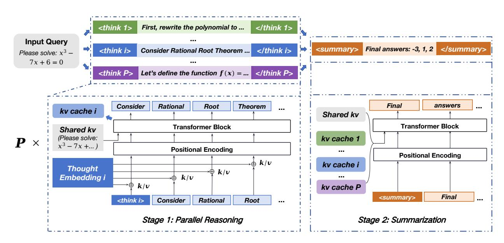

# 3. Model Design

As shown in Figure 3, ParaThinker generates an answer for a given question in two stages. In the parallel reasoning stage, ParaThinker generates multiple independent reasoning trajectories. In the summarization stage, it analyzes these diverse reasoning paths and then fuses them into a final answer. ParaThinker utilizes intermediate KV-cache representations from the reasoning stage, which eliminates the need for costly re-prefilling during summarization.

#### 3.1. Preliminaries

We denote an LLM by  $\pi_{\theta}$ , where  $\theta$  is the set of model parameters. Given an input prompt of l tokens  $x = \{x_i\}_{i=1}^l$ . The LLM then autoregressively generates an output sequence  $y = (y_1, y_2, \dots, y_L)$  with the conditional probability:

$$\pi_{\theta}(y|x) = \prod_{t=1}^{L} \pi_{\theta}(y_t|x, y_{< t})$$
 (1)

For tasks requiring multi-step reasoning, the output y can be decomposed into a reasoning path r followed by a final answer a: y = (r, a). During decoding, each new token  $y_t$  requires attention over the full

> **[图片提取文字 (无描述)]:**
> First, rewrite the polynomial to ... </think 1> <think 1> Input Query <summarv> Final answers: -3, 1, 2 
 Consider Rational Root Theorem ... </think i> <think i> Please solve:  $x^3$  – 7x + 6 = 0Let's define the function f(x) = ... </think P><think P> Rational Final Consider Theorem answers Root kv cache i Shared kv Transformer Block Transformer Block Shared kv (Please solve: kv cache 1  $x^3 - 7x + ...$ Positional Encoding Positional Encoding k/v kv cache i Thought k/vEmbedding i k/v k/vkv cache P Final 
 <think i> Consider Rational Root Stage 1: Parallel Reasoning Stage 2: Summarization

Figure 3 | ParaThinker architecture. For an input question, ParaThinker processes it in two stages: (1) Parallel Reasoning: ParaThinker generates *P* reasoning paths in parallel, guided by special <think i> tokens to encourage diverse thoughts, and employs thought embeddings to separate paths and prevent positional ambiguity; (2) Summarization: ParaThinker merges the reasoning paths by reusing their KV-caches to generate the final answer.

context  $x, y_{< t}$ , which involves computing Key (K) and Value (V) tensors. To avoid recomputation when generating each  $y_t$ , LLMs often use a KV-cache to store K/V tensors.

#### 3.2. ParaThinker Workflow

As shown in Figure 3, our approach extends the sequential reasoning LLM paradigm by first generating a set of P distinct reasoning paths  $\{r^{(1)}, r^{(2)}, \ldots, r^{(P)}\}$  for a single input x in parallel. Each individual reasoning path  $r^{(i)}$  is a sequence of tokens representing a unique line of thought, sampled from the distribution:

$$\pi_{\theta}(r^{(i)}|x) = \prod_{t=1}^{L_i} \pi_{\theta}(r_t^{(i)}|x, s^{(i)}, r_{< t}^{(i)})$$
(2)

Here,  $s^{(i)}$  is a special control token that helps initiate a distinct reasoning path, which will be detailed in Section 3.3. After generating these parallel paths, the model synthesizes them to produce a final answer, a. This answer is conditioned on both the original prompt x and the complete context of all preceding reasoning paths. Let  $\mathcal{R} = (r^{(1)}, r^{(2)}, \dots, r^{(P)})$  be the concatenation of all generated reasoning paths. The final answer a is then sampled from the model as follows:

$$\pi_{\theta}(a|x) = \prod_{t=1}^{La} \pi_{\theta}(a_t|x, \mathcal{R}, a_{< t})$$
(3)

Crucially, ParaThinker leverages the KV-caches from the parallel reasoning stage, eliminating the need to re-prefill the context and thereby offering significant computational savings compared to other methods.

## 3.3. Special Tokens for Boosting Thought Diversity

ParaThinker needs to ensure diverse reasoning paths to avoid the trap of relying on a single sampled sequence. To achieve this, we introduce a set of trainable special control tokens: <think i>, </think i>, 
, and 
 for  $i \in \{1, \ldots, P\}$  to control the parallelization and merging operations. The <think i> token (denoted as  $s^{(i)}$  in our equations) is placed at the beginning of each reasoning path, which leads the model to generate a distinct trajectory. Thus, the distribution of each reasoning path  $\pi_{\theta}(r^{(i)}|x) = \prod_{t=1}^{L_i} \pi_{\theta}(r^{(i)}_t|x, s^{(i)}, r^{(i)}_{< t})$  will be conditioned by  $s^{(i)}$ . The closing 
 i> token marks the end of a specific path, and the generation of the final answer is then wrapped within 
 and 
 tokens. This structured use of control tokens is a simple yet powerful mechanism to guide the model's generation process towards diverse and parallel lines of thought.

