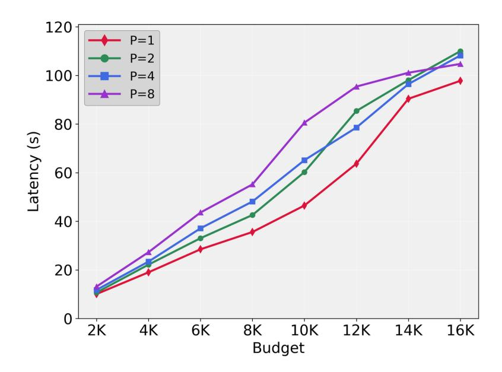

# 5. Experiment

In this section, we conduct experiments to address the following research questions:

- **Scalability and Performance:** How does ParaThinker's reasoning accuracy scale with an increase in parallel reasoning paths number and generation budget? (Section 5.2)
- **Inference Efficiency:** What are the trade-offs in terms of inference latency and memory consumption as we scale the number of parallel paths? (Section 5.3)
- • **Fine-Grained Analysis:** What is the optimal termination strategy for parallel reasoning stage, and how much does each component contribute? (Section 5.4 and Section 5.5)

## 5.1. Experimental Setup

**Training Details:** Our experiments are based on a Qwen-2.5 (Qwen et al., 2025) 1.5B and 7B parameter model distilled from DeepSeek-R1 (DeepSeek-AI, 2025), which we denote as original models below.

For SFT, we construct a parallel reasoning dataset with 6.2K problem-solution pairs. 3.5K of the problems are sampled from the Open-R1 (Hugging Face, 2025) filtered to include only those with more than 4 existing answer variations. We also randomly sample 1.5K from and DeepMath (He et al., 2025) dataset, which provides 3 answers per question, and 1.2K from s1k (Muennighoff et al., 2025) (0.4K filtered for clear answers) and limo (Ye et al., 2025) (0.8K full dataset). To enrich diversity, we use gpt-oss-20b (OpenAI, 2025) as a teacher model, generating additional solutions at temperature 0.8, yielding six reasoning paths per problem. Each instance thus consists of a query ( $x_i$ ), ground-truth answer ( $a_i$ ), and  $\hat{P} = 6$  distinct reasoning paths.

During fine-tuning, we use a maximum context length of 28K tokens. The model is trained for 2-3 epochs on multiple A800 GPUs. More training details can be found in Appendix A.1. During every step, we randomly choose a path number P from the set  $\{2,4,6\}$  and construct a training sample by concatenating P samples, which is detailed in Appendix A.2.

For data ablation, we ensure comparable dataset volume by unrolling our parallel dataset into  $\tilde{D}_{ablation} = \{\{x_i, (r_i^{(j)}, a_i)\}_{j=1}^{\hat{p}}\}_{i=1}^{|D|}$ , then fine-tune the 1.5B baseline with identical settings. We then report results for *sequential*, *majority voting*, and *re-prefilling* against ParaThinker-1.5B.

**Baselines:** We compare ParaThinker against:

- Sequential: Direct reasoning with original 1.5B/7B models.
- Majority Voting: Generate P independent paths and return the majority answer (Chen et al., 2024a).
- *Re-Prefilling:* Generate *P* paths, concatenate them, and feed the full context into the model for summarization. This mimics ParaThinker's summarization but is inefficient since KV caches are not reused (Section 5.3).

**Benchmarks and Evaluation Setup:** We evaluate our model on four challenging mathematical reasoning benchmarks: AIME 2024, AIME 2025, AMC 2023, and MATH-500 (Hendrycks et al., 2021). We employ two primary criteria for evaluation: effectiveness, measured by accuracy; and efficiency, measured by performance under a fixed token budget. To assess efficiency, we use a budget control method where each reasoning path is limited to a maximum of B tokens ( $|r^{(i)}| \leq B$ ). If a model reaches this budget without naturally stopping, we enforce termination and then initiate the summarization stage by adding the (summary>) token. This allows us to examine the utilization of the test-time scaling budget.

Our system is implemented using the vLLM inference framework (Kwon et al., 2023), integrated with our custom parallel generation engine. For the 1.5B parameter model, we employ a sampling temperature of 0.5 and a top-p value of 1.0, while for the 7B parameter model, we use a temperature of 0.6 and a top-p value of 1.0. To account for output randomness, we report pass@1 accuracy, calculated as  $pass@1 = \frac{1}{k} \sum_{i=0}^{k} p_i$ , where  $p_i$  is a binary indicator of correctness for the i-th response. Following DeepSeek-R1, we set k depending on the size of test dataset, thus we set k = 16 for AIME 2024, AIME 2025, AMC 2023, and k = 4 for MATH-500.

|                                               | AIME 2024                                   | AIME 2025 | AMC 2023 | MATH-500 | Average |  |
|-----------------------------------------------|---------------------------------------------|-----------|----------|----------|---------|--|
| Original Model: DeepSeek-R1-distill-Qwen-1.5B |                                             |           |          |          |         |  |
| Sequential (16K)                              | 26.1                                        | 22.4      | 67.1     | 81.2     | 49.2    |  |
| Sequential (32K)                              | 28.3                                        | 24.5      | 68.9     | 81.8     | 50.9    |  |
| Sequential (64K)                              | 27.1                                        | 25.5      | 67.7     | 81.7     | 50.5    |  |
| Sequential (128K)                             | 27.4                                        | 22.1      | 68.0     | 81.8     | 49.8    |  |
| Majority (2×16K)                              | 25.9                                        | 23.0      | 67.0     | 81.4     | 49.3    |  |
| Majority (4×16K)                              | 32.9                                        | 27.5      | 74.3     | 86.7     | 55.4    |  |
| Majority (8×16K)                              | 41.0                                        | 31.8      | 79.8     | 89.0     | 60.4    |  |
| Reprefill (2×16K)                             | 30.4                                        | 26.7      | 70.6     | 60.8     | 47.1    |  |
| Reprefill (4×16K)                             | 24.2                                        | 25.8      | 61.3     | 58.6     | 42.5    |  |
| Reprefill (8×16K)                             | 14.2                                        | 13.3      | 60.0     | 55.3     | 35.7    |  |
| ParaThinker-1.5B (2×16K)                      | 34.8                                        | 24.2      | 73.1     | 87.5     | 54.9    |  |
| ParaThinker-1.5B (4×16K)                      | 43.3                                        | 26.7      | 80.8     | 88.7     | 59.9    |  |
| ParaThinker-1.5B (8×16K)                      | 48.1                                        | 31.9      | 83.1     | 89.7     | 63.2    |  |
|                                               | Original Model: DeepSeek-R1-distill-Qwen-7B |           |          |          |         |  |
| Sequential (16K)                              | 51.9                                        | 37.9      | 88.4     | 91.2     | 67.4    |  |
| Sequential (32K)                              | 55.5                                        | 37.9      | 89.8     | 92.0     | 68.8    |  |
| Sequential (64K)                              | 56.0                                        | 39.6      | 89.8     | 92.5     | 69.5    |  |
| Sequential (128K)                             | 52.7                                        | 40.4      | 89.8     | 92.6     | 68.9    |  |
| Majority (2×16K)                              | 52.3                                        | 38.3      | 88.4     | 91.4     | 67.6    |  |
| Majority (4×16K)                              | 60.6                                        | 43.1      | 92.2     | 93.5     | 72.4    |  |
| Majority (8×16K)                              | 68.8                                        | 49.6      | 93.1     | 94.2     | 76.4    |  |
| Reprefill (2×16K)                             | 42.9                                        | 33.8      | 88.1     | 63.8     | 57.2    |  |
| Reprefill (4×16K)                             | 43.3                                        | 33.3      | 86.3     | 63.2     | 56.5    |  |
| Reprefill (8×16K)                             | 43.3                                        | 31.7      | 91.9     | 63.7     | 57.7    |  |
| ParaThinker-7B (2×16K)                        | 57.1                                        | 46.0      | 89.5     | 93.2     | 71.5    |  |
| ParaThinker-7B (4×16K)                        | 63.3                                        | 46.9      | 91.7     | 94.2     | 74.0    |  |
| ParaThinker-7B (8×16K)                        | 68.8                                        | 51.3      | 93.3     | 94.5     | 77.0    |  |

Table 1 | Accuracy of ParaThinker and baselines on MATH-500, AIME 2024, AIME 2025, and AMC 2023. We report Pass@1 accuracy (%). Values in brackets indicate the maximum generation length (*e*.*g*., 16K); for parallel generation methods, we use × to denote generating reasoning paths, each with a maximum length of .

## **5.2. Scalability and Performance**

Table [1](#page-10-0) compares ParaThinker with baseline methods under different token budgets. Compared with sequential LLMs, ParaThinker improves accuracy by up to 14.5% (1.5B) and 8.3% (7B) on AIME 2024, and by 3.6% (1.5B) and 8.8% (7B) on AIME 2025 at each budget on average (*e*.*g*., 2 × 16K vs. 32K), demonstrating the effectiveness of parallel reasoning. On average, ParaThinker achieves 4.3% and 2.0% higher accuracy than majority voting on the 1.5B and 7B models, respectively. This indicates that the summarization stage captures a richer aggregation strategy than vote counting. Besides, for = 2, ParaThinker substantially outperforms maj@2 (which randomly selects one result from two reasoning paths and thus closely resembles sequential reasoning), showing that it does more than simply pick the

|       | B = 8K | B=16K | B = 32K | B = 64K | B = 128K |
|-------|--------|-------|---------|---------|----------|
| P = 1 | 23.5   | 26.1  | 28.3    | 27.1    | 27.4     |
| P = 2 | 27.1   | 29.2  | 34.8    | 35.8    | 25.0     |
| P = 4 | 18.1   | 30.2  | 38.1    | 43.3    | 36.7     |
| P = 8 | 7.9    | 22.3  | 35.0    | 41.5    | 48.1     |

Table 2 | Accuracy of baseline (P = 1) and ParaThinker-1.5B (P = 2/4/8) on AIME 2024 with different reasoning path number P and total token budget B (total token length of all reasoning paths).

|        | P=1  | P=2  | P=4  | P=8  |
|--------|------|------|------|------|
| pass@1 | 26.1 | 34.8 | 43.3 | 48.1 |
| maj@4  | 32.9 | 42.5 | 53.0 | 56.3 |
| maj@8  | 41.0 | 50.1 | 61.7 | 59.9 |
| maj@16 | 47.8 | 56.7 | 66.7 | 60.0 |

Table 3 | ParaThinker-1.5B together with majority voting on AIME 2024. P: number of parallel reasoning paths; maj@k: majority voting with k samples.

majority answer and instead learns to integrate information across reasoning paths. By contrast, the performance of the re-prefilling baseline degrades with more paths, which we attribute to the context length limitations of the flattened positional encoding scheme discussed in Section 3.4.

We analyze how performance scales with the number of parallel paths in Table 2, where increasing the path count consistently yields higher accuracy at larger generation budget. For sequential reasoning LLM (P=1), expanding the token budget beyond 32K yields no further accuracy gains, whereas ParaThinker continues to improve. These results indicate that ParaThinker effectively extends the scaling law beyond the point where sequential reasoning models typically encounter a test-time scaling bottleneck.

We further analyze the relationships between ParaThinker and majority voting in detail. The result is shown in Table 3. We find that our method does not conflict with the majority voting, ParaThinker with majority voting can achieve higher accuracy than only using ParaThinker. The highest accuracy of ParaThinker-1.5B+maj@8 can achieve accuracies of 66.7% and 60.0% on AIME 2024 with P = 4 and P = 8, gaining 23.4% and 11.9% accuracy improvements against pass@1. Besides, majority voting is not able to be applied to scenarios where results can't be quantified (*e.g.*, coding, document generation, etc.), which we will evaluate ParaThinker as a future work.

#### **5.3.** Inference Efficiency

A key advantage of ParaThinker is its efficiency. Figure 4 shows that latency does not grow linearly with the number of paths *P*, and with *P* grows, the total inference latency increases slightly. This is because the decoding phase is typically bounded by memory bandwidth, and increasing the number of parallel reasoning paths does not increase data movement operations. The inference latency of ParaThinker even decreases slightly under some budgets when number of parallel size grows, because we terminate the reasoning process once the first reasoning path stops, and when the number of paths increases, the probability of ParaThinker terminating earlier grows larger. The efficiency of our method gives us the proof that we can achieve greater accuracy through parallel scaling within acceptable inference latency.

> **[图片提取文字 (无描述)]:**
> 120 P=1P=2 100 P=8 80 Latency (s) 60 40 20 0 6K 4K 8K 12K 14K 16K 2K 10K **Budget**

Figure 4 | Total latency of ParaThinker-1.5B (batch size=1) with different number of parallel paths () under different generation budgets for each path (*i*.*e*., total decoding latency of × tokens for ParaThinker with paths.

|                            | 𝑃=2          | 𝑃=4          | 𝑃=8          |
|----------------------------|--------------|--------------|--------------|
| Last-Finish Half-Finish | 32.1 34.8 | 37.1 38.3 | 42.5 42.5 |
| First-Finish (Default)     | 34.8         | 43.3         | 48.1         |

Table 4 | Accuracy of ParaThinker-1.5B on AIME 2024 under budget for each reasoning path based on different strategies for terminating the parallel reasoning stage before proceeding to summarization.

## **5.4. Termination Strategies for the Parallel Reasoning Stage**

We compare three strategies for terminating the parallel reasoning stage before proceeding to summarization: (1) *Last-Finish:* Wait for all paths to complete. (2) *Half-Finish:* Terminate when /2 paths have completed. (3) *First-Finish:* Terminate when the first path completes (our default strategy).

As shown in Table [4,](#page-12-2) the First-Finish strategy yields the best performance. We attribute this to the fact that it maintains equal reasoning lengths across all paths, preventing any single path from dominating the context and ensuring a balanced contribution to the summarization stage. It is also, by definition, the most computationally efficient strategy.

#### **5.5. Ablation Study**

To have a fine-grained analysis of our key design choices, we conduct an ablation study on AIME 2024 based on ParaThinker-1.5B.

• **Train Data:** We test whether the performance gain of ParaThinker comes from the training dataset.

|                                   | AIME 2024 | AIME 2025 | AMC 2023 | MATH-500 | Average |
|-----------------------------------|-----------|-----------|----------|----------|---------|
| DeepSeek-R1-distill-Qwen-1.5B-SFT |           |           |          |          |         |
| Sequential (16K)                  | 26.3      | 18.5      | 66.0     | 81.1     | 48.0    |
| Sequential (32K)                  | 22.9      | 22.1      | 64.1     | 77.6     | 46.7    |
| Sequential (64K)                  | 25.8      | 17.3      | 62.2     | 77.6     | 45.7    |
| Sequential (128K)                 | 24.8      | 21.9      | 63.6     | 78.6     | 47.2    |
| Majority (2×16K)                  | 26.0      | 18.1      | 66.3     | 81.0     | 47.9    |
| Majority (4×16K)                  | 32.2      | 23.4      | 72.1     | 86.5     | 53.6    |
| Majority (8×16K)                  | 42.5      | 27.1      | 79.8     | 89.2     | 59.7    |
| Reprefill (2×16K)                 | 23.3      | 16.3      | 65.6     | 76.8     | 45.5    |
| Reprefill (4×16K)                 | 15.0      | 11.7      | 55.6     | 70.6     | 38.2    |
| Reprefill (8×16K)                 | 15.8      | 9.2       | 58.8     | 66.6     | 37.6    |
| ParaThinker-1.5B                  |           |           |          |          |         |
| ParaThinker-1.5B (2×16K)          | 34.8      | 24.2      | 73.1     | 87.5     | 54.9    |
| ParaThinker-1.5B (4×16K)          | 43.3      | 26.7      | 80.8     | 88.7     | 59.9    |
| ParaThinker-1.5B (8×16K)          | 48.1      | 31.9      | 83.1     | 89.7     | 63.2    |

Table 5 | Accuracy of ParaThinker and baselines on MATH-500, AIME 2024, AIME 2025, and AMC 2023. We report Pass1 accuracy (%). Values in brackets indicate the maximum generation length (*e*.*g*., 16K); for parallel generation methods, we use × to denote generating reasoning paths, each with a maximum length of .

|                            | 𝑃=2  | 𝑃=4  | 𝑃=8  |
|----------------------------|------|------|------|
| ParaThinker-1.5B           | 34.8 | 43.3 | 48.1 |
| Thought Embedding Ablation | 33.3 | 39.0 | 46.7 |

Table 6 | Ablation study on the effect of thought embedding (AIME 2024, avg@16, = 0.5, = 16K).

The training details of data ablation are stated in Section [5.1,](#page-8-1) where we use all the data from our dataset (6 samples for each question) to finetune the original LLM, remaining all other settings the same. Table [5](#page-13-0) indicates that finetuning does not improve performance, with results even slightly worse than the original LLM. ParaThinker, on the other hand, outperforms all baselines across budgets, confirming its effectiveness.

• **Thought Embedding:** We conduct two ablation studies of thought embedding: (1) removing the embedding entirely and (2) replacing it with a naive flattened positional encoding as stated in Section [3.4.](#page-6-1) As shown in Table [6,](#page-13-1) the flattened encoding leads to a severe accuracy drop, especially with larger budgets, confirming the detrimental effect of long-range positional decay. Surprisingly, removing the embedding altogether, while still underperform our proposed method, is superior to the flattened approach. This suggests the model can partially infer path distinctions from context but is misled by the ambiguous signals of a naive long-range positional encoding.

