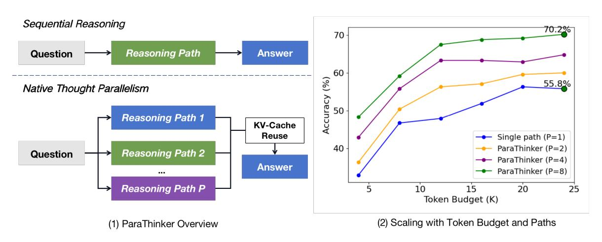

# **ParaThinker: Native Parallel Thinking as a New Paradigm to Scale LLM Test-time Compute**

**Hao Wen**1,∗ **, Yifan Su**1,∗,‡ **, Feifei Zhang**1 **, Yunxin Liu**1 **, Yunhao Liu**2 **, Ya-Qin Zhang**1 **, Yuanchun Li**1,†

**Source Code**: <https://github.com/MobileLLM/ParaThinker>

**Recent advances in Large Language Models (LLMs) have been driven by test-time compute scaling - a strategy that improves reasoning by generating longer, sequential thought processes. While effective, this approach encounters a significant bottleneck as computation increases, where further computation offers only marginal performance gains. We argue this ceiling is not an inherent limit of the model's capability but a flaw in the scaling strategy itself, a phenomenon we term** *"Tunnel Vision"***, where a model's imperfect initial steps lock it into a suboptimal reasoning path. To overcome this, we introduce a new scaling paradigm:** *native thought parallelism***. We present** *ParaThinker***, an end-to-end framework that trains an LLM to generate multiple, diverse reasoning paths in parallel and synthesize them into a superior final answer. By exploring different lines of thoughts simultaneously,** *ParaThinker* **effectively sidesteps the** *Tunnel Vision* **issue and unlocks the model's latent reasoning potential. Our approach demonstrates that scaling compute in parallel (width) is a more effective and efficient way to superior reasoning than simply scaling sequentially (depth). On challenging reasoning benchmarks,** *ParaThinker* **achieves substantial accuracy improvements over sequential LLMs (12.3% for 1.5B and 7.5% for 7B models on average with 8 parallel paths), while adding only negligible latency overhead (7.1%). This enables smaller models to surpass much larger counterparts and establishes parallel thinking as a critical, efficient dimension for scaling future LLMs.**

> **[图片提取文字 (无描述)]:**
> Sequential Reasoning 70.2% 70 Reasoning Path Answer Question 60 Accuracy (%) 55.8% Native Thought Parallelism 50 Reasoning Path 1 **KV-Cache** Reuse Single path (P=1) 40 ParaThinker (P=2) Reasoning Path 2 Question ParaThinker (P=4) Answer ParaThinker (P=8) Reasoning Path P 10 20 25 15 Token Budget (K) (2) Scaling with Token Budget and Paths (1) ParaThinker Overview

Figure 1 | Sequential vs. Parallel reasoning with ParaThinker framework and scaling results. (1) Illustrations of ParaThinker. (2) Parallel scaling results of ParaThinker-7B on AIME 2024 with varying numbers of reasoning paths (). "Token budget" refers to the maximum token length allowed per reasoning path.

1 Institute for AI Industry Research (AIR), Tsinghua University

2Global Innovation Exchange & Department of Automation, Tsinghua University

∗Equal contribution.

†Corresponding author: Yuanchun Li (liyuanchun@air.tsinghua.edu.cn).

‡Work done during internships at AIR, Tsinghua University.

