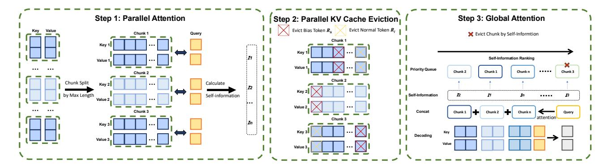

# 2. Related Work

Position encoding. Existing absolute position encoding (APE) [\(Vaswani, 2017;](#page-10-12) [Devlin, 2018\)](#page-9-6) incorporates either fixed or learnable position encodings into input representations through vector addition. However, APE faces challenges when dealing with long-contexts. To overcome these limitations, relative position encoding (RPE) methods—such as rotary and additive position encodings [\(Su,](#page-10-1) [2023;](#page-10-1) [Su et al., 2024;](#page-10-13) [Press et al., 2021\)](#page-10-14)—are developed to offer improved generalization in longer contexts. In addition, some data-dependent position encoding methods [\(Golovneva et al., 2024;](#page-10-15) [Zheng et al., 2024\)](#page-11-1) are gaining widespread attention. These position encodings are generated based on the input data.

Some works [\(Press et al., 2022;](#page-10-2) [Chi et al., 2022;](#page-9-2) [Li et al.,](#page-10-16) [2023a\)](#page-10-16) also focus on designing better position encodings to enhance the pre-trained model's capability for length extrapolation. Another line of works [\(Peng et al., 2023;](#page-10-3) [bloc97, 2023;](#page-9-4) [Chen et al., 2023a\)](#page-9-7) focus on enhancing the LLM's length extrapolation capability by fine-tuning.

Furthermore, there are two categories of training-free extrapolation methods. The first category, such as [LocalLLaMA](#page-10-4) [\(2023b\)](#page-10-4); [Chen et al.](#page-9-8) [\(2023b\)](#page-9-8); [LocalLLaMA](#page-10-5) [\(2023a\)](#page-10-5); [Chen](#page-9-9) [et al.](#page-9-9) [\(2024\)](#page-9-9), directly modifies position encodings to enable extrapolation or interpolation, aiming to enhance the model's length extrapolation capability. The second category [\(An et al., 2024;](#page-9-5) [Xiao et al., 2024;](#page-10-6) [Ratner et al., 2022;](#page-10-7) [Zhu et al., 2024\)](#page-11-0) achieves extrapolation solely by reusing position encodings. In this work, we focus primarily on the training-free setting.

Attention sink. A series of studies [\(Gu et al., 2024;](#page-10-11) [Xiao](#page-10-9) [et al., 2023;](#page-10-9) [Liu et al., 2024\)](#page-10-8) reveal the phenomenon of attention sink, where certain tokens in the sequence (referred to as sink tokens) consistently receive abnormally high attention scores.

> **[图片提取文字 (无描述)]:**
> Step 1: Parallel Attention Step 2: Parallel KV Cache Eviction Step 3: Global Attention Evict Bias Token R, Evict Normal Token R, X Evict Chunk by Self-Informtion Chunk 1 Query Chunk 1 Key 1 ... 11 Self-Information Ranking Value 1 ... Priority Queue Chunk 2 Chunk 1 Chunk n Chunk 3 Chunk 2 Chunk 2 Chunk Split Calculate Key 2 ... by Max Length Self-information Self-Information ... Chunk 3 Concat Chunk 1 Chunkn Query Chunk 3 In Key 3 ... Decoding Value 3 ...

Figure 2: Overview of PARALLELCOMP. **Parallel Attention** – The input sequence is split into multiple chunks based on the model's maximum context length. Each chunk undergoes local attention computation independently, and the self-information score of the query is calculated. **Parallel KV Cache Eviction** – Based on the self-information score, low-score tokens (marked in yellow,  $R_L^h$ ) and attention bias tokens (marked in red,  $R_H^h$ ) are selectively evicted to optimize memory usage and attention bias. **Global Attention** – The remaining KV caches are ranked by self-information, and less relevant chunks are discarded. The selected chunks are then concatenated, and a global attention operation is applied to ensure comprehensive information aggregation before the final autoregressive decoding stage.

When the sequence length increases, the attention scores in the middle of the sequence are significantly lower compared to the beginning and the end. Some work (Xiao et al., 2023; Zhang et al., 2023; Wan et al., 2024; Xiong et al., 2024) find that the tokens of attention sink can effectively aggregate information and use it to efficiently compress the KV cache. But in ultra-long contexts, this may prevent the model from focusing on the correct parts of long sequences. Xiao et al. (2023) attributes this phenomenon to the softmax function, which forces the query to assign attention scores to all preceding tokens, even when the preceding tokens lack essential information, resulting in high scores being assigned to initial tokens. Gu et al. (2024) proposes a simple solution by replacing the softmax attention with alternative attention mechanisms (e.g., unnormalized sigmoid attention) to alleviate this dependency. Chen et al. (2024) alleviates this phenomenon by simply removing certain lowfrequency components from RoPE. Yu et al. (2024) deals with this issue by calibrating the attention distribution. In our work, we focus primarily on three phenomena of attention bias within parallel attention: the attention sink at the beginning of the input, the attention sink at the end of the input (i.e. recency bias Peysakhovich & Lerer 2023), and the scattered attention in the middle of the input (Yu et al., 2024). These biases provide insights into how LLMs utilize parallel contextual information.

