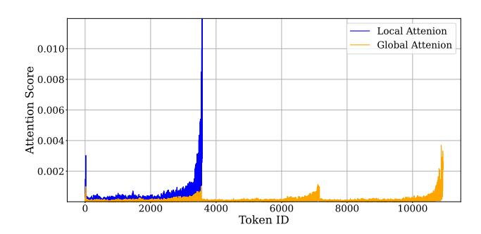
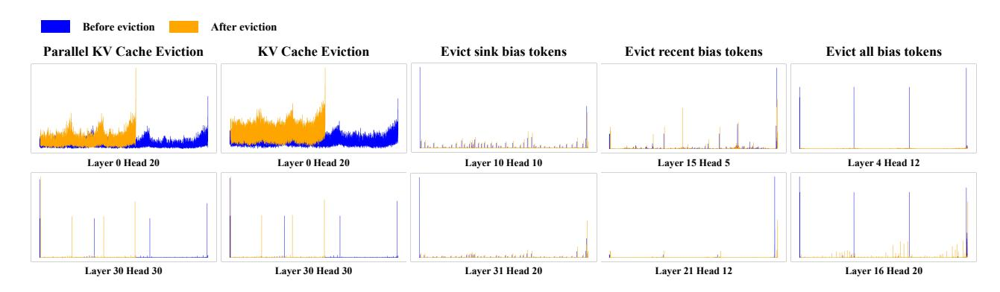

# **Theorem 3.1.** Consider the following setup:

- Part 1: For any ε > 0, the sparsity threshold of effective entries in Ac1 decreases as w increases. ε represents a user-defined threshold controlling sparsity in the attention matrix. As the number of chunks (C) increases, ε governs the trade-off between preserving information within each chunk and computational efficiency.
- Part 2: The number of effective entries k in each row of Aic is upper-bounded by:

$$k \le w - \exp\left(O\left(\frac{\log^2(\epsilon \cdot w)}{R^2}\right)\right) \cdot \frac{\delta}{wd},$$

where R is the rank of the sparse attention matrix, influencing the effective dimensionality of retained attention entries, and  $\delta$  is a probability bound controlling the confidence level of the sparsity constraint.

 Part 3: With high probability (1 – δ), the number of ineffective entries in each row satisfies:

$$\lim_{w \to \infty} |\mathcal{S}_{\epsilon}^{(c)}(A_{\mathfrak{l}}^{c}[i,:])| = w - k.$$

*Proof Sketch of Theorem 3.1.* **Proof sketch of Part 1:** By utilizing the exponential decay property of local attention weights (as derived in Theorem A.1), the sparsity threshold for effective entries in  $A_{\mathfrak{l}}^c$  can be bounded by:

$$\epsilon \ge \exp\left(O(R) \cdot \sqrt{\log(w \cdot (w - k)/\delta)}\right)$$
.

This inequality indicates that as w increases, the threshold for retaining effective entries becomes stricter, thus limiting the number of such entries.

**Proof sketch of Part 2:** Rearranging the above inequality, we derive an upper bound on k, the number of effective entries:

$$k \le w - \exp\left(O\left(\frac{\log^2(\epsilon \cdot w)}{R^2}\right)\right) \cdot \frac{\delta}{wd}.$$

Thus, the number of effective entries in each row of the attention matrix is w - k.

> **[图片提取文字 (无描述)]:**
> Sink Bias Recency Bias Attention Score Layer 27, Head 18 Layer 10, Head 1 Attention Score 0.05 0.0 1500 2500 500 1000 2000 3000 3500 500 1000 1500 2000 2500 3000 3500 ñ Token ID Token ID U-shape Middle Bias Attention Score Layer 21, Head 13 Attention Score Layer 32, Head 32 0.02 1500 2000 2000 500 1000 2500 3000 3500 500 1000 1500 2500 3000 3500 ñ Token ID Token ID Mountain-shape Uniform-shape 0.0025 Attention Score Layer 1, Head 22 Attention Score Layer 1, Head 3 0.0020 0.0000 0.0015 0.0010 0.0005 0.0000 500 1000 1500 2000 2500 3000 3500 500 1500 2000 2500 3000 3500 Û 1000 Token ID Token ID

Figure 3: Several types of attention distribution. The Token ID represents the token position in the input text.

> **[图片提取文字 (无描述)]:**
> Local Attenion Global Attenion 0.010 Attention Score 0.002 2000 4000 6000 8000 10000 Token ID

Figure 4: Comparison of local and parallel attention patterns. The blue lines show the local attention distribution within a chunk, while the yellow lines represent the parallel attention patterns in global attention.

**Proof sketch of Part 3:** Substituting the bound on k into the definition of  $|\mathcal{S}_{\epsilon}^{(c)}|$ , the number of ineffective entries, we obtain:

$$\lim_{w \to \infty} |\mathcal{S}_{\epsilon}^{c}(A_{\mathfrak{l}}^{c}[i,:])| \ge w - k.$$

Finally, observing that  $R = O(\sqrt{\log(w)})$  ensures that the sparsity growth is bounded as  $w \to \infty$ . A more detailed proof is available in Appendix A.

**Discussion.** Theorem 3.1 emphasizes the inevitability of attention collapse in parallel attention. If we fix the sparsity threshold  $\epsilon$  and keep the number of chunks C constant, as the input sequence length increases, the effective number of attention entries within each chunk decreases as the chunk size w increases, despite partitioning the input sequence into C chunks. The key insights include: i) Each local attention matrix  $A^c_1$  exhibits sparsity behavior akin to the global attention matrix, with most entries becoming negligible for

> **[图片提取文字 (无描述)]:**
> Before eviction After eviction Parallel KV Cache Eviction KV Cache Eviction Evict sink bias tokens Evict recent bias tokens Evict all bias tokens Layer 0 Head 20 Layer 0 Head 20 Layer 10 Head 10 Layer 15 Head 5 Layer 4 Head 12 Layer 30 Head 30 Layer 30 Head 30 Layer 16 Head 20 Layer 31 Head 20 Layer 21 Head 12

Figure 5: Several types of attention bias and patterns. In the figure, **Parallel KV Cache Eviction** performs independent KV cache eviction within each chunk, while **KV Cache Eviction** unifies this process during global attention. **Parallel KV Cache Eviction** significantly reduces the computational load of global attention.

large w.~ii) When a long sequence is processed in parallel, attention~bias becomes unavoidable, with the attention mechanism consistently focusing on a small subset of tokens due to its inherent limitations, even when more information is available. Choosing an appropriate sparsity parameter  $\epsilon$  can mitigate this issue. iii) Dividing the input into chunks reduces computational overhead while preserving sparsity within each chunk, leading to an efficient approximation of global attention.

