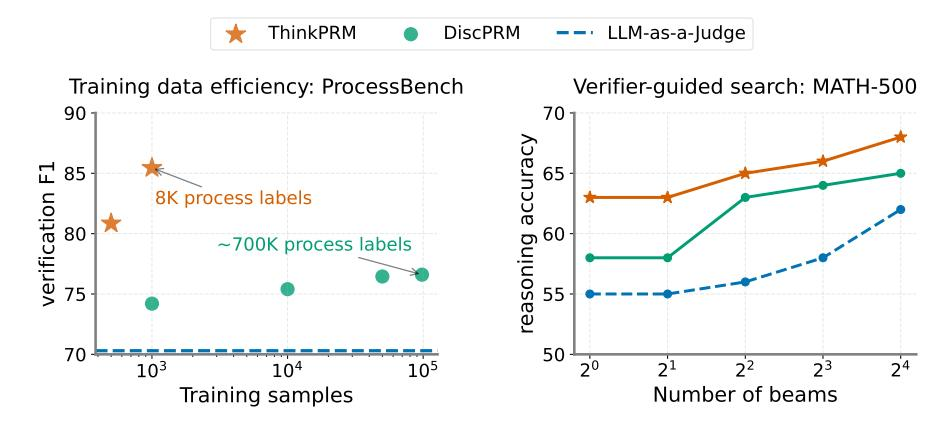
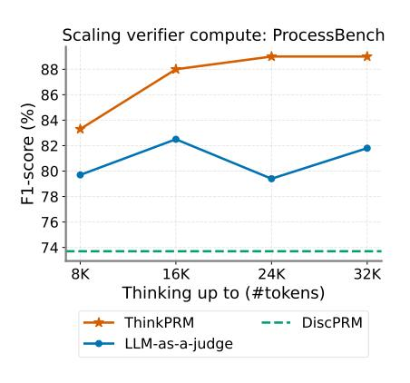

# **Process Reward Models That Think**

Muhammad Khalifa♥, Rishabh Agarwal♠, Lajanugen Logeswaran♦,
Jaekyeom Kim♦, Hao Peng♠, Moontae Lee♦, Honglak Lee♥♦\*, Lu Wang♥\*

♥University of Michigan ♠Mila

♠LG AI Research ♠University of Illinois Urbana-Champaign

\*Equal supervision

khalifam@umich.edu

#### **Abstract**

Step-by-step verifiers—also known as process reward models (PRMs)—are a key ingredient for test-time scaling, but training them requires expensive step-level supervision. This work aims to build data-efficient PRMs as verbalized step-wise reward models that verify every step in the solution by generating a verification chain-of-thought (CoT). We propose THINKPRM, a long CoT verifier fine-tuned on orders of magnitude fewer process labels than those required by discriminative PRMs. Our approach capitalizes on the inherent reasoning abilities of long CoT models, and outperforms LLM-as-a-Judge and discriminative verifiers—using only 1% of the process labels in PRM800K—across several challenging benchmarks. Specifically, THINKPRM beats the baselines on ProcessBench, MATH-500, and AIME '24 under best-of-N selection and reward-guided search. In an out-ofdomain evaluation over subsets of GPQA-Diamond and LiveCodeBench, our PRM surpasses discriminative verifiers trained with the full PRM800K by 8% and 4.5%, respectively. Lastly, under the same token budget, THINKPRM scales up verification compute more effectively compared to LLM-as-a-Judge, outperforming it by 7.2% on a subset of ProcessBench. This work highlights the value of generative, long CoT PRMs that can scale test-time compute for verification while requiring minimal supervision for training.1

> **[图片提取文字 (无描述)]:**
> **ThinkPRM** DiscPRM LLM-as-a-Judge Verifier-guided search: MATH-500 Training data efficiency: ProcessBench 90 70 accuracy ₩ 85 65 verification 8 8K process labels reasoning a ~700K process labels 50 70 24 21 22 23  $10^{3}$ 20  $10^{4}$  $10^{5}$ Number of beams Training samples

Figure 1: **Left:** Verifier F1-score on ProcessBench (Zheng et al., 2024). THINKPRM-14B, trained on 8K process labels or 1K synthetic examples, outperforms discriminative PRMs trained on about 100x more data. **Right:** Verifier-guided search accuracy on MATH-500 with Llama-3.2-3B-Instruct as generator. THINKPRM-1.5B, trained using the same 8K labels, outperforms LLM-as-a-judge and discriminative verifiers in reward-guided search on MATH-500. The LLM-as-a-judge in both figures uses the same base model as THINKPRM.

&lt;sup>1Our code, data, and models are released at https://github.com/mukhal/thinkprm.

#### 1 Introduction

Reasoning with large language models (LLMs) can substantially benefit from utilizing more test-time compute (Jaech et al., 2024; Guo et al., 2025; Akyürek et al., 2024). This typically depends on a high-quality process reward model (PRM)—also known as a process verifier—that scores (partial) solutions for selecting promising paths for search or ranking (Cobbe et al., 2021; Li et al., 2023; Wu et al., 2024; Brown et al., 2024). PRMs have typically assumed the form of discriminative classifiers, trained to discern correct from incorrect reasoning (Uesato et al., 2022; Zhang et al., 2025). However, training discriminative PRMs requires access to process labels, i.e., step-level annotations, which either require extensive human annotation (Lightman et al., 2023; Zheng et al., 2024), gold step-by-step solutions (Khalifa et al., 2023), or compute-intensive rollouts (Luo et al., 2024; Chen et al., 2024a). For instance, training reasonably performing math PRMs requires hundreds of thousands of step-level annotations (Lightman et al., 2023; Wang et al., 2023b).

Generative verification either via LLM-as-a-judge (Wang et al., 2023a; Liu et al., 2023b; Zheng et al., 2023) or GenRM (Zhang et al., 2024a) treats verification as a generation problem of a rationale followed by a decision. However, LLM-as-a-judge is known to perform poorly compared to specialized reward models (Lambert et al., 2024; Zhang et al., 2024b; Chen et al., 2024c), as general-purpose LLMs frequently fail to recognize reasoning errors (Huang et al., 2023; Zhang et al., 2024a; Ye et al., 2024). Moreover, GenRM is limited to outcome verification via *short* chain-of-thoughts (CoTs), fundamentally limiting its ability for test-time scaling.

This paper builds on the insight that generative step-by-step verification can greatly benefit from scaling up the verifier's inference compute—specifically, by enabling it to *think* through a CoT. Specifically, we repurpose open-weight large reasoning models (LRMs) as the foundation for generative PRMs through *lightweight* training. This training uses uses synthetic data (Kim et al., 2023; Zhu et al., 2023; Wang et al., 2024), utilizing as few as 8K step labels, and yieldinga THINKPRM —a PRM that not only surpasses LLM-as-a-judge, but also outperforms discriminative PRMs trained on two orders of magnitude more data across a variety of test-time scaling scenarios.

We obtain THINKPRM by training four reasoning models, namely R1-Distill-Qwen{1.5B,7B,14B} (Guo et al., 2025), and QwQ-32B-Preview (Team, 2024), and extensively evaluate it both as a standalone verifier on Process-Bench (Zheng et al., 2024), and combined with a generator under Best-of-N and verifier-guided beam search.

> **[图片提取文字 (无描述)]:**
> Scaling verifier compute: ProcessBench 88 86 %) 84 82 80 78 76 74 8K 16K 32K 24K Thinking up to (#tokens) ThinkPRM DiscPRM LLM-as-a-judge

Figure 2: THINKPRM enables scaling verification compute with more CoT tokens.

THINKPRM-14B outperforms a discriminative PRM based on the same base model in terms of accuracy while using far fewer supervision signals as in Fig. 1 left. In addition, THINKPRM-1.5B demonstrates strong performance on MATH-500 (Hendrycks et al., 2021) under guided beam search, shown in Fig. 1 right. Lastly, as shown in Fig. 2, THINKPRM can effectively utilize more verification compute than LLM-as-a-judge, by forcing it to think for more tokens. All these results are obtained while training only on 8K step labels.

Our work highlights the promise of long CoT PRMs that *verify reasoning with reasoning*, effectively scaling both generator and verifier compute. Our main findings are as follows: THINKPRM outperforms strong PRM baselines in best-of-N and guided-search setups on two math reasoning benchmarks: MATH-500 and AIME 2024, and surpasses LLM-as-a-judge baselines under the same base model by thinking longer during verification (§4). Moreover, THINKPRM generalizes under two types of domain shift. First, it outperforms baselines on out-of-domain tasks such as scientific reasoning and code generation. Second, despite being trained only on short solutions, it generalizes to long-form reasoning without explicit step delimiters (§5.3). Third, THINKPRM outperforms self-consistency (Wang et al., 2022) when using the same compute budget, especially under high sampling regimes (§5.4). Finally, fine-grained filtering of synthetic data based on step supervision is crucial for training high-quality PRMs (§5.7).

#### 2 Background and Related Work

**Discriminative PRMs.** Discriminative PRMs are trained as classifiers that directly predict numerical correctness scores for each solution step, and typically rely on extensive step-level annotations (Uesato

