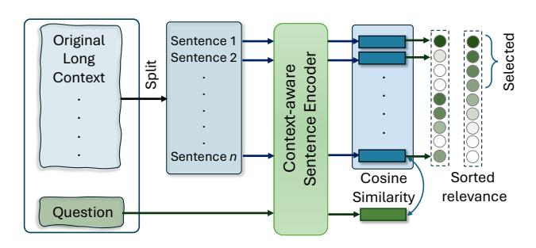

# Prompt Compression with Context-Aware Sentence Encoding for Fast and Improved LLM Inference

Barys Liskavets<sup>1\*</sup>, Maxim Ushakov<sup>1</sup>, Shuvendu Roy<sup>2</sup>, Mark Klibanov<sup>3</sup>, Ali Etemad<sup>2</sup>, Shane Luke<sup>3</sup>

<sup>1</sup>Alterra AI, Palo Alto, United States <sup>2</sup>Queen's University, Canada <sup>3</sup>Workday Inc.

#### **Abstract**

Large language models (LLMs) have triggered a new stream of research focusing on compressing the context length to reduce the computational cost while ensuring the retention of helpful information for LLMs to answer the given question. Token-based removal methods are one of the most prominent approaches in this direction, but risk losing the semantics of the context caused by intermediate token removal, especially under high compression ratios, while also facing challenges in computational efficiency. In this work, we propose context-aware prompt compression (CPC), a sentencelevel prompt compression technique where its key innovation is a novel context-aware sentence encoder that provides a relevance score for each sentence for a given question. To train this encoder, we generate a new dataset consisting of questions, positives, and negative pairs where positives are sentences relevant to the question, while negatives are irrelevant context sentences. We train the encoder in a contrastive setup to learn context-aware sentence representations. Our method considerably outperforms prior works on prompt compression on benchmark datasets and is up to 10.93× faster at inference compared to the best token-level compression method. We also find better improvement for shorter length constraints in most benchmarks, showing the effectiveness of our proposed solution in the compression of relevant information in a shorter context. Finally, we release the code and the dataset for quick reproducibility and further development: https://github.com/Workday/cpc.

#### 1 Introduction

The advent of large language models (LLMs) has triggered a surge of research into prompting techniques, including chain-of-thought (Wei et al. 2022), in-context learning (Dong et al. 2022), and retrieval augmented generation (Lewis et al. 2020), aimed at leveraging their generalization and reasoning capabilities for various downstream applications. In practice, providing suitable and descriptive (often long) prompts is essential for LLMs to generate useful responses for domain-specific tasks. However, longer prompts come at a significant inference expense for LLMs in terms of both time and cost. Therefore, striking a balance between

> **[图片提取文字 (无描述)]:**
> Original Sentence 1 Sentence 2 Long Split Encode Context-aware Context Sentence Sentence n Cosine Sorted Similarity relevance Question


Figure 1: Overview of CPC. We first train a novel **context-aware** sentence encoder contrastively on a newly generated dataset of questions, positives, and negative pairs. Our model then uses this context-aware encoder to generate embeddings of the question and context sentences, and uses the similarity between them to select relevant sentences.

| Method        | Performance | Latency        |
|---------------|-------------|----------------|
| LLMLingua     | 37.2        | $9.8 \times$   |
| LLMLingua-2   | 42.2        | $0.67 \times$  |
| LongLLMLingua | 48.8        | $10.93 \times$ |
| CPC           | 50.0        | $1\times$      |

Table 1: Overall comparison of our method on performance and latency on LongBench. CPC outperforms LongLLM-Lingua (SOTA) on both performance and latency.

the quality and the length of the prompt is a timely area of research in order to optimize inference performance vs. cost.

Recently, prompt compression has shown promise as a solution to the context length problem. The basic idea of such a method is to reduce the size of the prompt by removing less informative content. For instance, LLMLingua (Jiang et al. 2023b) proposed to utilize a well-trained language model to identify and remove non-essential tokens from the prompt. LongLLMLingua (Jiang et al. 2023c) enhanced LLMLingua for longer context by enabling question-aware compression. Later, LLMLingua-2 (Pan et al. 2024) proposed to formulate prompt compression as a token-level binary classification task that learns a task-agnostic prompt compression model by removing less important tokens. However, such token removal methods may result in non-coherent sentences, often

<sup>\*</sup>Corresponding Author. Email: liskovets.borets@gmail.com Copyright © 2025, Association for the Advancement of Artificial Intelligence (www.aaai.org). All rights reserved.

hampering the semantics of the prompt, especially when the compression ratio is relatively high. This results in a drop in the performance of the LLMs in answering questions. Additionally, most existing compression methods are usually computationally expensive as the inference time is proportional to the token length.

In this work, we propose a sentence-level compression technique called Context-aware Prompt Compression (CPC) that compresses the prompt by removing the sentences that are less relevant to the given question. A key innovation of our proposed solution is a context-aware sentence encoder that is used to rank all the sentences in the context based on their relevance to the question. Here, the relevance is measured as the (context-aware) embedding similarity (cosine distance) between the question and each sentence in the context. An important characteristic of our method is that it performs context compression while preserving human readability, unlike token-based compressors such as the LLMLingua family (Pan et al. 2024; Jiang et al. 2023c,b). We train the context-aware sentence encoder by learning to distinguish between positive and negative sentences, where the positives are context sentences that contain relevant information to the given question, and the negatives are context sentences that do not contain any relevant information to the question. Along with the proposed method, we also introduce a new dataset with question, positive, and negative sentence pairs required to train our context-aware sentence encoder. Figure 1 provides an overview of our method.

We evaluate our model following the protocol established by prior works on prompt compression (Pan et al. 2024; Jiang et al. 2023c) on LongBench (Bai et al. 2023) and ZeroSCROLLS (Shaham et al. 2023). Extensive experiments show that our proposed method outperforms the existing state-of-the-art (LongLLMLingua (Jiang et al. 2023c)) on these two benchmarks by 1.5% and 1.3% on average on the 2,000 tokens constraint. Similarly, on the 3,000 token constraint, our method outperforms others by 1.2% and 2.1%, respectively. On the individual sub-tasks of Long-Bench, our method shows up to 8.3% improvements. We present detailed ablation studies on different components of our proposed solution, including the dataset collection and the context-aware sentence embedding module. Furthermore, our method is up to 10.93× faster than LongLLM-Lingua during inference, imposing minor overhead during prompt compression (see Table 5). In summary, our contributions are:

- We propose a new method for sentence-level prompt compression. Our method relies on the novel concept of context-aware sentence encoding, which enables it to compress prompts by removing sentences that do not contain relevant information for the given question.
- As part of our solution, we curate and release a new dataset that contains tuples of context, question, positive, and negatives to train the context-aware sentence encoder.
- Our method outperforms prior works and sets a new state-of-the-art for prompt compression on LongBench and ZeroSCROLLS. Additionally, our method is up to

10.93× faster during inference compared to existing prompt compressors. To enable reproducibility and contribute to the area, we release our code and dataset at: https://github.com/Workday/cpc.

### 2 Related work

In this section, we discuss the literature relevant to our work from two perspectives. First, we review previous works on prompt compression. Next, we provide an overview of the literature on sentence embedding learning, focusing on aspects relevant to our context-aware embedding module.

#### 2.1 Prompt compression.

Recent work on prompt compression aims to reduce the inference cost of LLMs. A prominent direction in this area is model-agnostic prompt compression, which utilizes a pretrained model to act as an information-based compressor. For instance, Kim et al. (2022) introduced a token pruning method in the forward pass of the LLM. In Chen et al. (2023), a heuristic method was employed to recursively summarize the context. A limitation of these early works is that they require access to the pre-trained LLM as part of the compression method, which is not often feasible. Some of the more recent works developed solutions that do not require the LLM for compression. The most notable method in this direction is LLMLingua (Jiang et al. 2023b), which uses token-level perplexities to filter out semantically insignificant tokens that do not have high perplexity. Similar efforts have been performed by Selective-Context (Li et al. 2023a), with decoder-only models (LLaMa (Touvron et al. 2023), GPT-2 (Radford et al. 2019)) for token-wise perplexity calculation, which keeps a pre-defined number of highest-perplexity tokens to achieve the required compression. LongLLMLingua (Jiang et al. 2023c) further developed this idea for question-aware context compression by adding document-level question relevance estimation prior to employing LLMLingua. In general, these methods suffer from the lack of capability to adapt to new domains.

Another common direction of prompt compression is trainable prompt compression methods, including soft prompt methods, sequence-to-sequence methods, and reinforcement learning methods, among others. Soft prompt methods directly pre-train or fine-tune a language model as the compressor (Wang et al. 2024; Bulatov, Kuratov, and Burtsev 2022; Chevalier et al. 2023; Ge et al. 2024; Wang and Xiao 2024), which usually yield a high compression rate but have little interpretability or control over the compression rate. Sequence-to-sequence models capture the entire context as input and directly generate the compressed sentence (Xu, Shi, and Choi 2024). However, these methods have high latency due to the autoregressive nature of generation. Reinforcement learning for prompt compression, such as in Laban et al. (2021), introduces a novel reward function to simplify complex text by jointly optimizing simplicity, fluency, salience, and guardrails. Another approach utilizes compression ratio as a reward function, conditioned on meeting a ROUGE metric threshold (Jung and Kim 2024), but may compromise on question-aware context compression tasks. Furthermore, reinforcement learning has been employed for token classification in efficient unsupervised sentence compression by fine-tuning pre-trained encoder (Ghalandari, Hokamp, and Ifrim 2022). Among more recent methods, Pan et al. (2024) trains a model that is designed to evaluate the information value of each specific lexical unit, which is then sorted by these values and pruned. However, the token-level compression results in a non-coherent sentence that compromises the semantics of the compressed prompt, resulting in a sub-optimal performance of the LLM. In this work, we focused on prompt compression by identifying and removing less relevant *sentences* from an input context.

#### 2.2 Text embedding learning.

The goal of text embedding learning is to generate text embeddings that capture the semantic meaning in a highdimensional vector space, enabling various natural language processing tasks, such as text classification, clustering and similarity search. Earlier works in text embedding learning, such as GloVe (Pennington, Socher, and Manning 2014) and Word2Vec (Church 2017), focused on learning a word or token-level representation, while more recent works have explored sentence-level representation learning. For instance, Reimers and Gurevych (2019) proposed to fine-tune BERT-like architecture (Vaswani et al. 2017) for extraction of sentence embeddings that can be subsequently utilized to measure text similarities. Later Li et al. (2023b); Wang et al. (2022); Beltagy, Peters, and Cohan (2020) further improved the efficacy of the text embedding, especially for longer contexts. More recently, BehnamGhader et al. (2024) utilized the vast knowledge of pre-trained LLMs to develop a strong sentence encoder. However, the sentence representation learned by such models is not context-aware, and no prior works focused on context-aware sentence encoding that is required for our prompt compression approach.

## 3 Method

#### 3.1 Problem definition

Let  $x = \{x_i\}_{i=1}^L$  be an input context of length L tokens. The goal of the prompt compression is to produce a compressed prompt  $\tilde{x} = \{\tilde{x}_i\}_{i=1}^{\tilde{L}}$ , where  $\tilde{L} < L$ . The compression ratio can be denoted as  $\tau = \tilde{L}/L$ , where  $\tau \in [0,1]$ . The goal of an efficient compression method is to generate a compressed prompt (with smaller  $\tau$ ) while keeping the relevant context preserved so that the performance of the LLM on the compressed prompt  $\tilde{x}$  matches that of the original prompt x. However, existing solutions often rely on token-level compression, which can come with a key drawback. The removal of intermediate tokens from a sentence may result in a non-coherent and grammatically incorrect sentence, often hampering the semantics of the input prompt and causing a drop in the performance of LLM. In this work, we propose a sentence-level compression method that removes sentences from the given context based on their relevance to the input question. The key innovation of our proposed method is a context-aware sentence encoder, which is utilized to find the relevance of each sentence in the context, given a question. Our method requires a dataset of context, question, positive,

and negative tuples for training our proposed context-aware sentence encoder, which we discuss below. Subsequently, we discuss our proposed method for training the contextaware sentence encoder and prompt compression pipeline during inference.

#### 3.2 Dataset curation

To train the context-aware sentence encoder, we first create a dataset containing tuples of (long) contexts, questions, positive sentences, and negative sentences, called Context-aware Question-Relevance (CQR) Dataset. The 'context' is the text input that contains all the relevant information to answer the 'question', which is a meaningful query that asks some key information regarding the 'context'. The 'positives' are defined as sentences within the 'context' that contain *some*, but not necessarily all relevant information to answer the question. Finally, the 'negatives' are 'context' sentences that contain no information relevant to answering the question. To generate a dataset of such tuples, we use a two-step approach where we first generate a set of questions, positives, and negatives, followed by a filtering step. We discuss these two steps below.

We start with the WikiText dataset (Merity et al. 2017) as the seed dataset for our synthetic data generation. This dataset consists of long Wikipedia pages, each containing factual information about historical/scientific concepts. First, we take a document from the original dataset which we consider as context C. This document consists of sentences  $\{S_i\}_{i=1}^K$ . Next, we sample 'positive' sentence P from  $S_i$ . During the sampling procedure, we ensure that P is a consistent English sentence that contains coherent information. We consider a sentence to be consistent and coherent if at least  $\theta\%$  of its words are from the English dictionary and consist of ASCII-only characters. Then, we prompt a pretrained LLM  $\psi$  to generate synthetic question-answer pairs  $(Q_j, A_j)$  for this particular sentence P while also considering its context C. This is performed using Prompt 1 below.

```
Prompt 1 (Question Prompt):
Here is a text to consider: TEXT: "text"
Read the sentence in double brackets,
namely, [[sentence]].
Ask questions to this sentence, and make
sure the question is not answerable from
this sentence alone without knowing the
context.
Reply in this format:
Q: {question 1}
A: {answer 1}
Q: {question 2}
A: {answer 2}
```

Note that while some sentences may not directly contain the information required to answer the question, they may provide key contextual clues needed to do so indirectly. For example: Q: How many children does John have?
C: (1) John and Mary have been married for 10 years. (2) They have their anniversary now and they have decided to travel to Spain for a month. (3) Mary is worried that her two children are too small to travel on the plane. (4) So she has asked her sister to look after them.

In the example above, sentences (1) and (3) do not contain sufficient information to answer question Q, but together they form a subset of sentences that contains all the necessary information. Note that if we evaluate the sentence embedding similarity of the question and each of these sentences, the similarity between sentence (3) and Q would be relatively low due to the absence of any direct reference to John. Accordingly, we need our compression model to train on questions that can not be answerable solely based on P. To ensure the question is not fully answerable from the sentence P alone, we use the LLM to verify each sentence/question/answer triplet with Prompt 2 as follows:

