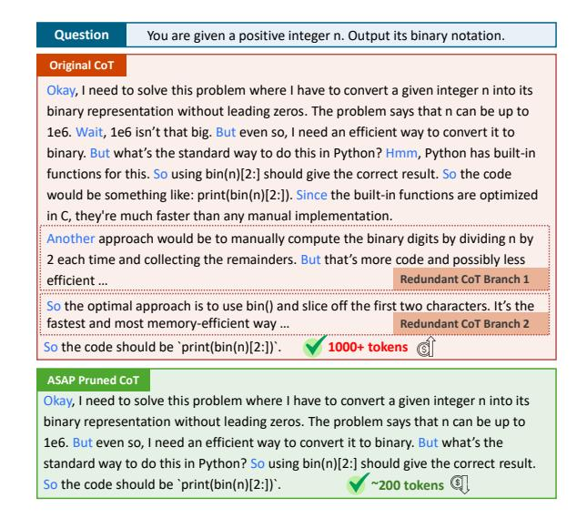
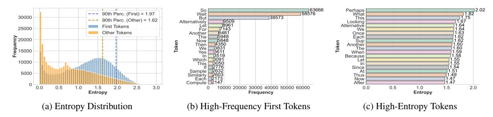
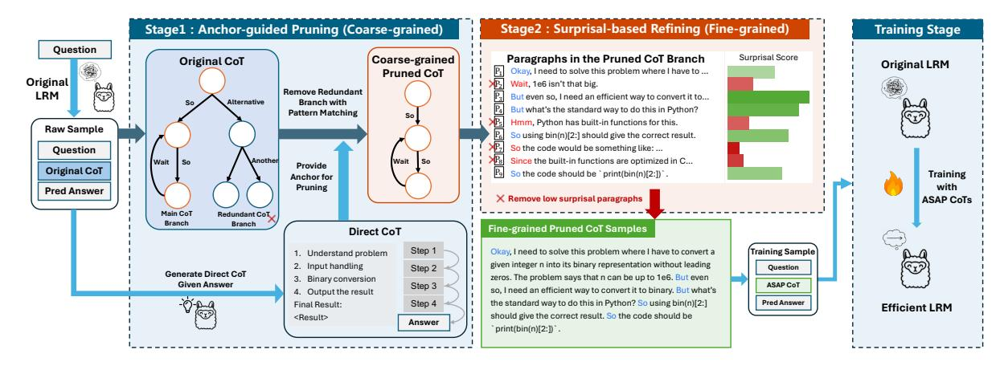
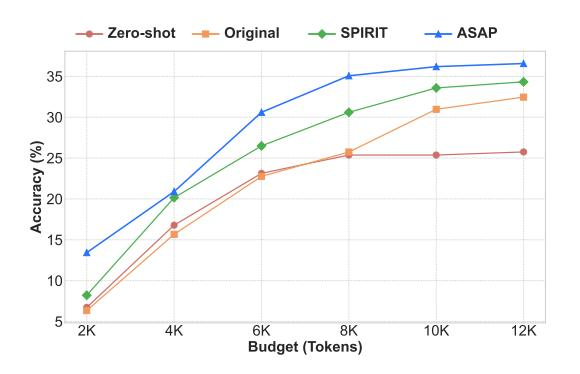

# Pruning the Unsurprising: Efficient LLM Reasoning via First-Token Surprisal

Wenhao Zeng<sup>1</sup> Yaoning Wang<sup>2</sup> Chao Hu<sup>1</sup> Yuling Shi<sup>1</sup> Chengcheng Wan<sup>3</sup> Hongyu Zhang<sup>4</sup> Xiaodong Gu<sup>1</sup>

<sup>1</sup>Shanghai Jiao Tong University <sup>2</sup>Fudan University <sup>3</sup>East China Normal University <sup>4</sup>Chongqing University {zengwh\_cs, xiaodong.gu}@sjtu.edu.cn

## Abstract

Large Reasoning Models (LRMs) have demonstrated remarkable capabilities by scaling up the length of Chain-of-Thought (CoT). However, excessively long reasoning traces pose substantial challenges for training cost and inference latency. While various CoT compression approaches have emerged to address this challenge, they face inherent trade-offs: tokenlevel methods often disrupt syntactic and logical coherence, while step-level methods based on perplexity fail to reliably capture the logically critical reasoning steps because of the dilution of logical information. In this paper, we propose ASAP (Anchor-guided, SurprisAlbased Pruning), a novel coarse-to-fine framework for CoT compression. ASAP first performs anchor-guided pruning to preserve the core reasoning structure, which efficiently reduces the search space for subsequent processing. Leveraging the insight that logical branching choices are concentrated at the onset of reasoning steps, it then enables logic-aware pruning by selecting logically essential reasoning steps based on a novel first-token surprisal metric. Finally, ASAP distills the models to autonomously generate and leverage these concise CoTs at inference time, enabling efficient reasoning. Experiments show that ASAP achieves state-of-the-art accuracy across multiple benchmarks while substantially reducing training and inference costs.

## 1 Introduction

The emergence of Large Reasoning Models, including OpenAI's o1 [\(Jaech et al.,](#page-8-0) [2024\)](#page-8-0) and DeepSeek-R1 [\(Guo et al.,](#page-8-1) [2025\)](#page-8-1), marks a paradigm shift in artificial intelligence. By scaling up Chainof-Thought (CoT) reasoning [\(Wei et al.,](#page-9-0) [2022\)](#page-9-0), these models demonstrate emergent capabilities in complex domains such as mathematics [\(Sun et al.,](#page-9-1) [2025\)](#page-9-1), programming [\(Shi et al.,](#page-9-2) [2024;](#page-9-2) [Yang et al.,](#page-9-3) [2025b;](#page-9-3) [Hu et al.,](#page-8-2) [2025\)](#page-8-2), and logical reasoning [\(Liu](#page-9-4)

<span id="page-0-0"></span>> **[图片提取文字 (无描述)]:**
> Question You are given a positive integer n. Output its binary notation. Original CoT Okay, I need to solve this problem where I have to convert a given integer n into its binary representation without leading zeros. The problem says that n can be up to 1e6. Wait, 1e6 isn't that big. But even so, I need an efficient way to convert it to binary. But what's the standard way to do this in Python? Hmm, Python has built-in functions for this. So using bin(n)[2:] should give the correct result. So the code would be something like: print(bin(n)[2:]). Since the built-in functions are optimized in C, they're much faster than any manual implementation. Another approach would be to manually compute the binary digits by dividing n by 2 each time and collecting the remainders. But that's more code and possibly less efficient ... Redundant CoT Branch 1 So the optimal approach is to use bin() and slice off the first two characters. It's the fastest and most memory-efficient way ... Redundant CoT Branch 2 So the code should be `print(bin(n)[2:])`. 1000+ tokens ASAP Pruned CoT Okay, I need to solve this problem where I have to convert a given integer n into its binary representation without leading zeros. The problem says that n can be up to 1e6. But even so, I need an efficient way to convert it to binary. But what's the standard way to do this in Python? So using bin(n)[2:] should give the correct result. 200 tokens 3 So the code should be `print(bin(n)[2:])`.


Figure 1: Illustration of CoT pruning by *ASAP*. The *Original CoT* generated by LRMs exhibits two types of redundancy: (1) Structural Redundancy, such as digressive branches (highlighted in red dashed boxes), which are removed by our Stage 1 Anchor-guided pruning; and (2) Logical Redundancy within valid paths. *ASAP* addresses the latter in Stage 2 by computing the surprisal of the first tokens of reasoning steps (marked in blue) to identify and retain only the critical cognitive pivots.

[et al.,](#page-9-4) [2025;](#page-9-4) [Zhang et al.,](#page-10-0) [2025c](#page-10-0)[,b\)](#page-10-1). However, this performance comes at a prohibitive cost: reasoning traces often span thousands of tokens, introducing substantial latency and memory overhead. Crucially, these lengthy traces often contain substantial redundancy, such as over-explaining simple problems or superficially exploring multiple paths for complex ones [\(Bi et al.,](#page-8-3) [2024;](#page-8-3) [Xie et al.,](#page-9-5) [2025;](#page-9-5) [Wu](#page-9-6) [et al.,](#page-9-6) [2025;](#page-9-6) [Qu et al.,](#page-9-7) [2025\)](#page-9-7). For instance, the *Original CoT* in Figure [1](#page-0-0) contains tangential branches (highlighted in red dashed boxes), such as exploring an alternative manual implementation that is subsequently rejected ("*But that's more code...*"). Furthermore, the reasoning is punctuated by syntactic fillers that contribute little to the core logic. This observation raises a fundamental question: *Can we identify and retain only the "cognitive pivots" of reasoning while discarding the redundancy?*

A growing body of research has emerged on CoT compression for efficient reasoning [\(Qu et al.,](#page-9-7) [2025\)](#page-9-7). Token-level methods like TokenSkip [\(Xia](#page-9-8) [et al.,](#page-9-8) [2025a\)](#page-9-8) adapt general-purpose context compressors such as LLMLingua-2 [\(Pan et al.,](#page-9-9) [2024\)](#page-9-9) to prune non-informative tokens. However, indiscriminate token removal risks disrupting the syntactic integrity of the reasoning chain. To address this, step-level pruning methods like SPIRIT [\(Cui](#page-8-4) [et al.,](#page-8-4) [2025\)](#page-8-4) trim entire reasoning steps, thereby preserving structural coherence. Nevertheless, these approaches face a fundamental challenge: accurately estimating the logical importance of each step. They typically rely on fixed metrics like perplexity (PPL), which measures the overall predictability of a sentence. This holistic measure often dilutes the signal of critical logical leaps with the noise of syntactically predictable but logically trivial content.

In this work, we ground CoT compression from an information-theoretic perspective. Through an empirical analysis of 10 million reasoning tokens (detailed in Section [2\)](#page-1-0), we find that the logical progression within a CoT sequence is not uniformly distributed; instead, its information density is highly concentrated at the beginning of each reasoning step—specifically within the first few tokens (blue-highlighted in Figure [1\)](#page-0-0). These tokens, such as "*But*" (self-correction) or "*So*" (deduction, not continuation), serve as high-entropy cognitive pivots. By leveraging the surprisal of these initial tokens, we can distinguish between critical logical transitions and predictable elaborations.

Guided by this insight, we propose ASAP (Anchor-guided, SurprisAl-based Pruning), a coarse-to-fine framework designed to preserve these high-information steps. ASAP in a two-stage cascade that directly addresses the two types of redundancies identified in our study (illustrated in Figure [1\)](#page-0-0): First, it employs Anchor-guided Pruning to remove structural redundancies. By generating a concise step-by-step reasoning trace as a logical backbone, it identifies and prunes the irrelevant branches (e.g., the red boxes in Figure [1\)](#page-0-0). Second, it performs Surprisal-based Refining to eliminate logic-sparse steps. Leveraging our First-Token Surprisal metric, this stage iteratively filters out steps acting as mere fillers while retaining the

high-surprisal cognitive pivots. Finally, we distill these compact, logic-dense CoTs into a target model, enabling it to generate efficient reasoning chains.

We validate our approach through extensive experiments on the DeepSeek-R1-Distill-Qwen-7B and DeepSeek-R1-Distill-Llama-8B [\(Guo et al.,](#page-8-1) [2025\)](#page-8-1) across diverse domains. The results demonstrate that ASAP establishes a superior Pareto frontier between performance and efficiency. Notably, on the challenging LiveCodeBench v4\_v5 benchmark, ASAP achieves 36.19% Pass@1 while reducing token generation by 23.5% and inference latency by 43.5% compared to the strongest baseline.

Our main contributions are summarized as follows:

- We present an empirical analysis of the information concentration of CoTs, uncovering that the surprisal of the starting token for each CoT step is a more robust indicator of logical importance than perplexity.
- We propose ASAP, a novel CoT compression framework that combines structural alignment with information-guided refinement.
- Extensive experiments on multiple benchmarks demonstrate that models fine-tuned on CoTs pruned by ASAP achieve state-of-theart accuracy while substantially reducing computational costs.

## <span id="page-1-0"></span>2 Empirical Analysis

To investigate the intrinsic distribution of logical information in CoTs, we conducted a large-scale analysis on 10 million tokens generated by DeepSeek-R1-Distill-Qwen-32B [\(Guo et al.,](#page-8-1) [2025\)](#page-8-1) across diverse reasoning benchmarks (AIME and Live-CodeBench [\(Jain et al.,](#page-8-5) [2024\)](#page-8-5)).

Information Concentration in CoTs. We analyze the entropy distribution of the *first token* of each reasoning step compared to all subsequent tokens. Entropy, in this context, quantifies the model's uncertainty regarding the next state transition [\(Shannon,](#page-9-10) [1948;](#page-9-10) [Malinin and Gales,](#page-9-11) [2020;](#page-9-11) [Kuhn et al.,](#page-8-6) [2023;](#page-8-6) [Wang et al.,](#page-9-12) [2025;](#page-9-12) [Cheng et al.,](#page-8-7) [2025\)](#page-8-7). As illustrated in Figure [2\(](#page-2-0)a), a distinct concentration is observed. Starting tokens (blue) exhibit a dispersed distribution with a significantly

<span id="page-2-0"></span>> **[图片提取文字 (无描述)]:**
> \_\_\_\_63666 \_\_\_\_58576 Perhaps What This Looking Alternative So | Wait But 90th Perc. (First) = 1.97 30000 138573 But | BE03 | PE03 | PE04 | PE04 | PE04 | PE04 | PE04 | PE04 | PE04 | PE04 | PE04 | PE04 | PE04 | PE04 | PE04 | PE04 | PE04 | PE04 | PE04 | PE04 | PE04 | PE04 | PE04 | PE04 | PE04 | PE04 | PE04 | PE04 | PE04 | PE04 | PE04 | PE04 | PE04 | PE04 | PE04 | PE04 | PE04 | PE04 | PE04 | PE04 | PE04 | PE04 | PE04 | PE04 | PE04 | PE04 | PE04 | PE04 | PE04 | PE04 | PE04 | PE04 | PE04 | PE04 | PE04 | PE04 | PE04 | PE04 | PE04 | PE04 | PE04 | PE04 | PE04 | PE04 | PE04 | PE04 | PE04 | PE04 | PE04 | PE04 | PE04 | PE04 | PE04 | PE04 | PE04 | PE04 | PE04 | PE04 | PE04 | PE04 | PE04 | PE04 | PE04 | PE04 | PE04 | PE04 | PE04 | PE04 | PE04 | PE04 | PE04 | PE04 | PE04 | PE04 | PE04 | PE04 | PE04 | PE04 | PE04 | PE04 | PE04 | PE04 | PE04 | PE04 | PE04 | PE04 | PE04 | PE04 | PE04 | PE04 | PE04 | PE04 | PE04 | PE04 | PE04 | PE04 | PE04 | PE04 | PE04 | PE04 | PE04 | PE04 | PE04 | PE04 | PE04 | PE04 | PE04 | PE04 | PE04 | PE04 | PE04 | PE04 | PE04 | PE04 | PE04 | PE04 | PE04 | PE04 | PE04 | PE04 | PE04 | PE04 | PE04 | PE04 | PE04 | PE04 | PE04 | PE04 | PE04 | PE04 | PE04 | PE04 | PE04 | PE04 | PE04 | PE04 | PE04 | PE04 | PE04 | PE04 | PE04 | PE04 | PE04 | PE04 | PE04 | PE04 | PE04 | PE04 | PE04 | PE04 | PE04 | PE04 | PE04 | PE04 | PE04 | PE04 | PE04 | PE04 | PE04 | PE04 | PE04 | PE04 | PE04 | PE04 | PE04 | PE04 | PE04 | PE04 | PE04 | PE04 | PE04 | PE04 | PE04 | PE04 | PE04 | PE04 | PE04 | PE04 | PE04 | PE04 | PE04 | PE04 | PE04 | PE04 | PE04 | PE04 | PE04 | PE04 | PE04 | PE04 | PE04 | PE04 | PE04 | PE04 | PE04 | PE04 | PE04 | PE04 | PE04 | PE04 | PE04 | PE04 | PE04 | PE04 | PE04 | PE04 | PE04 | PE04 | PE04 | PE04 | PE04 | PE04 | PE04 | PE04 | PE04 | PE04 | PE04 | PE04 | PE04 | PE04 | PE04 | PE04 | PE04 | PE04 | PE04 | PE04 | PE04 | PE04 | PE04 | PE04 | PE04 | PE04 | PE04 | PE04 | PE04 | PE04 | PE04 | PE04 | PE04 | PE04 | PE04 | PE04 | PE04 | PE04 | PE04 | PE04 | PE04 | PE04 | PE04 | PE04 | PE04 | PE04 | PE04 | PE04 | PE04 | PE04 | PE04 | PE04 | PE04 | PE04 | PE04 | PE04 | PE04 | PE04 | PE04 | PE04 | PE04 | PE04 | PE04 | PE04 | PE04 | PE0 90th Perc. (Other) = 1.62 1.67 1.64 1.64 1.62 1.62 1.60 1.59 1.58 1.55 1.55 1.54 Alternatively First Tokens 25000 Other Tokens Once Each Sup ≥ 20000 Another 15000 When Because 10000 Since 5000 Thus Now After 1.47 0.0 2.5 10000 20000 30000 40000 50000 60000 0.0 0.5 1.0 1.5 1.0 Entropy Entropy Frequency (a) Entropy Distribution (b) High-Frequency First Tokens (c) High-Entropy Tokens


Figure 2: Empirical analysis of 10M tokens from DeepSeek-R1-Distill-Qwen-32B. (a) The entropy distribution reveals a clear information concentration: first tokens (blue) exhibit significantly higher uncertainty (entropy) compared to body tokens (orange), which are highly deterministic. (b) The most frequent first tokens are a mixture of logical operators (e.g., *Wait*) and ubiquitous syntactic connectors (e.g., *So*). (c) High-entropy states filter out predictable fillers like *So* or *Then*, while exclusively highlighting cognitive pivots such as *Perhaps*, *What*, and *Alternative*.

higher 90th percentile. In contrast, other tokens (orange) are heavily concentrated near zero entropy, indicating that once a reasoning step is initiated, its subsequent elaboration is largely deterministic and syntactically driven. This empirical evidence confirms that the logical branching points, where the model actively deliberates on the reasoning path, are structurally concentrated at the beginning of each step.

#### Identifying Cognitive Pivots with Entropy.

Having identified the informative start tokens, we perform a more in-depth analysis of real logical pivots among the start tokens. We aim to distinguish between superficial syntactic connectors and real logical pivots. Figure 2(b) presents high-frequency start tokens that appear in CoTs, which mix connectors ("So", "Let") with reasoning markers ("Wait", "But"). However, when focusing on tokens generated in high-entropy states (Figure 2(c)), a qualitative shift emerges. Predictable connectors like "So" and "Then" are effectively suppressed due to their low uncertainty. Instead, the distribution is dominated by terms representing cognitive pivots and state transitions, such as: 1) Exploration: "Alternative", "Another" (proposing hypotheses or new paths). 2) Causality: "Because", "Since" (providing formal justification). 3) Self-Correction: "Perhaps", "What" (indicating error detection or logic reversal).

This analysis demonstrates that high entropy is a robust indicator of logical salience. Since the actual next token is known in the given training sequence, we operationalize this insight by using *First-Token Surprisal* as a proxy to identify and preserve these critical reasoning hops in our proposed framework (Fu et al., 2025).

#### 3 Methodology

#### 3.1 Overall Framework

Formally, we consider a supervised reasoning task defined by a dataset  $\mathcal{D} = \{(Q_i, C_i, A_i)\}_{i=1}^N$ , where  $Q_i$  is the query,  $A_i$  is the predicted answer, and  $C_i$  represents the original CoT generated by the LRMs.  $C_i$  is a sequence of reasoning steps  $C_i = \{s_1, s_2, \ldots, s_L\}$ . Our goal is to compress each  $C_i$  into a concise pruned one  $C_i'$  such that  $|C_i'| \ll |C_i|$  while the LRMs maintains the quality of generated reasoning steps and answers when fine-tuned on the dataset  $\mathcal{D}' = \{(Q_i, C_i', A_i)\}_{i=1}^N$ .

We propose ASAP, a coarse-to-fine framework tailored to the redundancy of "Original CoT" (C), as illustrated in Figure 3. Stage 1 (Anchor-guided Pruning) reduces structural redundancy (e.g., dead ends) by aligning the CoT with a generated logical backbone. The LLM generates a "Direct Thought"  $(\mathcal{P})$  from the (Q, A) pairs.  $\mathcal{P}$  acts as an anchor to prune the C into a "Coarse-grained Pruned CoT"  $(C_{coarse})$ . Stage 2 (Surprisal-based Refining) reduces logical redundancy (e.g., syntactic fillers) by filtering non-informative steps. We approximate the information of each step in  $C_{coarse}$  with their surprisal of start tokens and prune low-surprisal steps, yielding the final "Fine-grained Pruned CoT" (C'). Finally, all  $\{(Q, C', A)\}$  are utilized to finetune the target model.

#### 3.2 Anchor-guided Pruning

Directly pruning raw CoTs is challenging due to the noise and unstructured digressions inherent in LLM reasoning (Zhou et al., 2024). To address this, we first construct a high-level logical skeleton to narrow the pruning space.

<span id="page-3-0"></span>> **[图片提取文字 (无描述)]:**
> Stage2 : Surprisal-based Refining (Fine-grained) Stage1: Anchor-guided Pruning (Coarse-grained) Training Stage Ouestion Surprisal Score Paragraphs in the Pruned CoT Branch **Original CoT** Coarse-grained Original LRM Okay, I need to solve this problem where I have to ... Pruned CoT Original Wait, 1e6 isn't that big. Remove Redundant LRM But even so, I need an efficient way to convert it to... Alternative Branch with But what's the standard way to do this in Python? Pattern Matching Hmm, Python has built-in functions for this. Raw Sample So using bin(n)[2:] should give the correct result. So the code would be something like: ... Ouestion Another Since the built-in functions are optimized in C... Wait Wait Provide Original CoT So the code should be 'print(bin(n)[2:])'. Training Anchor for Pruning with **Pred Answer** X Remove low surprisal paragraphs ASAP CoTs Main CoT Redundant CoT. Branch Branch Fine-grained Pruned CoT Samples Direct CoT Step 1 Training Sample Okay, I need to solve this problem where I have to convert a 1. Understand problem given integer n into its binary representation without leading 2. Input handling Step 2 Ouestion Generate Direct CoT zeros. The problem says that n can be up to 1e6. But even 3. Binary conversion Given Answer Step 3 ASAP CoT so. I need an efficient way to convert it to binary. But what's 4. Output the result the standard way to do this in Python? So using bin(n)[2:] Final Result: Step 4 **Pred Answer** Efficient LRM should give the correct result. So the code should be <Result> Answer print(bin(n)[2:]) .


Figure 3: The overall framework of **ASAP**. The pipeline consists of three phases: (1) **In Stage 1**, the LLM generates a "Direct Thought" ( $\mathcal{P}$ ) from the (Question, Answer) pair.  $\mathcal{P}$  acts as an anchor to prune the "Original CoT" ( $\mathcal{C}$ ) into a "Coarse-grained Pruned CoT" ( $\mathcal{C}_{coarse}$ ). (2) **In Stage 2**, we compute the *First-Token Surprisal* for each step in  $\mathcal{C}_{coarse}$ . High-surprisal steps are retained, while low-surprisal fillers are pruned, yielding the final "Fine-grained Pruned CoT" ( $\mathcal{C}'$ ). (3) **In Training Stage**, the data with ASAP pruned CoTs is used to fine-tune the LRM for efficient inference.

Generate Direct Thoughts. We prompt the LLM to infer a concise reasoning path called "Direct Thought"  $(\mathcal{P})$  based on the (Q,A) pair (see Appendix B for prompts). Unlike exploratory CoTs,  $\mathcal{P}$  is generated as a structured, step-by-step explanation that outlines how to derive the answer from the question, exemplified in Appendix B. This  $\mathcal{P}$  acts as a reference anchor, outlining the least reasoning trajectory required to solve the problem.

**Pruning with Pattern Matching.** Guided by the anchor  $\mathcal{P}$ , we prompt the LLM to prune the original CoT C. Specifically, the LLM is instructed to: 1) remove unnecessary reasoning steps from C; 2) retain all key supporting content that aligns with the logic of  $\mathcal{P}$ ; and 3) crucially, preserve the original wording without introducing new information. The prompt used for pruning is shown in Appendix B. The goal is to extract the subsequence of C that semantically aligns with  $\mathcal{P}$  while discarding irrelevant branches (as shown in the "Original CoT" block of Figure 3).

Crucially, to mitigate LLM hallucination during compression, we enforce an extractive constraint, which validates structural and semantic alignment with C. Specifically, we design a pattern-matching algorithm that verifies whether each step in  $C_{coarse}$  corresponds to a matching step in C while preserving their original order. The matching is performed using Gestalt Pattern Matching (Black, 2004) as a text similarity metric. A pruning is considered valid only if all steps in  $C_{coarse}$  achieve a similarity score above a predefined threshold  $\tau$  when matched

against sequential steps in C. The full patternmatching algorithm is detailed in Algorithm 1 (see Appendix A). We leverage high-temperature sampling, which provides the necessary diversity to efficiently re-prompt failed cases, ensuring that a valid  $C_{\rm coarse}$  can be eventually generated.

#### 3.3 Surprisal-based Refining

Following the coarse-grained pruning, the resulting  $C_{coarse}$  may still contain verbose steps that contribute little to the logic. Grounded in our empirical finding that logical information is concentrated (Section 2), we perform a meticulous, logic-aware refinement in  $C_{coarse}$  to identify more subtle redundancies within the core reasoning path.

#### First-Token Surprisal as Logical Importance.

We introduce First-Token Surprisal as a novel metric to precisely quantify the logical importance of each step, enabling us to filter out the least informative ones and produce the final highly condensed CoT. Let a reasoning step s be a sequence of tokens  $s = (x_1, x_2, \ldots, x_T)$ . The informational value of s within the context of previous steps  $\mathcal{C}_{pre}$  is typically estimated by its joint probability. However, our analysis reveals that the first token  $x_1$  serves as the "cognitive pivot" carrying the majority of the uncertainty. Therefore, we define the First-Token Surprisal  $\mathcal{S}(s)$  as:

$$S(s \mid C_{nre}) = -\log P_{\theta}(x_1 \mid C_{nre}) \tag{1}$$

where  $P_{\theta}$  denotes the probability distribution of the LRM. A high S(s) indicates a high-information

transition (e.g., initiating a new deduction or selfcorrection), whereas a low score suggests a deterministic continuation or syntactic filler.

**Pruning using First-Token Surprisal.** We formulate the fine-grained pruning as a constrained maximization problem. Our goal is to select a subset of steps  $S' \subset C_{coarse}$  that maximizes the total logical information subject to a length budget  $L_{max}$ :

$$S^* = \underset{S' \subseteq C_{coarse}}{\operatorname{arg max}} \sum_{s \in S'} \mathcal{S}(s)$$
s.t. 
$$\sum_{s \in S'} \operatorname{len}(s) \le L_{max}$$
(2)

This formulation explicitly prioritizes steps with high information density. To solve this efficiently, we employ a greedy iterative strategy. We calculate the surprisal score for all steps in  $C_{coarse}$  and iteratively remove the step with the lowest  $\mathcal{S}(s)$ , while the relative order of steps in S' is preserved. The detailed procedure is provided in Algorithm 2 (see Appendix A). This process yields the final finegrained CoT C', which retains the critical "aha moments" (Guo et al., 2025) while meeting efficiency constraints.

#### 3.4 Supervised Fine-tuning

Following the pruning, we construct the final training dataset  $\mathcal{D}' = \{(Q_i, \mathbf{C}'_i, A_i)\}_{i=1}^N$ . For each instance, we concatenate the pruned CoT  $(\mathbf{C}'_i)$  and the final answer  $(A_i)$  to form the complete target response  $R_i$ . We then fine-tune the LRM to minimize the standard negative log-likelihood of the target response tokens, conditioned on the input question. Formally, the loss is defined as:

$$\mathcal{L} = -\sum_{i=1}^{N} \sum_{i=1}^{|R_i|} \log P_{\theta}(r_{i,j}|Q_i, r_{i,< j})$$
 (3)

where  $r_{i,j}$  is the j-th token of the target response  $R_i$ , and  $\theta$  represents the parameters of the model being fine-tuned. This supervised fine-tuning process effectively distills the knowledge from our pruning framework into the model. By training on these compact, logically salient examples, the model learns to internalize efficient reasoning patterns.

#### 4 Experiments

#### 4.1 Experimental Setup

**Models and Datasets.** All experiments are conducted on the DeepSeek-R1-Distill-Qwen-7B and

DeepSeek-R1-Distill-Llama-8B (Guo et al., 2025), with DeepSeek-R1-Distill-Qwen-7B as the default backbone across all settings. For the code reasoning domains, we use the Python subset of the CodeForces-CoTs (Hugging Face, 2025) dataset. For the math reasoning domain, we adopt the OpenR1-Math (Hugging Face, 2025) dataset and randomly sample 10K instances to match the size of the code subset, ensuring a balanced comparison across domains. The datasets consist of high-quality Chain-of-Thought (CoT) samples generated by DeepSeek-R1, making it particularly suitable for training competitive reasoning tasks. Detailed implementation settings (hyperparameters, hardware, etc.) are provided in Appendix C.

**Benchmarks.** We evaluate our method on a suite of widely used benchmarks that cover both code generation and mathematical reasoning tasks. For code generation, we adopt HumanEval+ (Chen et al., 2021; Liu et al., 2023), Live-CodeBench v1\_v3, LiveCodeBench v4\_v5 (Jain et al., 2024), and LeetCodeDataset (Xia et al., 2025b). For mathematical reasoning, we evaluate on GSM8K (Cobbe et al., 2021), MATH500 (Hendrycks et al., 2021), AIME24, and AIME25.

**Baselines.** We compare our method against a comprehensive set of baselines. Zero-shot refers to the original model without any task-specific finetuning. Original denotes the model fine-tuned on the uncompressed CoTs from the training data. Among compression approaches, Selective Context (Li et al., 2023) prunes redundant lexical units based on self-information; LLMLingua-2 (Pan et al., 2024) distills GPT-4's token importance signals into a lightweight Transformer encoder trained as a token classifier; **TokenSkip** (Xia et al., 2025a) learns to skip less informative tokens to achieve controllable compression; and **SPIRIT** (Cui et al., 2025) identifies critical reasoning steps by measuring perplexity shifts. Except for the zero-shot setting, all methods involve fine-tuning on CoTs processed according to their respective compression strategies.

Metrics. We evaluate both accuracy and inference efficiency of each approach across three metrics: Pass@1 (Acc), which measures the percentage of problems correctly solved on the first attempt; Tokens (Tok), which denotes the average number of tokens generated by the LRMs; and La-

<span id="page-5-0"></span>

| Methods                 | HE+            |              |              |                | LCBv1_v3     |              |                | LCBv4_v5     |              |                | LCD          |              |  |
|-------------------------|----------------|--------------|--------------|----------------|--------------|--------------|----------------|--------------|--------------|----------------|--------------|--------------|--|
|                         | Acc ↑          | Tok ↓        | Lat ↓        | Acc ↑          | Tok ↓        | Lat ↓        | Acc ↑          | Tok ↓        | Lat ↓        | Acc ↑          | Tok ↓        | Lat ↓        |  |
| Zero-shot<br>Original   | 68.29<br>75.61 | 3051<br>2973 | 1.16<br>1.12 | 42.16<br>52.12 | 7088<br>6611 | 3.59<br>3.15 | 25.37<br>30.97 | 8336<br>8289 | 5.15<br>4.83 | 19.74<br>25.00 | 8680<br>8485 | 4.95<br>4.72 |  |
| Selective Context 54.88 |                | 2979         | 1.13         | 30.23          | 7025         | 3.75         | 16.79          | 8558         | 5.35         | 15.79          | 8461         | 4.90         |  |
| LLMLingua-2             | 68.29          | 3075         | 1.19         | 38.89          | 6953         | 3.60         | 22.76          | 8474         | 5.31         | 17.54          | 8513         | 4.81         |  |
| TokenSkip               | 73.78          | 2823         | 1.07         | 32.35          | 7095         | 3.85         | 20.15          | 8400         | 5.37         | 18.42          | 8503         | 4.87         |  |
| SPIRIT                  | 75.61          | 2764         | 1.07         | 50.82          | 6524         | 3.09         | 33.58          | 7892         | 4.62         | 25.00          | 8186         | 4.45         |  |
| ASAP                    | 78.66          | 2464         | 0.98         | 54.74          | 5177         | 2.09         | 36.19          | 6035         | 2.61         | 27.63          | 7541         | 3.48         |  |

Table 1: Experimental results of different methods on code generation benchmarks with DeepSeek-R1-Distill-Qwen-7B. We report accuracy (Acc), average number of generated tokens (Tok), and average generation latency (Lat) measured in seconds. The best results are highlighted in bold, and the second-best are underlined.

<span id="page-5-1"></span>

| Methods                 | GSM8K |       |       |       | MATH500 |       |       | AIME24 |       |       | AIME25 |       |  |
|-------------------------|-------|-------|-------|-------|---------|-------|-------|--------|-------|-------|--------|-------|--|
|                         | Acc ↑ | Tok ↓ | Lat ↓ | Acc ↑ | Tok ↓   | Lat ↓ | Acc ↑ | Tok ↓  | Lat ↓ | Acc ↑ | Tok ↓  | Lat ↓ |  |
| Zero-shot               | 83.55 | 1301  | 0.27  | 60.40 | 2629    | 0.70  | 36.67 | 8352   | 6.76  | 40.00 | 8145   | 6.67  |  |
| Original                | 86.35 | 1250  | 0.26  | 63.80 | 2511    | 0.66  | 46.67 | 8034   | 6.43  | 43.33 | 8026   | 6.75  |  |
| Selective Context 75.44 |       | 1108  | 0.24  | 52.20 | 2507    | 0.66  | 16.67 | 9610   | 7.40  | 10.00 | 9329   | 7.40  |  |
| LLMLingua-2             | 79.98 | 1128  | 0.24  | 54.60 | 2802    | 0.76  | 36.67 | 8369   | 6.60  | 23.33 | 8919   | 7.42  |  |
| TokenSkip               | 85.37 | 1303  | 0.27  | 65.60 | 2483    | 0.65  | 36.67 | 8073   | 6.61  | 33.33 | 8465   | 7.44  |  |
| SPIRIT                  | 88.55 | 1118  | 0.23  | 64.20 | 2144    | 0.57  | 46.67 | 7198   | 5.78  | 43.33 | 7817   | 6.57  |  |
| ASAP                    | 90.75 | 753   | 0.16  | 70.80 | 1649    | 0.43  | 46.67 | 5552   | 5.04  | 36.67 | 5434   | 5.10  |  |

Table 2: Experimental results of different methods on mathematical reasoning benchmarks with DeepSeek-R1- Distill-Qwen-7B. We report accuracy (Acc), average number of generated tokens (Tok), and average generation latency (Lat) measured in seconds. The best results are highlighted in bold, and the second-best are underlined.

tency (Lat), which measures the average time (in seconds) required for the model generation.

#### 4.2 Main Results

Tables [1](#page-5-0) and [2](#page-5-1) present the results of various methods on all benchmarks. The results show that the model fine-tuned on CoTs pruned by ASAP consistently achieves the best trade-off between accuracy and efficiency. It achieves the best accuracy while generating the fewest tokens, leading to the lowest generation latency.

We notice a clear distinction between token-level and step-level pruning strategies. Token-level baselines such as Selective Context, LLMLingua-2, and TokenSkip exhibit a significant performance degradation compared to the original CoTs. This is because the token removal disrupts the syntactic structure and semantic coherence of the original reasoning steps. Consequently, the fine-tuning data becomes fragmented and grammatically unnatural, making it difficult for the model to learn

the intended logical flow of the CoT. Step-level methods, such as SPIRIT, perform significantly better than token-level pruning methods, due to the preservation of sentence-level integrity. While SPIRIT improves efficiency over the Original with comparable accuracy, our method achieves higher efficiency and accuracy at the same time. This improvement is particularly pronounced on the challenging LiveCodeBench v4\_v5 benchmark: ASAP reduces the average number of generated tokens by 23.5% (from 7892 to 6035) and lowers generation latency by 43.5% (from 4.62s to 2.61s), while also achieving a 7.8% improvement in accuracy (Pass@1 increases from 33.58% to 36.19%).

## 4.3 Ablation and Analysis

Effect of Different Components. To validate the contribution of each component, we conduct an ablation study on three model variants. 1) *w/o Anchor-guided Pruning*: which skips Stage 1 and applies only surprisal-based pruning to the origi-

<span id="page-6-0"></span>

| Variants                     | $\mathbf{Acc}\uparrow\mathbf{Tok}\downarrow\mathbf{Lat}\downarrow$ |      |      |  |  |  |  |
|------------------------------|--------------------------------------------------------------------|------|------|--|--|--|--|
| ASAP                         | 36.19                                                              | 6035 | 2.61 |  |  |  |  |
| w/o Anchor-guided Pruning    | 35.07                                                              | 7735 | 4.60 |  |  |  |  |
| w/o Surprisal-based Refining | 31.72                                                              | 8061 | 4.83 |  |  |  |  |
| w/o Both Pruning             | 30.97                                                              | 8289 | 4.83 |  |  |  |  |

Table 3: Ablation study of different pruning strategies on LiveCodeBench v4\_v5. We report accuracy (Acc), average number of generated tokens (Tok), and average generation latency (Lat) measured in seconds.

nal CoT. 2) w/o Surprisal-based Refining: which omits the surprisal-based refinement stage; and 3) w/o Both Pruning: equivalent to the original baseline, where the model is fine-tuned on the full, uncompressed CoT. Table 3 presents the results on LiveCodeBench v4\_v5, which is representative of the consistent trends observed across benchmarks. Additional results are included in Appendix D. The results show that both pruning stages are essential and mutually complementary for optimal accuracy and efficiency. First, removing the anchor-guided pruning leads to a drop in both accuracy and efficiency. While the accuracy decrease is modest, the generation latency increases by a substantial 76.2% (from 2.61s to 4.60s), underscoring the importance of stage 1. Second, removing the surprisal-based refining results in a significant degradation across all metrics. The accuracy drops by 12.4% (Pass@1 decreases from 36.19% to 31.72%) relative to the ASAP, and efficiency improvements are largely lost. This highlights that our surprisal-based pruning mechanism is essential to select the most critical steps.

**Generalization to Different Architectures.** To validate the generalizability of ASAP, we replicate our main experiments on the DeepSeek-R1-Distill-Llama-8B. Following the same experimental protocol, we compare ASAP against three strong baselines: Zero-shot, Original, and SPIRIT. We observe consistent trends across all benchmarks. For brevity, we present representative results on two key benchmarks: LiveCodeBench v4 v5 and AIME24 in Table 4, while reporting the full results in the Appendix E. The results in the Llama3.1 series are highly consistent with our findings in the Qwen2.5 series, confirming the generalization of the ASAP. As shown in Table 4, ASAP achieves the highest accuracy on both benchmarks, and the efficiency improvements are even more pronounced. On LiveCodeBench, for instance, ASAP not only

<span id="page-6-1"></span>

| Methods   | LCB        |                   | AIME         |
|-----------|------------|-------------------|--------------|
| 112011000 |            | Lat ↓ Acc ↑       | `Tok ↓ Lat ↓ |
| Zero-shot | 25.00 8508 | 8.90 33.33        | 8 8445 10.42 |
| Original  | 31.34 8202 | 8.60 <b>36.67</b> | 8550 10.04   |
| SPIRIT    | 30.22 7913 | 8.45 <b>36.67</b> | 8788 10.04   |
| ASAP      | 32.84 4175 | 2.69 36.67        | 5314 6.97    |

Table 4: Experimental results of different methods with DeepSeek-R1-Distill-Llama-8B. We report accuracy (Acc), average number of generated tokens (Tok), and average generation latency (Lat) measured in seconds. The best results are highlighted in bold.

<span id="page-6-2"></span>> **[图片提取文字 (无描述)]:**
> -- Zero-shot -- Original SPIRIT --- ASAP 35 30 925 Vacaracy (%) 15 10 5 2K 10K 12K 4K 6K 8K **Budget (Tokens)**


Figure 4: Performance of ASAP on LiveCodeBench v4\_v5 under different token budgets.

surpasses the accuracy of the Original baseline (32.84% vs. 31.34%) but also generates **49.1%** fewer tokens and reduces latency by over **3x** (from 8.60s to 2.69s). This suggests that the ASAP is particularly effective in identifying and distilling the core reasoning patterns, validating its robustness and broad applicability for improving reasoning efficiency across different model families.

**Impact of Token Budget.** To evaluate the scalability and resource sensitivity of our method, we analyze its behavior under varying inference-time token budgets (i.e., the maximum number of tokens to the model). We compare ASAP against the three strong baselines-SPIRIT, Original, and Zero-shot—across all benchmarks, and observe consistent trends. For clarity, we present results on LiveCodeBench v4\_v5 under six budget settings ranging from 2K to 12K tokens. Results for other benchmarks and additional statistics are provided in Appendix F. As shown in Figure 4, ASAP consistently outperforms all baselines across all budget settings. In particular, ASAP exhibits smooth performance scaling with respect to the token budget. We note that ASAP achieves superior performanceefficiency trade-offs. For example, ASAP with just

<span id="page-7-0"></span>

| Methods     | Tokens                                         | Time                         |
|-------------|------------------------------------------------|------------------------------|
| Original    | 13023                                          | 80.11                        |
|             | Selective Context 6722 (-48.4%) 63.41 (-20.9%) |                              |
| LLMLingua-2 |                                                | 6919 (-46.9%) 65.25 (-18.6%) |
| TokenSkip   | 9813 (-24.6%)                                  | 77.27 (-3.6%)                |
| SPIRIT      |                                                | 6082 (-53.3%) 57.45 (-28.3%) |
| ASAP        |                                                | 3178 (-75.6%) 31.48 (-60.7%) |

Table 5: Training efficiency comparison on CodeForces-CoTs dataset. We report the average number of tokens per sample and training time measured in seconds per step. Percentages indicate the reduction relative to the Original baseline.

an 8K token budget achieves higher accuracy than SPIRIT and Original at a much larger 12K budget. These results further validate the practical utility of ASAP in real-world scenarios.

Training Efficiency. To quantify the training efficiency gains, we present results of the CodeForces-CoTs dataset in Table [5](#page-7-0) and results on other datasets are provided in Appendix [G.](#page-13-2) The results highlight the training efficiency advantage of the ASAP. By generating the most compact yet logically rich CoTs, our approach significantly reduces training overhead. Compared to the uncompressed baseline (Original), our method reduces the number of training tokens by 75.6% and shortens training time by 60.7%. These savings substantially exceed those achieved by all other baselines. ASAP enables a more resource-efficient training process, making it a practical and cost-effective solution for real-world deployment.

## 5 Related Work

Chain-of-Thought and Advanced Reasoning. Chain-of-Thought (CoT) prompting [\(Wei et al.,](#page-9-0) [2022\)](#page-9-0) has evolved from heuristic prompting strategies [\(Yao et al.,](#page-9-16) [2023;](#page-9-16) [Lei et al.,](#page-9-17) [2023;](#page-9-17) [Ling et al.,](#page-9-18) [2023\)](#page-9-18) to the training of specialized Large Reasoning Models (LRMs) like OpenAI's o1 [\(Jaech](#page-8-0) [et al.,](#page-8-0) [2024\)](#page-8-0) and DeepSeek-R1 [\(Guo et al.,](#page-8-1) [2025\)](#page-8-1). These models leverage reinforcement learning to scale test-time compute, generating lengthy reasoning traces to solve complex tasks [\(Kimi et al.,](#page-8-14) [2025;](#page-8-14) [Yang et al.,](#page-9-19) [2025a;](#page-9-19) [Yu et al.,](#page-9-20) [2025;](#page-9-20) [Wang](#page-9-12) [et al.,](#page-9-12) [2025;](#page-9-12) [Zhang et al.,](#page-10-7) [2025a,](#page-10-7)[d\)](#page-10-8). Unlike prior works that enhance performance by scaling up CoT length, we focus on pruning redundancy to improve efficiency without compromising reasoning performance.

Context Compression for LLMs. To mitigate the computational cost of long contexts, various compression techniques have been proposed [\(Zhang et al.,](#page-10-9) [2025e\)](#page-10-9). Approaches like Selective Context [\(Li et al.,](#page-9-15) [2023\)](#page-9-15), LLMLingua series [\(Jiang et al.,](#page-8-15) [2023;](#page-8-15) [Pan et al.,](#page-9-9) [2024\)](#page-9-9), and Long-CodeZip [\(Shi et al.,](#page-9-21) [2025\)](#page-9-21) employ informationtheoretic metrics or small external models to filter redundant tokens. However, these methods typically treat input as unstructured text. Applying them directly to CoT often disrupts the syntactic and logical coherence required for valid reasoning, a limitation that our pruning aims to overcome.

Efficient Reasoning via Fine-Tuning. Recent research has explored various efficiency mechanisms [\(Qu et al.,](#page-9-7) [2025\)](#page-9-7), ranging from compressing thoughts into continuous latent representations [\(Hao et al.,](#page-8-16) [2024;](#page-8-16) [Cheng and](#page-8-17) [Van Durme,](#page-8-17) [2024;](#page-8-17) [Shen et al.,](#page-9-22) [2025\)](#page-9-22) to compressing CoTs [\(Kang et al.,](#page-8-18) [2025;](#page-8-18) [Xia et al.,](#page-9-8) [2025a;](#page-9-8) [Cui et al.,](#page-8-4) [2025\)](#page-8-4). Approaches like TokenSkip [\(Xia](#page-9-8) [et al.,](#page-9-8) [2025a\)](#page-9-8) and SPIRIT [\(Cui et al.,](#page-8-4) [2025\)](#page-8-4) reduce length by filtering tokens or steps based on heuristics or perplexity shifts. However, these metrics often struggle to differentiate between syntactic fluency and logical necessity. ASAP differs by combining anchor-guided structural pruning with first-token surprisal, offering a more robust proxy for cognitive pivots.

## 6 Conclusion

In this paper, we address the inefficiency of Large Reasoning Models stemming from the structural and logical redundancies in Chain-of-Thought reasoning. Grounded in an information-theoretic perspective, our large-scale empirical analysis reveals a fundamental property of reasoning traces: Information Concentration, where the logical uncertainty is highly concentrated at the onset of reasoning steps. Guided by this insight, we propose ASAP. This coarse-to-fine framework first aligns the reasoning structure with a logical anchor and then refines it using a novel First-Token Surprisal metric. Extensive experiments across multiple benchmarks demonstrate that ASAP outperforms existing baselines, establishing a new stateof-the-art Pareto frontier between accuracy and efficiency. Our work highlights the potential of using information-theoretic signals for efficient reasoning. Future work will explore applying ASAP to online inference acceleration.

## Limitations

While ASAP demonstrates significant improvements in reasoning efficiency, we acknowledge several limitations. First, our method relies on the availability of a capable LLM to generate highquality "Direct Thoughts" in Stage 1. If the anchor contains logical errors or hallucinations, it may misguide the subsequent pruning, although our patternmatching constraint mitigates this risk. Second, our experiments primarily focus on code generation and mathematical reasoning. While we believe the principle of information concentration applies broadly, the effectiveness of ASAP on creative writing or commonsense reasoning tasks remains to be verified.

## References

- <span id="page-8-3"></span>Zhen Bi, Ningyu Zhang, Yinuo Jiang, Shumin Deng, Guozhou Zheng, and Huajun Chen. 2024. When do program-of-thought works for reasoning? In *Proceedings of the AAAI conference on artificial intelligence*, volume 38, pages 17691–17699.
- <span id="page-8-9"></span>Paul E Black. 2004. Ratcliff/obershelp pattern recognition. *Dictionary of algorithms and data structures*, 17.
- <span id="page-8-11"></span>Mark Chen, Jerry Tworek, Heewoo Jun, Qiming Yuan, Henrique Ponde De Oliveira Pinto, Jared Kaplan, Harri Edwards, Yuri Burda, Nicholas Joseph, Greg Brockman, and 1 others. 2021. Evaluating large language models trained on code. *arXiv preprint arXiv:2107.03374*.
- <span id="page-8-7"></span>Daixuan Cheng, Shaohan Huang, Xuekai Zhu, Bo Dai, Wayne Xin Zhao, Zhenliang Zhang, and Furu Wei. 2025. Reasoning with exploration: An entropy perspective. *arXiv preprint arXiv:2506.14758*.
- <span id="page-8-17"></span>Jeffrey Cheng and Benjamin Van Durme. 2024. Compressed chain of thought: Efficient reasoning through dense representations. *arXiv preprint arXiv:2412.13171*.
- <span id="page-8-12"></span>Karl Cobbe, Vineet Kosaraju, Mohammad Bavarian, Mark Chen, Heewoo Jun, Lukasz Kaiser, Matthias Plappert, Jerry Tworek, Jacob Hilton, Reiichiro Nakano, and 1 others. 2021. Training verifiers to solve math word problems. *arXiv preprint arXiv:2110.14168*.
- <span id="page-8-4"></span>Yingqian Cui, Pengfei He, Jingying Zeng, Hui Liu, Xianfeng Tang, Zhenwei Dai, Yan Han, Chen Luo, Jing Huang, Zhen Li, and 1 others. 2025. Stepwise perplexity-guided refinement for efficient chain-ofthought reasoning in large language models. *arXiv preprint arXiv:2502.13260*.

- <span id="page-8-8"></span>Yichao Fu, Xuewei Wang, Yuandong Tian, and Jiawei Zhao. 2025. Deep think with confidence. *arXiv preprint arXiv:2508.15260*.
- <span id="page-8-1"></span>Daya Guo, Dejian Yang, Haowei Zhang, Junxiao Song, Ruoyu Zhang, Runxin Xu, Qihao Zhu, Shirong Ma, Peiyi Wang, Xiao Bi, and 1 others. 2025. Deepseek-r1: Incentivizing reasoning capability in llms via reinforcement learning. *arXiv preprint arXiv:2501.12948*.
- <span id="page-8-16"></span>Shibo Hao, Sainbayar Sukhbaatar, DiJia Su, Xian Li, Zhiting Hu, Jason Weston, and Yuandong Tian. 2024. Training large language models to reason in a continuous latent space. *arXiv preprint arXiv:2412.06769*.
- <span id="page-8-13"></span>Dan Hendrycks, Collin Burns, Saurav Kadavath, Akul Arora, Steven Basart, Eric Tang, Dawn Song, and Jacob Steinhardt. 2021. Measuring mathematical problem solving with the math dataset. *NeurIPS*.
- <span id="page-8-2"></span>Minghao Hu, Junzhe Wang, Weisen Zhao, Qiang Zeng, and Lannan Luo. 2025. Flowmaltrans: Unsupervised binary code translation for malware detection using flow-adapter architecture. *arXiv preprint arXiv:2508.20212*.
- <span id="page-8-10"></span>Hugging Face. 2025. Open r1: A fully open reproduction of deepseek-r1.
- <span id="page-8-0"></span>Aaron Jaech, Adam Kalai, Adam Lerer, Adam Richardson, Ahmed El-Kishky, Aiden Low, Alec Helyar, Aleksander Madry, Alex Beutel, Alex Carney, and 1 others. 2024. Openai o1 system card. *arXiv preprint arXiv:2412.16720*.
- <span id="page-8-5"></span>Naman Jain, King Han, Alex Gu, Wen-Ding Li, Fanjia Yan, Tianjun Zhang, Sida Wang, Armando Solar-Lezama, Koushik Sen, and Ion Stoica. 2024. Livecodebench: Holistic and contamination free evaluation of large language models for code. *arXiv preprint arXiv:2403.07974*.
- <span id="page-8-15"></span>Huiqiang Jiang, Qianhui Wu, Chin-Yew Lin, Yuqing Yang, and Lili Qiu. 2023. Llmlingua: Compressing prompts for accelerated inference of large language models. In *Proceedings of the 2023 Conference on Empirical Methods in Natural Language Processing*, pages 13358–13376.
- <span id="page-8-18"></span>Yu Kang, Xianghui Sun, Liangyu Chen, and Wei Zou. 2025. C3ot: Generating shorter chain-of-thought without compromising effectiveness. In *Proceedings of the AAAI Conference on Artificial Intelligence*, volume 39, pages 24312–24320.
- <span id="page-8-14"></span>Kimi, Angang Du, Bofei Gao, Bowei Xing, Changjiu Jiang, Cheng Chen, Cheng Li, Chenjun Xiao, Chenzhuang Du, Chonghua Liao, and 1 others. 2025. Kimi k1. 5: Scaling reinforcement learning with llms. *arXiv preprint arXiv:2501.12599*.
- <span id="page-8-6"></span>Lorenz Kuhn, Yarin Gal, and Sebastian Farquhar. 2023. Semantic uncertainty: Linguistic invariances for uncertainty estimation in natural language generation. *arXiv preprint arXiv:2302.09664*.

- <span id="page-9-17"></span>Bin Lei, Chunhua Liao, Caiwen Ding, and 1 others. 2023. Boosting logical reasoning in large language models through a new framework: The graph of thought. *arXiv preprint arXiv:2308.08614*.
- <span id="page-9-15"></span>Yucheng Li, Bo Dong, Frank Guerin, and Chenghua Lin. 2023. Compressing context to enhance inference efficiency of large language models. In *Proceedings of the 2023 Conference on Empirical Methods in Natural Language Processing*, pages 6342–6353.
- <span id="page-9-18"></span>Zhan Ling, Yunhao Fang, Xuanlin Li, Zhiao Huang, Mingu Lee, Roland Memisevic, and Hao Su. 2023. Deductive verification of chain-of-thought reasoning. *Advances in Neural Information Processing Systems*, 36:36407–36433.
- <span id="page-9-4"></span>Hanmeng Liu, Zhizhang Fu, Mengru Ding, Ruoxi Ning, Chaoli Zhang, Xiaozhang Liu, and Yue Zhang. 2025. Logical reasoning in large language models: A survey. *arXiv preprint arXiv:2502.09100*.
- <span id="page-9-13"></span>Jiawei Liu, Chunqiu Steven Xia, Yuyao Wang, and Lingming Zhang. 2023. Is your code generated by chatgpt really correct? rigorous evaluation of large language models for code generation. *Advances in Neural Information Processing Systems*, 36:21558–21572.
- <span id="page-9-11"></span>Andrey Malinin and Mark Gales. 2020. Uncertainty estimation in autoregressive structured prediction. *arXiv preprint arXiv:2002.07650*.
- <span id="page-9-9"></span>Zhuoshi Pan, Qianhui Wu, Huiqiang Jiang, Menglin Xia, Xufang Luo, Jue Zhang, Qingwei Lin, Victor Rühle, Yuqing Yang, Chin-Yew Lin, and 1 others. 2024. Llmlingua-2: Data distillation for efficient and faithful task-agnostic prompt compression. In *Findings of the Association for Computational Linguistics ACL 2024*, pages 963–981.
- <span id="page-9-7"></span>Xiaoye Qu, Yafu Li, Zhaochen Su, Weigao Sun, Jianhao Yan, Dongrui Liu, Ganqu Cui, Daizong Liu, Shuxian Liang, Junxian He, and 1 others. 2025. A survey of efficient reasoning for large reasoning models: Language, multimodality, and beyond. *arXiv preprint arXiv:2503.21614*.
- <span id="page-9-10"></span>Claude E Shannon. 1948. A mathematical theory of communication. *The Bell system technical journal*, 27(3):379–423.
- <span id="page-9-22"></span>Zhenyi Shen, Hanqi Yan, Linhai Zhang, Zhanghao Hu, Yali Du, and Yulan He. 2025. Codi: Compressing chain-of-thought into continuous space via selfdistillation. *arXiv preprint arXiv:2502.21074*.
- <span id="page-9-21"></span>Yuling Shi, Yichun Qian, Hongyu Zhang, Beijun Shen, and Xiaodong Gu. 2025. Longcodezip: Compress long context for code language models. *arXiv preprint arXiv:2510.00446*.
- <span id="page-9-2"></span>Yuling Shi, Songsong Wang, Chengcheng Wan, and Xiaodong Gu. 2024. From code to correctness: Closing the last mile of code generation with hierarchical debugging. *arXiv preprint arXiv:2410.01215*.

- <span id="page-9-1"></span>Jiankai Sun, Chuanyang Zheng, Enze Xie, Zhengying Liu, Ruihang Chu, Jianing Qiu, Jiaqi Xu, Mingyu Ding, Hongyang Li, Mengzhe Geng, and 1 others. 2025. A survey of reasoning with foundation models: Concepts, methodologies, and outlook. *ACM Computing Surveys*, 57(11):1–43.
- <span id="page-9-12"></span>Shenzhi Wang, Le Yu, Chang Gao, Chujie Zheng, Shixuan Liu, Rui Lu, Kai Dang, Xionghui Chen, Jianxin Yang, Zhenru Zhang, and 1 others. 2025. Beyond the 80/20 rule: High-entropy minority tokens drive effective reinforcement learning for llm reasoning. *arXiv preprint arXiv:2506.01939*.
- <span id="page-9-0"></span>Jason Wei, Xuezhi Wang, Dale Schuurmans, Maarten Bosma, Fei Xia, Ed Chi, Quoc V Le, Denny Zhou, and 1 others. 2022. Chain-of-thought prompting elicits reasoning in large language models. *Advances in neural information processing systems*, 35:24824– 24837.
- <span id="page-9-6"></span>Yuyang Wu, Yifei Wang, Ziyu Ye, Tianqi Du, Stefanie Jegelka, and Yisen Wang. 2025. When more is less: Understanding chain-of-thought length in llms. *arXiv preprint arXiv:2502.07266*.
- <span id="page-9-8"></span>Heming Xia, Chak Tou Leong, Wenjie Wang, Yongqi Li, and Wenjie Li. 2025a. Tokenskip: Controllable chain-of-thought compression in llms. *arXiv preprint arXiv:2502.12067*.
- <span id="page-9-14"></span>Yunhui Xia, Wei Shen, Yan Wang, Jason Klein Liu, Huifeng Sun, Siyue Wu, Jian Hu, and Xiaolong Xu. 2025b. Leetcodedataset: A temporal dataset for robust evaluation and efficient training of code llms. *arXiv preprint arXiv:2504.14655*.
- <span id="page-9-5"></span>Tian Xie, Zitian Gao, Qingnan Ren, Haoming Luo, Yuqian Hong, Bryan Dai, Joey Zhou, Kai Qiu, Zhirong Wu, and Chong Luo. 2025. Logic-rl: Unleashing llm reasoning with rule-based reinforcement learning. *arXiv preprint arXiv:2502.14768*.
- <span id="page-9-19"></span>An Yang, Anfeng Li, Baosong Yang, Beichen Zhang, Binyuan Hui, Bo Zheng, Bowen Yu, Chang Gao, Chengen Huang, Chenxu Lv, and 1 others. 2025a. Qwen3 technical report. *arXiv preprint arXiv:2505.09388*.
- <span id="page-9-3"></span>Xinwei Yang, Zhaofeng Liu, Chen Huang, Jiashuai Zhang, Tong Zhang, Yifan Zhang, and Wenqiang Lei. 2025b. Elaboration: A comprehensive benchmark on human-llm competitive programming. *arXiv preprint arXiv:2505.16667*.
- <span id="page-9-16"></span>Shunyu Yao, Dian Yu, Jeffrey Zhao, Izhak Shafran, Tom Griffiths, Yuan Cao, and Karthik Narasimhan. 2023. Tree of thoughts: Deliberate problem solving with large language models. *Advances in neural information processing systems*, 36:11809–11822.
- <span id="page-9-20"></span>Qiying Yu, Zheng Zhang, Ruofei Zhu, Yufeng Yuan, Xiaochen Zuo, Yu Yue, Weinan Dai, Tiantian Fan, Gaohong Liu, Lingjun Liu, and 1 others. 2025. Dapo: An open-source llm reinforcement learning system at scale. *arXiv preprint arXiv:2503.14476*.

<span id="page-10-7"></span>Jusheng Zhang, Kaitong Cai, Yijia Fan, Jian Wang, and Keze Wang. 2025a. CF-VLM: Counterfactual visionlanguage fine-tuning. In The Thirty-ninth Annual Conference on Neural Information Processing Systems (NeurIPS).

<span id="page-10-1"></span>Jusheng Zhang, Kaitong Cai, Xiaoyang Guo, Sidi Liu, Qinhan Lv, Ruiqi Chen, Jing Yang, Yijia Fan, Xiaofei Sun, Jian Wang, Chen Ziliang, Liang Lin, and Keze Wang. 2025b. Mm-cot: A benchmark for probing visual chain-of-thought reasoning in multimodal models. *Preprint*, arXiv:2512.08228.

<span id="page-10-0"></span>Jusheng Zhang, Yijia Fan, Wenjun Lin, Ruiqi Chen, Haoyi Jiang, Wenhao Chai, Jian Wang, and Keze Wang. 2025c. GAM-agent: Game-theoretic and uncertainty-aware collaboration for complex visual reasoning. In *The Thirty-ninth Annual Conference on Neural Information Processing Systems (NeurIPS)*.

<span id="page-10-8"></span>Jusheng Zhang, Yijia Fan, Wen Zimo, Jian Wang, and Keze Wang. 2025d. Tri-MARF: A tri-modal multiagent responsive framework for comprehensive 3d object annotation. In *The Thirty-ninth Annual Conference on Neural Information Processing Systems* (NeurIPS).

<span id="page-10-9"></span>Jusheng Zhang, Xiaoyang Guo, Kaitong Cai, Qinhan Lv, Yijia Fan, Wenhao novelist Chai, Jian Wang, and Keze Wang. 2025e. Hybridtoken-vlm: Hybrid token compression for vision-language models. *Preprint*, arXiv:2512.08240.

<span id="page-10-2"></span>Zhanke Zhou, Rong Tao, Jianing Zhu, Yiwen Luo, Zengmao Wang, and Bo Han. 2024. Can language models perform robust reasoning in chain-of-thought prompting with noisy rationales? *Advances in Neural Information Processing Systems*, 37:123846–123910.

#### <span id="page-10-5"></span>A Algorithms

#### <span id="page-10-4"></span>**Algorithm 1** Pattern Matching

```
Require: Original CoT C, Coarse-grained Pruned CoT
     C_{coarse}, Threshold \tau
Ensure: True if C_{coarse} is valid, False otherwise.
 1: function PATTERNMATCH(C, C_{coarse}, \tau)
         S_{origin} \leftarrow SplitStepsByBlankLine(C)
         S_{coarse} \leftarrow \text{SplitStepsByBlankLine}(C_{coarse})
 4:
         origin_idx \leftarrow 0
 5:
        for each step s_{coarse} in S_{coarse} do
 6:
             found\_match \leftarrow False
 7:
             while origin_i dx < Length(S_{origin}) do
 8:
                 s_{origin} \leftarrow S_{origin}[origin\_idx]
 9:
                 score \leftarrow GestaltSimilarity(s_{origin}, s_{coarse})
10:
                 if score \ge \tau then
11.
                     found\_match \leftarrow True
12:
                     origin\_idx \leftarrow origin\_idx + 1
13:
                     break
14:
                 end if
15:
                 origin_idx \leftarrow origin_idx + 1
16:
             end while
17:
             if not found match then
18:
                 return False
19:
             end if
         end for
20:
         return True
22: end function
```

