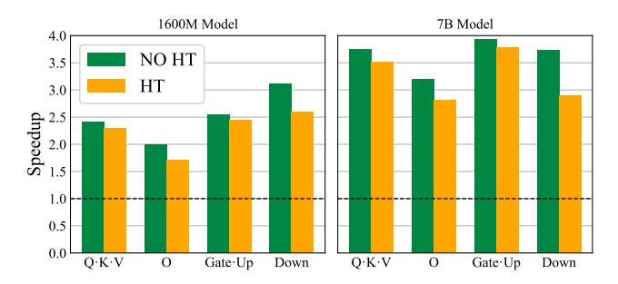

# Algorithm 2 QuEST Training Backward

- 1: Input:  $\frac{\partial L}{\partial \mathbf{y}}$ ,  $\hat{\mathbf{x}}_h$ ,  $\hat{\mathbf{w}}_h$ ,  $M_{\alpha^*}(\mathbf{x}_h; \hat{\mathbf{x}}_h)$ ,  $M_{\alpha^*}(\mathbf{w}_h; \hat{\mathbf{w}}_h)$ 2:  $\frac{\partial L}{\partial \hat{\mathbf{x}}_h} = \frac{\partial L}{\partial \mathbf{y}} \hat{\mathbf{w}}_h$

- 3:  $\frac{\partial \mathbf{L}}{\partial \hat{\mathbf{x}}} = \text{IHT}\left(M_{\alpha^*}(\mathbf{x}_h; \hat{\mathbf{x}}_h) \odot \frac{\partial L}{\partial \hat{\mathbf{x}}_h}\right)$ 4:  $\frac{\partial L}{\partial \hat{\mathbf{w}}_h} = \hat{\mathbf{x}}_h^T \frac{\partial L}{\partial \mathbf{y}}$ 5:  $\frac{\partial L}{\partial \mathbf{w}} = \text{IHT}\left(M_{\alpha^*}(\mathbf{w}_h; \hat{\mathbf{w}}_h) \odot \frac{\partial L}{\partial \hat{\mathbf{w}}_h}\right)$
- 6: **Return:**  $\frac{\partial L}{\partial \mathbf{x}}$ ,  $\frac{\partial L}{\partial \mathbf{w}}$

**Training Complexity.** In total, during training, for each original matrix multiplication (e.g.,  $xw^T$ ), we need only

> **[图片提取文字 (无描述)]:**
> 1.0 0.8 Gradient Alignment 0.6 Trust Estimator w. Hadamard Trust Estimator Straight-Through Estimator 0.4 0.2 0.0 -2.5 0.5 1.0 2.0 3.0 3.5 4.5 1.5 4.0 5.0 0.0Depth From Top, Blocks

Figure 2. Gradient alignment comparison for a 30M Llama model after training on 2.7B tokens in 8-bit precision.

two Hadamard Transforms on the forward pass and two Inverse Hadamard transforms on the backward pass.

For a Transformer model (Vaswani, 2017) with d blocks and hidden dimension h, and a batch containing b tokens, the MatMul complexity of the forward pass can be estimated as:  $b \times d \times h^2$ . Then, the asymptotic cost of the Hadamard Transform is the quantity  $b \times d \times h \times \log h + d \times h^2 \times \log h$ , which is asymptotically negligible with  $b > \log h$ .

Activation Effects. It is well-known (Choi et al., 2018) that activation quantization has major impact on training, possibly due to compounding with model depth. To test the effect of different gradient estimators on backpropagation, we empirically examine "gradient quality" as follows: we calculate intermediate gradients  $\nabla_{\mathbf{a}^\ell} L$  with respect to activations after the  $\ell$ -th Transformer block. For the same input, we disable activations quantization and calculate the "true" gradients  $\nabla_{\mathbf{a}^\ell} L$ . We then define the "gradient alignment" as the cosine similarity between gradients:  $\Xi(\nabla_{\mathbf{a}^\ell} L, \nabla_{\mathbf{a}^\ell} L) = (\nabla_{\mathbf{a}^\ell} L \cdot \nabla_{\mathbf{a}^\ell} L)/(\|\nabla_{\mathbf{a}^\ell} L\|_2 \|\nabla_{\mathbf{a}^\ell} L\|_2)$ .

While low similarity does not necessarily indicate poor gradient estimation (as the quantized forward pass might have utilized slightly different pathways, leading to discrepancy), high similarity clearly indicates that the estimator produces "high-quality" gradients relative to full precision. Figure 2 compares the gradient alignment for the STE relative to QuEST, with and without the HT. QuEST leads to remarkably-high and well-concentrated alignment ( $\geq 0.8$ ), even at larger depths. By contrast, standard trust estimation degrades alignment with depth but has good concentration, whereas the STE has *poor alignment and high variance*.

The 1-bit Case. In our original trust estimation formulation, we proposed to set the trust factor as half the quantization interval,  $T = \frac{\alpha^*}{2^b-1}$ . Thus, the trust regions increase exponentially as the bitwidth decreases. In particular, for 1-bit weights and activations, QuEST will suffer from trust regions that extend out of the grid by a whole  $\alpha^*$ . To fix

this, we reduce the size of the "outermost" trust regions, outside the clipping factor, by a scaling factor s. Through small-scale experiments, we determined the optimal value of s to be  $s^{\star} \approx 1.30$ . We use this scaling factor for all the 1-bit QuEST runs in this paper (unless stated otherwise). This modification is necessary (and leads to an improvement) only in the extreme 1-bit compression regime. This is discussed further in Appendix A.2.

### 4. Experimental Validation

### 4.1. Implementation Details

Models and Hyperparameters. We tested our method on pre-training decoder-only Transformers (Vaswani, 2017) following the Llama architecture (Touvron et al., 2023), in the range of 30, 50, 100, 200, 430 and 800 million non-embedding parameters. Please see Appendix B.1 for architecture and hyper-parameter details. We trained all models on tokens from the C4 (Dodge et al., 2021) dataset, tokenized with the Llama 2 tokenizer. We used the AdamW (Loshchilov & Hutter, 2019) optimizer with a cosine learning rate schedule and a 10% warmup period, with gradient clipping (1.0 threshold, decoupled weight decay of 0.1). We identified the learning rate optimally for a 50M FP16 model via a learning-rate sweep. For other models, as standard, we scale the learning rate inverse-proportionally to the number of non-embedding parameters. We reuse the exact learning rates for all QuEST training runs. Please see https://github.com/IST-DASLab/QuEST for a reference implementation.

Unless stated otherwise, we train every model on a number of tokens equal to 100x its number of "free" parameters, e.g., 10B tokens for a Llama 100M model, regardless of precision. This allows us to explore the data-saturation regime. We aim for comparisons that are iso-size: That is, to match the size / FLOPs of a 100M FP16 Llama model (trained on 10B parameters), we will train a 400M-parameter model with 4-bit weights and activations, using 40B total tokens. This allows us to explore accuracy for fixed model sizes, across compression ratios (see Figure 1). We discuss different D/N regimes in Appendix C.2.

### 4.2. Comparison to Prior QAT Methods

We compare QuEST to: STE; LSQ (Esser et al., 2019), a widely used QAT baseline; a QAT extension of QuaRot (Ashkboos et al., 2024), a method similar to QuEST but with AbsMax scaling instead of proper distribution matching; and AdaBin (Tu et al., 2022), a specialized W1A1 training method. The results, presented in Table 1, indicate that QuEST outperform all existing methods, including specialized ones, across all tested bitwidths. We perform a more elaborate numerical comparison in the next section.

| 36 11 1    | 36.1.1 | XX7444 | 1112.1.2 | XX / 0 | XX71 A 1 |
|------------|--------|--------|----------|--------|----------|
| Model size | Method | W4A4   | W3A3     | W2A2   | W1A1     |
| 30M        | STE    | 3.792  | 4.449    | 4.793  | 5.256    |
|            | QuaRot | 3.338  | 3.612    | 4.481  | 4.932    |
|            | LSQ    | 3.315  | 3.410    | 3.598  | 3.991    |
|            | AdaBin | _      | _        | _      | 3.988    |
|            | QuEST  | 3.272  | 3.372    | 3.574  | 3.945    |
| 50M        | STE    | 4.040  | 4.542    | 5.162  | 6.867    |
|            | QuaRot | 3.201  | 3.695    | 4.566  | 5.007    |
|            | LSQ    | 3.240  | 3.290    | 3.501  | 3.862    |
|            | AdaBin | _      | _        | _      | 3.843    |
|            | QuEST  | 3.135  | 3.226    | 3.441  | 3.791    |

*Table 1.* C4 validation loss comparison across bit-widths and model sizes for STE, a QAT extension of QuaRot, LSQ, AdaBin and QuEST. AdaBin is only defined in the binary case.

### 4.3. Scaling Laws

**Background.** Hoffmann et al. (2022) proposed to model loss scaling as a function of the number of parameters in the model N and the number of tokens D it was trained on, in the form of parametric function:

$$L(N,D) = \frac{A}{N^{\alpha}} + \frac{B}{D^{\beta}} + E, \tag{4}$$

where  $A, B, E, \alpha$ , and  $\beta$  are the scaling law parameters that can be fit empirically. Following Frantar et al. (2025), we modify this formula assuming that the training precision P only affects the parameter count N as a multiplicative factor eff(P), which, for a given quantization method, depends only on the training precision:

$$L(N, D, P) = \frac{A}{(N \cdot \operatorname{eff}(P))^{\alpha}} + \frac{B}{D^{\beta}} + E.$$
 (5)

If we take eff(16) = 1.0, we recover the law in Equation 4.

**Fitting process.** To estimate A, B, E,  $\alpha$ ,  $\beta$  and eff(P) for every quantization precision P we need, we fit this parametric function by minimizing the Huber loss (Huber, 1964) between the predicted and the observed log loss. Our process is detailed in the Appendix, and closely follows the setup of Hoffmann et al. (2022), including the grid search and the loss hyper-parameters.

Specifically, we fit the model on the range of parameters  $P \in \{1,2,3,4,16\}$ ,  $N \in \{30,50,100,200,430,800\} \times 10^6$  and  $D=100\times N$ . The resulting fit is presented on Figure 1. To capture a larger range of D, we fit the model on additional runs with  $P \in \{2,3,4\}$ ,  $N \in \{30,50,100\} \times 10^6$  and  $D/N \in \{25,50\}$ . We additionally fit the extensions of our method described in Sections 5 and 4.6. Appendix Figure 12 illustrates the quality-of-fit.

**Results.** The overall results were presented in Figure 1,

| P     | 1    | 2    | 3    | 4    | 8    | 16   |
|-------|------|------|------|------|------|------|
| QuEST | 0.02 | 0.16 | 0.43 | 0.70 | 1.02 | 1.00 |
| LSQ   |      | 0.12 | 0.32 | 0.56 | 0.87 | 1.00 |

Table 2. Fitted scaling-law parameter efficiencies eff(P).

> **[图片提取文字 (无描述)]:**
> 3.0 2.5 -2.0 eff(*P*)/*P* · 16 QuEST INT 1.0 QuEST 2:4 INT4 QuEST FP4 0.5 LSQ INT STE INT 0.0 8 16

Figure 3. Illustration of the efficiency factors  ${\rm eff}(P)/P$ , arising from our analysis, for different numerical precisions P, formats (INT, FP, INT+sparse) and methods. Higher is better. QuEST INT4 appears to have the highest efficiency.

illustrating loss vs. model size. First, we observe that, remarkably, QuEST provides stable training down to 1-bit weights and activations, across model sizes, following a stable scaling law. Second, examining the Pareto frontier, we observe that 4-bit precision is slightly superior to 3-bit, and consistently outperforms all higher precisions. Overall, these results show that QuEST can lead to stable scaling laws, which consistently improve upon prior results (Kumar et al., 2024), moving the Pareto-optimal line to around 4-bit.

### 4.4. Finding the "Optimal" Precision

The Overtraining (OT) regime. The goal of a standard scaling law (Equation 4) is to determine the "optimal" model size N and training duration D under fixed pre-training compute C=6ND. For instance, Hoffmann et al. (2022) estimated the "Chinchilla-optimal" ratio to be around  $D/N\approx 20$ . Yet, it is now common to train (often smaller) models way beyond this ratio, effectively spending additional training compute (relative to "optimal") to minimize deployment costs by executing a smaller model. For example, recent models are trained with  $D/N \geq 1000$  (Dubey et al., 2024; Team et al., 2024). With test-time compute (Snell et al., 2024), there is an incentive to increase this even further. If we extrapolate and take  $D/N \to \infty$ , Equation 5 takes the simplified form:

> **[图片提取文字 (无描述)]:**
> 3.4 -3.6 -W1A16 W1A1 NO HT 3.75 -W2A16 •••• W1A1 3.4 -S All Loss 3.50 -W3A16 --- W2A2 NO HT W4A16 W2A2 ... 3.2 3.25 -BF16. 3.00 QuEST W4A4 3.0 -QuEST 2:4 INT4 2.75 -2.8 -QuEST FP4 2.8 -2.50 -Memory, Mbit Memory, Mbit Memory, Mbit (a) (b) (c)

Figure 4. Additional scaling laws induced by QuEST: (a, left) compares INT, FP, and INT+sparse formats at 4-bit precision, (b, middle) shows the scaling laws for weight-only quantization, where 2-bit appears to be Pareto-dominant, while (c, right) shows that trust estimation benefits significantly from Hadamard normalization.

$$L_{OT}(N, P) = \frac{A}{(N \cdot \operatorname{eff}(P))^{\alpha}} + E.$$
 (6)

We refer to this as the "overtraining" (OT) regime, where the training compute is less relevant, and is only bounded by factors such as the available amount of filtered training data. The focus is on minimizing runtime/inference compute, measured for example by model latency. This problem can be formulated as finding the optimal model size N and precision P that minimizes a certain runtime compute limit.

**Runtime Cost Estimate.** Since we focus on quantizing both weights and activations, the matrix multiplications can be performed directly in lower-precision, providing linear speedups in the precision P (Abdelkhalik et al., 2022). As such, we can roughly estimate the runtime cost, up to constants, as the precision-weighted number of basic operations (FLOPs) in a forward pass F = NP. Then, the problem of minimizing loss while staying within a certain runtime (FLOP) constraint can be re-written as:

$$\min_{N,P} L_{OT}(N,P) = \frac{A}{\left(F \cdot \frac{\mathrm{eff}(P)}{P}\right)^{\alpha}} + E \text{ s.t. } F \leq F_{\max}.$$

From this formulation, if we fix  $F \leq F_{\max}$ , maximizing  $\frac{\operatorname{eff}(P)}{P}$  becomes the key factor that influences the "optimal" pre-training precision in the OT regime. Recall that we can estimate  $\operatorname{eff}(P)$  from the empirical scaling law (obtained in Section 4.3 and shown in Table 2). Thus, we can calculate  $\frac{\operatorname{eff}(P)}{P}$  for any precision. Figure 3 suggests that 4-bit appears to be the optimal pre-training precision in this regime. Additionally fitting  $\operatorname{eff}(P)$  for selected baselines and plotting them on the same figure, one can see the dominance of QuEST across all bitwidths with gaps aroung 50% of baseline efficiency around the optimal precision.

#### 4.5. Extensions to Different Formats

The FP4 Format. We can use the same framework to compare the "effective parameter count" for INT, INT + sparse, and the lower-precision FP format supported by NVIDIA Blackwell (NVIDIA, 2024). QuEST can be extended to this data type by replacing the  $\lfloor \cdot \rfloor$  rounding operation with rounding to the FP4 grid  $\lfloor \cdot \rceil_{\text{FP4}}$  scaled to fit the same [-1,1] interval. The optimal scaling factor  $\alpha_{\text{FP4}}^*$  would be defined by simply replacing  $\lfloor \cdot \rceil$  with  $\lfloor \cdot \rceil_{\text{FP4}}$  in the original definition. We choose the trust factor T for  $M_{\alpha^*}(\mathbf{x}; \hat{\mathbf{x}}) = \mathbf{I}_{|\hat{\mathbf{x}} - \mathbf{x}| \leq T}$  as the largest half-interval of the FP4 grid.

To determine the eff(P) parameter for FP4, we train 30, 50, 100, and 200M models with QuEST in FP4 precision and aggregate results in Figure 4(a), comparing them with the original uniform grid results. We observe that FP4 performs slightly worse than INT4. We also fit FP4 with the scaling law in Equation (5) and present the resulting eff(P)/P in Figure 3 (red dot). The results show that, indeed, FP has lower parameter efficiency than INT at 4-bit precision. We hypothesize that this is correlated with the fact that, when clipping is allowed, FP4 has higher MSE than INT4 when fitting Gaussian-distributed data.

**Extension to sparsity.** QuEST can also be extended to sparsity. Then, the trust estimator will mask out sparsified elements with absolute value above the trust mask; specifically, this covers the majority of sparsified elements, except for the small elements within  $\left[-\frac{\alpha^*}{2^b-1}, +\frac{\alpha^*}{2^b-1}\right]$ . In practice, we still keep the whole weight matrix in full precision during training. On the forward pass, we first sparsify and then quantize. On the backward pass, we apply the trust mask as usual.

Figure 4(a) illustrates the scaling law induced by the 50% sparse + INT4 of NVIDIA Ampere (Abdelkhalik et al., 2022), while Figure 3 (green dot) shows its parameter efficiency relative to INT and FP. With QuEST, this format can

> **[图片提取文字 (无描述)]:**
> 1600M Model 7B Model 4.0 NO HT 3.5 HT 3.0 Speedup 2.5 1.0 0.5 0.0 Q·K·V 0 Gate-Up Q·K·V Gate-Up Down Down 0

Figure 5. Per-layer speedups for QuEST INT4 vs BF16, on a single RTX 4090 GPU. The results take into account quantization/dequantization costs for QuEST, and include the cost of the Hadamard transform (orange bar). We present results for the 1.6B 4-bit QuEST model we trained, as well as inference speedups for a proportional 7B-parameter model.

provide better scaling than FP4, but slightly inferior to INT4. (While this format is known as 2:4 sparsity, for INT4 + 2:4 it requires a 4:8 mask with some additional constraints.)

### 4.6. Additional Experiments

Weight-only quantization. In addition to the comparison with the baseline presented in Section 4.2, we present full scaling for weight-only QuEST quantized training. We train models with 30, 50, 100, and 200 million parameters in 1,2,3, and 4 bits in the same general setup as Figure 1. The results in Figure 4(b) show that our approach leads to stable scaling laws in the weight-only case as well. Interestingly, here 2-bit weights appear to be Pareto-dominant, while 1-bit is surprisingly competitive with 3-bit weights.

Hadamard ablation. Finally, we examine the impact of the Hadamard transform by removing it while maintaining the trust technique, as described in Section 3.2. In Figure 4(c), we present the results in the same setup as Figure 1 for a simplified trust scheme without the Hadamard Transform. Specifically, 1) training remains stable across all precisions, although W1A1 is now inferior to BF16; 2) W4A4 remains Pareto-dominant, suggesting that the Hadamard transform improves the coefficients but does not alter the scaling laws.

