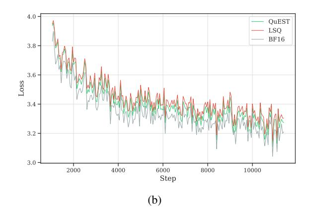

# B. Additional Information about the Experimental Setup

### **B.1. Model Hyper-parameters**

For our experiments, we chose to use the Llama 2 (Touvron et al., 2023) model as the base architecture. For the attention block, this architecture utilizes multi-head attention (Vaswani et al., 2023) with rotary positional embeddings (Su et al., 2023). For the MLP block, it uses additional gate projection and SiLU (Elfwing et al., 2017) activation function. We kept the MLP intermediate dimension equal to 8/3 of the hidden size, padding it to 256 for increased kernel compatibility. For the AdamW optimizer, we used  $\beta_1 = 0.90$  and  $\beta_2 = 0.95$ . We did not apply weight decay to any biases and layer normalizations. Table 4 describes size-specific models and optimizer hyper-parameters for all model sizes used in this work.

| Model size       | 30M    | 50M    | 100M   | 200M   | 430M    | 800M     |
|------------------|--------|--------|--------|--------|---------|----------|
| Num. Blocks      | 6      | 7      | 8      | 10     | 13      | 16       |
| Hidden Size      | 640    | 768    | 1024   | 1280   | 1664    | 2048     |
| Num. Attn. Heads | 5      | 6      | 8      | 10     | 13      | 16       |
| Learning Rate    | 0.0012 | 0.0012 | 0.0006 | 0.0003 | 0.00015 | 0.000075 |
| Num. Tokens      | 3B     | 5B     | 10B    | 20B    | 43B     | 80B      |

Table 4. Hyper-parameters used for each model size.

### B.2. Training Stability and Convergence

Here we present the loss curves for BF16, LSQ, PACT, and QuEST (ours) to analyze training stability and convergence. As shown in Figure [10\(](#page-14-0)a), QuEST smoothly converges throughout training, closely tracking the BF16 baseline while consistently outperforming LSQ. Meanwhile, PACT struggles with much higher loss, indicating poor convergence. To better highlight the differences between QuEST and LSQ in the later stages of training, Figure [10\(](#page-14-0)b) focuses on steps after 1000, removing PACT for clarity. This zoomed-in view shows that QuEST maintains a consistently lower loss trajectory than LSQ, further reinforcing its superior stability and accuracy across training.

> **[图片提取文字 (无描述)]:**
> 10 -QuEST LSQ 9 PACT BF16 8 7 Loss 6 whymmhy hyphmine which which which 5 4 3 2000 4000 6000 0 8000 10000 Step (a)

> **[图片提取文字 (无描述)]:**
> 4.0 QuEST LSQ BF16 3.8 3.6 Loss 3.4 3.2 3.0 8000 10000 6000 2000 4000 Step (b)

Figure 10. Training loss curves for a 30M model trained on 3B tokens with W4A4 bitwidth, comparing QuEST (ours), LSQ, PACT, and BF16. (a) Full training loss curves, showing that QuEST closely follows BF16 and consistently outperforms LSQ, while PACT struggles with high loss. (b) Zoomed-in view of training steps after 1000, excluding PACT for clarity, highlighting that QuEST maintains a lower loss than LSQ throughout training.

