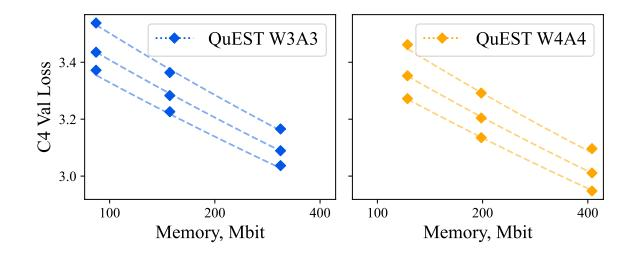

# C.1. Description of the Fitting Procedure

As described in Section 4.3, we closely follow the fitting procedure of Hoffmann et al. (2022) for the scaling law (5) fitting. Specifically, we copied their grid of initialization given by:  $\alpha \in \{0., 0.5, \ldots, 2.\}, \ \beta \in \{0., 0.5, \ldots, 2.\}, \ e \in \{-1., -.5, \ldots, 1.\}, \ a \in \{0.5, \ldots, 25\}, \ \text{and} \ b \in \{0.5, \ldots, 25\}.$  We also reuse their  $\delta = 10^{-3}$  for the Huber loss. In addition, we fit the eff(P) coefficient for a number of quantization schemes described below:

- QuEST for  $P \in \{1, 2, 3, 4, 8\}$ .
- Weight-only QuEST for  $P \in \{1, 2, 3, 4\}$ .
- QuEST without the HT for  $P \in \{1, 2, 3, 4, 8\}$ .
- QuEST with FP4 grid.
- QuEST with 2:4 INT4.

### C.2. Analysis of the Transitory Data Regime

The results in Section 4.4 suggest that 4-bit training is optimal in the  $D/N \to \infty$  regime. Here, we use the fitted scaling law (5) to verify that 4 bit is also close to optimal for D/N ratios that are reasonable in practice. We formulate the question as follows: for a fixed model size (e.g. in Gb), for which amount of compute is QuEST 4-bit the optimal precision?

Figure 14 demonstrates the (predicted) dependence of performance as a function of  $\frac{D}{N} \cdot \frac{16^2}{P^2}$ . For BF16, this quantity becomes D/N. For other P, it ensures the same amount of training computed ( $\sim ND$ ). As such, models there are compared at both the same size and the same training compute. We can see that 4-bit quantization becomes optimal after it passes a certain compute threshold that depends on model size. We can also see that the threshold value decreases as the model size (in Gb) grows. For a 14.0Gb model (corresponding to 7B parameters in BF16), the threshold is around  $D/N \approx 30$ , which is significantly below the amount of data that models of that size are currently trained on (see Section 4.3). For even larger models, the threshold eventually becomes less than the "Chinchilla-optimal" ratio of  $D/N \approx 20$ . This validates that the regime in which 4-bit pre-

> **[图片提取文字 (无描述)]:**
> QuEST W3A3 QuEST W4A4 C4 Val Loss 3.0 -100 200 400 100 200 Memory, Mbit Memory, Mbit

Figure 12. Scaling law (5) fit for 3 and 4 bit QuEST with tokens/parameters ratios in  $\{25, 50, 100\}$ .

> **[图片提取文字 (无描述)]:**
> 1.6Gb Model, 30 BF16 exa-FLOP QuEST INT 2.85 -2.80 -C4 Val Loss 2.75 -2.70 -2.65 10 12 16 14 2 8 6

Figure 13. Comparison of different QuEST precisions P at a fixed model size and training compute.

> **[图片提取文字 (无描述)]:**
> 1.6Gb Model 6.4Gb Model 3.0 BF16 BF16 2.9 2.5 QuEST W8A8 QuEST W8A8 QuEST W4A4 QuEST W4A4 2.8 2.4 C4 Val Loss C4 Val Loss C5 C5 C5 C5 C5 C5 C5 C5 C5 C5 C5 C5 C5 C C4 Val Loss 2.4 2.1 2.3 2.2 2.0  $\frac{D}{N} \cdot \frac{16^2}{P^2}$  $\frac{D}{N} \cdot \frac{16^2}{P^2}$ 14.0Gb Model 140.0Gb Model BF16 BF16 1.90 -QuEST W8A8 QuEST W8A8 2.3 QuEST W4A4 QuEST W4A4 1.85 -C4 Val Loss C4 Val Loss 1.80 1.75 1.70 2.0 1.65 1.9 102 102 103 100 10  $10^3$ 104 100 101 104

Figure 14. Different QuEST precision performance as a function of tokens-to-parameters ratio at a fixed model memory footprint. The gray line indicates a 4-bit optimality threshold.

training is optimal can, in fact, be easily achieved in practice.

We validate this in practice by training a set of models of approximately the same model size (1.6 Gb) and training compute (30 exa-FLOP, 100 B tokens for BF16 100M). The results, presented on Figure 13, show how P = 4 is optimal.