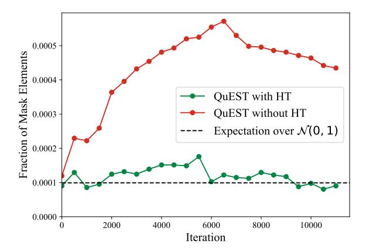

# A.1. Trust Mask Analysis

For the purposes of weight trust masks interpretation, we trained a 30M model over 3B tokens (11,444 iterations at bs=512) with QuEST weights and activations quantization to 8-bit with and without the Hadamard Transform (HT). We logged the trust masks every 500 iterations. Figure 7 shows the fraction of masked weights. We can see that adding the HT leads to an  $\approx$ 4x decrease in the amount of masked values, corresponding to the fraction of expected clipped weights for a standard normal distribution. We can also see that without the HT the fraction deviates significantly from the expected fraction under the assumption of weights normality.

> **[图片提取文字 (无描述)]:**
> 0.0005 Fraction of Mask Elements 0.0004 QuEST with HT QuEST without HT 0.0003 Expectation over  $\mathcal{N}(0, 1)$ 0.0002 0.0001 0.0000 10000 2000 4000 6000 8000 Iteration

Figure 7. Fraction of weights for which  $M_{\alpha^*}=0$  as a function of number of training iterations for a 30M model trained with QuEST.

Moreover, we looked at the percentage of masked elements at a fixed iteration in the past, that remain masked at a fixed later iteration. We plot these percentages in Figure 8. As we can see, for the run without the HT, around 69% of masked elements at iteration 6000 (roughly halfway through training) remain masked at iteration 10000 (towards the end of the training). This percentage is more than twice as small for the run with the HT at 30%. This implies that the HT makes masks less persistent, as expected. In addition, we note that weight decay is applied on all weights (including masked ones). Thus, a masked weight will slowly decay until it may "exit" the masked interval, obtaining gradient again.

> **[图片提取文字 (无描述)]:**
> Without Hadamard Transform With Hadamard Transform 0.00 0.00 0.00 0.00 0.00 0.00 0.00 0.00 0.00 0.00 0 -2000 Old Mask Iteration 0.21 0.16 0.13 0.11 0.15 0.10 0.09 0.05 0.26 0.69 0.69 0.26 0.73 0.60 00001 ò 2000 6000 4000 4000 8000 10000 6000 8000 2000 10000 New Mask Iteration New Mask Iteration

Figure 8. Fraction of masked values retained from an old iteration to a new iteration for a 30M model trained with QuEST W8A8.

### A.2. The 1-bit Case

To determine the optimal outer trust scaling factor  $s^*$ , discussed in Section 3.3, we conduct a sweep over s, varying the outer size of the outermost trust regions as  $T = s \cdot \frac{\alpha^*}{2^b - 1}$ . The results for 1-bit, shown in Figure 9, indicate that  $s^* = 1.30$  for the standard QuEST setup and  $s^* = 1.25$  for the setup without the Hadamard Transform (HT), corresponding to exactly a quarter of the quantization interval.

> **[图片提取文字 (无描述)]:**
> QuEST W1A1 No HT QuEST W1A1 With HT 4.3 C4 Val Loss 4.0 -1.6 1.0 1.2 1.4 1.8 2.0 S

Figure 9. Performance of QuEST as a function of the outer trust scaling factor s for a 30M model pretraining.

### A.3. Zero-shot Evaluation of QuEST Models

To assess the effectiveness of QuEST beyond perplexity, we conducted a comprehensive zero-shot evaluation on five established commonsense reasoning benchmarks: HellaSWAG (Zellers et al., 2019), ARC (Easy and Challenge) (Clark et al., 2018), PiQA (Bisk et al., 2019), and Winogrande (Sakaguchi et al., 2019). We compared multiple QuEST quantization settings against full-precision (BF16) baselines. All models were trained on 80B tokens unless otherwise noted.

Table 3 summarizes the zero-shot accuracy across these tasks. Overall, W4A4 QuEST closely matches its BF16 counterpart on HellaSWAG and PiQA, with minor degradation on ARC and Winogrande. Sparse quantization ("2:4 INT4") incurs larger drops.

| Method, Model Size     | HSWAG (%) ↑ | ARC-e (%) ↑ | ARC-c (%) ↑ | PiQA (%)↑ | Winogrande (%) ↑ |
|------------------------|-------------|-------------|-------------|-----------|------------------|
| BF16, 800M             | 39.51       | 53.28       | 22.44       | 71.65     | 53.91            |
| QuEST INT4, 800M       | 39.18       | 52.40       | 22.01       | 71.16     | 52.96            |
| QuEST no HT INT4, 800M | 38.03       | 52.44       | 22.70       | 71.11     | 51.38            |
| QuEST 2:4 INT4, 800M   | 36.26       | 50.46       | 21.08       | 69.04     | 53.75            |

Table 3. Zero-shot evaluation on five commonsense reasoning benchmarks.

