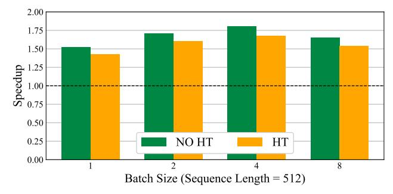

# **5. GPU Execution Support for QuEST Models**

**Kernel Overview.** Finally, we describe GPU kernel support. Our forward-pass pipeline for the quantized linear layer in QuEST consists of three main stages: (1) applying the Hadamard transformation to the BF16 activations, (2) quantizing the BF16 activations into INT4 and packing them into the low-precision format, and (3) performing INT4 matrix multiplication on the quantized activations and weights, followed by dequantization of the result back to BF16.

> **[图片提取文字 (无描述)]:**
> 2.00 1.75 1.50 dn 1.25 1.00 0.75 1.25 0.50 0.25 NO HT HT 0.00 Batch Size (Sequence Length = 512)

Figure 6. End-to-end prefill speedups for QuEST INT4 vs BF16, across different batch sizes, using the 1.6B parameter model on a single RTX 4090 GPU. As expected, QuEST is most effective for larger batch sizes, where the workload is more compute-bound.

For the first stage, we utilize an existing Hadamard kernel (Tri Dao). We developed a custom Triton kernel for the second stage to fuse the quantization and data formatting. This kernel computes MSE-optimal group scales and performs centered quantization on the activations. It also packs the INT4 elements into UINT8, with additional intermediate results prepared for matrix multiplication and dequantization. The third stage involves fused matrix multiplication and dequantization using our enhanced CUTLASS kernel. In this stage, both activations and weights are read and processed as integers to exploit the higher GPU throughput. The results are then dequantized back to BF16 within the same kernel. We also apply CUDA Graph end-to-end to further reduce the kernel launching overhead.

To optimize GEMM performance, we carefully tuned the CUDA thread-block and warp tile sizes and leveraged the high levels of the memory hierarchy to fuse the dequantization step before writing the results back to Global Memory in a custom CUTLASS *epilogue*. By performing dequantization at the register level, we minimize data movement, reduce GMEM memory access overhead, and minimize the number of kernel launches.

Runtime Results. The per-layer speedups achievable using our kernel at 4-bit precision, relative to 16-bit MatMuls, are illustrated in Figure 5. We provide a breakdown across layers of the same shape, for 1.6B (which we have already trained), and a proportionally-scaled 7B model (which we plan to train in future work). These measurements include all auxiliary overheads (e.g. quantization/dequantization) for QuEST; in addition, we separate out the performance impact of the Hadamard transform.

For the smaller 1.6B model, the per-layer speedups vary between  $1.2\times$  (on the smallest layers, with Hadamard) and  $2.4\times$  (largest down-projection layer, no Hadamard). The largest overhead of the Hadamard transform, of around 30%, is on the down-projection layer, which presents the largest dimension for the Hadamard. The speedups increase

significantly (2.3-3.9×) when we move to the 7B-parameter model, as the MatMuls are much more expensive. Figure [6](#page-7-3) shows the end-to-end inference performance at 1.6B using our kernels vs. the BF16 baseline, showing speedups of 1.3-1.5× in the less memory-bound regime.

