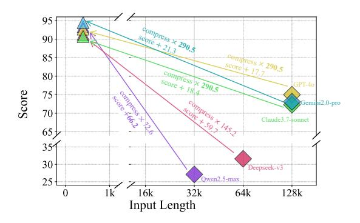
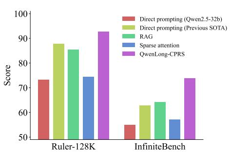
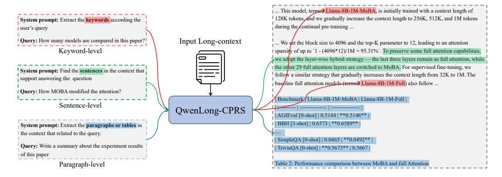

# 1 Introduction

Enhancing the long-context processing capabilities of large language models (LLMs) has emerged as a critical research frontier in both academia and industry [\[31,](#page-14-0) [39,](#page-14-1) [34,](#page-14-2) [1\]](#page-12-0). Recent advancements in positional embedding techniques [\[38,](#page-14-3) [33\]](#page-14-4) and the curation of synthetic long-context training data [\[3\]](#page-12-1) have enabled significant progress in extending LLMs' context windows, achieving expansions from 4K to over 1M tokens [\[46,](#page-15-0) [10\]](#page-12-2). Despite these advances, two critical challenges persist. First, the quadratic computational complexity of processing long sequences imposes prohibitive efficiency costs. Second, the unresolved "lost in the middle" phenomenon [\[25\]](#page-13-0), where LLMs struggle to effectively prioritize critical information within lengthy inputs.

A fundamental strategy involves efficiently managing long context by focusing on key content within the model's reliable context window [\[26\]](#page-14-5). Building upon this strategy, two primary approaches have

∗ Corresponding author

> **[图片提取文字 (无描述)]:**
> 95 sepre + 21.3 90 85 80 Score 75 Gemini2.0-pro 70 Claude3.7-sonnet 354 30 Deepseek-v3 Owen2.5-max 25 1k 16k 64k 128k 32k Input Length

> **[图片提取文字 (无描述)]:**
> 1001 Direct prompting (Qwen2.5-32b) Direct prompting (Previous SOTA) RAG 90 Sparse attention OwenLong-CPRS 80 Score 60 Ruler-128K InfiniteBench

- (a) The input compression rate and performance gain when different LLMs are cascaded with QWENLONG-CPRS.
- (b) Performance of Qwen2.5-32b-instruct with different context management methods.

Figure 1: Illustration of the performance of QWENLONG-CPRS. Figure 1a compares the input token consumption and model performance of various LLMs on Ruler-128K before (marked with  $\diamondsuit$ ) and after (marked with  $\Delta$ ) cascading QWENLONG-CPRS. Figure 1b highlights the performance improvements of QWENLONG-CPRS over other context management methods, such as RAG [22] and sparse attention [16].

been proposed: Retrieval-augmented generation (RAG) frameworks [21, 7] enhance computational efficiency by dynamically retrieving query-relevant text chunks from input contexts, enabling selective processing of contextual information. Conversely, sparse attention (SA) mechanisms [16, 27, 49] redesign the self-attention mechanism within LLMs, either by restricting attention computations to structured patterns or by prioritizing critical token interactions during sequential generation.

Despite their advantages, both approaches exhibit significant limitations. First, RAG systems, while efficient, rely on coarse-grained chunk-level embeddings, leading to imprecise outputs. This limitation becomes particularly problematic in scenarios requiring fine-grained localization of uniformly distributed knowledge [23]. On the other hand, SA methods, though flexible in token-level aggregation, necessitate substential data construction and computationally intensive model training to optimize attention patterns [27, 49], alongside specialized infrastructure investments.

To address these challenges, we introduce an innovative *dynamic context optimization* paradigm, which aims to improve context-processing efficiency through maximizing information density. As depicted in Figure 2, this approach dynamically compresses input contexts into query-tailored segments across different granularities, enabling concise and accurate context optimization for various user queries. This paradigm advances existing methods in two key aspects. First, it replaces RAG's coarse chunk-level retrieval with precise token-level content selection, enhancing information identification accuracy. Second, it operates independently as a plug-and-play component, eliminating SA's requirement for model retraining while maintaining compatibility with any downstream LLMs.

Building upon the dynamic context optimization paradigm, we propose a novel compression system QWENLONG-CPRS. Specifically, QWENLONG-CPRS takes the control prompt, task query, and long context as input, and then labels the token critic score to compress task-relevant content based on a single forward pass. To endow QWENLONG-CPRS with both precise and controllable characteristics, we redesign the attention mechanism into a hybrid architecture that combines bi-directional language modeling for comprehensive context location and causal language modeling for reliable language representation. Additionally, we develop a language modeling as token critic framework that repurposes the existing LLM's language modeling head to label token-level importance scores, thus maintaining the pretrained knowledge for better context compression

As illustrated in Figure 1a, QWENLONG-CPRS demonstrates a remarkable context compression effect, achieving a context compression rate ranging from 72.6 to 290.5 times. This indicates that QWENLONG-CPRS possesses efficient context optimization capabilities and can be seamlessly reused across various large models. More experimental results in Section 4 across four long-context benchmarks whose input context lengths ranging from 4K to 2M tokens demonstrate QWENLONG-CPRS's superiority over direct prompting, RAG, and SA methods, with remarkable performance improvements and considerably higher inference efficiency. Notably, we show that smaller, short-

> **[图片提取文字 (无描述)]:**
> ... This model, termed Llama-8B-1M-MoBA, is initially trained with a context length of 128K tokens and we gradually increase the context length to 256K, 512K, and 1M tokens System prompt: Extract the keywords according the during the continual pre-training ... user's query Query: How many models are compared in this paper? Input Long-context ... We set the block size to 4096 and the top-K parameter to 12, leading to an attention Keyword-level sparsity of up to '1 - (4096\*12)/1M = 95.31%'. To preserve some full attention capabilities, we adopt the layer-wise hybrid strategy - the last three layers remain as full attention, while the other 29 full attention layers are switched to MoBA. For supervised fine-tuning, we System prompt: Find the sentences in the context that follow a similar strategy that gradually increases the context length from 32K to 1M. The support answering the question baseline full attention models (termed Llama-8B-1M-Full) also follow ... Query: How MOBA modified the attention? Benchmark Llama-8B-1M-MoBA | Llama-8B-1M-Full | Sentence-level ..... OwenLong-CPRS AGIEval [0-shot] | 0.5144 | \*\*0.5146\*\* BBH [3-shot] | 0.6573 | \*\*0.6589\*\* System prompt: Extract the paragraphs or tables in the context that related to the query. SimpleQA [0-shot] | 0.0465 | \*\*0.0492\*\* | Query: Write a summary about the experiment results TriviaQA [0-shot] | \*\*0.5673\*\* | 0.5667 of this paper Table 2: Performance comparison between MoBA and full Attention Paragraph-level

Figure 2: The concept of *dynamic context optimization*, which aims to enhance context processing efficiency by maximizing information density. Given a long-context input, this paradigm dynamically compresses it into query-specific content at varying granularities, facilitating concise and accurate information extraction for different user queries. For instance, keywords for *search queries*, sentences for *question answering*, and paragraphs for *summarization*.

context LLMs augmented with QWENLONG-CPRS can outperform larger long-context counterparts. These findings highlight the potential of context optimization paradigms, offering a scalable and efficient pathway to augment LLMs' long-context processing capabilities.

Our key contributions are as follows:

- We introduce dynamic context optimization, a novel paradigm for long-context management through dynamic, instruction-guided token-level compression. This paradigm optimizes information retention while adaptively prioritizing critical content.
- We propose QWENLONG-CPRS, an innovative model that advances long-context processing via token-level critical scoring, enabling granular context optimization without sacrificing precision. We transformed the Qwen series models into an dynamic context optimization model by integrating a hybrid attention mechanism and leveraging the language modeling head token critic module. Furthermore, we systematically designed the framework for training data construction.
- Through extensive evaluation across four distinct benchmarks, we demonstrate that QWENLONG-CPRS achieves substantial performance gains while reducing inference overhead. The framework shows consistent efficacy across LLMs of varying parameter scales and context lengths, establishing its versatility as a context-optimization-augmentation solution for long-context processing.

