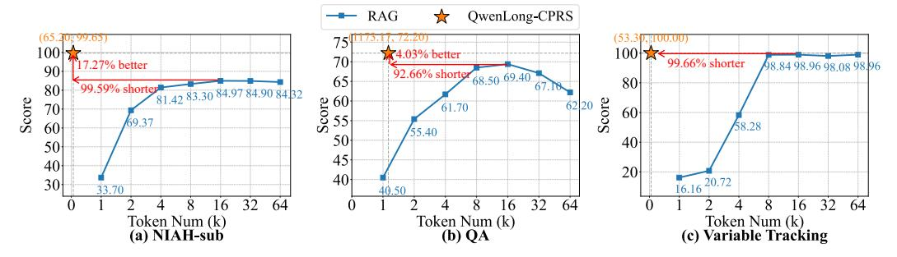
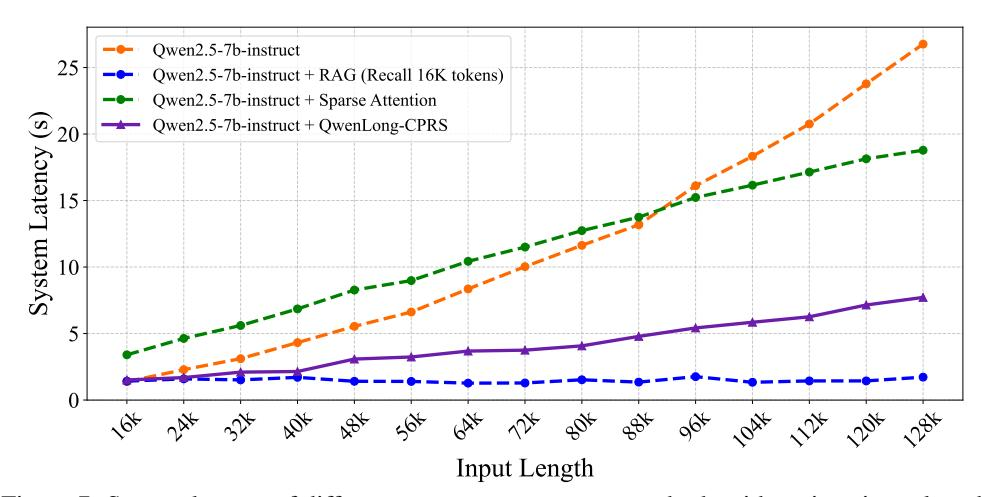

# 4.2 QWENLONG-CPRS with Stronger LLMs

To investigate QWENLONG-CPRS's capacity to push performance boundaries in long-context scenarios, we deploy it across high-parameter LLMs with superior general capabilities. Figure 5 reveals consistent performance enhancements: all QWENLONG-CPRS-augmented models exceed prior direct prompting baselines with the best performance (77.5 on Ruler-128K and 62.9 on InfiniteBench).

Crucially, QWENLONG-CPRS effectively compensates for varying input constraints5, delivering average gains of 54.9, 49.0, 21.7 and 15.7 for the LLMs with 32K, 64K, 128K and 1M context windows, respectively. This demonstrates QWENLONG-CPRS's ability to elevate length-limited LLMs to parity with specialized long-context LLMs through optimized context, enabling resource-efficient deployment of short-input LLMs in extended-sequence applications.

&lt;sup>5For Qwen2.5-max and Deepseek-v3, we utilize the version provided by the Aliyun Bailian platform, which supports 32K and 64K input contexts, respectively.

> **[图片提取文字 (无描述)]:**
> QwenLong-CPRS - RAG 4.03% better 70 99,66% shorter 7.27% better A8.84 98.96 98.08 98.96 90 92.66% shorter 68.50 69.40 65 80 99.59% shorter 80 81.42 83.30 84.97 84.90 84 32 Score 25 25 Score Score 61.70 70 60 60 55.40 50 40 50 45 40 20 40 30 40.50 16 32 64 16 32 64 32 64 16 Token Num (k) (a) NIAH-sub Token Num (k) **(b) QA** Token Num (k)
> (c) Variable Tracking

Figure 6: Performance comparison between RAG and QWENLONG-CPRS across varying retrieved token quantities

> **[图片提取文字 (无描述)]:**
> Qwen2.5-7b-instruct 25 Qwen2.5-7b-instruct + RAG (Recall 16K tokens) Qwen2.5-7b-instruct + Sparse Attention System Latency (s) Qwen2.5-7b-instruct + QwenLong-CPRS P Input Length

Figure 7: System latency of different context management methods with various input length.

### 4.3 Context Optimization Efficiency

This section analyzes token efficiency by examining RAG's performance variation with increasing retrieved tokens from 1K to 64K across three Ruler-128K subsets. As shown in Figure 6, RAG exhibits suboptimal performance when the retrieved tokens are less than 8K across all tasks due to critical information loss in coarse-grained retrieval. RAG's performance peaks at 16K tokens, and then keeps fluctuation on NIAH-sub and Variable Tracking, and even go worse on QA when the number of retrieved tokens increase. This pattern emerges from RAG's incomplete critical data capture at low token quantities and noise accumulation at higher scales.

QWENLONG-CPRS demonstrates superior performance through context optimization, achieving 99.59%, 92.66%, and 99.66% less tokens than RAG's peak-requirement volumes the three tasks. Furthermore, it surpasses RAG's maximum scores by 17.27% on NIAH-sub and 4.03% on QA, establishing both quantitative and qualitative advantages in context optimization efficiency.

#### 4.4 Latency Analysis

We evaluate QWENLONG-CPRS's impact on LLM prefill latency through four system configurations: (1) Direct prompting with Qwen2.5-7b-instruct, (2) RAG-enhanced implementation (16K retrieved tokens), (3) Minference sparse attention integration, and (4) QWENLONG-CPRS-cascaded architecture illustrated in Figure 3b. The QWENLONG-CPRS configuration employs window size w=8192 and parallelism factor  $\rho=5$ . All systems utilize Qwen2.5-7b-instruct deployed 1 NVIDIA A100 GPU via vLLM with paged attention [19] for memory optimization. Figure 7 presents Time-to-First-Token (TTFT) measurements of the above four systems under increasing context lengths, revealing three critical patterns:

Table 6: Performance Comparison of QWENLONG-CPRS-Augmented LLMs with Original vs. Customized Prompts

| Model                                   | SingleDoc QA |         |       | MultiDoc QA |       |        | Ana aa | Summary |        |       | 1 4110 |       |       |       |
|-----------------------------------------|--------------|---------|-------|-------------|-------|--------|--------|---------|--------|-------|--------|-------|-------|-------|
| Wiodei                                  | MF (en)      | MF (zh) | NQ    | Qasp        | HPQA  | 2Wiki. | Musi.  | Du.     | Avg_qa | GR    | QM     | MN    | VC    | Avg   |
| Qwen2.5-7b-instruct [34]+ QWENLONG-CPRS |              |         |       |             |       |        |        |         |        |       |        |       |       |       |
| + Original Prompt                       | 53.42        | 62.48   | 24.97 | 44.16       | 63.95 | 56.16  | 41.01  | 19.04   | 45.65  | 17.37 | 17.63  | 15.30 | 18.02 | 36.12 |
| + Customized Prompt                     | 54.73        | 62.74   | 24.2  | 45          | 62.72 | 56.33  | 41.34  | 20.79   | 45.98  | 17.87 | 18.1   | 14.65 | 17.39 | 36.32 |
| Qwen2.5-32b-instruct [34]+QWENLONG-CPRS | 1            |         |       |             |       |        |        |         |        | l     |        |       |       | 1     |
| + Original Prompt                       | 54.59        | 65.82   | 30.56 | 45.54       | 67.44 | 66.28  | 47.89  | 19.81   | 49.74  | 16.37 | 18.01  | 14.62 | 19.23 | 38.85 |
| + Customized Prompt                     | 53.42        | 65.73   | 29.52 | 45.31       | 68.3  | 65.44  | 47.07  | 19.42   | 49.27  | 17.37 | 17.72  | 15.03 | 18.4  | 38.56 |

- The baseline direct prompting method exhibits quadratic latency growth, reaching 26.76s at 128K tokens. QWENLONG-CPRS demonstrates superior linear scaling with 3.47× acceleration over baseline at 128K, despite current implementation limitations that leave the optimization of computation kernel unexplored.
- Minference's sparse attention shows paradoxical behavior: below 96K tokens, dynamic sparse pattern computation overhead causes higher latency than direct prompting (10.42s vs 8.35s at 64K). At 128K tokens, it achieves 1.42× acceleration, which is substantially lower than QWENLONG-CPRS's 3.47× improvement.
- RAG demonstrates constant-time latency characteristics, though this comes at accuracy costs shown in Section 4.1 and Section 4.3. Our future work will focus on bridging QWENLONG-CPRS's current linear complexity toward constant-time performance while preserving its accuracy advantages.

#### 4.5 Prompt-Agnostic Integration with Foundation Models

This section analyzes the viability of direct QWENLONG-CPRS integration with foundation models without prompt engineering. We evaluate two configurations: (1) *Standard Prompting* using original instructions, and (2) *Customized Prompting* explicitly stating the optimized context nature.

Table 6 reveals statistically comparable performance between prompt configurations for both Qwen2.5-7B-Instruct ( $\Delta$ =+0.20) and Qwen2.5-32B-Instruct ( $\Delta$ =-0.29). This consistency demonstrates QWENLONG-CPRS's output stability and seamless compatibility with existing LLM interfaces. The findings suggest practitioners can adopt QWENLONG-CPRS augmentation without workflow disruption, maintaining conventional prompting strategies while gaining long-context processing benefits.

#### 4.6 Case Study

Three practical implementations of QWENLONG-CPRS are presented in Figures 8, 9, and 10. Figures 8 and 9 demonstrate QWENLONG-CPRS's capability to compress query-relevant key sentences into minimal optimized contexts, effectively supporting downstream LLM inference through targeted information preservation.

Figure 10 reveals QWENLONG-CPRS's standalone potential for critical contractual element extraction without LLM integration. This independent functionality suggests broader applicability as a specialized service component in practical business intelligence applications requiring automated document analysis.

### 5 Conclusion and Future Works

This work introduces the dynamic context optimization paradigm through the QWENLONG-CPRS framework, enabling controlled context compression via four technical innovations: (1) natural language-guided dynamic optimization, (2) boundary-aware bidirectional reasoning layers, (3) token critic mechanisms with language modeling heads, and (4) window-parallel inference architecture.

Our comprehensive evaluations across five long-context benchmarks demonstrate QWENLONG-CPRS's advantages in performance enhancement and inference efficiency. Experimental results reveal consistent improvements across 10 mainstream LLMs, particularly enabling smaller and shorter LLMs to achieve superior performance over stronger and longer counterparts. The framework

achieves 97.3% relative compression versus RAG baselines with 7.3% accuracy improvements, while linear latency scaling enables 3.47× acceleration over direct prompting at 128K-token inputs.

Future research will pursue three primary objectives: First, improving computational efficiency through the implementation of KV-cache mechanisms and optimization of kernel operations. Second, integrating global context awareness to enhance semantic coherence. Third, expanding the framework's applicability by adapting it as a foundational component for diverse use cases, such as long-chain reasoning compression and agent systems.

