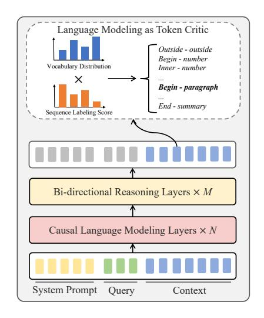
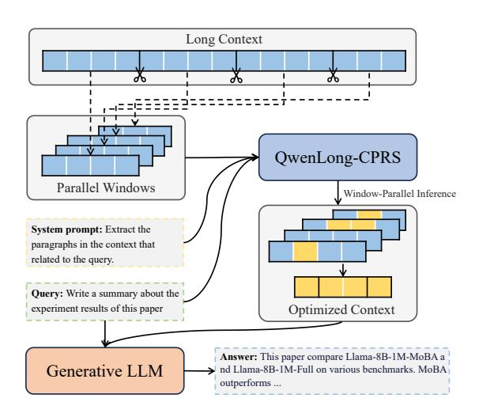

# 2 QWENLONG-CPRS

In this section, we initially present the formal definition of dynamic context optimization in Section [2.1.](#page-2-1) Subsequently, Section [2.2](#page-3-0) details the model architecture of QWENLONG-CPRS and elaborates on the training methodology employed to align QWENLONG-CPRS with the objectives of dynamic context optimization. Our effective window-parallelism inference method is also introduced in Section [2.2.](#page-3-0) Lastly, we describe the data construction method we have devised in Section [2.3.](#page-4-0)

### 2.1 Dynamic Context Optimization

The input structure for long-context tasks comprises two components: the user query q, and the long context Xl . When Xl exceeds the effective window size of LLMs, it typically causes either essential input truncation or the "lost-in-the-middle" phenomenon, ultimately degrading response quality. To address this, we propose identifying an information-condensed subset Xs such that:

$$|X_s| \ll |X_l|$$
, where  $X_s \subseteq X_l$  (1)

This process, termed *context optimization*, aims to find the minimal-length |Xs| that preserves maximally informative content for generating high-quality responses Y . Formally, we define our

> **[图片提取文字 (无描述)]:**
> Language Modeling as Token Critic Outside - outside Begin - number Vocabulary Distribution Inner - number Begin - paragraph End - summary Sequence Labeling Score Bi-directional Reasoning Layers  $\times M$ Causal Language Modeling Layers  $\times N$ System Prompt Query Context

> **[图片提取文字 (无描述)]:**
> Long Context QwenLong-CPRS Parallel Windows Window-Parallel Inference System prompt: Extract the paragraphs in the context that related to the query. Query: Write a summary about the experiment results of this paper Optimized Context Answer: This paper compare Llama-8B-1M-MoBA a Generative LLM nd Llama-8B-1M-Full on various benchmarks. MoBA outperforms ...

- (a) The model architecture of QWENLONG-CPRS.
- (b) The workflow of generative LLMs cascading QWENLONG-CPRS in this paper.

Figure 3: The model architecture and workflow of QWENLONG-CPRS.

objective function as:

$$\mathcal{J} = \max_{\phi} \mathbb{E}_{X_s \subseteq X_l} \left[ \frac{\mathcal{I}(Y; [X_s, q])}{|X_s|^{\beta}} \right], \tag{2}$$

where I(·, ·) is the mutual information, β controls the length penalty intensity, and ϕ parameterizes the context optimizer. In this paper, we propose QWENLONG-CPRS, which achieves context optimization by identifying and retaining the most semantically crucial tokens from Xl . In addition, we introduce a natural language prompt P that enables users to dynamically configure the granularity of the optimized context and how it will contribute the the response. Therefore, the resulting dynamically optimized context Xs is formalized as:

$$X_s = \mathcal{F}_{\phi}(P, q, X_l), \tag{3}$$

where F(·) is the token selection operation.

