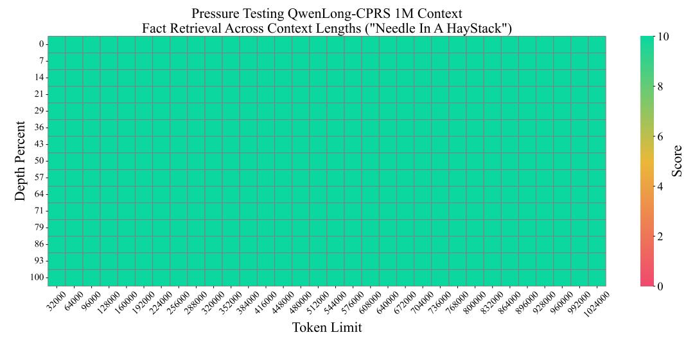
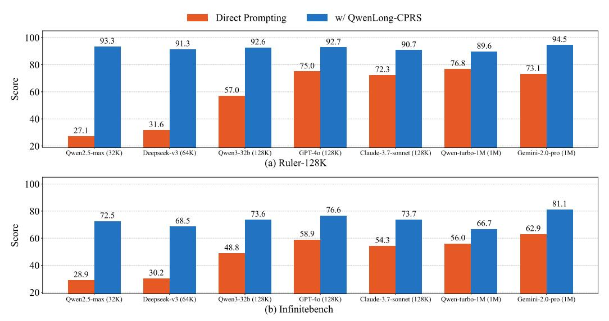

# 4 Experimental Results

#### 4.1 Overall Results

The evaluation results across Tables 1, 2, and 3 demonstrate QWENLONG-CPRS's effectiveness against comparative baselines, revealing several key findings:

4https://help.aliyun.com/zh/model-studio/long-context-qwen-long

Table 2: Evaluation results on Longbench V1

| M. J.1                    |         | SingleDoc | QA    |       |       | MultiDe | oc QA |       | <b>.</b> | l     | Sum   | mary  |       |       |
|---------------------------|---------|-----------|-------|-------|-------|---------|-------|-------|----------|-------|-------|-------|-------|-------|
| Model                     | MF (en) | MF (zh)   | NQ    | Qasp  | HPQA  | 2Wiki.  | Musi. | Du.   | Avg_qa   | GR    | QM    | MN    | VC    | Avg   |
| Qwen2.5-72b-instruct [34] | 54.26   | 66.20     | 33.78 | 47.56 | 65.88 | 64.46   | 42.00 | 19.29 | 45.89    | 19.56 | 18.69 | 13.52 | 16.30 | 38.46 |
| Qwen2.5-max [34]          | 51.40   | 64.75     | 27.80 | 43.47 | 65.77 | 62.51   | 40.16 | 20.09 | 46.99    | 16.90 | 18.64 | 13.57 | 16.52 | 36.80 |
| Qwen2.5-turbo-1M [46]     | 54.41   | 60.66     | 24.59 | 42.73 | 63.03 | 52.72   | 39.21 | 23.88 | 45.15    | 17.33 | 18.39 | 14.32 | 19.12 | 35.87 |
| Qwen3-32b                 | 46.71   | 62.90     | 27.79 | 40.73 | 66.56 | 74.00   | 52.57 | 18.48 | 48.72    | 27.73 | 19.93 | 21.69 | 13.99 | 39.42 |
| Qwen3-235b-a22b           | 45.60   | 61.45     | 30.16 | 42.06 | 68.40 | 75.42   | 56.20 | 17.59 | 49.61    | 27.35 | 20.00 | 21.45 | 13.50 | 39.93 |
| gpt-4o [30]               | 53.99   | 62.56     | 35.13 | 46.97 | 68.79 | 68.51   | 46.20 | 17.71 | 49.98    | 15.82 | 17.11 | 14.40 | 14.95 | 38.51 |
| claude-3.7-sonnet [2]     | 53.45   | 63.82     | 37.57 | 48.80 | 66.15 | 67.22   | 48.37 | 19.53 | 50.16    | 18.08 | 16.73 | 15.42 | 16.61 | 39.61 |
| deepseek-v3 [11]          | 56.69   | 66.72     | 34.80 | 47.59 | 69.53 | 69.65   | 57.62 | 21.23 | 52.98    | 17.85 | 17.85 | 15.06 | 17.81 | 41.03 |
| gemini-2.0-pro [9]        | 55.77   | 65.47     | 33.10 | 51.39 | 70.69 | 80.43   | 68.18 | 12.10 | 54.64    | 16.41 | 17.41 | 13.35 | 10.64 | 41.25 |
| Qwen-Long                 | 53.62   | 64.49     | 30.92 | 43.98 | 64.80 | 62.53   | 41.06 | 21.83 | 47.90    | 33.04 | 24.06 | 22.44 | 13.71 | 39.71 |
| LLaMA3.1-8b-instruct [1]  | 49.39   | 60.64     | 26.81 | 37.79 | 53.07 | 40.42   | 29.79 | 21.06 | 39.87    | 19.09 | 17.99 | 14.80 | 9.63  | 31.71 |
| + RAG [22]                | 32.09   | 25.91     | 12.83 | 18.36 | 30.91 | 21.35   | 10.64 | 15.21 | 20.91    | 12.09 | 15.50 | 13.77 | 6.94  | 17.97 |
| + MInference [16]         | 55.21   | 60.69     | 28.61 | 47.57 | 53.60 | 40.43   | 29.08 | 27.76 | 42.87    | 19.88 | 18.19 | 15.40 | 17.37 | 34.48 |
| + InfiniteRetrieval [48]  | 44.72   | -         | 18.88 | 36.45 | 50.10 | 29.98   | 27.26 | -     | -        | 21.94 | 20.17 | 24.14 | -     | -     |
| + QWENLONG-CPRS           | 54.37   | 60.87     | 28.68 | 42.92 | 59.03 | 52.46   | 34.58 | 23.93 | 44.60    | 20.02 | 18.22 | 15.06 | 16.84 | 35.58 |
| Qwen2.5-7b-instruct [34]  | 52.35   | 62.94     | 25.40 | 45.40 | 56.92 | 45.02   | 31.16 | 28.57 | 43.47    | 32.64 | 23.35 | 23.20 | 13.69 | 36.72 |
| + RAG [22]                | 33.93   | 26.97     | 12.15 | 21.97 | 33.15 | 23.72   | 11.14 | 20.64 | 22.96    | 20.48 | 20.15 | 21.41 | 9.81  | 21.29 |
| + MInference [16]         | 51.86   | 62.95     | 28.25 | 45.87 | 56.29 | 43.03   | 31.16 | 23.15 | 42.82    | 18.57 | 18.64 | 14.50 | 17.89 | 34.35 |
| + InfiniteRetrieval [48]  | 50.92   | -         | 25.48 | 42.12 | 57.52 | 50.26   | 30.62 | -     | -        | 19.26 | 20.47 | 20.60 | -     | -     |
| + QWENLONG-CPRS           | 53.42   | 62.48     | 24.97 | 44.16 | 63.95 | 56.16   | 41.01 | 19.04 | 45.65    | 17.37 | 17.63 | 15.30 | 18.02 | 36.12 |
| Qwen2.5-32b-instruct [34] | 52.68   | 66.22     | 31.91 | 47.99 | 64.81 | 59.81   | 40.60 | 22.00 | 48.25    | 17.09 | 17.84 | 14.88 | 18.80 | 37.89 |
| + RAG [22]                | 34.17   | 32.17     | 13.21 | 22.79 | 35.86 | 25.30   | 13.19 | 21.13 | 24.73    | 27.83 | 20.12 | 21.29 | 10.15 | 23.10 |
| + MInference [16]         | 50.98   | 66.14     | 27.90 | 46.46 | 62.37 | 59.22   | 39.13 | 24.90 | 47.17    | 18.46 | 17.62 | 14.32 | 17.36 | 37.07 |
| + QWENLONG-CPRS           | 54.59   | 65.82     | 30.56 | 45.54 | 67.44 | 66.28   | 47.89 | 19.81 | 49.74    | 16.37 | 18.01 | 14.62 | 19.23 | 38.85 |

Table 3: Evaluation results on Longbench V2

| Model                     | Overall | l .  | culty | Length (< 32K; 32K-128K; > 12 |        |      |  |  |  |
|---------------------------|---------|------|-------|-------------------------------|--------|------|--|--|--|
|                           |         | Easy | Hard  | Short                         | Medium | Long |  |  |  |
| Qwen2.5-72b-instruct [34] | 42.1    | 42.7 | 41.8  | 45.6                          | 38.1   | 44.4 |  |  |  |
| Qwen2.5-max [34]          | 46.5    | 51.6 | 43.4  | 56.7                          | 38.6   | 45.4 |  |  |  |
| Qwen2.5-turbo-1M [46]     | 40.8    | 45.3 | 37.9  | 46.1                          | 37.7   | 38.0 |  |  |  |
| Qwen3-32b [41]            | 48.7    | 57.3 | 43.4  | 57.2                          | 42.3   | 47.2 |  |  |  |
| Qwen3-235b-a22b [41]      | 51.9    | 58.1 | 48.1  | 60.3                          | 46.7   | 48.1 |  |  |  |
| gpt-4o [30]               | 46.0    | 50.8 | 43.0  | 47.5                          | 47.9   | 39.8 |  |  |  |
| claude-3.7-sonnet [2]     | 50.9    | 60.4 | 45.0  | 55.0                          | 47.9   | 50.0 |  |  |  |
| deepseek-v3 [11]          | 45.3    | 51.0 | 41.8  | 51.7                          | 40.0   | 45.4 |  |  |  |
| gemini-2.0-pro [9]        | 60.6    | 71.6 | 53.7  | 69.1                          | 54.0   | 59.4 |  |  |  |
| Qwen-Long                 | 43.0    | 49.2 | 39.2  | 48.3                          | 37.7   | 44.9 |  |  |  |
| Qwen2.5-7b-instruct [34]  | 27.4    | 30.2 | 25.7  | 35.0                          | 24.2   | 21.3 |  |  |  |
| + RAG [22]                | 31.4    | 35.9 | 28.6  | 33.3                          | 28.4   | 34.3 |  |  |  |
| + MInference [16]         | 27.8    | 27.6 | 28.0  | 31.7                          | 27.0   | 23.1 |  |  |  |
| + QWENLONG-CPRS           | 33.1    | 30.9 | 34.4  | 36.7                          | 29.8   | 33.6 |  |  |  |
| Qwen2.5-32b-instruct [34] | 41.7    | 47.9 | 37.9  | 46.1                          | 38.1   | 41.7 |  |  |  |
| + RAG [22]                | 32.2    | 36.5 | 29.6  | 35.6                          | 27.0   | 37.0 |  |  |  |
| + MInference [16]         | 35.8    | 38.0 | 34.4  | 32.8                          | 38.1   | 36.1 |  |  |  |
| + QWENLONG-CPRS           | 42.0    | 45.5 | 39.9  | 42.2                          | 38.1   | 49.5 |  |  |  |

Performance Enhancement Through QWENLONG-CPRS: Model cascading with QWENLONG-CPRS yields consistent improvements across all evaluated LLMs. LLaMA3.1-8b-Instruct, Qwen2.5-7b-Instruct, and Qwen2.5-32b-Instruct achieve respective performance gains of 39.72, 55.79, and 19.26 on Ruler-128K, with comparable improvements of 13.30, 21.95, and 18.83 on InfiniteBench. LongBench evaluations show sustained enhancements, averaging +2.8 on V1 and +3.0 on V2. Significantly, QWENLONG-CPRS-augmented open-source models surpass proprietary LLMs on Ruler-128K and InfiniteBench, establishing new state-of-the-art performances. This demonstrates that resource-constrained open-source LLMs can achieve parity with commercial counterparts in long-context tasks when integrated with QWENLONG-CPRS.

Superior Performance with Extended Context Lengths: Experimental results demonstrate QWENLONG-CPRS's effectiveness correlates positively with input context length across evaluated tasks. It shows pronounced advantages when processing contexts exceeding standard LLM capacity limits, achieving average performance gains of 38.20 on Ruler-128K, 18.02 on InfiniteBench, and 10.5 on LongBench V2-Long. Conversely, minor improvements occur on LongBench V1's shorter contexts (2K-18K tokens). This dichotomy reveals two critical insights: (1) Current LLMs exhibit sufficient competence for conventional-length tasks, and (2) QWENLONG-CPRS provides essential performance augmentation specifically for extreme-length scenarios beyond standard model

Table 4: The system prompt and performances of QWENLONG-CPRS in different Tasks, with Qwen2.5-7b-instruct as the generative LLM. The "Avg. Len." represents the average token numbers of the optimized context.

| Task                                                                                 | Granularity     | Avg. Len.                        | Improvement                        | Prompt Example                                                                                                             |
|--------------------------------------------------------------------------------------|-----------------|----------------------------------|------------------------------------|----------------------------------------------------------------------------------------------------------------------------|
| InfiniteBench-RT.KV                                                                  | Words (UUID)    | 69.32                            | +84.20                             | Extract the {key}:{value} pair for the key in user's question                                                              |
| Ruler-128K-NIAH Ruler-128K-VT InfiniteBench-RT.Passkey InfiniteBench-RT.NUM | Short Sentences | 52.13 53.30 24.00 36.95 | +39.87 +74.20 +5.19 +5.19 | Extract the 'needles' in the format of 'One of the special magic {type_needle_v} for {key} is: {value}.' from the document |
| Ruler-128K-QA                                                                        | Long Sentences  | 1173.17                          | +13.73                             | Extract some sentences from the documents as the supporting facts for answering the user's question.                       |
| InfiniteBench-EN.QA InfiniteBench-ZH.QA InfiniteBench-EN.MC                    | Long Paragraphs | 26287.13 63737.20 30466.04 | +9.74 +7.48 +20.09           | Retrieve chunks or paragraphs from the document that are related to the user's query.                                      |

Table 5: Performance comparison between QWENLONG-CPRS and NSA

| Model                    | SingleDoc QA MF (en) MF (zh) Qasp |       |       | HPQA  | MultiDo 2Wiki. | Du.   | Avg (\Delta) |                        |
|--------------------------|-----------------------------------|-------|-------|-------|-------------------|-------|--------------|------------------------|
| DeepSeekMOE [8]          | 51.20                             | 62.30 | 40.90 | 35.00 | 30.50             | 32.40 | 29.40        | 40.24                  |
| + NSA [49]               | 50.30                             | 62.40 | 43.20 | 43.70 | 35.60             | 30.70 | 34.10        | 42.86 (+2.62)          |
| LLaMA3.1-8b-instruct [1] | 49.39                             | 60.64 | 37.79 | 53.07 | 40.42             | 29.79 | 21.06        | 41.74                  |
| + QWENLONG-CPRS          | 54.37                             | 60.87 | 42.92 | 59.03 | 52.46             | 34.58 | 23.93        | 46.88 (+ <b>5.14</b> ) |

capacities. These findings strategically position QWENLONG-CPRS as a solution for ultra-long context applications.

Multi-Granularity Context Optimization: As detailed in Section 2, QWENLONG-CPRS enables dynamic context optimization through system-prompt-controlled granularity adaptation. Table 4 presents the implemented prompt-granularity configurations for Ruler-128K and InfiniteBench tasks, demonstrating consistent performance gains across all granularity levels. This multi-scale optimization capability permits customized prompt engineering while maintaining robust performance, which is particularly valuable for applications requiring flexible context optimization strategies.

Comparative Analysis with RAG: The evaluation reveals distinct performance characteristics between QWENLONG-CPRS and RAG approaches. RAG demonstrates effectiveness in elementary retrieval tasks requiring single-fact extraction from noisy contexts (e.g., Ruler-NIAH, RT.Passkey, RT.NUM), achieving 82.4% average accuracy across these benchmarks. However, its performance degrades markedly in complex scenarios: (1) multi-hop reasoning tasks (QA.EN, QA.ZH, MultiDoc QA) and contexts with high query-context similarity (RT.KV). In contrast QWENLONG-CPRS effectively mitigates these limitations through dynamic context optimization, achieving 18.52% and 25.20% relative improvements respectively in these challenging scenarios.

Comparative Analysis with Sparse Attention: Our analysis contrasts QWENLONG-CPRS against two sparse attention paradigms: training-free approaches (Minference [16], InfiniteRetrieval [48]) and trainable implementations (MOBA [27], NSA [49]). The training-free methods demonstrate limited improvements on Ruler-128K and Infinitebench, with Minference underperforming direct prompting on other benchmarks. The trainable MOBA achieves +28.36 on NIAH-sub versus direct prompting, though substantially lower than QWENLONG-CPRS's +52.43 gain. For NSA which is trained with DeepseekMOE [8]), relative improvements with comparable base models in Table 5 reveal QWENLONG-CPRS's superior scalability (+5.14 vs NSA's +2.62). This comparative analysis demonstrates that while parametric sparse attention requires model-specific training for marginal gains, while QWENLONG-CPRS delivers performance advantages across heterogeneous architectures without specialized optimization.

**Depth-Robust Needle Retrieval**: Figure 4 demonstrates QWENLONG-CPRS-enhanced Qwen2.5-7b-Instruct's performance in the Needle-in-a-Haystack paradigm across full-spectrum depth variations (0% to 100%) and context lengths (32K to 1M tokens). The system achieves perfect accuracy scores under all test configurations, matching the claimed capabilities of contemporary LLMs and agent systems advertising over 1M token capacities [27, 34, 46, 40, 28].

> **[图片提取文字 (无描述)]:**
> Pressure Testing QwenLong-CPRS 1M Context Fact Retrieval Across Context Lengths ("Needle In A HayStack") 0 -14-21 -29 -Depth Percent 36 -43 -50 -64 -71 -79 -86 -93 -100 n Lister land, Lind, Tendrater September Sterker land render Sterker Sterker Sterker Sterker Sterker Sterker Sterker Sterker Sterker Sterker Sterker Sterker Sterker Sterker Sterker Sterker Sterker Sterker Sterker Sterker Sterker Sterker Sterker Sterker Sterker Sterker Sterker Sterker Sterker Sterker Sterker Sterker Sterker Sterker Sterker Sterker Sterker Sterker Sterker Sterker Sterker Sterker Sterker Sterker Sterker Sterker Sterker Sterker Sterker Sterker Sterker Sterker Sterker Sterker Sterker Sterker Sterker Sterker Sterker Sterker Sterker Sterker Sterker Sterker Sterker Sterker Sterker Sterker Sterker Sterker Sterker Sterker Sterker Sterker Sterker Sterker Sterker Sterker Sterker Sterker Sterker Sterker Sterker Sterker Sterker Sterker Sterker Sterker Sterker Sterker Sterker Sterker Sterker Sterker Sterker Sterker Sterker Sterker Sterker Sterker Sterker Sterker Sterker Sterker Sterker Sterker Sterker Sterker Sterker Sterker Sterker Sterker Sterker Sterker Sterker Sterker Sterker Sterker Sterker Sterker Sterker Sterker Sterker Sterker Sterker Sterker Sterker Sterker Sterker Sterker Sterker Sterker Sterker Sterker Sterker Sterker Sterker Sterker Sterker Sterker Sterker Sterker Sterker Sterker Sterker Sterker Sterker Sterker Sterker Sterker Sterker Sterker Sterker Sterker Sterker Sterker Sterker Sterker Sterker Sterker Sterker Sterker Sterker Sterker Sterker Sterker Sterker Sterker Sterker Sterker Sterker Sterker Sterker Sterker Sterker Sterker Sterker Sterker Sterker Sterker Sterker Sterker Sterker Sterker Sterker Sterker Sterker Sterker Sterker Sterker Sterker Sterker Sterker Sterker Sterker Sterker Sterker Sterker Sterker Sterker Sterker Sterker Sterker Sterker Sterker Sterker Sterker Sterker Sterker Sterker Sterker Sterker Sterker Sterker Sterker Sterker Sterker Sterker Sterker Sterker Sterker Sterker Sterker Sterker Sterker Sterker Sterker Sterker Sterker Sterker Sterker Sterker Sterker Sterker Sterker Sterker Sterker Sterker Sterker Sterker Sterker Sterker Sterker Sterker Sterker Sterker Sterker Sterker S Token Limit

Figure 4: Performance of QWENLONG-CPRS in NIAH test with input length is upto 1M.

> **[图片提取文字 (无描述)]:**
> Direct Prompting w/ QwenLong-CPRS 100 94.5 93.3 92.6 92.7 91.3 90.7 89.6 76.8 80 75.0 73.1 72.3 Score 57.0 60 40 31.6 27.1 20-Qwen2.5-max (32K) Qwen3-32b (128K) GPT-40 (128K) Claude-3.7-sonnet (128K) Gemini-2.0-pro (1M) Deepseek-v3 (64K) Qwen-turbo-1M (1M) (a) Ruler-128K 100 81.1 76.6 80 73.6 73.7 72.5 68.5 66.7 Score 62.9 58.9 60 56.0 54.3 48.8 40 30.2 28.9 20 GPT-40 (128K) Qwen3-32b (128K) Gemini-2.0-pro (1M) Qwen2.5-max (32K) Deepseek-v3 (64K) Claude-3.7-sonnet (128K) Qwen-turbo-1M (1M) (b) Infinitebench

Figure 5: Comparative performance analysis of LLMs with and without QWENLONG-CPRS integration. Numerical values in parentheses indicate each model's maximum input capacity.

