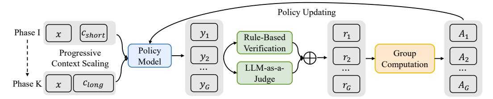

# 1 Introduction

Recent breakthroughs in large reasoning models (LRMs) have showcased significant improvements in reasoning capabilities, achieving performance comparable to human experts in complex problemsolving scenarios [\[49\]](#page-22-0). These advancements, exemplified by OpenAI-o1 [\[26,](#page-21-0) [15\]](#page-20-0), DeepSeek-R1 [\[6,](#page-19-0) [11\]](#page-20-1), and Qwen-QwQ [\[41,](#page-21-1) [43\]](#page-21-2), have sparked extensive research efforts to explore and enhance a broad spectrum of reasoning tasks through reinforcement learning (RL), ranging from foundational logical reasoning [\[29,](#page-21-3) [47\]](#page-22-1) to advanced challenges in programming [\[8,](#page-19-1) [7\]](#page-19-2) and mathematics [\[24,](#page-21-4) [39\]](#page-21-5), with innovations in RL algorithms driving progress in reasoning quality enhancements [\[3,](#page-19-3) [55,](#page-22-2) [23,](#page-20-2) [54\]](#page-22-3).

Following RL fine-tuning, LRMs exhibit a phenomenon analogous to human "slow thinking" [\[4\]](#page-19-4), characterized by the emergence of sophisticated problem-solving strategies such as divide-and-conquer and backtracking mechanisms in their extended chain-of-thought (CoT) reasoning outputs [\[46\]](#page-22-4). While this process enhances reasoning performance on short context tasks (e.g., 4K tokens) [\[45,](#page-21-6) [22\]](#page-20-3), its scalability to long-context scenarios (e.g., 120K tokens), which requires robust contextual grounding and multi-step reasoning, remains unexplored. This limitation poses a significant barrier to practical applications requiring interaction with external knowledge, such as deep research [\[38,](#page-21-7) [27,](#page-21-8) [40\]](#page-21-9), where LRMs must collect and process information from knowledge-intensive environments.

To shed light on this topic, we first introduce the concept of *long-context reasoning RL*. Different from *short-context reasoning RL*, which primarily relies on internal knowledge stored within model parameters, long-context reasoning RL instead necessitates that LRMs perform retrieval and grounding of relevant information from long-context inputs, followed by generation of reasoning chains based on the incorporated information [\[12,](#page-20-4) [30,](#page-21-10) [52\]](#page-22-5). To illustrate the differences between short-context and long-context reasoning RL, we conduct a preliminary experiment to compare the training dynamics in Figure [2.](#page-1-0) Our results reveal that long-context reasoning RL exhibits *suboptimal training efficiency* compared to the short-context counterpart with *(a) delayed reward convergence*. This discrepancy stems from *(b) marked reduction in output entropy* when processing long-context inputs, which restricts exploratory behavior during policy optimization. Furthermore, we identify *unstable optimization process*, evidenced by *(c) intermittent spikes in KL divergence*. These instabilities are introduced by the inherent variance amplification due to *(d) longer output length with heterogeneous input length distributions*, leading to greater variability during policy updating.

To address these challenges, we propose QWENLONG-L1, a novel RL framework designed to facilitate the transition of LRMs from short-context proficiency to robust long-context generalization, as shown in Figure [3.](#page-2-0) Inspired by recent studies on context extension during pretraining [\[9,](#page-20-5) [48,](#page-22-6) [10\]](#page-20-6), our framework enhances short-context LRMs through progressive context scaling during RL training. The framework comprises three core components: a warm-up supervised fine-tuning (SFT) phase to initialize a robust policy, a curriculum-guided RL phase that facilitates stable adaptation from short to long contexts, and a difficulty-aware retrospective sampling mechanism that adjusts training complexity across stages to incentivize policy exploration. Leveraging recent RL algorithms, including GRPO [\[34\]](#page-21-11) and DAPO [\[54\]](#page-22-3), our framework integrates hybrid reward functions combining rule-based and model-based binary outcome rewards to balance precision and recall. Through strategic utilization of group relative advantages during policy optimization, it guides LRMs to

> **[图片提取文字 (无描述)]:**
> Policy Updating Phase I Cshort  $A_1$ Rule-Based Verification Policy Progressive Group  $A_2$ Model Context Scaling Computation LLM-as-a-... ... ... Judge Phase K  $c_{long}$  $y_G$  $r_G$  $A_G$

Figure 3: Overview of QWENLONG-L1, which is a novel *long-context reasoning RL* training framework. The proposed framework integrates group-relative RL algorithms, hybrid reward mechanisms, and progressive context scaling strategies to enable stable adaptation from short-context to longcontext LRMs with robust contextual grounding and multi-step reasoning capabilities.

learn effective reasoning patterns essential for long-context reasoning scenarios, resulting in robust long-context grounding and superior reasoning capabilities.

In our experiments, we focus on document question answering (DocQA) [\[51,](#page-22-7) [17,](#page-20-7) [13\]](#page-20-8) as a representative real-world long-context reasoning task. Specifically, we introduce DOCQA-RL-1.6K, a specialized RL training dataset comprising 1.6K DocQA problems spanning mathematical, logical, and multi-hop reasoning domains. Experimental results across seven long-context DocQA benchmarks demonstrate the superiority of QWENLONG-L1 compared to various proprietary and open-source LRMs. Notably, QWENLONG-L1-14B achieves superior performance over Gemini-2.0-Flash-Thinking and Qwen3-32B, while QWENLONG-L1-32B outperforms OpenAI-o3-mini, Qwen3-235B-A22B, and even matches Claude-3.7-Sonnet-Thinking. Our analysis further identifies several critical insights in long-context reasoning RL optimization: (1) progressive context scaling promotes higher entropy and stabilizes KL divergence, enhancing training efficiency; (2) SFT proves to be an economical way for performance enhancement, whereas RL unlocks the potential to achieve optimal performance; (3) RL naturally fosters specialized long-context reasoning behaviors that boost final performance, but imitating these behaviors do not translate into gains when applied to SFT. Our key contributions are summarized as follows:

- We conceptualize the paradigm of *long-context reasoning RL* and identify its unique challenges, making a further step towards developing practical long-context LRMs capable of grounding and integrating information for complex, real-world reasoning scenarios.
- We present QWENLONG-L1, the first RL framework designed for long-context LRMs. Through progressive context scaling, QWENLONG-L1 enables stable short-to-long context adaptation via group-relative RL optimization and hybrid reward mechanisms.
- We showcase the effectiveness of QWENLONG-L1 through comprehensive experiments across seven long-context document question answering benchmarks. Our results reveal that QWENLONG-L1 achieves substantial performance gains compared to cutting-edge LRMs, offering a fundamental recipe and practice for long-context reasoning optimization.

