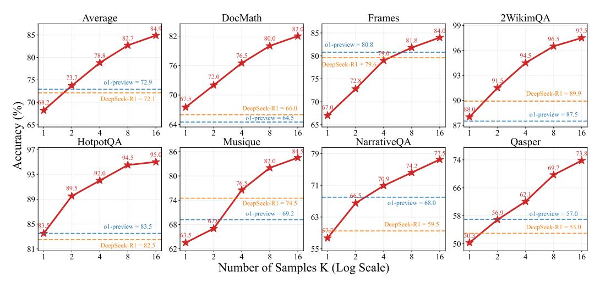

# 3.3 Evaluation Details

**Benchmarks** We conduct evaluation on seven long-context DocQA benchmarks, including multi-hop reasoning benchmarks4 such as 2WikiMultihopQA [13], HotpotQA [51], Musique [44], NarrativeQA [17], Qasper [5], and Frames [18] as well as mathematical reasoning benchmarks like DocMath [57]. We report the maximum of exact match and LLM-judged accuracy as the final score, aligned with the reward function in Section 2.4. We use DeepSeek-V3 [21] as the judge model with a temperature of 0.0 to provide a reliable evaluation. The benchmark statistics are shown in Table 3.

**Configurations** We evaluate our long-context LRMs with a maximum input length of 120K and output length of 10K. For the proprietary LRMs with a limited context length, we set the maximum input length to 50K. We conduct a zero-shot evaluation with a temperature of 0.7 and a top-p of 0.95.

#### 3.4 Baselines

We compare QWENLONG-L1 against the following state-of-the-art LRMs.

**Proprietary LRMs** OpenAI-o1-preview [15], Claude-3.7-Sonnet-Thinking [1], OpenAI-o3-mini [28], Qwen3-Plus [42], QwQ-Plus [43], and Gemini-2.0-Flash-Thinking [37].

**Open-Source LRMs** DeepSeek-R1 [11], Qwen3-235B-A22B [42], Qwen3-32B [42], QwQ-32B [43], R1-Distill-Qwen-32B [11], and R1-Distill-Qwen-14B [11].

&lt;sup>2For DocMath, we sample 75% items from each subset from its valid split for training and 25% for evaluation.

&lt;sup>3We exclude 7B/1.5B variants due to their mathematical reasoning feature inherent from Qwen2.5-Math [50].

&lt;sup>4We use the data from LongBench [2] for 2WikimultihopQA, HotpotQA, Musique, NarrativeQA, and Qasper.

Table 4: Main results across seven long-context DocQA benchmarks. We highlight the **top-1** and **top-3** performance.  $\Delta$  indicates the performance gains and declines compared to the base models.

| Models                          | DocMath | Frames | 2Wiki  | HQA                 | Musi   | NarQA  | Qasp        | Avg.   |  |  |  |
|---------------------------------|---------|--------|--------|---------------------|--------|--------|-------------|--------|--|--|--|
| Proprietary LRMs                |         |        |        |                     |        |        |             |        |  |  |  |
| OpenAI-o1-preview               | 64.5    | 80.8   | 87.5   | 83.5                | 69.0   | 68.0   | 57.0        | 72.9   |  |  |  |
| Claude-3.7-Sonnet-Thinking      | 67.5    | 70.9   | 86.5   | 84.4                | 68.3   | 61.5   | 56.0        | 70.7   |  |  |  |
| OpenAI-o3-mini                  | 66.5    | 75.5   | 86.5   | 83.5                | 66.5   | 59.0   | 55.0        | 70.4   |  |  |  |
| Qwen3-Plus                      | 66.0    | 73.6   | 90.5   | 82.4                | 69.8   | 57.5   | 52.5        | 70.3   |  |  |  |
| QwQ-Plus                        | 64.5    | 73.5   | 89.0   | 81.0                | 66.5   | 62.0   | 53.5        | 70.0   |  |  |  |
| Gemini-2.0-Flash-Thinking       | 63.0    | 69.8   | 82.9   | 79.5                | 62.5   | 57.0   | 45.5        | 65.7   |  |  |  |
| Open-Source LRMs                |         |        |        |                     |        |        |             |        |  |  |  |
| DeepSeek-R1                     | 66.0    | 79.6   | 89.9   | 82.5                | 74.5   | 59.5   | 53.0        | 72.1   |  |  |  |
| Qwen3-235B-A22B                 | 67.5    | 74.6   | 91.5   | 84.4                | 63.3   | 60.0   | 53.0        | 70.6   |  |  |  |
| QwQ-32B                         | 59.5    | 72.9   | 90.5   | 78.5                | 66.0   | 58.0   | <i>57.5</i> | 69.0   |  |  |  |
| Qwen3-32B                       | 58.0    | 70.0   | 87.0   | 83.4                | 62.8   | 57.5   | 56.0        | 67.8   |  |  |  |
| R1-Distill-Qwen-32B             | 62.5    | 67.0   | 84.0   | 80.5                | 61.0   | 54.0   | 50.0        | 65.6   |  |  |  |
| R1-Distill-Qwen-14B             | 61.0    | 64.2   | 87.0   | 77.5                | 58.0   | 51.0   | 51.0        | 64.2   |  |  |  |
| Ours Methods                    |         |        |        |                     |        |        |             |        |  |  |  |
| R1-Distill-Qwen-14B-SFT         | 60.0    | 65.7   | 88.5   | 80.5                | 60.0   | 52.0   | 48.5        | 65.0   |  |  |  |
| $\Delta$ to R1-Distill-Qwen-14B | (-1.0)  | (+1.5) | (+1.5) | (+3.0)              | (+2.0) | (+1.0) | (-2.5)      | (+0.8) |  |  |  |
| QWENLONG-L1-14B-GRPO            | 65.0    | 68.7   | 88.5   | 86.5                | 63.5   | 53.5   | 51.5        | 68.2   |  |  |  |
| $\Delta$ to R1-Distill-Qwen-14B | (+4.0)  | (+4.5) | (+1.5) | ( <del>+9.0</del> ) | (+5.5) | (+2.5) | (+0.5)      | (+4.0) |  |  |  |
| QWENLONG-L1-14B-DAPO            | 65.5    | 67.4   | 89.0   | 84.0                | 63.0   | 57.0   | 52.5        | 68.3   |  |  |  |
| $\Delta$ to R1-Distill-Qwen-14B | (+4.5)  | (+3.2) | (+2.0) | (+6.5)              | (+5.0) | (+6.0) | (+1.5)      | (+4.1) |  |  |  |
| R1-Distill-Qwen-32B-SFT         | 65.0    | 71.6   | 87.0   | 80.5                | 65.5   | 57.5   | 54.0        | 68.7   |  |  |  |
| $\Delta$ to R1-Distill-Qwen-32B | (+2.5)  | (+4.6) | (+3.0) | (+0.0)              | (+4.5) | (+3.5) | (+4.0)      | (+3.2) |  |  |  |
| QWENLONG-L1-32B-GRPO            | 68.0    | 72.2   | 87.0   | 82.0                | 66.0   | 61.0   | 56.0        | 70.3   |  |  |  |
| $\Delta$ to R1-Distill-Qwen-32B | (+5.5)  | (+5.2) | (+3.0) | (+1.5)              | (+5.0) | (+7.0) | (+6.0)      | (+4.7) |  |  |  |
| QWENLONG-L1-32B-DAPO            | 67.5    | 70.1   | 90.5   | 83.0                | 69.0   | 56.0   | 58.5        | 70.7   |  |  |  |
| $\Delta$ to R1-Distill-Qwen-32B | (+5.0)  | (+3.1) | (+6.5) | (+2.5)              | (+8.0) | (+2.0) | (+8.5)      | (+5.1) |  |  |  |

> **[图片提取文字 (无描述)]:**
> DocMath 2WikimQA Average Frames 99. 85 85 82-80.0 o1-preview = 80.8 96. 80-76.5 80 DeepSeek-R1 = 79.6 76-93. 75 75o1-preview = 72.9 DeepSeek-R1 = 89.9 70-DeepSeek-R1 = 72.1 90-70-Accuracy (%) DeepSeek-R1 = 66.0 o1-preview = 87.5 o1-preview = 64.5 64 16 16 16 16 HotpotQA Musique NarrativeQA Qasper 864 79-74 93 80 71-66. 89-74 DeepSeek-R1 = 74.5 o1-preview = 68.0 o1-preview = 69.2 o1-preview = 57.0 63 -58 85-DeepSeek-R1 = 59.5 68-DeepSeek-R1 = 53.0 o1-preview = 83.5 50-DeepSeek-R1 = 82.5 81 55 16 16 16 Number of Samples K (Log Scale)

Figure 4: Pass@K rates of QWENLONG-L1-14B with different sample numbers across all benchmarks. We show that QWENLONG-L1-14B surpasses DeepSeek-R1 with a small sampling number.

