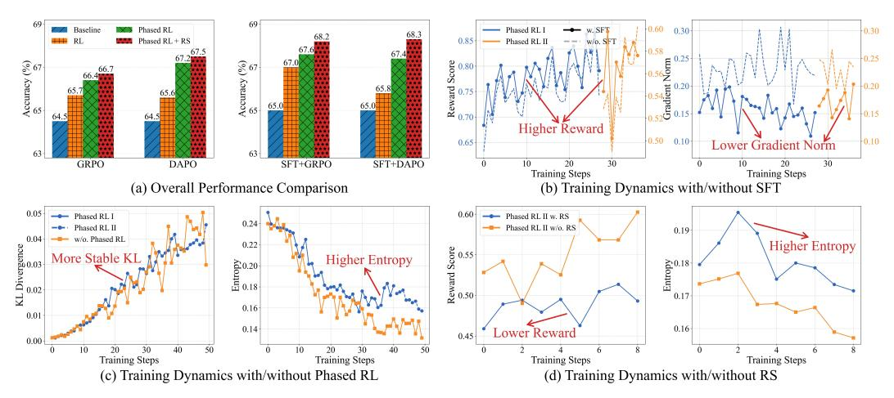

# 4.1 Main Results

Table 4 presents the overall performance of QWENLONG-L1 across seven long-context document question answering (DocQA) benchmarks. The key findings are as follows:

> **[图片提取文字 (无描述)]:**
> Phased RL 0.60 Baseline Phased RL 68.3 Phased RL + RS 0.8 Phased RL II Accuracy (%) Accuracy (%) Reward Score 0.75 0.70 65.0 65.0 64.5 64.5 Higher Reward 0.50 0.10 0.65 Lower Gradient Norm GRPO SFT+GRPO 30 30 DAPO SFT+DAPO 10 20 Training Steps Training Steps (a) Overall Performance Comparison (b) Training Dynamics with/without SFT - Phased RL I Phased RL II w. RS 0.24 Phased RL II Phased RL II w/o. RS 0.19 w/o, Phased RL KL Divergence 0.22 Higher Entropy Reward Score More Stable KL Higher Entropy Entropy 81.0 Eutropy 0.18 0.17 0.16 0.01 0.14 0.16 Lower Reward 0.45 0.00 30 50 50 20 40 20 40 Training Steps Training Steps Training Steps Training Steps (d) Training Dynamics with/without RS (c) Training Dynamics with/without Phased RL

Figure 5: Ablation studies of progressive context scaling strategy, where "Baseline" refers to the base or SFT model before RL training, "RL" refers to the naive single-stage RL, and "Phased RL" refers to the curriculum-guided phased RL. "RS" refers to the difficulty-aware retrospective sampling.

Limited Efficacy of SFT for Long-Context Reasoning. Since the base model, R1-Distill-Qwen, is primarily optimized for short-context reasoning tasks in mathematics, coding, and scientific domains, we conduct SFT to adapt it for long-context reasoning before RL training, as outlined in Section [2.3.](#page-4-0) Despite this intervention, the SFT model only shows an average gain of 0.8 points on 14B and 3.2 points on 32B. Furthermore, the improvements exhibit significant variability across benchmarks, suggesting limited generalizability of the SFT approach to long-context reasoning scenarios.

Significant Improvements via RL Integration. Through the integration of RL, QWENLONG-L1 exhibits remarkable advancements in long-context reasoning performance. Notably, QWENLONG-L1-14B achieves an average improvement of 4.1 and 4.0 points over the base model with DAPO and GRPO, surpassing the 0.4 points improvement of the SFT baseline by a significant margin. Furthermore, when scaling to 32B base model, QWENLONG-L1-32B even demonstrates a 5.1 and 4.7 points performance increase with DAPO and GRPO. These results highlight the advanced capacity of RL approaches in refining the output distribution to address intricate, context-dependent reasoning problems through group-relative advantage estimation and incentives for on-policy sampled outputs.

Leading Performance among Flagship LRMs. Our evaluation demonstrates that QWENLONG-L1 achieves superior performance compared to leading proprietary and open-source LRMs. Specifically, QWENLONG-L1-14B achieves an average score of 68.3, surpassing Gemini-2.0-Flash-Thinking, R1-Distill-Qwen-32B, and Qwen3-32B, while mathcing the performance of QwQ-32B. Moreover, QWENLONG-L1-32B achieves an average score of 70.7, exceeding the performance of QwQ-Plus, Qwen3-Plus, Qwen3-235B-A22B, and OpenAI-o3-mini, even comparable to Claude-3.7-Sonnet-Thinking, demonstrating leading performance among state-of-the-art flagship LRMs.

Additional Enhancements by Test-Time Scaling. We further conduct experiments to analyze the test-time scaling performance of QWENLONG-L1. Following established works [\[11,](#page-20-1) [45\]](#page-21-6), we generate 16 candidate outputs per input question and evaluate Pass@K to quantify exploratory capability across all benchmarks. As illustrated in Figure [4,](#page-7-1) QWENLONG-L1-14B exhibits consistent performance enhancements with increased sampling scales. Notably, QWENLONG-L1-14B demonstrates remarkable gains, even surpassing DeepSeek-R1 and OpenAI-o1-preview with a small sample size. Specifically, it achieves an average Pass@2 rate of 73.7 across all benchmarks, outperforming both DeepSeek-R1's 72.1 and OpenAI-o1-previews's 72.9, highlighting the efficacy of test-time scaling. Moreover, the significant gap between Pass@K and Pass@1 metrics indicates further potential for RL training to better bridge the transition from diverse exploration to optimal exploitation.

