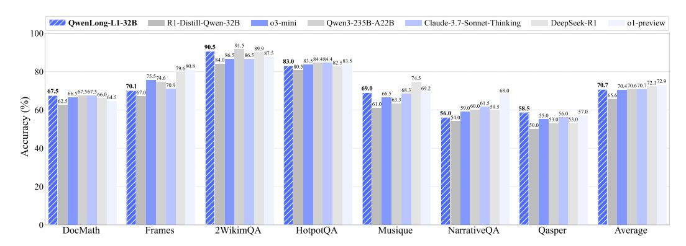
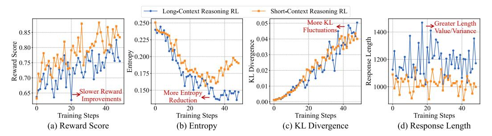

# **QWENLONG-L1: Towards Long-Context Large Reasoning Models with Reinforcement Learning**

Fanqi Wan, Weizhou Shen, Shengyi Liao, Yingcheng Shi, Chenliang Li, Ziyi Yang, Ji Zhang, Fei Huang, Jingren Zhou, Ming Yan\*
Tongyi Lab, Alibaba Group

https://github.com/Tongyi-Zhiwen/QwenLong-L1 https://huggingface.co/Tongyi-Zhiwen/QwenLong-L1-32B https://modelscope.cn/models/iic/QwenLong-L1-32B

## **Abstract**

Recent large reasoning models (LRMs) have demonstrated strong reasoning capabilities through reinforcement learning (RL). These improvements have primarily been observed within the short-context reasoning tasks. In contrast, extending LRMs to effectively process and reason on long-context inputs via RL remains a critical unsolved challenge. To bridge this gap, we first formalize the paradigm of long-context reasoning RL, and identify key challenges in suboptimal training efficiency and unstable optimization process. To address these issues, we propose QWENLONG-L1, a framework that adapts short-context LRMs to long-context scenarios via progressive context scaling. Specifically, we utilize a warm-up supervised fine-tuning (SFT) stage to establish a robust initial policy, followed by a curriculum-guided phased RL technique to stabilize the policy evolution, and enhanced with a difficulty-aware retrospective sampling strategy to incentivize the policy exploration. Experiments on seven long-context document question-answering benchmarks demonstrate that QWENLONG-L1-32B outperforms flagship LRMs like OpenAI-o3-mini and Qwen3-235B-A22B, achieving performance on par with Claude-3.7-Sonnet-Thinking, demonstrating leading performance among stateof-the-art LRMs. This work advances the development of practical long-context LRMs capable of robust reasoning across information-intensive environments.

> **[图片提取文字 (无描述)]:**
> QwenLong-L1-32B R1-Distill-Qwen-32B o3-mini Qwen3-235B-A22B Claude-3.7-Sonnet-Thinking DeepSeek-R1 o1-preview 100 .5 89.9 86.5 87.5 83.0 83.584.484.482.583.5 79.680.8 80 75.574.6 70.470.670.7 72.172.9 70.9 66.567.567.5 Accuracy (%) 59.060.061.5 56.0 55.0 56.0 5 DocMath Frames 2WikimQA HotpotQA Musique NarrativeQA Qasper Average

Figure 1: Overall results of QWENLONG-L1 across seven long-context reasoning benchmarks. Starting from R1-Distill-Qwen-32B, QWENLONG-L1-32B achieves an average gain of 5.1 points, surpassing OpenAI-o3-mini, Qwen3-235B-A22B, and comparable to Claude-3.7-Sonnet-Thinking.

\* Corresponding author.

> **[图片提取文字 (无描述)]:**
> Long-Context Reasoning RL Short-Context Reasoning RL More KL Greater Length 0.250 0.05 -Fluctuations Value/Variance 0.85 1400 edence 0.04 0.225 Reward Score 0.70 6 0.200 Response .ž ∩ 0.02 0.175 0.01 1000 0.150 Slower Reward More Entropy 0.65 Improvements Reduction 0.00 40 40 Training Steps Training Steps Training Steps Training Steps (c) KL Divergence (a) Reward Score (b) Entropy (d) Response Length

Figure 2: Comparison of training dynamics between short-context and long-context reasoning RL. The long-context reasoning RL demonstrates two key challenges: *suboptimal training efficiency*, with slower improvements in reward score caused by more reduction in entropy, and *unstable optimization process*, with more fluctuations in KL divergence introduced from greater variance in longer output.

