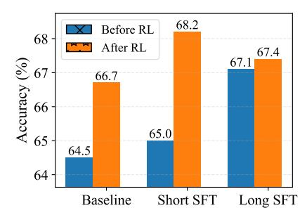
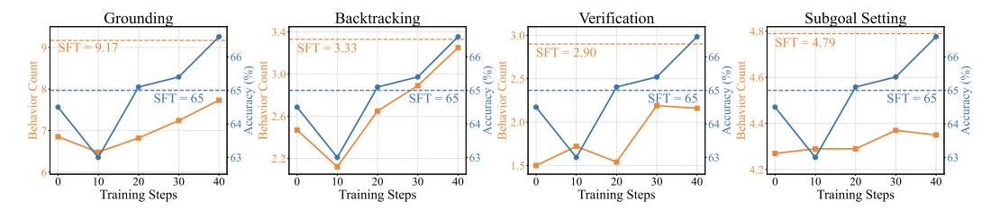

# 4.2 Ablation Studies

In this section, we conduct ablation studies to investigate the key components in QWENLONG-L1 that enable successful progressive context scaling for long-context reasoning RL, including warmup supervised fine-tuning, curriculum-guided phased reinforcement learning, and difficulty-aware retrospective sampling, with the experimental results shown in Figure 5.

Warm-up Supervised Fine-tuning. To illustrate the influence of warm-up SFT, we first evaluate the overall performance of models trained with and without this preparatory phase across seven benchmarks, using various RL algorithms and training strategies. As illustrated in Figure 5 (a), integration warm-up SFT yields significant performance improvements in all experimental setups. To further explore the mechanism of warm-up SFT in RL dynamics, Figure 5 (b) tracks the reward scores and gradient norm during training. The results reveal that warm-up SFT not only accelerates reward improvements but also sustains lower gradient norm during different RL phases, validating its capacity to prioritize performance gains over format alignment when transitioning models from short-context to long-context reasoning tasks. These findings highlight the necessity of integrating SFT as a precursor to providing a robust and efficient initialization for RL training.

Curriculum-Guided Phased Reinforcement Learning. As shown in Figure 5 (a), we conduct a comparative analysis between naive single-stage RL and the proposed curriculum-guided phased RL, with different training configurations: GRPO, DAPO, SFT + GRPO, and SFT + DAPO. The results demonstrate that our phased RL methodology achieves substantial performance improvements. We also note that this improvement is less pronounced when models are initialized with SFT, suggesting that warm-up training partially compensates for curriculum design. Further analysis in Figure 5 (c) reveals that single-stage RL exhibits heightened instability, as demonstrated by fluctuating KL divergence and entropy collapse. These results confirm the pivotal role of curriculum-guided phased training in the stable policy evolution from short-context to long-context reasoning RL.

**Difficulty-Aware Retrospective Sampling**. To maintain a wild exploration of hard examples, we introduce a difficulty-aware retrospective sampling strategy to integrate a subset of hard samples from prior training phases into the current training data. As illustrated in 5 (a), this strategy yields further performance enhancements with phased RL. Notably, in Figure 5 (d), despite undergoing phase I RL training, these retained hard examples also lead to significantly lower reward and higher policy entropy, which incentivize the policy model to augment the exploration process.

### 4.3 Additional Analysis

In this section, we investigate the questions pertaining to the development of long-context LRMs, focusing on the trade-off between SFT and RL in optimizing long-context reasoning capabilities, and the emergence and dynamics of long-context reasoning behaviors during training.

Trade-off between SFT and RL in Optimization. As discussed in Section 4.2, SFT offers a robust initialization for RL training. However, given that the initial SFT phase in our experiments relied on short-context training data, a critical question arises regarding the role of long-context SFT and its impact on RL. To this end, we train a long-context SFT model using 10K context-question-answer triplets distilled from DeepSeek-R1, maintaining the same data distribution as the short-context SFT phase. This long-context SFT model serves as the starting point for single-stage RL training, without progressive context scaling due to its inherent long-context capability.

> **[图片提取文字 (无描述)]:**
> 68.2 Before RL 68 After RL 67.4 Accuracy (%) 67.166.7 65.0 64.5 64 Baseline Short SFT Long SFT

Figure 6: Comparison between different models before and after RL, where "Baseline" denotes the base model, "Short SFT" denotes the short-context SFT model, and "Long SFT" denotes the long-context SFT model.

As shown in Figure 6, the long-context SFT model surpasses both the base model by 2.6 points and the short-context SFT model by 2.1 points. Despite the requirement for more training data, SFT offers distinct practical advantages, including reduced computational complexity, minimal infrastructure demands, and diminished reliance on specialized technical expertise, thereby positioning it as an economical strategy for performance enhancement [11]. However, further RL applied to the long-context SFT model yields marginal improvements, with only 0.3 points gains and a 67.4 final score, significantly underperforming the 3.2 points improvements and a 68.2 final score achieved when RL is applied to the short-context SFT model. These results highlight two insights for long-context LRM development: (1) SFT and RL exhibit distinct yet complementary purposes—SFT achieves acceptable performance with less effort, whereas RL is indispensable for attaining optimal results;

> **[图片提取文字 (无描述)]:**
> Backtracking Verification Subgoal Setting Grounding SFT = 4.79 $\Gamma = 9.17$ SFT = 3.33SFT = 2.908 SFT = 65= 65= 65SFT = 65Beha 2.2 40 40 40 Training Steps Training Steps Training Steps Training Steps

Figure 7: The change in reasoning behavior over training steps. We focus on four core reasoning behaviors, including long-context specific *grounding* and three general reasoning strategies: *subgoal setting*, *backtracking*, and *verification*. During RL training, we show that all the behaviors increase progressively with the corresponding performance gains. However, despite SFT leading to significantly increased reasoning behaviors, these efforts fail to improve the final performance.

(2) Maximizing performance necessitates prioritizing RL over SFT, as excessive focus on SFT risks trapping models in local optima, thereby constraining opportunities for RL improvements.

Emergence and Dynamics of Long-Context Reasoning Behaviors. The reasoning behaviors critically shape LRMs' reasoning trajectories and rewards [11, 14]. To investigate these dynamics, we follow recent studies [56, 23] to analyze the evolution of reasoning behaviors during SFT and RL training. Specifically, we use DeepSeek-V3 [21] to extract and track the shifts of the average count of four core reasoning behaviors over training steps, including long-context specific *grounding* and three general reasoning behaviors: *subgoal setting*, *backtracking*, and *verification*:

- **Grounding**: The model recalls related information in the long context to support subsequent reasoning, e.g., "Let me look through the provided text to find...".
- **Subgoal Setting**: The model decomposes complex questions into multiple manageable subgoals to solve them step-by-step, *e.g.*, "*To solve this, we first need to...*".
- **Backtracking**: The model identifies errors in generations and go back to revise its approach iteratively, *e.g.*, "*This approach won't work because...*".
- **Verification**: The model validates the predicted answers systematically to ensure solution correctness with self-reflection, *e.g.*, "Let's verify this result by...".

The results in Figure 7 reveal three insights: (1) All LRMs exhibit marked reasoning behaviors, with long-context grounding occurring most frequently, underscoring its effectiveness in managing contextual dependencies during reasoning. (2) RL training amplifies these behaviors progressively, correlating with significant performance gains, suggesting RL's efficacy in refining the output space to prioritize reasoning patterns conducive to accurate solutions. (3) In contrast, while SFT models demonstrate increased reasoning behaviors, these adjustments fail to transform into performance improvements, likely due to SFT's inherent reliance on imitation learning, which prioritizes superficial pattern alignment over substantive reasoning skill development [59, 20].

### 5 Conclusion and Future Work

In this study, we explore the development of long-context LRMs with robust contextual grounding and reasoning capabilities through reinforcement learning (RL). We first propose the paradigm of *long-context reasoning RL* and identify *suboptimal training efficiency* and *unstable optimization process*. To address these challenges, we present QWENLONG-L1, a progressive context scaling RL framework designed to bridge the gap between short-context proficiency and long-context generalization. Specifically, the training process begins with a warm-up SFT, followed by a curriculum-guided phased RL, with a difficulty-aware retrospective sampling strategy. Experiments across seven long-context document question-answering benchmarks demonstrate that QWENLONG-L1 achieves leading performance among state-of-the-art proprietary LRMs. Specifically, QWENLONG-L1-14B outperforms Gemini-2.0-Flash-Thinking and Qwen3-32B, while QWENLONG-L1-32B further surpasses OpenAI-o3-mini, Qwen3-235B-A22B, and even matches Claude-3.7-Sonnet-Thinking. Our analysis yields three key insights for long-context reasoning RL, including the pivotal role of progressive context scaling in enabling stable adaptation, the necessity of prioritizing RL for optimal performance, and the increase of long-context reasoning behaviors during RL training for performance improvements.

Future work should prioritize three key avenues to advance long-context LRMs. First, scaling real-world tasks, like automated scientific research and long video analysis, will provide appropriate environments to enhance long-context comprehension and decision-making capabilities. Second, developing advanced architectures is essential, including optimized attention mechanisms, e.g., linear and sparse attention, and efficient infrastructures, e.g., asynchronous actor rollout and parameter updating. Third, rethinking long-context RL paradigms, such as transitioning from token-level to turnlevel markov decision process (MDP), might enable the breakdown of long-context into sequential interactions and optimizing them iteratively, paving the way for infinite-context RL systems.

