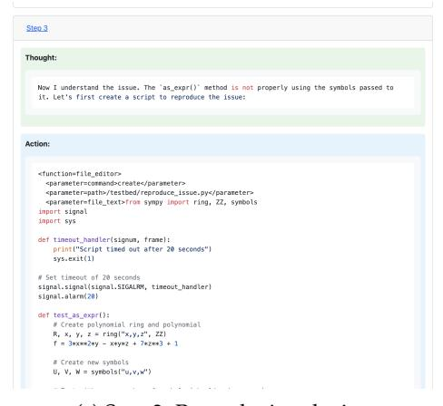
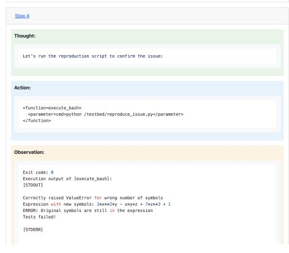
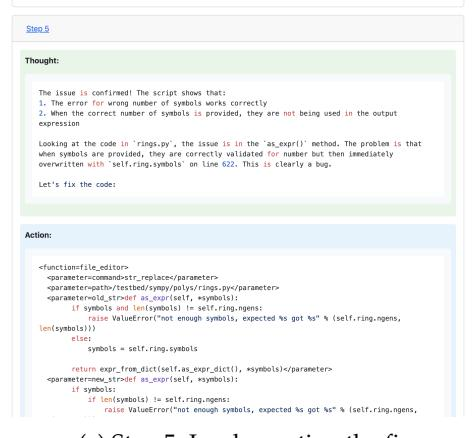

# **E Agent Trajectory Example**

This section provides a visual example of an agent's trajectory while solving a software engineering task. The sequence shows the step-by-step process from problem statement to solution, demonstrating how our agent approaches and solves real-world programming issues.

This trajectory example illustrates several key aspects of our agent's problem-solving approach:

- **Systematic Exploration:** The agent methodically explores the codebase to understand the context and locate the issue.
- **Root Cause Analysis:** Rather than addressing symptoms, the agent identifies the underlying cause of the problem using test issue.py.
- **Solution Development:** The agent formulates a clear plan before implementing changes.

These capabilities enable our agent to effectively tackle complex software engineering tasks that require deep understanding of code structure, programming language semantics, and software design principles.

Figure 15: Problem statement presented to the agent, describing the issue that needs to be resolved.

> **[图片提取文字 (无描述)]:**
> Step 1 Thought: I'll help you fix the issue with 'PolyElement.as\_expr()' not accepting symbols. Let's follow the steps systematically. 1. First, let's explore the repository to understand its structure: Action: <function=search> <parameter=search\_term>PolyElement</parameter> </function> Observation: Execution output of [search]: Found 196 matches for "PolyElement" in /testbed: ./sympy/utilities/tests/test pickling.pv (1 matches) ./sympy/printing/precedence.py (3 matches) ./sympy/printing/latex.pv (1 matches) ./sympy/printing/repr.py (1 matches) ./sympy/printing/str.pv (1 matches) ./sympy/printing/pretty/pretty.py (1 matches) ./sympy/printing/tests/test latex.pv (1 matches) ./sympy/printing/tests/test\_repr.py (2 matches) ./sympy/printing/tests/test str.py (1 matches) ./sympy/polys/rings.pv (17 matches) ./sympy/polys/modulargcd.py (65 matches)

(a) Step 1: Initial analysis and exploration (b) Step 2: Detailed Exploration

> **[图片提取文字 (无描述)]:**
> Step 2 Thought: Great! I can see that 'PolyElement' is primarily defined in '/testbed/sympy/polys/rings.py'. Let's look at the specific implementation: Action: <function=file\_editor> <parameter=command>view</parameter> <parameter=path>/testbed/sympy/polys/rings.py</parameter> <parameter=view range>[618, 638]</parameter> </function> Observation: Execution output of [file\_editor]: Here's the result of running 'cat -n' on the file: /testbed/sympy/polys/rings.py: if self, ring == new ring: 618 611 return self 612 elif self.ring.symbols != new\_ring.symbols: 613 terms = list(zio(\* dict reorder(self, self.ring.symbols, new ring.symbols))) return new ring.from terms(terms, self.ring.domain) 614 615 else: 616 return new\_ring.from\_dict(self, self.ring.domain) 617 618 def as\_expr(self, \*symbols): 619 if symbols and len(symbols) != self.ring.ngens; raise ValueError("not enough symbols, expected %s got %s" % (self.ring.ngens. 628 len(symbols)))

> **[图片提取文字 (无描述)]:**
> Step 3 Thought: Now I understand the issue. The 'as\_expr()' method is not properly using the symbols passed to it. Let's first create a script to reproduce the issue: Action: «function»file editor» <parameter=command>create</parameter> <parameter=path>/testbed/reproduce\_issue.py</parameter> import signal import sys def timeout\_handler(signum, frame): print("Script timed out after 20 seconds") sys.exit(1) # Set timeout of 20 seconds signal.signal(signal.SIGALRM, timeout handler) signal.alarm(28) def test as expr(): # Create polynomial ring and polynomial R, x, y, z = ring("x,y,z", ZZ)f = 3\*x\*\*2\*y - x\*y\*z + 7\*z\*\*3 + 1# Create new symbols U, V, W = symbols("u,v,w")

(c) Step 3: Reproducing the issue (d) Step 4: Running reproduction tests

> **[图片提取文字 (无描述)]:**
> Step 4 Thought: Let's run the reproduction script to confirm the issue: Action: <function=execute bash> <parameter=cmd>python /testbed/reproduce\_issue.py</parameter> </functions Observation: Exit code: 8 Execution output of [execute\_bash]: 1STDOUT1 Correctly raised ValueError for wrong number of symbols Expression with new symbols: 3\*x\*\*2\*v - x\*v\*z + 7\*z\*\*3 + 1 ERROR: Original symbols are still in the expression Tests failed! [STDERR]

> **[图片提取文字 (无描述)]:**
> Step 5 Thought: The issue is confirmed! The script shows that: 1. The error for wrong number of symbols works correctly 2. When the correct number of symbols is provided, they are not being used in the output expression Looking at the code in 'rings.py', the issue is in the 'as expr()' method. The problem is that when symbols are provided, they are correctly validated for number but then immediately overwritten with 'self.ring.symbols' on line 622. This is clearly a bug. Let's fix the code: Action: <function=file editor> <parameter=command>str replace</parameter> «parameter»path»/testbed/sympy/polys/rings.py</parameter»</pre> if symbols and len(symbols) != self.ring.ngens: raise ValueError("not enough symbols, expected %s got %s" % (self.ring.ngens, len(symbols))) elses symbols = self.ring.symbols return expr from dict(self.as expr dict(), \*symbols)</parameter> <parameter=new str>def as expr(self, \*symbols); if symbols: if len(symbols) != self.ring.noens: raise ValueError("not enough symbols, expected %s got %s" % (self.ring.ngens,

(e) Step 5: Implementing the fix (f) Step 6: Verifying the fix

> **[图片提取文字 (无描述)]:**
> Step 6 Thought: The changes look good. The key changes are: 1. Changed the logic to only check symbol count if symbols are provided 2. Only use 'self.ring.symbols' as a fallback when no symbols are provided 3. Maintained the same error checking for wrong number of symbols Let's run the reproduction script again to verify the fix: Action: <function=execute bash> <parameter=cmd>python /testbed/reproduce\_issue.py</parameter> </function> Observation: Exit code: 0 Execution output of lexecute bashl: [STODUT] Correctly raised ValueError for wrong number of symbols Expression with new symbols: 3\*u\*\*2\*v - u\*v\*w + 7\*w\*\*3 + 1 SUCCESS: New symbols are correctly used in the expression All tests passed! ISTDERRI.

Figure 16: Short successful agent trajectory (using our 32B model) showing the step-by-step process of solving a software engineering task. The agent analyzes the problem, identifies the root cause, implements a solution, tests it, and verifies that it resolves the issue.