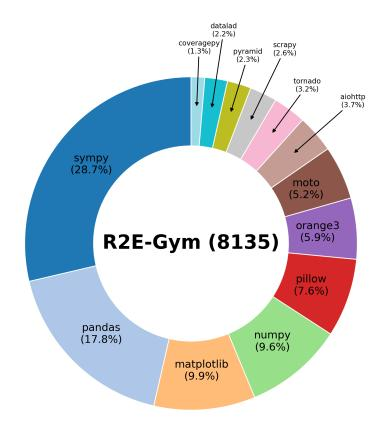

# <span id="page-14-1"></span><span id="page-14-0"></span>**A Dataset Details**

> **[图片提取文字 (无描述)]:**
> datalad (2.2%) coveragepy/ scrapy (1.356)pyramid (2.6%) (2.3%) tornado (3.2%) ajohtto (3.7%)sympy (28.7%) moto (5.2%)orange3 (5.9%)R2E-Gym (8135) pillow 7.6%) pandas numpy (17.8%)(9.6%)matplotlib (9.9%)


Figure 9: Repo distribution for our complete R2E-Gym dataset consisting of 8135 instances.

**Commit Filtering Heuristics.** Our commit filtering approach employs multiple heuristics to identify high-quality bug fixes and improvements suitable for training data. We particularly filter for small scoped changes, prioritizing non-documentation updates, and correlated code and test matches. We perform this filter at both line and AST entity level. To ensure consistency and quality, we employ specific thresholds in our filtering process:

- Maximum of 5 non-test files modified in a single commit
- Maximum of 100 edited lines across all non-test files
- Maximum patch length of 2000 characters to ensure focused changes
- No more than 1 deleted entity in non-test files
- Maximum of 3 added entities in non-test files
- Maximum of 3 edited entities in non-test files
- No more than 10 statement-level changes to maintain tractability

Additionally, we use LLM as a judge filter to further refine our dataset.

**Repository Installation.** Installing historical commits from GitHub repositories presents significant challenges due to evolving dependency requirements and API changes. We use a Docker-based approach with a search-based dependency resolution strategy to create reproducible environments for each commit. Our installation process follows these steps:

- 1. Extract dependency information from requirements.txt, setup.py, etc
- 2. Iteratively identify potential version conflicts and compatibility issues
- 3. Generate multiple candidate dependency configurations
- 4. Test each configuration until a working environment is found

This process is semi-manual and challenging to scale and we aim to rely more on LLMS in the future. Example installation scripts test multiple dependency combinations sequentially, exiting on the first successful build:

```
build_and_check_pandas () {
    local python_version =$1 ;
    local numpy_version =$1 ;
    local setuptools_version =$3$
    ...
```

```
}
# Attempt with first configuration
if build_and_check_pandas " 3.7" " 1.17.* " " <0.30" " 62.* " " 0.23 "; then
  echo "[ INFO ]␣ First ␣ combo ␣ succeeded .␣ Exiting ."
  exit 0
fi
# Attempt with second configuration
if build_and_check_pandas " 3.8" " 1.20.* " " <0.30" " 62.* " " 0.23 "; then
  echo "[ INFO ]␣ Second ␣ combo ␣ succeeded .␣ Exiting ."
  exit 0
fi
# Attempt with third configuration
if build_and_check_pandas " 3.10 " " 1.26.* " " ===3.0.5 " " 62.* " " 0.23 "; then
  echo "[ INFO ]␣ Third ␣ combo ␣ succeeded .␣ Exiting ."
  exit 0
fi
```

Listing 1: Example installation script excerpt

This approach allows us to create working environments for historical commits, enabling execution-based validation of our dataset.

**Test Generation.** We use an Agentless-like reproduction test generation approach. A key difference is that we use the ground truth patch as context when generating the tests.

**Issue Generation.** As discussed in the main paper, we use backtranslation to generate synthetic issues for commits that lack human-written GitHub issues. Our approach leverages both the code changes in the commit and the test execution results to create realistic, informative issue descriptions. The issue generation process follows these steps:

- 1. Extract failing test functions from the execution results
- 2. Analyze test outputs to identify error messages and expected behaviors
- 3. Provide the LLM with commit message, code patch, and test execution results
- 4. Guide the LLM to generate a concise, informative issue that describes the bug without revealing the solution

For each commit, we extract and utilize specific components:

- **Commit metadata**: Hash and commit message provide context about the change
- **Code patches**: We separate non-test file changes (showing what was fixed) from test file changes (showing how to verify the fix)
- **Test execution**: We include both old (failing) and new (passing) executions
- **Test functions**: We extract relevant test functions that demonstrate the bug
- **Assertion failures**: We extract and format the failing assertions from the old commit to show error details

The prompt construction carefully organizes these components to give the LLM sufficient context while focusing attention on the most relevant information for issue generation. We carefully design our prompting strategy to ensure the generated issues resemble humanwritten ones, focusing on clarity, naturalness, and providing sufficient information for understanding the bug.

```
# Build the complete prompt with all components
def get_prompt ( commit , execution_result , issues = None ) :
    # Include commit hash and message
    # Include commit patch (non - test files )
    # Include test file changes
```

```
# Include execution results from old and new commits
# Include improved test functions
# Include test function code
# Include assertion failures
# Include example issues and instructions
```

Listing 2: Issue generation code structure

The template below shows our prompt guidelines:

```
As you are trying to generate synthetic issues , you will follow these
   guidelines :
1. Keep the issue concise and informative .
2. Describe the failing test , including the input that causes the failure
   , the nature of the failure , and the expected behavior . Do NOT
   mention test functions or files directly .
3. Do not reveal the solution to the problem in the issue . Only describe
   the bug and the expected behavior .
4. If there are multiple failing tests , focus on the most informative one
    or a subset that best describes the general nature of the failure .
5. Describe the expected output of the failing test :
   - For errors , describe the error message .
   - For failing tests , mention what is supposed to happen .
6. Write the issue as a human would , using simple language without
   excessive formatting .
7. Use concrete terms to describe the nature of the failure . Avoid vague
   terms like " specific output " or " certain data ".
8. INCLUDE test code to describe the bug but keep it brief and relevant .
   Truncate or simplify tests longer than 5 -6 lines .
9. Do not mention external files unless absolutely necessary .
10. Format code snippets using triple backticks .
The issue should include :
1. A clear and concise title
2. A description of the problem with detailed example buggy code
3. Expected behavior
4. Actual behavior or error message
```

Listing 3: Issue generation template

This approach enables us to generate high-quality synthetic issues that provide clear problem statements for our training data, even for commits that lack human-written issues. Below are examples of synthetic issues generated using our approach:

```
** Title :** Calling `load ()` Before `draft ()` Causes `draft ()` to Fail for
     JPEG Images
** Description :**
When generating a thumbnail for a JPEG image using the `thumbnail ()`
    method , the method calls `load ()` before `draft () `. This sequence
    results in the `draft ()` method returning `None `, which prevents the
    thumbnail from being properly optimized .
** Example Code :**
```python
from PIL import Image
with Image . open (" Tests / images / hopper . jpg ") as im :
    im . thumbnail ((64 , 64) )
```
** Expected Behavior :**
```

```
The `thumbnail ()` method should utilize the `draft ()` method to optimize
   the image size before loading , ensuring that the thumbnail is resized
    correctly and efficiently .
** Actual Behavior :**
The `draft ()` method returns `None ` because `load ()` is invoked before it
   . This prevents the thumbnail from being optimized , potentially
   leading to incorrect thumbnail sizes or unnecessary memory usage .
```

Listing 4: Example synthetic issue for a PIL image thumbnail bug

```
** Title :** Unable to Register Route with Names Containing Both Dots and
    Colons
** Description :**
After merging branch '0.18 ' , attempting to register a route with a name
    that includes both dots (`.`) and colons (`:`) results in a `
    ValueError `. The recent changes were intended to allow route names to
     be a sequence of Python identifiers separated by dots or colons , but
     this combination is still causing issues .
** Example Code :**
```python
from aiohttp . web import UrlDispatcher , PlainRoute
def handler ( request ) :
    return 'Hello '
router = UrlDispatcher ()
