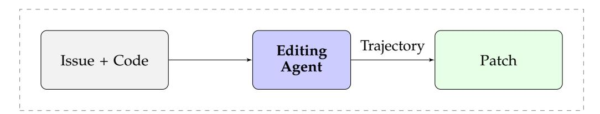

# <span id="page-17-0"></span>**B SFT Training**

**Agent Details.**

<span id="page-18-1"></span>> **[图片提取文字 (无描述)]:**
> Trajectory Editing Agent Issue + Code Patch


Figure 10: Code-editing agent architecture: The agent takes an issue description and codebase as input and produces a patch that fixes the issue.

We use R2E-Gym to train a general-purpose prompting agent. In particular, we train our code-editing agent on tasks from R2E-Gym, where given an executable environment  $\mathcal{E}$  and problem description  $\mathcal{D}$ , the agent is asked to solve the provided issue using any means necessary. Particularly, unlike (Orwall, 2024), we do not rely on the use of specialized workflows. The agent is tasked to solve the entire task end-to-end, including writing its own reproduction scripts, finding the bug, proposing a fix and then testing its correctness. Similar to (Wang et al., 2024), the agent is also provided with a finish tool, allowing it to submit a solution if it thinks it has completed the task.

**Agent and Tools.** Similar to (Aleithan et al., 2024; Wang et al., 2024), we adopt the traditional REACT format (Yao et al., 2022) for agent-design. For AGENTHUB, we use a minimalistic set of four tools to enable the agent to perform diverse SWE tasks; 1) file\_editor: for viewing and editing files, 2) search\_tool: for searching a relevant term in a given file or folder, 3) execute\_bash: allowing execution of non-interactive bash commands (*e.g.*, for running test scripts), 4) submit: for ending the current trajectory while returning expected outputs.No internet or browser access is provided to the agent during the training process.

**Data Curation.** For training, we use supervised finetuning with rejection sampling using trajectories from sonnet-3.5 model for supervision. To avoid contamination, we only use a subset of R2E-Gym consisting of repos with no overlap with the SWE-Benchdataset. The resulting subset (R2E-Gym-lite) consists of 4538 executable environments across 10 repositories (Figure 2). Overall, we collect a total of 3321 successful trajectories from 2048 unique test environments. For rejection sampling we use the unit tests from R2E-Gym environments (both synthetic and existing). For each trajectory, we use a maximum of N = 40 steps. Also, we limit the number of tokens per-trajectory to 32K max tokens. Finally, we also use a maximum timeout of 10-min for the overall trajectory and 90 seconds for each action execution, in order to avoid cases where the agent launches a long-running background process. We collect all training data using a temperature of 0.2.

**Training Setup and Hyperparameters.** For training, we use the Qwen-2.5-Coder 7B, 14B and 32B series as the base model for training SWE-agents on R2E-Gym. For training we perform full SFT using the above collected trajectories using LLaMA-Factory (Zheng et al., 2024). We train the overall model for a total of 2 epochs, batch size as 8 while using a learning rate of  $1e^{-5}$ . The warmup ratio for training was set to 0.1. Due to computational constraints, a maximum context length of 20K was used for training the agent. In future, the use of context-parallelism can enable us to further push the performance when training SWE-agents on more complex tasks requiring larger-context lengths.

## <span id="page-18-0"></span>C Inference Time Scaling

### C.1 Execution-Based Testing Agents

**Agent Details.** We train a specialized *testing-agent* that generates reproduction test cases to determine whether a candidate patch resolves the issue (i.e., whether the patch passes the generated test suite). Specifically, we train the testing-agent (using QWEN-CODER-32B as base-model) to generate a comprehensive test script containing M=10 diverse tests that cover various inputs, corner cases, etc. We use the same agent scaffold from Sec. 3 for training the testing agent.

<span id="page-19-1"></span><span id="page-19-0"></span>> **[图片提取文字 (无描述)]:**
> Trajectory Testing Agent Issue + Code Test Patch


Figure 11: Testing agent architecture: The agent generates comprehensive test cases to verify if a candidate patch resolves the issue.

**Data Curation.** For training, we use supervised finetuning using trajectories from sonnet-3.5 model for supervision. Overall, we collect a total of 2203 test-generation trajectories from sonnet (both positive and negative trajectories with minimal rejection sampling). For each trajectory, we use a maximum of N=40 steps. Also, we limit the number of tokens per-trajectory to 20K max tokens. Finally, we also use a maximum timeout of 5-min for the overall trajectory and 60 seconds for each action execution, in order to avoid cases where the agent launches a long-running background process.

**Training Setup and Hyperparameters.** For training, we use the QWEN-CODER-32B model as the base model. We then use the above collected training SFT trajectories to perform full finetuning with the QWEN-CODER-32B model using LLaMA-Factory (Zheng et al., 2024). We train the overall model for a total of 2 epochs, batch size as 8 while using a learning rate of 1e-5. A maximum context length of 20K was used for training the agent. The warmup ratio for training was set to 0.1.

**In-Context Starter Code Demonstration**. We provide the following in-context starter-code demonstration (from the Django repository) to the testing agent.

```
import os
import django
from django.conf import settings
from django.db import models
from django.test import TestCase
from django.test.utils import setup_test_environment
# Configure Django settings before setup
os.environ.setdefault('DJANGO_SETTINGS_MODULE', 'tests.test_sqlite')
# Override settings
settings.configure(
    DATABASES={
            "ENGINE": "django.db.backends.sqlite3",
            "NAME": "test.db",
            "TEST": {
                "NAME": "test.db",
            },
        }
   },
    INSTALLED_APPS=["tests"],
    MIGRATION_MODULES={"tests": None}, # Disable migrations for the
       tests app
# Setup Django
django.setup()
setup_test_environment()
# Define test models
class ExampleModel(models.Model):
    example_char = models.CharField(max_length=255)
    example_int = models.IntegerField()
```

```
class Meta:
    app_label = 'tests' # Set the app_label to 'tests'

# Create the database tables
from django.core.management import call_command
call_command('migrate', run_syncdb=True)

def add_test_data():
    """Create test instances of the model"""
    ExampleModel.objects.create(example_char="Test_1", example_int=1)
    ExampleModel.objects.create(example_char="Test_2", example_int=2)

# Add test data
add_test_data()
```

Listing 6: Incontext Demonstration for Testing Agent

## C.2 Execution-Free Verifiers

> **[图片提取文字 (无描述)]:**
> Trajectory Trajectory Verifier (Issue + React-YES/NO Loop + Patch)


Figure 12: Execution-free verifier architecture: The verifier predicts whether a patch is correct based on the full trajectory without executing the code.

**Verifier Details.** In addition to the execution-based "testing agents", we also explore the execution-free outcome-supervised reward models (a.k.a verifiers) (Cobbe et al., 2021). In particular, given a problem statement  $\mathcal{D}$ , agent-trajectory  $\mathcal{T}=\{a_1,o_1,a_2,o_2,\ldots,a_n,o_n\}$  and output patch  $\mathcal{O}$  from the code-editing agent on the R2E-Gym environments, we train a Qwen2.5-Coder-14B model (Yang et al., 2024a) to output a scalar score value  $s^{EF} \in [0,1]$  predicting the probability of output patch being correct. Specifically, following (Pan et al., 2024) we output the correctness of each patch through output tokens YES (correct) and NO (incorrect). The overall reward score is then computed by normalizing the relative probability of YES token as r = P(YES)/(P(YES) + P(NO)), where P(YES) and P(NO) are estimated through the log-probabilities of the corresponding token predictions.

Training Data. We first use the trajectories collected for code-editing agent training §3 in order to obtain a collection of positive and negative samples for verifier training. Following the best configuration from (Pan et al., 2024), we also generate on-policy trajectories using our trained 32B model. We then filter the collected samples to have an equal number of positive and negative samples. The overall dataset consists of 5700 total trajectories including both positive and negative samples. For training, we follow the template from (Pan et al., 2024), asking the LLM model to predict the output as YES for positive and NO for negative trajectories.

**Training Setup and Hyperparameters.** For training, we use the QWEN-CODER-14B model as the base model. We then use the above collected training SFT trajectories to perform finetuning using LLaMA-Factory (Zheng et al., 2024). Similar to (Pan et al., 2024), we perform LORA finetuning using a rank of 64. We train the overall model for a total of 2 epochs, batch size of 8 while using a learning rate of 1e - 5. A maximum context length of 32K was used for training the agent. The warmup ratio for training was set to 0.1.

## C.3 Execution-Based Analysis

In our analysis of execution-based testing agents, we focus on two key metrics: distinguishability and toxicity of generated tests. These metrics help us understand the effectiveness and limitations of execution-based verification.

**Distinguishability Rate.** The distinguishability rate measures a test's ability to differentiate between correct and incorrect patches. A test is considered "distinguishing" if it behaves differently when applied to correct patches versus incorrect patches. In practical terms, this means the test can help us identify which patches are correct and which are not.

For example, consider a test that passes for all correct patches but fails for all incorrect patches—this test has perfect distinguishability. Conversely, a test that passes (or fails) for both correct and incorrect patches provides no useful signal for distinguishing between them. Mathematically, for a given test t and a set of patches P divided into correct patches  $P_c$  and incorrect patches  $P_i$ , we compute distinguishability metric as:

$$Distinguish(t) = \mathbb{1}\left[\max_{p \in P_i} Pass(p, t) \neq \max_{p \in P_c} Pass(p, t)\right]$$
(3)

where  $\operatorname{Pass}(p,t)$  indicates whether patch p passes test t, and  $\mathbb{1}[\cdot]$  is the indicator function. This formula checks whether the best-performing incorrect patch behaves differently on the test compared to the best-performing correct patch. The distinguishability rate for a set of tests T is then the average distinguishability across all tests:

$$DistinguishRate(T) = \frac{1}{|T|} \sum_{t \in T} Distinguish(t)$$
 (4)

In our analysis, we found that most generated tests have low distinguishability rates—typically less than 20% of tests can effectively differentiate between correct and incorrect patches. This limitation significantly impacts the ability of execution-based verification to identify the best patches, especially as the number of candidate patches increases.

**Toxicity Rate.** We define toxic tests as those that incorrectly favor incorrect patches over correct ones. The toxicity rate is the proportion of tests that exhibit this behavior. Mathematically:

$$Toxic(t) = \mathbb{1} \left[ \max_{p \in P_i} Pass(p, t) > \max_{p \in P_c} Pass(p, t) \right]$$
 (5)

The toxicity rate for a set of tests *T* is:

ToxicityRate
$$(T) = \frac{1}{|T|} \sum_{t \in T} \text{Toxic}(t)$$
 (6)

While toxic tests are generally rare, they can significantly impact verification reliability when present, with toxicity rates reaching up to 10% for some problems. These findings highlight the importance of generating diverse, high-quality tests and the value of combining execution-based verification with other approaches, such as execution-free verifiers, to achieve more robust results.

## C.4 Execution-Free Analysis

Figure 13 shows the limitations of the execution-free verifier.

