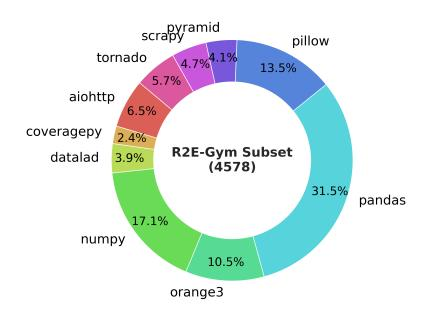

# 2 R2E-GYM: Procedural Synthetic Data Generation

| Dataset (split)                         | Repo? | Executable? | # Instances |
|-----------------------------------------|-------|-------------|-------------|
| APPS (Hendrycks et al., 2021)           | X     | /           | 10,000      |
| R2E (Jain et al., 2024b)                | /     | ✓           | 246         |
| SWE-Bench(train) (Jimenez et al., 2023) | /     | X           | 19,008      |
| SWE-Gym Raw (Pan et al., 2024)          | 1     | ×           | 66,894      |
| SWE-Bench (test) (Jimenez et al., 2023) | /     | /           | 2,294       |
| SWE-Gym (Pan et al., 2024)              | /     | /           | 2,438       |
| R2E-Gym-Subset (Ours)                   | /     | /           | 4,578       |
| R2E-Gym (Ours)                          | /     | 1           | 8,135       |

Table 1: **Dataset Statistics.** Comparing statistics across different datasets curating executable training environments for SWE-agent training. R2E-Gym refers to our full dataset, and R2E-Gym-Subset refers to a filtered subset of tasks, with non-overlapping repositories with SWE-Bench.

> **[图片提取文字 (无描述)]:**
> scrapy scrapy pillow 4.7%4.1% tornado 13.5% 5.7% aiohttp 6.5% coveragepy 2.4% R2E-Gym Subset datalad 3.9% (4578)31.5% pandas 17.1% numpy 10.5% orange3

Table 2: **Repo distribution** for R2E-Gym subset (no overlap with SWE-Bench) used for training (refer §3).

**Overview.** SWE task collection methods (Jimenez et al., 2023) rely on human-written issues and unit tests for problem statements and evaluation functions. However, this presents a challenge for scaling data curation as size is limited by human-written PRs. To overcome this limitation, we propose SWEGEN — a synthetic data curation recipe using backtranslation and test generation. We procedurally generate environments using only commits from GITHUB repositories, reducing reliance on both human-written issues and test cases.

**Repository and Commit Curation.** We use SEART GITHUB search2 to identify PYTHON repositories with a large number of commits. Next, we extract commit history and associated code changes for each repository. We filter relevant commits using a combination of rule-based and LLM-based heuristics, identifying *interesting* code changes. For each relevant commit, we next collect build scripts by semi-manually searching across dependency pins. We expand our set of heuristics and installation procedure further in the Appendix A.

**Test-Validation and Generation for Environment Collection.** Following Jimenez et al. (2023), we use the existing test cases in the curated commits to identify Fail $\rightarrow$ Pass (F2P) test cases, i.e. test cases that fail in the original buggy commit and pass in the fixed commit. In cases where the curated commits do not have associated tests, limiting the ability to use them for training environments, we supplement such commits with automatically generated Fail $\rightarrow$ Pass test-cases. Appendix A expands our test generation approach.

Backtranslation: Non-reliance on GITHUB Issues. Using the above steps, we collect a large number of commits, associated build environments and F2P (Fail→Pass) test cases. Now, we need to collect the problem statements associated with the commits. Prior works (Jimenez et al., 2023; Pan et al., 2024) use human-written GITHUB issues as problem statements. This inevitably cannot use the entire commit history since human-written issues are not available for all commits. Here, following Li et al. (2023); Wei et al. (2023) we propose a backtranslation approach to collect the problem statements associated with the commits.

However, naively back-translating code changes is quite noisy as models often generate generic problem statements that do not capture the essence of the code changes. Instead, we identify that human-written issues often contain failing tests and execution traces as part of bug reports. We use this observation to collect high-quality problem statements by using the F2P test-cases as part of the backtranslation prompt. Similar to existing works (Jain et al., 2024b; Zhuo et al., 2024), we find that using test execution information allows generating precise and directed problem statements. Please find prompts and examples in Appendix.

We collect over 8.1K problem statements using this approach (referred to as R2E-Gym). We decontaminate this set by removing repositories overlapping with SWE-Bench test-set repositories, obtaining 4578 problems (referred to as R2E-Gym-Subset) and use that across all experiments unless specified otherwise. Table 1 shows the statistics of different datasets, and Figure 2 and Figure 9 show the distribution of the repositories in R2E-Gym-Subset and

2https://seart-ghs.si.usi.ch/

Table 3: Resolve Rate (%) Comparison on SWEBENCH-VERIFIED and SWEBENCH-LITE benchmarks. We observe that synthetic data curation (SWEGEN): allows our approach to scale better across different model sizes. All experiments use the Qwen-2.5-Coder as base-models.

| Model |                    | SWEBENCH-LITE |              |       |                    | SWEBENCH-VERIFIED |             |       |
|-------|--------------------|---------------|--------------|-------|--------------------|-------------------|-------------|-------|
| Size  | Base-model SWE-Gym |               | Ours         | ∆     | Base-model SWE-Gym |                   | Ours        | ∆     |
| 7B    | 1.0 (±1.0)         | 10.0 (±2.4)   | 11.0 (±0.8)  | +1.0  | 1.8 (±1.3)         | 10.6 (±2.1)       | 19.0 (±1.0) | +8.4  |
| 14B   | 2.7 (±1.9)         | 12.7 (±2.3)   | 20.67 (±0.7) | +7.97 | 4.0 (±1.6)         | 16.4 (±2.0)       | 26.8 (±1.4) | +10.4 |
| 32B   | 3.0 (±1.4)         | 15.3 (±2.5)   | 23.77 (±0.8) | +8.47 | 7.0 (±1.3)         | 20.6 (±2.1)       | 34.4 (±1.2) | +13.8 |

R2E-Gym respectively. Notably, using our SWEGEN approach, we can collect over 2.5 times more problems than relying on the data collection relying on GITHUB issues (Figure [1a\)](#page-1-0).

