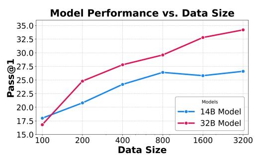

# **3 Training SWE-Agents using R2E-GYM Environments**

**Agent Scaffolding.** We design a minimal scaffold on top of OPENHANDS [\(Wang et al.,](#page-12-0) [2024\)](#page-12-0) to experiment with agents for diverse SWE tasks. It uses a traditional REACT framework [\(Yao](#page-13-3) [et al.,](#page-13-3) [2022\)](#page-13-3) without any specialized workflow; equipping the LLM with only a bash terminal, file editor, and search tool. Figure [16](#page-26-0) depicts an example code editing trajectory.

**Trajectory Collection and SFT Training**. We next collect SFT trajectories using from R2E-Gym environments. To avoid contamination, we only use a subset of R2E-Gym consisting of repos with no overlap with the SWE-Bench dataset. The resulting subset (R2E-Gym-Subset) consists of 4578 executable environments across 10 repositories (Figure [2\)](#page-2-2). For each task environment, we use SONNET-3.5-V2 with our agent scaffold and collect the successful agent trajectories. Through this process, we collect 3321 trajectories from 2048 unique task environments. We then use these trajectories to train our agent via supervised fine-tuning on agent thoughts and actions. For training, we use LLaMA-Factory [\(Zheng et al.,](#page-13-4) [2024\)](#page-13-4) and Qwen-2.5-Coder models (7B, 14B, 32B) as our base models. For detailed experiment configuration and hyperparameters, please refer to Appendix [B.](#page-17-0)

## **3.1 Results and Analysis**

**Comparison to open-weight SWE-Agents across Model Scales**. We report PASS@1 of R2E-Gym trained models on the SWEBENCH-VERIFIED and SWEBENCH-LITE benchmarks in Table [3.](#page-3-1) We also report comparisons with recently proposed SWE-Gym [\(Pan et al.,](#page-12-2) [2024\)](#page-12-2), which is most closest to our work. As seen in Table [3,](#page-3-1) we find that our approach enables better scaling for training SWE-agents across all model sizes. For instance, on SWEBENCH-VERIFIED, for the same base-model type and scale, our 32B model significantly improves the PASS@1 performance by 14%; pushing the final performance from 20.6 (SWE-Gym) to 34.4%.

**Scaling with Number of Trajectories**. We investigate the relationship between training samplesize (number of trajectories) and agent performance in Figure [2.](#page-4-1) We evaluate 14B and 32B models trained with trajectory counts ranging from 100 to 3, 200. Our findings indicate that performance improves with increasing trajectory count, though with diminishing returns for both models. Notably, the 14B model begins to saturate at approximately 800 samples, while the 32B model still shows improvements, likely due to its larger capacity. These results extend the findings of [Pan et al.](#page-12-2) [\(2024\)](#page-12-2), who studied dataset scaling up to ∼ 500 samples. Our analysis demonstrates that while performance does improve with increasing samplesize, the rate of improvement diminishes or even plateaus for smaller models.

**Real vs Synthetic Problem Statements.** The R2E-Gym approach enables us to generate problem statements without relying on human-written descriptions and test cases, offering greater scalability. We compare the performance of models trained on real GitHub issues versus our synthetic problem statements (collecting 400 trajectories from both sets). Remarkably, models trained on synthetic data achieve nearly identical performance (27.8% PASS@1) to those trained on real data (28.0%). This finding validates the efficacy of our synthetic data generation methodology, demonstrating that procedurally generated environments can match the training value of real-world examples while providing scalability.

> **[图片提取文字 (无描述)]:**
> Model Performance vs. Data Size 35.0 32.5 30.0 (a) 27.5 (b) 25.0 (c) 22.5 Models 20.0 14B Model 17.5 32B Model 15.0 200 400 800 1600 3200 **Data Size**

Figure 2: PASS@1 scaling curve with increasing number of training samples. Performance improvement with more training samples, enabled by SWEGEN approach.

| Ablation           | Config            | Pass@1 (%)   |
|--------------------|-------------------|--------------|
| Adding Thoughts    | With Without   | 34.4 30.4 |
| Real vs. Synthetic | Real Synthetic | 28.0 27.8 |

Figure 3: **Top.** Using thoughts in REACT agent trajectories leads to significant performance improvements. **Bottom.** Using SWEGEN synthetic generated issues and test cases achieves similar performance as real-world issues (400 trajectories for both real & synthetic in above) while providing better scalability during data collection.

**Explicit Thought Traces are Important.** During SFT we use both the agent's thought processes and actions as training targets. Models trained with thought demonstrations achieve significantly better performance compared to those trained without (34.2% vs 30.4% in Table 3). This suggests that exposing the model to step-by-step reasoning processes is necessary for reliable problem-solving in complex environments.

