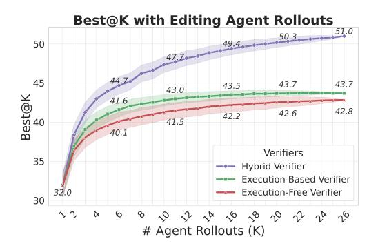
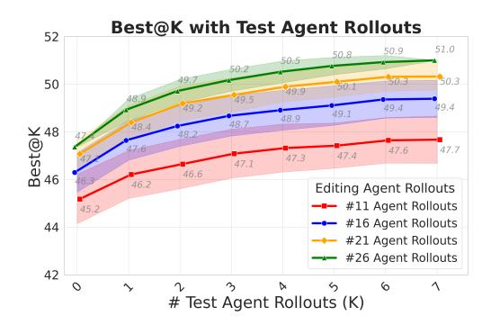
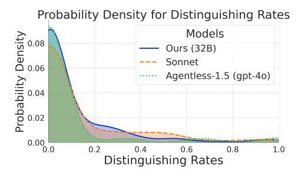
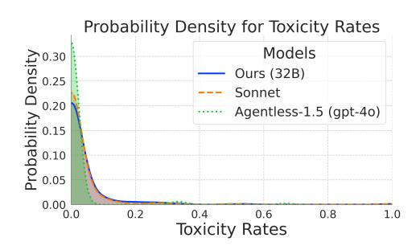
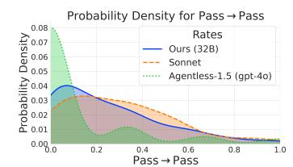
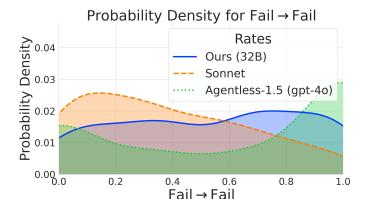
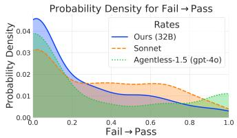

# <span id="page-4-0"></span>4 Efficient Inference Time Scaling With Hybrid Verifiers

We utilize R2E-Gym (§2) for inference-time scaling experiments with coding agents. In §4.1, we explore different axes for scaling test-time compute, focusing on two distinct approaches: 1) Execution-based Verifiers and 2) Execution-free Verifiers. We analyze the relative strengths and weaknesses of each approach, demonstrating their complementary nature (§4.2). Based on this insight, we propose a hybrid approach that leverages the strengths of both, significantly improving test-time performance (§4.3). Finally, we provide detailed ablations and analysis, examining critical design choices for our approach (§4.4).

## <span id="page-4-2"></span>4.1 Exploring Different Axes for Training Verifiers

Given an input task description  $\mathcal{D}$ , a set of agent trajectories  $\{\mathcal{T}_i\}_{i=1}^K$  and candidate patch outputs  $\{\mathcal{P}_i\}_{i=1}^K$ , our objective is to build a verifier that assigns scores  $\mathbf{S} = \{s_i\}_{i=1}^K$  to rank the outputs. To this end, we investigate two types of verifiers:

**Execution-Based Verifiers.** We train a specialized *testing-agent* that generates reproduction test cases to determine whether a candidate patch resolves the issue (i.e., whether the patch passes the generated test suite). Additionally, following Xia et al. (2024b), we leverage existing regression tests to filter out patches that fail to maintain backward compatibility. Our execution-based (EB) verifier thus comprises two components: 1) a *testing-agent* that generates targeted tests to evaluate bug fixes, and 2) a regression test filter that eliminates patches that compromise existing functionality. Specifically, we train the testing-agent (using QWEN-CODER-32B as base-model) to generate a comprehensive test script containing M=10 diverse tests that cover various inputs, corner cases, *etc.*. See Appendix D for example generated tests. The execution-based score  $s_k^{EB}$  for each each patch  $\mathcal{P}_k$  is then computed as,

$$s_k^{EB} = \begin{cases} \text{TestScore}_k, & \text{if } RS_k = \max_{j \in [1,K]} RS_j, \\ 0, & \text{otherwise,} \end{cases}; \text{ where } \text{TestScore}_k = \sum_i \text{Pass}(\mathcal{P}_k, \text{Test}_i) \quad (1)$$

where  $RS_k$  refers to the regression test score for the  $k^{th}$  patch and helps select the patches with the highest regression test scores (Xia et al., 2024b). TestScore<sub>k</sub> is simply the sum of the number of passing tests for each patch  $\mathcal{P}_k$ . Please refer to Appendix §C for further details.

Notably, unlike zero-shot test generation with Agentless (Xia et al., 2024b), our testing agent interacts with the environment to examine existing test cases and generates new

<span id="page-5-3"></span><span id="page-5-1"></span>> **[图片提取文字 (无描述)]:**
> Best@K with Editing Agent Rollouts 49.4.....50.3.... 50 45 43.7 43.7 43.5 43.0 Best@K 41.6 42.8 42.6 42.2 41.5 40.1 Verifiers 35 Hybrid Verifier Execution-Based Verifier 32.0 Execution-Free Verifier 30 # Agent Rollouts (K)


> **[图片提取文字 (无描述)]:**
> Best@K with Test Agent Rollouts 52 51.0 50.9 50.8 50.5 50:2 30.3 50 4919 49.4 49.4 49.1 48.7 Best@K 48.2 47.7 47.6 47.4 47.3 47.1 46.6 46.2 Editing Agent Rollouts #11 Agent Rollouts 45.2 #16 Agent Rollouts 44 #21 Agent Rollouts #26 Agent Rollouts 42 6 # Test Agent Rollouts (K)


Figure 4: **Left.** Best@K with increasing number of editing-agent rollouts. Inference-time scaling improves final performance for both execution-based and execution-free verifiers. Hybrid Verifier combining execution-based and execution-free verifiers provides significantly superious scaling. **Right.** Best@K with increasing number of testing-agent rollouts. Increasing test-agent rollouts also improves final performance and can provide more compute efficient scaling than naively increasing only editing-agent rollouts.

Table 4: Performance of various models/methods on SWE-Bench Verified.

<span id="page-5-2"></span>

| Method                                            | Model              | Type     | Verified |  |  |
|---------------------------------------------------|--------------------|----------|----------|--|--|
| Proprietary Models                                |                    |          |          |  |  |
| Agentless-1.5 (Xia et al., 2024b)                 | GPT-40             | Pipeline | 34.0     |  |  |
| Agentless (Xia et al., 2024b)                     | O1                 | Pipeline | 48.0     |  |  |
| Claude + Tools                                    | Claude-3.6-Sonnet  | Agent    | 49.0     |  |  |
| Agentless-1.5 (Xia et al., 2024b)                 | Claude-3.6-Sonnet  | Pipeline | 50.8     |  |  |
| OpenHands (Wang et al., 2024)                     | Claude-3.6-Sonnet  | Ågent    | 53.0     |  |  |
| Claude + Tools                                    | Claude-3.7-Sonnet  | Agent    | 62.3     |  |  |
| Claude + Tools (Best@Any)                         | Claude-3.7-Sonnet  | Agent    | 70.3     |  |  |
| Open-source Models                                |                    |          |          |  |  |
| SWE-SynInfer (Ma et al., 2024)                    | Lingma-SWE-GPT-72B | Agent    | 30.2     |  |  |
| SWE-Fixer (Xie et al., 2025)                      | SWE-Fixer-72B      | Pipeline | 30.2     |  |  |
| SWE-Gym (BEST@16 w / Verifier) (Pan et al., 2024) | SWE-Gym-32B        | Ågent    | 32.0     |  |  |
| SWE-RL (Best@500 w / Tests) (Wei et al., 2025)    | SWE-RL-70B         | Pipeline | 41.0     |  |  |
| Agentless (Xia et al., 2024b)                     | DeepSeek-R1        | Pipeline | 49.2     |  |  |
| R2E-Gym (Ours) (PASS@1)                           | R2E-Gym-32B        | Agent    | 34.4     |  |  |
| R2E-Gym (Ours) (BEST@16 w / Hybrid)               | R2E-Gym-32B        | Agent    | 49.4     |  |  |
| R2E-Gym (Ours) (BEST@26 w / Hybrid)               | R2E-Gym-32B        | Agent    | 51.0     |  |  |

tests informed by these examples with execution feedback. We demonstrate that this environment-aware approach provides additional benefits over zero-shot methods in §4.4.

**Execution-free Verifiers.** We next train execution-free (EF) verifiers for selecting the best trajectory from a set of sampled trajectories from the code-editing agent (§3). In particular, following (Pan et al., 2024), given task description  $\mathcal{D}$ , agent-trajectory  $\mathcal{T}$  (sequence of thought, action, and observations) and output patch  $\mathcal{P}$ , we finetune a Qwen2.5-Coder-14B model to predict YES and N0 tokens to determine correctness of a trajectory using SFT on correct and incorrect trajectories. The execution-free score is then computed by normalizing the relative probability of YES token as  $s^{EF} = P(\text{YES})/(P(\text{YES}) + P(\text{NO}))$ , where P(YES) and P(NO) are estimated through log-probabilities of corresponding token predictions.

#### <span id="page-5-0"></span>4.2 Comparative Analysis of Execution-Based and Execution-Free Verifiers

**Experimental Methodology.** We evaluate verifier performance using the Best@K metric, which quantifies each verifier's ability to identify correct patches from multiple candidates. Specifically, given K trajectories, the Best@K metric represents the percentage of problems where the verifier successfully selects the correct patch using its scoring mechanism. For our experiments, we sample 1 trajectory at temperature T=0 and 25 trajectories at temperatures T=0.8 and T=0.9 from the R2E-Gym-32B model on SWEBENCH-VERIFIED problems. These trajectories achieve Pass@26 =64.4% (Figure 14). Next, we sample 7 tests using our testing

<span id="page-6-2"></span>agent at temperature T=0.8. When generating tests, the test agent is provided a *fixed* in-context example (from Django) showing sample starter code and format for writing test cases. We empirically find that use of an incontext example is useful for improving output formatting and lacking domain knowledge in the base LM; improving test generation for  $\sim 2\%$  problems. Please see Listing C.1 for further details and incontext starter code.

**Both verifiers elicit inference time gains.** Figure 4 illustrates the Best@K performance of both verifier types on the SWEBENCH-VERIFIED benchmark as a function of number of editing agent rollouts. Both execution-based and execution-free verifiers demonstrate substantial performance improvements with increased number of rollouts. However, Best@K rate quickly plateaus for both methods, converging similarly to 43.7% and 42.8% respectively.

Limited Distinguishability in Execution-Based Verifiers. Recall that these verifiers output scores based on test pass counts and thus cannot differentiate between patches with identical test pass-rates, limiting their discriminative capacity. We study this discriminative capability from tests generated by our 32B testing agent, prompted SONNET-3.5-v2 model, and Agentless-1.5 reproduction tests (Xia et al., 2024b)³ on a subset of SWEBENCH-VERIFIED problems. Figure 5 (left) presents the problem density distribution for distinguishability rate, i.e., the proportion of tests that successfully differentiate between top-ranked correct and incorrect patches. The results demonstrate that for the majority of problems, less than 20% of tests provide discriminative signal, constraining the re-ranking. Figure 6 additionally depicts that most generated tests either do not reproduce the bug (high Pass→Pass values in 6-left) or do not pass ground truth patches (high Fail→Fail values in 6-middle) primarily due to bugs or exceptions in the generated test cases.

Vulnerability to Test Toxicity. Following (Chen et al., 2022), we examine the prevalence of toxic tests, i.e., tests that pass incorrect patches but fail correct patches. Figure 5 (right) illustrates the distribution of toxic test rates across different test generation approaches. While toxic tests are generally rare, we find that for a small but significant subset of problems, testing agents generate toxic tests (up to 10% of total tests) that can erroneously rank incorrect patches above correct ones, undermining the reliability of execution-based verification.

<span id="page-6-1"></span>> **[图片提取文字 (无描述)]:**
> Probability Density for Distinguishing Rates Models Density 80.0 80.0 Ours (32B) Sonnet Agentless-1.5 (gpt-40) Probability 80.0 80.0 0.00 0.2 0.8 Distinguishing Rates


> **[图片提取文字 (无描述)]:**
> Probability Density for Toxicity Rates Acopa Proposity Density Density 0.25 0.20 0.15 0.10 0.05 Models 0.30 Ours (32B) Sonnet Agentless-1.5 (gpt-40) 0.00 0.0 0.2 0.4 0.6 0.8 1.0 Toxicity Rates


Figure 5: Analyzing limitations of execution-based verifiers. Left: Problem Probability Distributions for distinguishability rates depicting weak discrimination capabilities of tests. We observe that for the majority of problems, less than 20% of tests provide discriminative signal, constraining the re-ranking ability of test-based agent. Right: Distributions for toxicity rates showing (rare) generation of toxic tests. We find that execution-based verifiers are also vulnerable to (rare) generation of toxic tests (tests that pass incorrect patches but fail correct patches); which can undermine the reliability of execution-based verifiers.

Execution-Free Verifiers can rely on heuristics. We next study the workings and limitations of execution-free verifiers. In particular, we first perform quantitative ablation studies, studying the impact of different trajectory components (e.g., output patch, agent thoughts) to verifier performance. To this end, we train multiple execution-free verifiers (§4.1) excluding different trajectory components while training the verifier. Results are shown in Figure 7-a. We find that agent thoughts play a considerable role in determining the verifier performance. Surprisingly, the final Best@26 drops from 42.8% to 37.6% when we remove the trajectory from the verifier input (i.e., only use the final patches). This means that while patch alone is

<span id="page-6-0"></span><sup>&</sup>lt;sup>3</sup>We utilize test cases from the official artifacts repository (Xia et al., 2024a).

<span id="page-7-4"></span><span id="page-7-1"></span>> **[图片提取文字 (无描述)]:**
> Probability Density for Pass → Pass 0.08 Rates Density 0.06 0.05 Ours (32B) Sonnet Agentless-1.5 (gpt-4o) A 0.04 0.03 0.02 0.01 0.00 0.2 0.4 0.6 Pass → Pass


> **[图片提取文字 (无描述)]:**
> Probability Density for Fail → Fail Rates Density 0.04 Ours (32B) Sonnet Agentless-1.5 (gpt-4o) Probability 0.00 0.2 0.4 0.6 0.8 1.0


> **[图片提取文字 (无描述)]:**
> Probability Density for Fail → Pass Rates Density 0.04 Ours (32B) Sonnet 0.03 Agentless-1.5 (gpt-4o) Probability S S 0.00 0.2 0.4 0.6 0.8 1.0 Fail → Pass


Figure 6: Problem Probability Distributions for Pass→Pass, Fail→Fail, and Fail→Pass generated test fractions for various approaches. We identify a large fraction of generated tests either do not reproduce the bug (left) or do not even pass the correct solution (middle).

<span id="page-7-2"></span>

| Method              | Accuracy (%) | Best@26 (%) |
|---------------------|--------------|-------------|
| Final Patch + Traj. | 71.82        | 42.8        |
| Patch Only          | 68.01        | 37.6        |
| Traj Thoughts       | 68.77        | 41.4        |

(a) Impact of Patch & Thoughts on execution-free verifier. Patch alone reduces performance, indicating that model relies on other heuristics (e.g., agent thoughts) for reranking; which can be misleading (see part-b: right).

```
1. Successfully reproduced the issue
2. Implemented a fix [...]
4. Ensured edge cases are handled
5. Maintained backward compatibility [...]
<function=finish>submit</function> [...]

Great! The fix works. Let's see what we did to fix the issue:
```

(b) Top two attention windows while predicting YES for an incorrect trajectory. We find that focusing on heuristics (agent thoughts) can mislead the verifier.

1. We identified that the original code was failing because it was trying to use

the `.inverse()` method directly on permutations, which [...]

Figure 7: **Quantitative and qualitative analysis on limitations of execution-free verifiers.** We perform two experiments: a) Quantitative ablations on the impact of output patch on verifier performance; showing that execution-based verifiers rely on other heuristics (e.g., agent thoughts) over the final patch. b) Qualitative visualization analyzing top k = 2 sliding windows with highest mean attention score while predicting output token YES (§4.2) for an *incorrect* agent trajectory (sympy\_sympy-24443: SWE-Bench (Yang et al., 2024b)). Focusing on heuristics (e.g., agent thoughts) can be misleading, and the verifier predicts the trajectory as correct. Visualizations are condensed for space. Please refer to the Appendix for further visualizations and results.

responsible for determining the correctness, execution-free verifiers heavily rely on trajectory features, such as agent thoughts, to make predictions.

To further investigate this phenomenon, we also perform an attention analysis trying to visualize parts of the input trajectory which are most relevant while predicting the output success with execution-free verifiers. In particular, we perform a sliding window search over the input trajectory, and compute the mean attention score over the tokens in the window when predicting the final output token (YES: correct, NO: incorrect). Figure 7 (right) illustrates the top two windows receiving the highest attention scores, demonstrating that verifiers disproportionately attend to agent thoughts. This can be misleading since the verifier can use these sentiment signals in these thoughts as proxies for correctness rather than evaluating the technical merits of the solution (i.e. the output patch).

## <span id="page-7-0"></span>4.3 Hybrid Inference Time Scaling

**Combining the verifier strengths.** Given the analysis from §4.2, we can summarize two key insights: 1) Execution-based approach provides direct signal for patch correctness through execution but suffers from lack of distinguishing tests 2) Execution-free approach offers better distinguishability between patches through a continuous reward score  $s^{EF}$  but can be biased to pay more attention to heuristics (e.g., agent thoughts) over final output patch.

Given the above insights, we thus propose a hybrid verifier that leverages the strengths of both approaches. Particularly, we define the hybrid verifier with score  $s_{\nu}^{H}$  as,

<span id="page-7-3"></span>
$$s_k^H = \text{Top}_n(s_k^{EF}) + s_k^{EB}$$
, where  $\text{Top}_n(s_k^{EF}) = \begin{cases} s_k^{EF}, & \text{if } s_k^{EF} \text{ is among the top } n \text{ scores,} \\ -\infty, & \text{otherwise.} \end{cases}$  (2)

<span id="page-8-2"></span>where  $s_k^{EB}$  provides execution-feedback,  $s_k^{EF}$  provides distinguishability in case of a tie with execution-based test scores (as  $s_k^{EF}$  provides a continuous score between 0 and 1), and  $Top_n$  restricts hybrid verifier to only consider the top verifier ranked patches. In practice, we perform regression filtering after the top-n filtering to ensure non-zero scores.

**Main Results.** Results are shown in Tab. 4 and Fig. 4. While both execution-based and execution-free methods rapidly reach performance plateaus with increasing agent rollouts (saturating at  $\sim$  43%), our hybrid approach demonstrates substantially superior scaling properties, yielding significant performance improvements (additional 7-8%); achieving a Best@26 performance of 51% on the challenging SWEBENCH-VERIFIED benchmark.

Comparison to Open Systems. The proposed approach significantly outperforms other open-weight alternatives; reflecting a new state-of-the-art in this domain. Among other generalist-agent methods, SWE-Gym (Pan et al., 2024) recently achieves a Best@16 performance of 32.0%. Similarly, concurrent work (Wei et al., 2025) recently achieved 41.0% using RL and Best@500 (using Agentless). In contrast, despite mainly relying on supervised fine-tuning for training, our proposed approach achieves a Pass@1 itself of 34.4% with Best@26 performance of 51.0% — achieving strong performance improvements through simply more scalable data curation (§2) and better test-time scaling (Figure 4).

