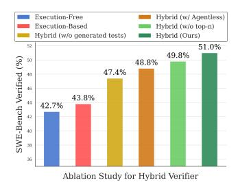

# 4.4 Ablation Studies on Hybrid Verification Design

> **[图片提取文字 (无描述)]:**
> Execution-Free Hybrid (w/ Agentless) Execution-Based Hybrid (w/o top-n) Hybrid (w/o generated tests) Hybrid (Ours) 52 51.0% 49.8% SWE-Bench Verified (%) 50 48.8% 47.4% 43.8% 44 42.7% 42 40 38 36 Ablation Study for Hybrid Verifier

Figure 8: **Ablation Study on Hybrid Verifier.** We find three key insights: 1) While both execution-based and execution-free verifiers saturate around 42-43%, the hybrid approach yields significantly higher test-time gains (51%). 2) Regression tests alone are insufficient for hybrid scaling — achieving only 47.4% aggregation performance. 3) Agentic vs Agentless: training a specialized testing agent is important improving the performance from 48.8% to 51%.

**Variation with Test-Agent Rollouts.** As in 4.2, execution-based test generation can suffer from a lack of distinguishing tests. One approach to address this, is to sample more testagent rollouts. We quantify this effect in Figure 4 (right). We observe that increasing number of test-agent rollouts consistently helps improve performance with our hybrid approach.

**Compute-Efficient Rollouts.** Figure 4 (right) illustrates the BEST®K performance as a function of both test-agent and code-editing agent rollout counts. Interestingly, we find that sampling more test-agent rollouts can provide more compute optimized inference-scaling over naively sampling more editing-agent rollouts. For instance, increasing the number of editing-agent rollouts from 16 to 21 improves the BEST®K performance from 47.6% to 48.4%. In contrast, simply sampling 5 more test-rollouts can yield better gains (BEST®K 49.3%).

**Regression Tests Alone are Insufficient.** Our execution-based verification framework integrates both regression and generated reproduction tests. Figure 5 (right) isolates the impact of regression tests alone on the final performance. While regression tests alone improve performance from 42.9% to 47.4%, using generated tests further enhances performance to 51.0%, demonstrating that both test types provide essential and complimentary signals.

**Agentic vs Agentless Tests.** A distinguishing feature of our approach is to train a specialized agent for test-generation; instead of the zero-shot approach from Xia et al. (2024b). To evaluate this design choice, we conducted a controlled comparison using official Agentless tests from their released artifact (Xia et al., 2024a) within our hybrid verification framework on the SWEBENCH-VERIFIED benchmark. Figure 5 (right) demonstrates that while Agentless tests provide meaningful performance improvements, our agent-generated tests yield superior results (51.0% versus 48.8%), validating our agent-based approach to test generation.

&lt;sup>4Note that test-agent rollouts are also usually considerably cheaper than editing-agent rollouts.

**Role of** Topn. We evaluate the impact of the Topn filtering mechanism introduced in Equation (2). Figure 5 (right) shows that this selective application strategy improves performance from 49.8% to 51.0%. This improvement likely stems from mitigating the impact of toxic tests (§4.2) by restricting their application to higher-quality patches (identified via execution-free reward scores  $s_k^{EF}$ ), thereby enhancing the reliability of the verification process.

## 5 Related Work

**Programming Agents**. Recent work on GITHUB issue resolution includes SWE-agent (Yang et al., 2024b), Autocoderover (Zhang et al., 2024b), OpenHands (Wang et al., 2024), Agent-Less (Xia et al., 2024b), Moatless Orwall (2024). All of them rely on proprietary models due to a lack of datasets and open-weight models — a gap our work addresses.

**Agent Training Environments**. Existing SWE agent environments have key limitations: SWE-Bench (Jimenez et al., 2023) lacks executable training environments, R2E (Jain et al., 2024b) offers only 246 instances with function completion. SWE-Gym (Pan et al., 2024) collects executable GITHUB environments similar to us but rely on human-written issues and test cases. Synthetic data generation has been studied in various domains but our work is the first to apply it for executable GITHUB environment collection. We use backtranslation (Li et al., 2024) and test-generation in SWEGEN approach. Please see Long et al. (2024) for a comprehensive survey on synthetic data generation methods.

**SWE-Agent Training.** Ma et al. (2024) and Xie et al. (2025) train on synthetic code editing tasks. Pan et al. (2024) study SFT on agent trajectories and inference scaling similar to our work. Wei et al. (2025) explores reinforcement learning on large scale data collected from real-world GITHUB issues without execution feedback.

**Verifiers for SWE-Coding Tasks**. Various works have explored use of verifiers for SWE tasks. AgentLess (Xia et al., 2024b) used majority voting to select the best patch from multiple agents. Agentless-1.5 relied on reproduction and regression tests to verify the correctness of generated patches. Zhang et al. (2024a) proposed multi-agent commitee-review (LLM judge) to select the best patch from multiple agents. Pan et al. (2024) proposed trajectory verifiers to re-rank the generated patches based on LLM score.

Verifiers for General Coding Tasks. Various works have explored the use of verifiers for general coding tasks on isolated puzzles (HumanEval (Chen et al., 2021)), interviews (Jain et al., 2024a), and competition or olympiad problems (Hendrycks et al., 2021; Li et al., 2022) Gu et al. (2024) showed that LLM judges perform poorly on checking correctness of generated code. Chen et al. (2022); Ridnik et al. (2024); Key et al. (2022); Zhang et al. (2023a) study how test generation can be used to re-rank the generated code samples. Inala et al. (2022); Zhang et al. (2023b); Ni et al. (2023) employ neural code re-ranker models.

In this work, we extend these lines of work by first presenting **novel insights on challenges** and opportunities for both execution-based and execution-free approaches in SWE-Coding. Using these insights, we also propose a novel hybrid approach that effectively combines their strengths to achieve better performance (51.0% on SWEBENCH-VERIFIED).

## 6 Conclusion

In this paper, we introduce R2E-Gym, the largest gym environment and training framework for scaling open-weight SWE agents. We share two key insights: 1) Synthetic data curation can enable more scalable training on SWE tasks. 2) Hybrid-test time scaling: different axis for test-time scaling (execution-based testing agents and execution-free verifiers) exhibit complementary strengths; which can be leveraged to achieve significantly higher test-time gains. Overall, our final approach achieves 51% on SWE-Bench Verified, reflecting a new state-of-the-art for open-weight SWE agents, while also for first-time showing competitive performance with some proprietary models. We hope that our work can offer unique insights for scaling open-source SWE-agents on real-world applications.

