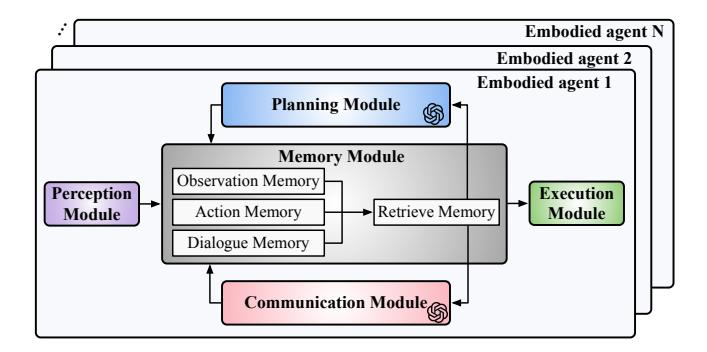

# 1 Introduction

Embodied AI systems consist of agents that interact with the physical world, integrating perception, cognition, and action to accomplish complex tasks [\[13,](#page-13-0) [47,](#page-14-0) [48,](#page-14-1) [76,](#page-15-1) [81,](#page-15-2) [84\]](#page-15-3). The rapid advancement of embodied AI is driving transformative changes in robotics and autonomous systems, enabling realworld applications across domains. These systems typically rely on perception, memory, communication, planning, and action modules, as a coherent workflow for task execution.

A recent advancement of embodied AI is cooperative embodied AI systems, where multiple autonomous agents collaborate to achieve shared goals [\[11,](#page-13-1) [12,](#page-13-2) [20,](#page-13-3) [21,](#page-13-4) [26,](#page-13-5) [29,](#page-13-6) [30,](#page-13-7) [43,](#page-14-2) [75,](#page-15-4) [83,](#page-15-5) [86](#page-15-6)[–88,](#page-15-7) [90\]](#page-15-8). These systems typically employ modular frameworks to perform long-horizon tasks, integrating high-level planning and reasoning with low-level action execution. LLMs are increasingly utilized in these

systems to enhance communication, decision-making, and planning in dynamic, complex environments. Cooperative embodied agent systems have demonstrated superior capabilities in long-horizon multi-objective tasks. For instance, CoELA [\[86\]](#page-15-6) improves task success rate by 23% in benchmarks involving complex object transportation, table setting, and dishwashing in human-agent interaction scenarios.

Cooperative embodied agents have demonstrated impressive long-horizon task integration and planning capabilities using distributed GPU clusters. However, enabling real-time and efficient cooperative embodied AI systems—highly desirable for many human-AI applications—remains a challenging open problem. For instance, we observe that current cooperative embodied systems, such as CoELA [\[86\]](#page-15-6), COMBO [\[87\]](#page-15-9), and MindAgent [\[20\]](#page-13-3), are highly inefficient, requiring 18, 23, and 21 minutes, respectively, even on desktop GPUs, to complete a single long-horizon multi-objective task.

To understand this further, we systematically profile and analyze the runtime, scalability, and module sensitivity of various cooperative embodied AI systems and identify the following system-level challenges. 1 Large Planning and Communication Latency. Cooperative embodied agents typically rely on LLM-based modules for high-level planning and inter-agent communication. Each action step involves multiple sequential LLM executions, making real-time operation impractical. 2 Limited Scalability. As the number of embodied agents increases in complex, long-horizon tasks, decentralized systems experience exponential latency growth, while centralized systems suffer from a sharp decline in task success rates due to reduced cooperation efficiency. 3 Sensitivity of Low-Level Execution. Typically, the embodied agents transform LLM-generated high-level plans to low-level planning and control commands for task execution, making the efficient and robust low-level execution critical for mission success.

To address the aforementioned challenges, we develop ReCA, an integrated acceleration framework designed to enhance the real-time efficiency and scalability of cooperative embodied autonomous agent systems. On the algorithm level, ReCA presents efficient local model processing to eliminate API dependencies by deploying LLMs locally on agents while maintaining comparable performance in cooperative long-horizon tasks. On the system level, ReCA introduces a dual-memory structure with hybrid long-term and short-term memory to improve planning efficiency, hierarchical cooperative planning scheme with intra-cluster centralized and intercluster decentralized cooperation to improve system scalability, and planning-guided multi-step execution strategy to mitigate sequential critical-path dependencies. On the hardware level, ReCA employs a heterogeneous hardware system with high-level planning GPU subsystem and low-level planning A-star accelerator subsystem to ensure efficient and robust task execution. Evaluated across three cooperative embodied systems and six benchmarks, ReCA achieves an

> **[图片提取文字 (无描述)]:**
> Embodied agent N Embodied agent 2 Embodied agent 1 Planning Module Memory Module Observation Memory Perception Execution Retrieve Memory Action Memory Module Module Dialogue Memory Communication Module

Figure 1. Modular framework for cooperative embodied AI agents. The agentic modular framework comprises five core modules: the perception module interprets the environment, the communication module formulates messages, the planning module devises high-level plans, the execution module translates plans into primitive actions, and the memory module retains the agent's knowledge and experiences across observation, action, and dialogue memories.

average of 10.2× end-to-end speedup, demonstrating its effectiveness in accelerating cooperative AI-driven autonomy. This paper, therefore, makes the following contributions:

- We systematically analyze the runtime, scalability, and modular sensitivity of cooperative embodied AI agent systems, identifying the primary causes of inefficiency and potential optimization opportunities (Sec. [3\)](#page-3-0).
- We introduce ReCA, an integrated acceleration framework designed to enable real-time, efficient, and scalable cooperative embodied AI systems (Sec. [4\)](#page-4-0). Our innovations span both system-level optimizations (Sec. [5\)](#page-4-1) and hardware acceleration (Sec. [6\)](#page-7-0), enhancing cooperative efficiency and reducing end-to-end task latency.
- We evaluate ReCA on long-horizon multi-objective tasks and cooperative embodied agent systems, demonstrating it generalizes across scenarios and scales, achieving a 4.3% increase in successful missions with a 10.2× speedup over state-of-the-art embodied systems (Sec. [7\)](#page-10-0).

