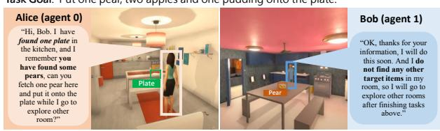
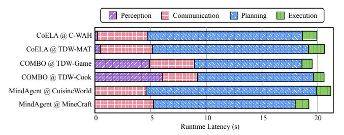

# 2.1 Modular Framework

Embodied agents typically harnesses the strong reasoning, planning and communication capabilities of LLMs to cooperatively tackle complex, long-horizon, multi-objective tasks. We present a modular framework for cooperative embodied agent systems, comprising five key modules: perception, memory, communication, planning, and execution (Fig. [1\)](#page-1-1). This framework encompasses a wide range of embodied agent architectures and interaction mechanisms [\[20,](#page-13-3) [30,](#page-13-7) [43,](#page-14-2) [49,](#page-14-3) [59,](#page-14-4) [86,](#page-15-6) [87\]](#page-15-9). The details of each module are as follows:

Modular Framework Details **Embodied Systems** Tasks Benchmarks TDW-MAT [15] Collaborative objects transporting CoELA [86] Mask R-CNN Observation, dialogue, action GPT-4 GPT-4 A-star planner Collaborative housework (e.g., set up table) C-WAH [63 Collaborative gaming TDW-Game [14 COMBO [87] Diffusion model Observation, dialogue, action LLaVA-1.5 LLaVA-1.5 + Tree search A-star planne TDW-Cook [14] Collaborative housework (e.g., co Collaborative gaming CuisineWorld [20] MindAgent [20] N/A GPT-4 GPT-4 Observation, dialogue, action A-star planne rative exploration and navigatior Minecraft [2

Table 1. Cooperative embodied agent systems. A selection of systems analyzed, representing a diverse range of cooperative scenarios.

**Perception module.** This module processes sensor data, enabling agents to collect and analyze critical information for higher-level reasoning. It constructs a global or shared environmental model, incorporating spatial layouts, dynamic entities, obstacles, and resource locations. Each agent continuously updates its local environmental view through sensor inputs and communication with other agents.

Memory module. Embodied agents retain knowledge and experiences from interactions with their environment and peers across three categories: observation, dialogue, and action memory. Observation Memory stores the agent's understanding of the world, including maps, task progress, and agent statuses, continuously updated by the Perception Module. Dialogue Memory logs communication history and past interactions. Action Memory tracks the agent's actions, execution status, and accumulated knowledge on implementing high-level plans across different environments, encoded as code or neural model parameters.

**Communication module.** This module retrieves relevant data from memory, including environmental maps, task progress, agent states, and past interactions. It converts this data into text-based descriptions, which are then used to prompt LLMs to generate meaningful messages for communication with other agents.

**Planning module.** The planning module extracts relevant information from memory and generates high-level plans based on the current state and stored procedural knowledge. LLMs use this data to formulate executable plans without relying on few-shot demonstrations. To enhance reasoning, zero-shot chain-of-thought prompting [34] can be applied, guiding LLMs through a more structured deliberation process before finalizing decisions.

**Execution module.** While LLMs are effective at high-level planning, they struggle with low-level planning and control [79, 89]. To bridge this gap, the execution module translates high-level plans into primitive actions for robust, low-level execution [18]. This design ensures generalizability, allowing the system to adapt to diverse tasks while leveraging LLMs' world knowledge and reasoning abilities.

#### 2.2 Representative Workloads

Building on the modular framework (Fig. 1) and [71], we select and analyze three representative cooperative embodied systems in detail: CoELA [86] for cooperative object transportation and household tasks, COMBO [87] for cooperative gaming and cooking, and MindAgent [20] for cooperative

Task Goal: Put one pear, two apples and one pudding onto the plate

> **[图片提取文字 (无描述)]:**
> lask doal. I di one peal, two apples and one padding onto the plate. Alice (agent 0) Bob (agent 1) "Hi, Bob, I have found one plate in "OK, thanks for your the kitchen, and I information. I will do remember you this soon. And I do have found some not find any other pears, can you target items in my Plate fetch one pear here room, so I will go to and put it onto the Pear explore other rooms plate while I go to after finishing tasks explore other above." room?"

Figure 2. Example of a cooperative embodied task. A complex multi-agent collaboration scenario that integrates sensory inputs, communication, and long-horizon, multi-objective task execution.

human-AI planning. These systems achieve state-of-the-art performance, demonstrating advanced long-horizon planning and decision-making capabilities. Our goal is to identify system-level challenges and facilitate scalable deployment of embodied AI, where latency and efficiency are critical.

CoELA. Cooperative Embodied Language Agent (CoELA) is designed for decentralized environments, enabling embodied agents to collaborate with each other or with humans on long-horizon, multi-objective tasks. Fig. 2 illustrates a cooperative scenario involving two agents. CoELA integrates Mask R-CNN for perception and GPT-4 for planning and communication, demonstrating strong performance on the TDW-MAT [15] and C-WAH [63] benchmarks. It excels in perceiving complex environments, reasoning about the world and other agents, communicating efficiently, and executing long-horizon plans in tasks such as collaborative object transport, tea preparation, table setting, and dishwashing.

COMBO. Compositional Model for Embodied Multi-Agent Cooperation (COMBO) is a decentralized planning framework leveraging compositional world models for online cooperative planning. Agents reconstruct the global world state from partial egocentric observations using a diffusion model [33] and utilize Visual Language Models (LLaVA-1.5) [42] to infer other agents' intents, communicate, and propose actions. COMBO further refines action sequences through tree search, achieving strong performance in long-horizon cooperation tasks such as cooking and puzzle-solving in ThreeDWorld[14] (TDW-Game and TDW-Cook). It reduces the number of steps required by 45% compared to LLaVA [42].

MindAgent. MindAgent MindAgent is designed for multiagent collaboration in gaming and household tasks, enabling agents to coordinate and execute complex plans in a centralized manner with emergent planning capabilities. It utilizes LLMs (GPT-4) for task scheduling and cooperation, enhancing planning efficiency through few-shot prompting

> **[图片提取文字 (无描述)]:**
> Perception Communication Planning Execution CoELA @ C-WAH CoELA @ TDW-MAT COMBO @ TDW-Game COMBO @ TDW-Cook MindAgent @ CuisineWorld MindAgent @ MineCraft Runtime Latency (s)

Figure 3. Performance bottleneck analysis. Latency distribution across module in CoELA [86], COMBO [87], and MindAgent [20] workloads, measured across six benchmarks.

and feedback mechanisms. Evaluations in CuisineWorld [20] and Minecraft [22] demonstrate significant improvements in multi-agent coordination and collaboration efficiency.

