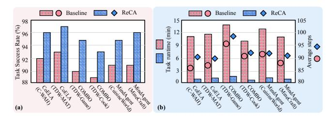
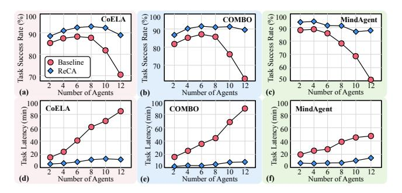
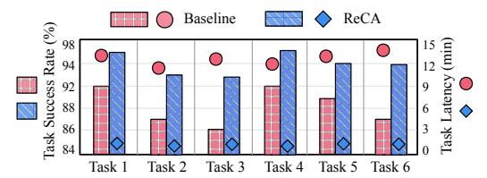
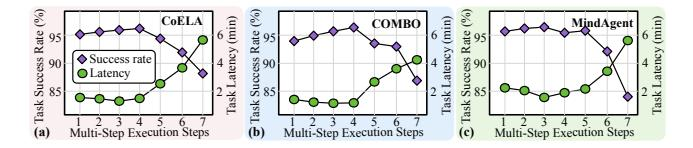
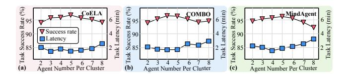
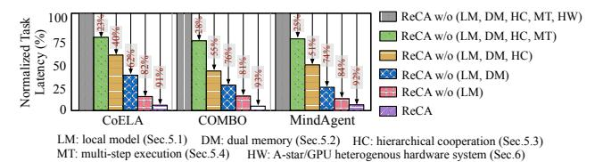

# 7.2 ReCA Performance and Efficiency

Success rate improvement. Fig. [12a](#page-11-1) shows the average task success rate of cooperative embodied AI agent systems across six benchmarks. We use the original workload implementations with four embodied agents as the baseline. ReCA uses the Llama-3.1-8b model along with other system and hardware optimizations. We observe that ReCA consistently improves the success rate by an average of 4.3% across long-horizon multi-objective tasks. This improvement is mainly attributed to enhanced memory consistency via dual-memory structure and improved cooperation capability via the hierarchical decentralized-centralized mechanism.

Efficiency improvement. Fig. [12b](#page-11-1) shows the average end-to-end task runtime and the number of steps required to complete the task of cooperative embodied AI agent systems. We observe that ReCA requires only 3.2% more steps, but

> **[图片提取文字 (无描述)]:**
> Baseline ReCA Baseline ReCA 98 Task Success Rate (%) min) (a) (b)

**Figure 12. Success rate and efficiency improvement**. ReCA (a) improves the task success rate and (b) reduces end-to-end task latency across six complex long-horizon multi-objective tasks.

> **[图片提取文字 (无描述)]:**
> Task Success Rate (%) 100 Task Success Rate (%) Task Success Rate (%) CoELA 100 100 MindAgent COMBO 90 90 90 80 80 70 80 Baseline 70 60 ReCA 50 4 6 8 10 Number of Agents 10 10 Number of Agents (a) Number of Agents (c) (b) Task Latency (min) 9 9 9 8 4 100 100 CoELA COMBO MindAgent Task Latency (min) Task Latency (min) 80 80 60 60 40 20 12 12 12 10 10 Number of Agents (d) Number of Agents Number of Agents (f) (e)

**Figure 13. Scalability improvement**. ReCA improves the system scalability with improved task success rates and reduced end-to-end latency under large-scale cooperative embodied agent systems.

delivers a 10.2× average speedup over the original CoELA, COMBO, and MindAgent systems. This is primarily due to reduced latency per step. We also conduct ten user studies for human-agent interaction and observe a 3.3 min average task completion time. ReCA, on the contrary, achieves a 1.2 min task runtime, enhancing system efficiency and real-time performance.

**Scalability improvement.** Fig. 13 illustrates the average task success rate and end-to-end latency under different numbers of embodied agents. We observe that ReCA consistently improves cooperative long-horizon task performance and efficiency, compared to both fully decentralized systems (CoELA and COMBO) and fully centralized systems (MindAgent). For example, under 12 embodied agents, the baseline systems typically take 1 hour to finish complex cooperative tasks with only <70% success rate, whereas ReCA can finish them in within 20 minutes and maintain a 90% success rate.

**Effectiveness across tasks.** Fig. 14 evaluates ReCA on six different C-WAH tasks with varying difficulty levels. We observe that ReCA is adaptive across tasks, with an average of 4.0% success rate improvement and  $9.8\times$  speedup across six long-horizon object transporting tasks.

Hardware resource consumption. The ReCA A-star architecture is compact and resource-efficient, making it well-suited for deployment on real-world resource-constrained physical agents. When implemented on Xilinx ZC706 FPGA, the design utilizes 25.3% of digital signal processors (DSPs), 15.6% of flip-flops (FFs), and 21.1% of look-up tables (LUTs). Additionally, the optimized custom scratchpad enables the

> **[图片提取文字 (无描述)]:**
> ReCA Baseline Rate (%) 94 ask Success 92 88 86 Task i Task 2 Task 3 Task 4 Task 5 Task 6

| Task | Descriptions                                                                                        |
|------|-----------------------------------------------------------------------------------------------------|
| 1    | Find and place 3 forks and 1 plate into the dishwasher                                              |
| 2    | Find and place 1 bottle of wine, 1 pancake, 1 pound cake, 1 juice, and 1 apple on the kitchen table |
| 3    | Find and place 3 forks into the dishwasher                                                          |
| 4    | Find and place 1 pudding, 1 juice, 1 apple, and 2 cupcakes on the coffee table                      |
| 5    | Find and place 1 bottle of wine, 2 cupcakes, and 1 pudding on the coffee table                      |
| 6    | Find and place 1 bottle of wine, 1 juice, 1 apple, 1 cupcake, and 1 pound cake on the kitchen table |

**Figure 14. Effectiveness across tasks**. ReCA consistently improves the task success rate and efficiency across six C-WAH tasks with varying difficulty levels.

> **[图片提取文字 (无描述)]:**
> CoELA MindAgent Multi-Step Execution Steps Multi-Step Execution Steps Multi-Step Execution Steps (a)

Figure 15. Sensitivity across multi-step execution. Task success rate and latency across scenarios of different numbers of low-level action steps agents take after high-level planned instructions.

ReCA A-star accelerator to consume only 10.7% of the total block random access memory (BRAM).

**Energy consumption.** The ReCA heterogeneous hardware system efficiently processes high-level LLM planning (via GPU subsystem) and low-level planning and control (via APU subsystem). For the low-level A-star planning module, we observe that ReCA APU subsystem achieves 4.6× speedup compared to the GPU-based A-star implementation while delivering a 281× improvement in energy efficiency.

#### 7.3 Sensitivity Analysis

Sensitivity across multi-step execution. Fig. 15 evaluates the performance and efficiency of ReCA across various multi-step execution scenarios (Sec. 5.4), specifically examining the number of low-level planning and action steps agents take after receiving each high-level LLM-based instruction. We observe that increasing the number of consecutive low-level action steps initially reduces end-to-end task latency by minimizing the number of LLM runs. Beyond a certain point, the total number of steps required to complete the task rises sharply due to accumulated trajectory errors, leading to increased overall latency and decrease in task success rate.

Sensitivity across hierarchical cooperative planning. Fig. 16 evaluates the performance and efficiency of ReCA under different hierarchical cooperative planning configurations (Sec. 5.3), focusing on the average number of agents per cluster. We observe that both too few or too many agents per cluster negatively impact task success rates and increase end-to-end latency, particularly in large-scale systems. Having too few agents per cluster causes the system to behave more

> **[图片提取文字 (无描述)]:**
> (a) Agent Number Per Cluster Agent Number Per Cluster (c)

Figure 16. Sensitivity across hierarchical cooperative planning. Task success rate and latency across scenarios of different number of agents in each cluster during centralized intra-cluster and decentralized inter-cluster cooperation.

> **[图片提取文字 (无描述)]:**
> ReCA w/o (LM, DM, HC, MT, HW) ReCA w/o (LM, DM, HC, MT) Normalized 7 ReCA w/o (LM, DM, HC) ReCA w/o (LM, DM) ReCA w/o (LM) ReCA CoELA COMBO MindAgent LM: local model (Sec.5.1) DM: dual memory (Sec.5.2) HC: hierarchical cooperation (Sec.5.3) MT: multi-step execution (Sec.5.4) HW: A-star/GPU heterogenous hardware system (Sec.6)

**Figure 17. Ablation study on ReCA optimization techniques.** The task latency achieved by ReCA w/o the local model, dual memory, hierarchical cooperation, multi-step execution, and heterogeneous hardware systems across embodied AI tasks.

like a decentralized architecture, while having too many agents leads to centralized behavior. These observations further validate the advantages of our proposed hierarchical approach, which combines decentralized inter-cluster cooperation with centralized intra-cluster planning.

Ablation study on the proposed optimization tech**niques.** As illustrated in Sec. 5 and Sec. 6, ReCA features a software-system-hardware co-design technique aimed at enhancing the efficiency (latency), performance (success rate), and scalability (agent number capacity) of cooperative embodied systems. The framework consists of efficient local model processing, dual-memory structure, hierarchical communication, planning-guided multi-step execution, and GPU/A-star heterogeneous hardware system to improve cooperative embodied task efficiency and performance. To verify the effectiveness of our proposed methods, we summarize the end-to-end task latency and success rate of ReCA w/o each technique in Fig. 17. In particular, the proposed GPU/APU hardware system can trim down the runtime by 25.3% on average. Additionally, with the proposed multi-step execution, hierarchical planning, and dual-memory structure, the runtime reduction ratio can be further enlarged to 48.7%, 70.7%, and 82.3%, indicating that both proposed techniques are necessary for ReCA to achieve the desired efficient and scalable cooperative embodied intelligence.

#### 8 Related Work

**Embodied AI system.** Embodied AI systems integrate perception, cognition, and action, enabling agents to interact with the physical world and perform complex tasks [13, 28, 81]. These systems process sensory inputs, reason about their surroundings, and execute actions by leveraging cognitive models for planning and control [48, 50, 66, 76, 77, 84, 85]. Typically, they consist of a server equipped with GPUs for

LLM execution and a physical agent for interaction [28], where real-time responsiveness is critical. Integrated task and motion planning enhances decision-making by combining task reasoning with motion control [2, 74], while model-based reasoning and reinforcement learning help agents manage uncertainty and adapt to long-horizon tasks [70]. ReCA is designed for embodied physical agent systems that integrate hierarchical high-level and low-level planning, providing a structured framework that includes perception, memory, communication, and execution modules.

Multi-agent collaboration. Multi-agent cooperation involves agents working together to achieve shared goals via coordination, communication, and collaboration. Research has explored various mechanisms to synchronize actions, mitigate conflicts, and enhance overall efficiency [11, 12, 21, 26, 29, 30, 43, 61, 75, 83, 88, 90]. Collaboration techniques enable agents to leverage each other's strengths, drawing on algorithms from distributed systems, game theory, and cooperative control to optimize performance [49, 53, 60]. ReCA is designed to enhance real-time efficiency in cooperative long-horizon multi-objective tasks.

Efficient autonomous systems. Recent advancements in autonomous system design span multiple domains, including domain-specific languages [61, 64], simulation tools [8, 35, 56], benchmark suites [37, 50], runtime systems [9, 65], design frameworks [7, 23, 36, 38, 54, 55], and safety considerations [24, 72]. Additionally, optimized compute units and accelerators have been developed for both FPGA [3, 16, 17, 44–46, 51, 52, 52, 73, 82] and ASIC implementations [6, 10, 32, 39, 40, 58, 67]. ReCA complements these techniques and can be integrated with them to enable real-time, efficient cooperative embodied systems. While demonstrated in generalist agents, ReCA's acceleration techniques are broadly applicable to a wide range of single- and multi-agent systems.

#### 9 Conclusion

To enable efficient and scalable cooperative agent systems for real-time embodied intelligence, we present ReCA, the integrated software-hardware co-design framework dedicated to accelerating cooperative embodied systems. ReCA identifies opportunities for accelerating cooperative embodied AI, including dual memory structure, hierarchical cooperative planning, planning-guided multi-step execution, and scalable A-star accelerator. We believe ReCA paves the way for a new perspective on scalable and efficient cooperative embodied agent systems.

