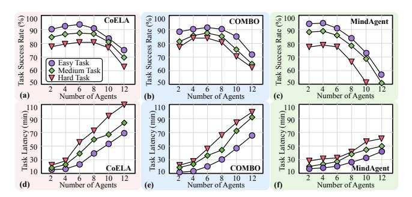
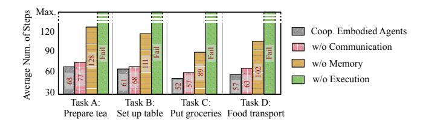

# 3 System Characterization and Implication

This section examines the system behavior of various cooperative embodied agent systems (Sec. 3.1, Sec. 3.2), evaluates their scalability (Sec. 3.3) and module sensitivity (Sec. 3.4), to provide insights into their performance characteristics.

## 3.1 Profiling Setup

To assess the efficiency of cooperative embodied AI systems, we profile CoELA [86], COMBO [87], and MindAgent [20] in terms of runtime latency, scalability, and module sensitivity, focusing on their ability to handle long-horizon, multi-objective tasks [71]. Each workload follows the configurations reported in its respective study.

**CoELA workload setup.** We profile CoELA on the C-WAH [63] and TDW-MAT [15] benchmarks, where two agents perform various household tasks. The objective is to complete 3 to 5 subgoals per task within 250 time steps. Efficiency is measured using the *Average Steps* metric, which quantifies the average steps taken per task. CoELA utilizes GPT-4 via the OpenAI API for communication and planning, while actions are executed on Intel i7 CPU.

**COMBO workload setup.** We evaluate COMBO on the TDW-Cook [14] and TDW-Game [14] benchmarks, which involve complex embodied multi-agent planning. In these tasks, embodied agents cooperate to explore, navigate, and place food items to create dishes in the indoor environments. LLaVA-1.5 model inferences are executed on NVIDIA A6000 GPU, while agent actions run on Intel i7 CPU.

MindAgent workload setup. We profile MindAgent with GPT-4 on the CuisineWorld [20] and Minecraft [22]. These benchmarks represent gaming and household scenarios that assess multi-agent collaboration efficiency. The system is tasked with managing multiple agents to complete as many missions as possible while optimizing task execution.

## 3.2 Performance Bottleneck Analysis

**End-to-end latency.** Fig. 3 presents the end-to-end latency per step for the CoELA, COMBO, and MindAgent in cooperative long-horizon, multi-objective tasks. The analysis reveals

> **[图片提取文字 (无描述)]:**
> Task Success Rate (%) 00 00 00 00 00 00 00 00 00 00 00 00 00 CoELA Task Success Rate (%) 00 00 00 00 00 00 00 00 00 00 00 00 00 Task Success Rate (%) COMBO MindAgent 90 80 70 Easy Task Medium Task 60 Hard Task 50 4 6 8 10 Number of Agents 10 12 12 (a) Number of Agents Number of Agents (c) (b) Task Latency (min) 200 110 06 011 Task Latency (min) 20 00 00 00 00 00 00 00 00 00 00 00 00 Task Latency (min) 20 20 20 20 20 20 20 20 20 20 20 20 20 COMBO CoELA MindAgent 10 12 10 12 Number of Agents (d) Number of Agents (e) (f) Number of Agents

**Figure 4. System scalability analysis**. Average task success rate and end-to-end latency for CoELA [86], COMBO [87], and MindAgent [20] systems across varying number of agents and tasks.

three key findings: (1) High system runtime latency and low frame rate. Each step in the CoELA, COMBO, and MindAgent workloads takes an average of 19.9, 20.8, and 21.4 seconds, respectively. This results in a slow frame and action rate, making real-time execution infeasible for human-agent applications. (2) LLM-based communication and planning modules dominate latency. The LLM-based modules contribute significantly to overall mission time, accounting for 90.0% in CoELA (GPT-4-based), 62.5% in COMBO (LLaVA-1.5-based), and 93.7% in MindAgent (GPT-4-based). (3) Network latency is a significant factor. For example, network overhead between the agent and the LLM cloud server contributes 27.0% of total latency, significantly impacts total task runtime.

System and collaboration efficiency. We also identify several system-level inefficiencies in cooperative embodied agent systems. (1) Memory inconsistencies in LLMs during task progression. Embodied tasks require executing sequential instructions, where later actions depend on earlier ones. As the in-context prompt grows, LLMs struggle to retain critical details, such as previous actions and object locations, leading to errors in long-horizon planning. (2) Multiple LLM inference runs per execution step. In CoELA, each step requires three separate LLM runs: message generation (16.1%), planning (36.5%), and action selection (10.3%). This redundancy amplifies inefficiencies, particularly in multi-agent setups and long-horizon tasks. (3) Sequential processing bottlenecks. The perception-communication-planning pipeline introduces cumulative latency and redundant high-level planning computations at each step, further slowing down agent actions.

## 3.3 Cooperative Agents Scalability Analysis

Scalability challenges. While most studies on cooperative embodied agent systems focus on two to four agents, scaling to larger groups presents major challenges, especially in long-horizon, multi-objective tasks: (1) Exponential growth in coordinated actions and dependencies. As the number of agents increases, the number of possible coordinated actions and interdependencies grows exponentially, making LLM-based reasoning increasingly complex. (2) Expanding

> **[图片提取文字 (无描述)]:**
> Max. Average Num. of Steps Coop. Embodied Agents 120 w/o Communication 90 w/o Memory 60 w/o Execution Task A: Task B: Task C: Task D: Set up table Put groceries Food transport

Figure 5. Ablation and sensitivity analysis. The average number of steps required to complete four C-WAH household tasks [\[63\]](#page-15-10) under different CoELA [\[86\]](#page-15-6) configurations, highlighting the sensitivity of the memory and execution modules to mission performance.

context length and computational overhead. Each LLM context includes ongoing dialogues, history, actions, and states. More agents result in longer input contexts, approaching LLM token limits, thereby increasing inference runtime and API costs. (3) Information dilution in long prompts. Lengthy prompts can dilute critical task-relevant information, reducing the LLM's ability to generate effective decisions and impacting overall task performance.

Decentralized and centralized comparison. Fig. [4](#page-3-5) illustrates the average task success rate and end-to-end latency across varying numbers of agents and tasks. We observe different characteristics of decentralized (CoELA and COMBO) and centralized (MindAgent) architectures in cooperative generalist agent systems. (1) Decentralized embodied systems suffer from limited scalability and exploded latency. In decentralized systems, with more agents, the number of communication rounds per planning step grows, often resulting in repetitive and unproductive dialogues, leading to significant latency. Agents frequently reiterate prior suggestions or propose identical actions, which dilutes the context and hampers collaboration. As the number of agents increases, task success initially improves but declines due to reduced collaboration efficiency in larger agent groups. (2) Centralized systems suffer from sharp task success rate decline under more agents. In centralized systems, the task success rate sharply decreases as the number of agents grows. This suggests that a single central LLM planner struggles to generate effective plans for complex multi-agent tasks, leading to suboptimal performance in more intricate scenarios.

## 3.4 Ablation and Sensitivity Analysis

To evaluate the sensitivity of individual modules within the cooperative agent framework (Fig. [1\)](#page-1-1) for long-horizon tasks, we analyze the average number of steps taken to complete various embodied tasks under different configurations.

Communication module sensitivity. The communication module facilitates information exchange and request handling among agents. Surprisingly, we observe from Fig. [5](#page-4-3) that disabling communication among agents had no significant impact on performance. We hypothesize two possible reasons: System-level factors, pre-generated messages cover agent-relevant interactions, yet fewer than 20% of these are

actually exchanged, suggesting sparse communication usage. Model-level limitations, effective communication requires understanding agent intentions and managing natural language ambiguities, which current models like GPT-4 struggle to handle consistently [\[86\]](#page-15-6).

Memory module sensitivity. Fig. [5](#page-4-3) highlights the critical role of memory in cooperative embodied systems. Disabling the memory module results in a 1.84× increase in steps required to complete long-horizon tasks across four benchmarks. This demonstrates that memory is essential for tracking environmental knowledge and agent actions, significantly improving task efficiency.

Execution module sensitivity. The low-level execution module plays an indispensable role in system functionality. As shown in Fig. [5,](#page-4-3) disabling it led to task failures and reaching the maximum step limit. This likely occurred because, without this module, the LLM-based planning system was forced to handle low-level control decisions, significantly expanding the decision space and slowing inference. This underscores the importance of using LLMs for high-level planning while relying on optimization-based algorithms (e.g., A-star) for low-level control. Developing agents with efficient low-level control is essential for advancing scalable and robust cooperative systems.

