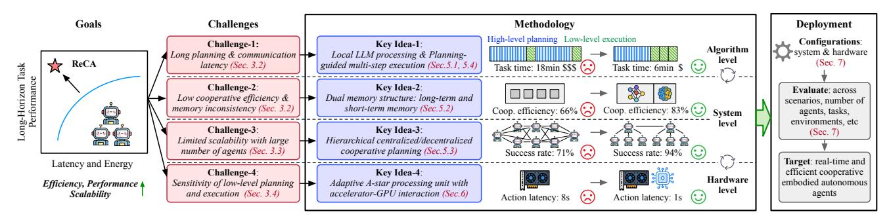
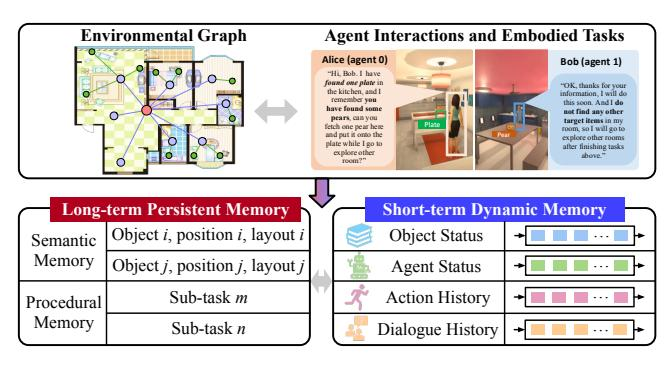
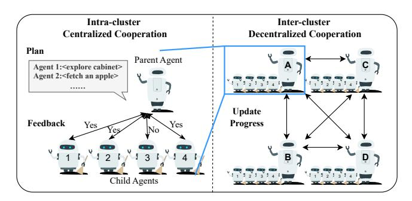
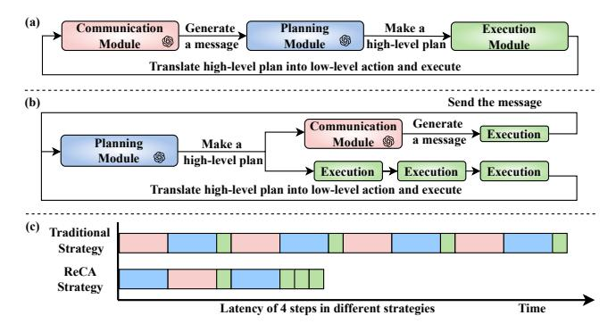
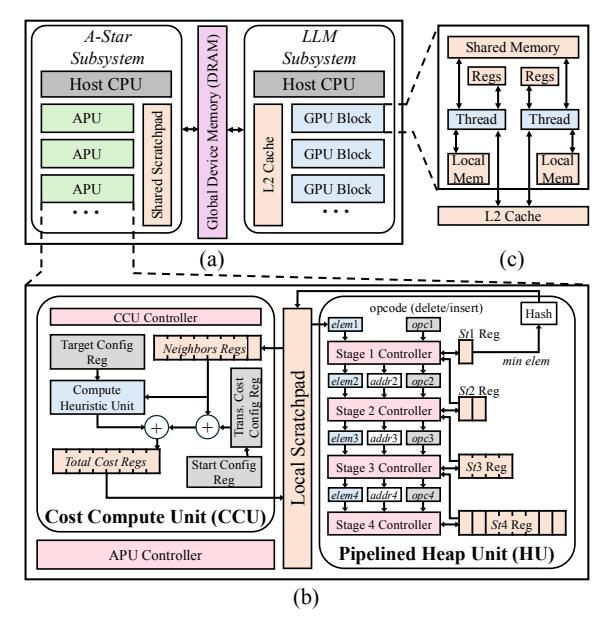
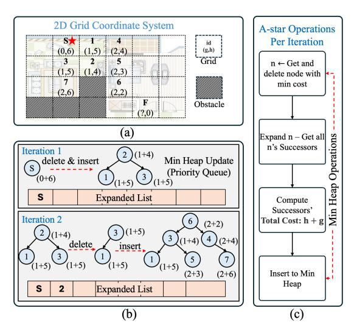

# 5 ReCA: System Optimization

This section presents ReCA system optimizations for cooperative embodied agent systems. ReCA features efficient local model processing (Sec. [5.1\)](#page-5-1), dual long/short-term memory structure (Sec. [5.2\)](#page-5-2), hierarchical decentralized-centralized planning (Sec. [5.3\)](#page-6-0), and planning-guided execution (Sec. [5.4\)](#page-7-1).

> **[图片提取文字 (无描述)]:**
> Goals Challenges Methodology Deployment High-level planning Low-level execution Configurations: Challenge-1: Key Idea-1: Algorithm ▶system & hardware Local LLM processing & Planning-Long planning & communication | level ReCA (Sec. 7) latency (Sec. 3.2) guided multi-step execution (Sec.5.1, 5.4) Task time: 6min \$ Task time: 18min \$\$\$ (>) ng-Horizon Ta Performance Challenge-2: Key Idea-2: Evaluate: across Low cooperative efficiency & Dual memory structure: long-term and scenarios, number of memory inconsistency (Sec. 3.2) short-term memory (Sec. 5.2) Coop. efficiency: 66% (\*\*) agents, tasks, System environments, etc level Challenge-3: Key Idea-3: (Sec. 7) Limited scalability with large Hierarchical centralized/decentralized number of agents (Sec. 3.3) cooperative planning (Sec. 5.3) Success rate: 71% (\*\*) Success rate: 94% Target: real-time and Latency and Energy Key Idea-4: efficient cooperative Challenge-4: Hardware Efficiency, Performance A Sensitivity of low-level planning Adaptive A-star processing unit with embodied autonomous level and execution (Sec. 3.4) accelerator-GPU interaction (Sec.6) agents Scalability Action latency: 1s Action latency: 8s

Figure 6. ReCA System Overview. ReCA is an integrated acceleration framework with the goal to enable real-time and efficient cooperative embodied autonomous agent systems. ReCA addresses the challenges of long planning and communication latency, low cooperative efficiency, limited scalability, and low-level planning and execution sensitivity, by proposing methodologies including dualmemory structure, hierarchical cooperative planning, multi-step execution, and hardware subsystems. ReCA is deployed across embodied workloads and scenarios and consistently demonstrates performance-efficiency-scalability improvements for cooperative embodied systems.

## 5.1 Efficient Local Model Processing

Motivation. ReCA aims to achieve real-time efficiency in generalist multi-agent embodied AI systems. Recent systems [\[20,](#page-13-3) [27,](#page-13-12) [86\]](#page-15-6) have relied heavily on closed-source models such as GPT-4 [\[57\]](#page-14-8) and Claude-3 [\[1\]](#page-13-13) for planning and communication due to their superior performance. However, these models pose challenges for optimizing embodied systems. First, unpredictable API call runtime. API call performance varies with real-time demand and server usage, making it hard to reduce the latency of LLM requests, which are typically the most time-consuming component in embodied AI systems (Sec. [3.2\)](#page-3-2). Second, substantial model cost for embodied agents. The cost of using higher-capability models rises significantly, creating budget constraints that limit the large-scale deployment of embodied AI systems. Third, privacy concerns are critical in scenarios involving ubiquitous human-agent interaction, as the use of external API calls introduces risks to data privacy. To address these issues, ReCA explores the feasibility of using smaller, open-source LLMs deployed locally on agents while maintaining comparable performance in long-horizon tasks without API dependencies. Local deployment eliminates the need to transmit sensitive data to external servers, reducing the risk of private data exposure while also minimizing dependency on network latency and API availability.

Model optimization. To optimize the deployment of smaller LLMs in cooperative embodied systems, ReCA employs several techniques to enhance efficiency, scalability, and adaptability: First, parameter-efficient fine-tuning. We apply LoRA [\[25\]](#page-13-14) to fine-tune smaller models using agentcollected datasets, achieving promising performance while minimizing computational overhead. Second, chain-of-thought (CoT) prompting. We adopt CoT prompting [\[78\]](#page-15-14), which breaks down complex tasks into smaller, sequential subtasks, making them more manageable for lightweight LLMs. Third, hierarchical prompt structuring. We format prompts using structured hierarchical representations to improve clarity,

consistency, and interpretability for smaller models. Fourth, optimized model compilation. We integrate MLC-LLM [\[68\]](#page-15-15), which compiles models into hardware-optimized representations, leveraging software stack accelerations to enhance execution efficiency. Finally, model quantization. We employ AWQ quantization [\[41\]](#page-14-9) to further reduce model size, enabling efficient deployment on resource-constrained embodied agents without compromising functionality.

Model experimentation. The trade-off between model inference time and task step count directly affects overall mission latency. Simply reducing model size can degrade planning quality, leading to longer task completion times. To strike the optimal balance between model size and task performance, we conduct comprehensive experiments with models of varying sizes (e.g., Llama2-7B, Llama3-8B-Instruct, Llama3.2-1B, Llama3.2-3B, Llama3.1-8B, etc.) to minimize end-to-end task latency by optimizing runtime efficiency and the number of task steps.

## 5.2 Dual Memory Structure

Motivation. The memory module is critical in ensuring the efficiency and functionality of cooperative embodied agent systems. However, as shown in Sec. [3.2,](#page-3-2) existing systems struggle with hallucinations and inconsistencies, particularly in long-horizon, multi-objective tasks. These challenges stem from poor long-term retention and difficulty retrieving relevant information when needed. Additionally, permanent memory storage increases storage demands, while resetting memory on restart erases long-term knowledge, leading to performance degradation. Therefore, optimizing the memory module is essential for enhancing agent performance.

Dual memory structure overview. To address memory inconsistencies and enhance long-horizon planning capabilities, ReCA introduces a dual-memory structure, which divides the memory module into two complementary components: long-term memory and short-term memory (Fig. [7\)](#page-6-1). Long-term memory stores static environmental information such as objects, layouts, and structural features, while

> **[图片提取文字 (无描述)]:**
> Environmental Graph Agent Interactions and Embodied Tasks Alice (agent 0) Bob (agent 1) "Hi. Bob. I have found one plate in "OK, thanks for your the kitchen, and I information, I will do remember you this soon. And I do have found some not find any other pears, can you target items in my fetch one near here room, so I will go to and put it onto the explore other rooms plate while I go to after finishing tasks explore other shove " room?" Long-term Persistent Memory Short-term Dynamic Memory Object i, position i, layout i Object Status Semantic Memory Object j, position j, layout j Agent Status Sub-task m Action History Procedural Memory Sub-task n Dialogue History

Figure 7. Dual memory structure. ReCA presents a dual memory structure consisting of long-term memory and short-term memory to improve high-level planning and cooperative efficiency.

short-term memory tracks real-time updates on agent status, task progress, and recent interactions. This structure enables agents to combine stable environmental knowledge with immediate task-specific details, improving their performance in complex multi-step tasks.

Long-term memory. Long-term memory is designed to store static environmental information, including layout structures and static object positions, which remain unchanged over extended periods. To enable efficient management and retrieval, perceptual data is structured as a hierarchical graph, encoding spatial relationships and object attributes. As illustrated in Fig. [7,](#page-6-1) this graph represents objects as vertices and their relationships as edges, providing a structured and scalable representation of the environment.

As agents cooperatively navigate the environment, they dynamically construct and update this graph, expanding it as new areas are explored. This enables agents to efficiently integrate spatial knowledge while continuously refining their understanding. When the LLM planner requires environmental data, the graph is serialized into a structured text format for direct parsing. This approach minimizes redundant exploration and enables fast updates by dynamically adding or removing nodes based on environmental changes. As a result, agents can make well-informed decisions, improving long-horizon planning efficiency and enhancing accuracy.

Short-term memory. Short-term memory is compact and dynamically refreshed, storing recent task-related information such as object states, agent status, and interaction history. This ensures quick access to recently used objects and their attributes, streamlining task execution.

To optimize LLM planning efficiency, short-term memory is structured for serialization into text format. This allows the planner to seamlessly incorporate recent observations and task progress into decision-making. For instance, in the Fig. [2](#page-2-1) scenario, if an agent is instructed to "fetch a pear and place it on a plate," its location and status are logged in short-term memory. When a subsequent instruction requires finding the same object, the agent can retrieve this stored data instead of re-exploring the environment, significantly reducing redundant operations and improving efficiency.

> **[图片提取文字 (无描述)]:**
> Intra-cluster Inter-cluster Centralized Cooperation Decentralized Cooperation Plan Parent Agent Agent 1:<explore cabinet> Agent 2:<fetch an apple> Update Feedback Progress Yes Yes Child Agents

Figure 8. Hierarchical cooperative planning. ReCA presents a hierarchical paradigm featuring parent-child centralized cooperation within clusters and decentralized cooperation across clusters.

Throughout task execution, short-term memory is dynamically updated by replacing the least recently used data with the most recent information. This adaptive retention strategy ensures that critical, high-priority data remains readily accessible, while outdated or less relevant information is systematically discarded. By prioritizing task-relevant details over retrieving entire dialogue histories, this approach prevents context dilution, optimizes memory efficiency, and enhances overall task performance.

## 5.3 Hierarchical Cooperative Task Planning

Motivation. As the number of embodied agents increases, both fully centralized and fully decentralized cooperative embodied systems encounter scalability challenges (Sec. [3.3\)](#page-3-3). Decentralized systems suffer from increased latency and reduced planning efficiency, while centralized systems experience a sharp decline in task success rates. These limitations necessitate a more scalable approach to ensure efficient task execution in large-scale cooperative systems.

Hierarchical cooperative planning. To overcome these challenges, ReCA introduces a hierarchical cooperative planning paradigm, as illustrated in Fig. [8.](#page-6-2) In this paradigm, agents are grouped into clusters when they are close enough to interact. Within each cluster, ReCA utilizes a parent-child centralized cooperation model, while coordination between clusters follows a decentralized approach.

Intra-cluster centralized cooperation. Within each cluster, the parent agent acts as the central planner, leveraging its LLM to generate task plans for both itself and its child agents. The parent communicates these plans to child agents and other parent agents across clusters. Upon receiving their assigned actions, child agents review them and provide feedback. If any action is deemed infeasible, the parent agent re-plans accordingly. This iterative feedback loop continues until all agents in the cluster agree on their respective actions, which can enhance task success rates and eliminate invalid actions in large-scale cooperative systems. Agents execute their tasks asynchronously, dynamically resolving dependencies during execution. Cluster-wide synchronization occurs after each round of actions, minimizing workload

> **[图片提取文字 (无描述)]:**
> (a) Communication Generate. Planning Make a Execution 6 Module Module high-level plan Module a message Translate high-level plan into low-level action and execute (b) Send the message Generate Communication Execution Module \$ Planning Make a Module high-level plan Execution -Execution > Execution Translate high-level plan into low-level action and execute Traditional Strategy ReCA Strategy Latency of 4 steps in different strategies Time

**Figure 9. Planning-guided efficient execution**. ReCA presents a planning-then-communication strategy and planning-guided multistep execution, effectively decoupling high-level and low-level planning to significantly reduce end-to-end system latency.

imbalances and enhancing overall system efficiency by avoiding the overhead of global synchronization across all agents.

Inter-cluster decentralized cooperation. For interactions between clusters, parent agents from each cluster communicate to update task progress while minimizing communication overhead and context dilution among agents. Cluster composition is dynamically adjusted based on the evolving distances between agents. To mitigate computational overhead in systems with a large number of agents (e.g., N agents), ReCA sweeps the number of agents per cluster ( $N_C$ ) based on the deployed workload to identify the optimal cluster size ( $N_C'$ ). It then designates  $\lceil N/N_C' \rceil$  agents as parent agents, each leading a separate cluster, thereby distributing the planning workload more efficiently.

Dynamic task decomposition and allocation. The LLM-based planner within each parent agent handles task decomposition and sub-task allocation. By leveraging the overall mission goal, semantic map from long-term memory, and agent/object status from short-term memory, the planner generates optimized sub-task sequences. It considers the spatial distribution of agents and objects to allocate tasks in a manner that minimizes overall execution time. Throughout the mission, task decomposition and allocation remain dynamic, with parent agents adjusting plans in response to new observations and updated agent statuses. This adaptability enables the system to respond effectively to environmental changes and optimize task performance in real time.

## 5.4 Planning-Guided Efficient Execution

**Motivation.** Inefficiencies in execution and collaboration significantly hinder the real-time performance of cooperative embodied agents (Sec. 3.2). From a communication perspective, the message pre-generation process introduces unnecessary redundancy as depicted in Fig. 9a. Messages are generated at every step for each agent, yet only around 20% of these steps result in actual communication once plans are finalized. From a planning perspective, the sequential execution model, which requires high-level planning decisions

from the LLM before each low-level action, leads to substantial runtime latency, adversely affecting system efficiency.

**Planning-then-communication strategy.** To mitigate these issues, ReCA adopts a planning-then-communication strategy that optimizes communication by tightly integrating it with the planning process. Instead of pre-generating messages at every step, the planning module assesses the need for communication based on data from the dual memory architecture, which stores environmental information, agent states, actions, and dialogue history. Messages are generated only when communication is essential, thereby eliminating redundancy and reducing overhead.

**Planning-guided multi-step execution.** To further reduce end-to-end latency, ReCA redefines the execution pipeline for cooperative embodied AI systems, shifting away from the conventional step-by-step high-level planning approach. Instead of generating a high-level plan for each low-level action, ReCA allows the planning module to produce a high-level plan that guides multiple consecutive low-level actions within a specified time frame.

Multi-step execution may introduce cumulative errors. To mitigate their impact, ReCA employs two key strategies: (1) Pre-deployment optimization, sweeping the number of multi-step executions to identify the system's optimal balance between success rate and task latency. (2) Runtime adaptation, utilizing a self-reflection module (rule-based or LLM-based) to continuously monitor agent statuses, trigger re-planning when necessary, and update accurate operational information in the memory module.

By implementing these strategies, along with the newly designed execution pipeline shown in Fig. 9b, ReCA reduces the frequency of LLM inferences, leading to substantial savings in both latency and energy, as shown in Fig. 9c. This approach minimizes the need for frequent high-level planning, allowing agents to execute multiple actions continuously without additional LLM input. As a result, the latency bottleneck shifts from LLM-based planning to the efficient execution of low-level actions, making the optimization of the low-level action module essential for achieving real-time performance in embodied AI systems.

#### 6 ReCA: Hardware Architecture

This section presents ReCA system architecture designed to support cooperative embodied agents. ReCA integrates a high-level LLM subsystem and low-level A-star accelerator subsystem (Sec. 6.1), with efficient support across computation blocks (Sec. 6.2), processing units (Sec. 6.3), and heterogeneous subsystem interface (Sec. 6.4).

## 6.1 Hardware Subsystems Overview

Cooperative embodied autonomous agents employ hierarchical high-level planning and low-level execution to accomplish long-horizon, multi-objective tasks. With optimizations

> **[图片提取文字 (无描述)]:**
> A-Star LLMGlobal Device Memory (DRAM) Shared Memory Subsystem Subsystem Regs Regs Host CPU Host CPU GPU Block APU Shared Scratchpad Thread Thread L2 Cache GPU Block APU Local Local Mem Mem GPU Block APU L2 Cache (c) (a) opcode (delete/insert) Hash CCU Controller elem1 opcl Stl Reg Target Config Neighbors Regs Stage 1 Controller Reg min elem Local Scratchpad elem2 addr2 opc2 Config Reg Compute St2 Reg Heuristic Unit Stage 2 Controller elem3 addr3 opc3 Total Cost Regs Start Config Stage 3 Controller St3 Reg Reg elem4 addr4 opc4 Cost Compute Unit (CCU), Stage 4 Controller St4 Reg Pipelined Heap Unit (HU) APU Controller (b)

**Figure 10. Embodied system hardware acceleration.** (a) Integrated system architecture, including both the LLM subsystem and the A-star subsystem. (b) APU (A-star Processing Unit) architecture. (c) GPU block architecture.

on high-level functions and multi-step execution (Sec. 5), the efficiency and scalability of low-level planning become even more critical to system performance (Sec. 3.4). To further accelerate cooperative embodied AI workloads, ReCA is empowered by a system architecture that is built around two primary subsystems: the A-star Subsystem and the LLM Subsystem (Fig. 10a). The A-star Subsystem is designed to execute low-level planning tasks through A-star search algorithms. The core component of this subsystem is the *A-star Processing Unit* (APU), a specialized hardware module optimized for state-space search computations. The LLM Subsystem, on the other hand, handles the LLM inferences. It is composed of GPU optimized for matrix multiplications and Transformer-based operations. Each subsystem operates under the control of a host CPU.

**Agent-Specific Architecture.** The proposed architecture is adaptable to various agent types, particularly the hierarchical parent and child embodied agents paradigm (Sec. 5.3). Parent agents, responsible for high-level planning and decision-making, integrate both the A-star subsystem and LLM subsystem. Child agents utilize a streamlined architecture with the A-star subsystem, focusing on efficiently and robustly executing low-level plans assigned by the parent agents.

#### 6.2 A-Star Path Planning Computations

**A-Star Acceleration Motivation.** A-star is a widely used algorithm for path planning in robotics and embodied systems due to its optimality and completeness under certain conditions [4, 5, 31, 43, 62], and its performance is critical to the success rate of embodied systems (Fig. 5). While A-star

accounts for 5-15% of the latency in the original system, this attribute can increase to around 20–40% after optimizing LLM-based modules, making it a system bottleneck. Moreover, A-star is highly inefficient on off-the-shelf CPUs and GPUs due to its interactive and sequential nature, limited parallelism, high branching, and frequent memory access. These challenges highlight the need for system- and architecture-level optimizations to reduce A-star latency, making a custom A-star architecture essential for efficient low-level planning and execution in embodied systems.

**A-star workflow.** For clarity, the A-star algorithm is illustrated using a 2D grid search space, where each cell represents a possible state the robotic agent can occupy (Fig. 11a). The objective is to move from a start cell (S) to a goal cell (F) while minimizing the total path cost. Each cell is assigned two cost metrics: the (g) cost, which represents the exact cost of reaching that cell from the start, and the (h) cost, a heuristic estimate of the remaining distance from the current cell to the goal. The algorithm computes the total cost for each cell as f = g + h, and this value is used to prioritize the cells that appear most promising for achieving the goal.

The path planning algorithm maintains a frontier of candidate cells in a priority queue (min heap) (Fig. 11b). In the initial step, the start cell (S) is inserted into the heap, and its f value is calculated using g=0 and the estimated h value based on the distance to the goal. The heap dynamically orders the cells by their f values, ensuring that the cell with the lowest cost is processed first. During each iteration, the cell with the smallest f value is removed from the heap, marking it as the current cell for expansion. For each neighboring cell, the path planning calculates the g and g and g costs and inserts them into the heap if they have not yet been explored or updates their costs if a more efficient path is found. The algorithm repeats these steps until it reaches the goal cell or exhausts all possible paths.

Key computation blocks. The computational flow of A-star consists of several critical operations performed at each step (Fig. 11c). These operations include deleting the lowest-cost cell from the min heap, expanding the selected cell to retrieve neighboring cells, computing their costs, and reinserting or updating neighbors in the heap based on their new f values. Efficient execution of these operations is crucial, especially for large grids or complex search spaces. This motivates the need for hardware acceleration to optimize two key areas: min heap management and cost computation. Specialized hardware for heap operations, such as insertion, deletion, and reordering, can significantly reduce processing time, while parallelized units for calculating q, h, and f values enable faster cost evaluation. Additionally, an efficient memory mechanism is essential to quickly access and update neighboring cells, minimizing latency during node expansion. Together, these hardware enhancements provide the necessary speedup for real-time, low-level path-planning tasks in cooperative embodied systems.

> **[图片提取文字 (无描述)]:**
> 2D Grid Coordinate System A-star Operations Per Iteration id (g,h) (0,6)(1,5) + (2,4)2 Grid 5 n ← Get and (1,5) (1,4) (2,3) delete node with min cost (2,6)(2,2) F Obstacle (2.0)(a) Expand n - Get all Min Heap Operations n's Successors Iteration 1 (1+4)Min Heap Update delete & insert (Priority Queue)  $\binom{1}{(1+5)}\binom{3}{(1+5)}$ (0+6)S Expanded List Compute Successors' Iteration 2 6 Total Cost: h + g (2+2)(1+5)(1+4)(1+4)(2+4)delete insert 7 (2+3)Insert to Min (2+6)Heap Expanded List (b) (c)

Figure 11. A-star planning computations. (a) Example planning problem mapped onto a 2D grid coordinate system. (b) Algorithmic representation and operations of min heap. (c) A flowcart summarizing A-star computations in each iteration.

