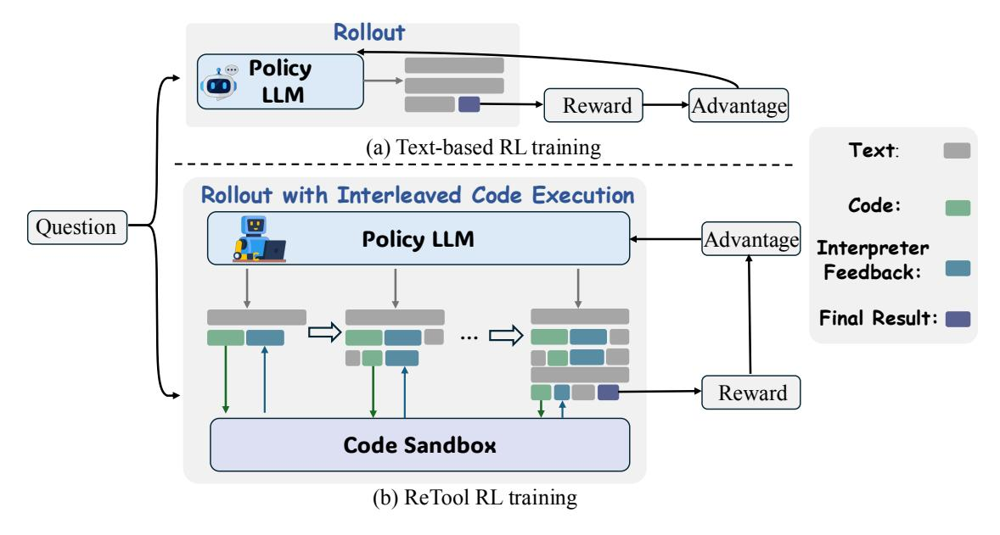

# **2 Methodology**

In this section, we introduce ReTool, a CI-powered RL framework designed to address math problem-solving tasks. We begin with an overview of ReTool. Next, we describe our cold-start training, including the data construction pipeline and supervised fine-tuning [\(section 2.2\)](#page-2-0). We then outline our reinforcement learning pipeline, enhanced by a code interpreter sandbox, to further enhance strategic tool usage development [\(section 2.3\)](#page-2-1).

#### **2.1 Overview**

Our methodology consists of two primary stages: cold-start supervised fine-tuning followed by reinforcement learning with interleaved code execution rollout. Firstly, we collect data through our designed pipeline for cold-start supervised fine-tuning (SFT), which provides a robust initialization for the reinforcement learning phase. To enhance our model's tool utilization capabilities, we introduce a specialized tool-using reinforcement learning pipeline that enhances the model's ability to appropriately select and apply tools during the reasoning process.

### **2.2 Cold-start for Tool-Integrated Reasoning Foundation**

We designed a pipeline for collecting and curating high-quality data. Specifically, we begin by gathering existing mathematical reasoning data from diverse sources, including open-source datasets such as Open-Thoughts [\[22\]](#page-12-6). Subsequently, we implement a dual-verification approach combining human expert curation and Deepseek-R1 [\[4\]](#page-10-2) evaluation to filter invalid data. Through these steps, we collect a high-quality text-based reasoning dataset, denoted as Dinit.

Based on Dinit, we further construct code-integrated reasoning data in an automatic manner. We first utilize a structured prompt template (detailed in Figure [8\)](#page-15-0) for transformation, which modifies the original thinking process by replacing manual calculation steps that can benefit from code execution with the corresponding code snippets and their interpreter's execution results. Following this initial transformation, we apply a two-stage verification protocol. The first stage focuses on format verification, which improves readability and ensures consistent syntax that that enables the efficient detection of computational tool invocation triggers during subsequent reinforcement learning phases. The second stage entails answer verification, where we eliminate data samples whose final outputs do not align with the correct solutions to the mathematical problems. Finally, we collect a dataset DCI that consist of code-augmented long-form reasoning traces.

ReTool employs supervised fine-tuning to learn when and how to invoke the code interpreter from the aforementioned dataset DCI, thereby enhancing the model's capability to appropriately utilize computational tools.

> **[图片提取文字 (无描述)]:**
> Rollout **Policy** LLM Advantage Reward (a) Text-based RL training Text: Rollout with Interleaved Code Execution Code: Question Advantage **Policy LLM** Interpreter Feedback: Final Result: | Reward Code Sandbox (b) ReTool RL training

**Figure 2** Demonstration of text-based RL training process and ReTool's RL training process.

### **2.3 ReTool: Reinforcement Learning for Strategic Tool Use**

#### **2.3.1 Training Algorithm**

We train ReTool based on PPO algorithm [\[16\]](#page-11-2), it updates policy with the following objective:

$$\mathcal{J}_{\text{PPO}}(\theta) = \mathbb{E}_{(q,a) \sim \mathcal{D}, o \leq t} \sim \pi_{\theta_{\text{old}}}(\cdot|q)} \left[ \min \left( \frac{\pi_{\theta}(o_t \mid q, o < t; \mathcal{CI})}{\pi_{\theta_{\text{old}}}(o_t \mid q, o < t; \mathcal{CI})} \hat{A}_t, \operatorname{clip} \left( \frac{\pi_{\theta}(o_t \mid q, o < t; \mathcal{CI})}{\pi_{\theta_{\text{old}}}(o_t \mid q, o < t; \mathcal{CI})}, 1 - \varepsilon, 1 + \varepsilon \right) \hat{A}_t \right) \right], (1)$$

where *πθ* is policy model, *πθ*old is reference model, *πθ*(*ot* | *q, o<t*; CI) represents the rollouts with interleaved code execution and feedback from code interpreter.

We modify PPO to better adopt tool integrated reasoning. During training, the policy LLM will collaborate with a code sandbox to generate rollouts with multi-turn real-time code execution for solving given problems. We implement a rule-based outcome reward to enable the model with the flexibility to autonomously explore and develop strategies for code usage awareness, code selection, timing of code invocation, and further diverse behaviors.

**Reward Design** To teach the model in learning when and how to invoke tools, we implement a rule-based accuracy reward to optimize the model. The accuracy reward evaluates response correctness. We require the model to present final answers in a specified format (e.g., within \boxed{}), enabling reliable rule-based verification. The reward is formulated as:

$$R(a, \hat{a}) = \begin{cases} 1, & \text{is\_equivalent}(a, \hat{a}) \\ -1, & \text{otherwise} \end{cases}$$
 (2)

where *a* and *a*ˆ represent the ground-truth answer and the predicted answer, respectively. We simplify the reward design aim to alleviate reward hacking and promote more diverse problem-solving behaviors based on mere outcome feedback without considering code executability reward.

**Rollout with Interleaved Code Execution** To facilitate the integration of reasoning and executable code within the model, we propose a rollout approach that dynamically supports interleaved real-time code execution with natural language reasoning processes. As depicted in Figure [2](#page-3-0) (b), our rollout process differs from the conventional approach, which typically generates only text-based reasoning (as shown in Figure [2](#page-3-0) (a)). By contrast, our rollout approach integrates the collaboration of a policy LLM with an external code sandbox, enabling the production of hybrid content that combines text, code snippets, and real-time interpreter

feedback. Concretely, we utilize a prompt template (Figure [7\)](#page-14-0) to guide the model in interacting with the code sandbox by utilizing tags <code></code> to explicitly mark the boundaries of generated codes. During the rollout process, policy model generate text-based reasoning *t*1 when a code termination trigger (</code>) is detected, the generation pause and the generated code *c*1 is parsed and send to code sandbox environment for execution. Upon completion, the sandbox's output *f*1 (successful results or error messages) is filled within <interpreter></interpreter> tags and fed back to the model, which continues generating the rollout until either providing a final answer *o* or producing a new code snippet, ultimately producing a hybrid reasoning trajectory [*t*1 ⊕ *c*1 ⊕ *f*1 ⊕ *...* ⊕ *o*].

Notably, our approach returns both successful code execution results and interpreter error messages to the model. This dynamic feedback mechanism enables the model to iteratively explore, refine, and optimize its reasoning and tool usage strategies.

#### **2.3.2 Training Details**

**Cold-start & RL** For training, we employ the VeRL framework[1](#page-4-0) . We adopt PPO as our RL method. We train our model on curated cold-start data for two epochs. Regarding hyperparameters, we utilize the AdamW optimizer with an initial learning rate of 1e-6. We define the expected maximum sequence length as 16384 tokens. For training, the mini-batch size is set to 512, and the KL coefficient is set to 0.0. We use Qwen2.5-32B-Instruct [\[15\]](#page-11-3) as the main backbone.

**Interpreter Feedback Mask.** We mask out the <interpreter></interpreter> feedback output from the loss computation. This sandbox-based output masking approach blocks external tokens from interfering with loss calculations, ensuring training stability and preserving the model's inherently generated coherent reasoning sequences from disruption.

**KV-Cache Reuse.** In order to reduce the memory cost during rollout, when each time the code termination trigger (</code>) is detected, we will cache all the KV-cache before code execution and only calculate and append the KV-cache from the interpreter feedback (<interpreter></interpreter>). This will largely reduce the KV-cache for each rollout.

**Sandbox Construction.** To accelerate the RL training process, we design a asynchornous code sandbox environment. The sandbox pods function as workers in a pool, independently pulling tasks based on their current capacity, creating an efficient load-balancing mechanism. This distributed asynchronous approach accelerates RL training by enabling parallel environment interactions across multiple threads, It prevents slower threads from creating bottlenecks and ensures optimal resource utilization, maintaining continuous throughput during the training process.

