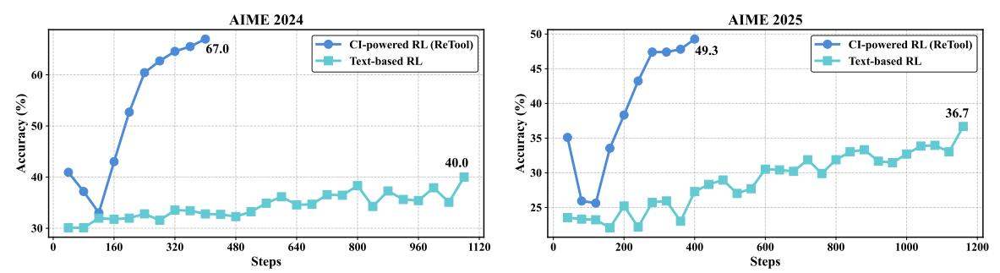

# ReTool: Reinforcement Learning for Strategic Tool Use in LLMs

Jiazhan Feng\*, Shijue Huang\*, Xingwei Qu, Ge Zhang, Yujia Qin, Baoquan Zhong, Chengquan Jiang, Jinxin Chi, Wanjun Zhong†

#### **ByteDance Seed**

\*Co-first authors, †Corresponding author

### **Abstract**

While reasoning models (e.g., DeepSeek R1) trained with reinforcement learning (RL), excel in textual reasoning, they struggle in scenarios requiring structured problem-solving, such as geometric reasoning, concise computation, or complex equation solving—areas where computational tools like code interpreters (CI) demonstrate distinct advantages. To bridge this gap, we propose **ReTool**, which enhances long-form reasoning with tool-integrated learning, including two key features: (1) dynamic interleaving of real-time code execution within natural language reasoning processes, and (2) an automated RL paradigm that allows policy rollouts with multi-turn real-time code execution and teaches the model in learning when and how to invoke tools based on outcome feedback. ReTool employs a systematic training framework, beginning with synthetic cold-start data generation to produce code-augmented long-form reasoning traces for fine-tuning base models. Subsequent RL training leverages task outcomes as rewards to iteratively refine the model's tool use strategy, enabling autonomous discovery of optimal tool invocation patterns without human priors. Experiments on the challenging MATH Olympiad benchmark AIME demonstrate ReTool's superiority: Our 32B model achieves 67% accuracy with 400 training steps, outperforming text-based RL baseline (40% accuracy, 1080 steps) in efficiency and performance. Remarkably, ReTool-32B attains 72.5% accuracy in extended settings, surpassing OpenAI's o1-preview by 27.9%. Further analysis reveals emergent behaviors such as code self-correction, signaling an "aha moment" in which the model autonomously masters adaptive tool use. These findings highlight the promise of outcome-driven tool integration for advancing complex mathematical reasoning and offer new insights into hybrid neuro-symbolic systems.

**Date:** April 15, 2025

Project Page: https://retool-rl.github.io/

> **[图片提取文字 (无描述)]:**
> **AIME 2024 AIME 2025** CI-powered RL (ReTool) -- CI-powered RL (ReTool) --- Text-based RL Text-based RL 40.0 25 -

Figure 1 AIME 2024 & 2025 scores of ReTool and text-based RL baseline on the Qwen2.5-32B-Instruct model.

## **1 Introduction**

Reinforcement learning (RL) has recently become a popular paradigm for enhancing the reasoning capabilities of large language models (LLMs), enabling them to explore and refine long chains of thought (CoT) [\[9,](#page-10-0) [26,](#page-12-0) [32,](#page-13-0) [34\]](#page-13-1). Reasoning models such as OpenAI o1 [\[12\]](#page-10-1) and DeepSeek R1 [\[4\]](#page-10-2) demonstrate strong performance in pure textbased reasoning tasks by learning to self-correct and engage in more deliberate, analytical thinking [\[3,](#page-10-3) [20,](#page-12-1) [23\]](#page-12-2). These advances suggest early signs of metacognitive control, where models not only reason, but also monitor and revise their reasoning process.

Despite these advances, reasoning LLMs equipped with long chains of textual reasoning processes [\[13\]](#page-11-0) still show notable limitations in tasks that require precise numerical calculation or symbolic manipulation, such as geometric reasoning, precise computation, or complex equation solving. In contrast, computational tools, such as code interpreters (CI), can empower models with symbolic computation capabilities that go far beyond pure text-based reasoning. Unlike textual CoT [\[27\]](#page-12-3) methods that rely solely on internal language patterns, code interpreters provide a formal and executable interface for enumeration, verification, and precise computation. This not only enables exact numeric validation of intermediate steps—dramatically reducing the ambiguity and compounding error often seen in textual reasoning [\[1,](#page-10-4) [25\]](#page-12-4), but also allows models to expand their solution search space via programmable exploration.

Recent works have explored prompting and supervised fine-tuning methods [\[2,](#page-10-5) [14\]](#page-11-1) to equip LLMs with tool-use capabilities. However, these approaches are limited to imitating the specifically-curated data distribution, often failing to generalize beyond seen patterns or adaptively decide when and how to invoke external tools. As a result, models may misuse tools or fall back on brittle heuristics that are not robust across diverse problem settings. To overcome these limitations, RL offers a principled solution: it enables models to explore flexible reasoning trajectories and learn tool-use strategies guided by outcome-based feedback. This paradigm not only incentivizes correct solutions, but also allows the model to discover nuanced behavioral patterns—such as how to recover from tool execution mistakes via self-correction, decide when to effectively invoke tool execution during the long-chain reasoning process.

In this work, we embrace the RL paradigm and introduce **ReTool**, a **Tool**-augmented **Re**inforcement learning framework explicitly designed to guide LLMs towards optimal strategies for leveraging external computational tools during reasoning. ReTool consists of two key components: First, we develop a data construction pipeline to curate a high-quality cold-start dataset that explicitly demonstrates when and how to invoke the code interpreter. This teaches the model an initial competency in tool usage and execution result analysis. Then, we apply tool-enhanced reinforcement learning to train the model in discovering the optimal tool manipulation reasoning strategy and adjusting its behavior through outcome-based rewards, going beyond what can be captured by supervised learning alone. During long-chain reasoning, the policy model rolls out by flexibly writing code blocks and achieving real-time execution results from a sandbox-style code interpreter to assist subsequent thinking.

We evaluate ReTool on the challenging MATH Olympiad benchmarks AIME2024 and AIME2025. Building on Qwen2.5-32B-Instruct [\[30\]](#page-12-5), our model achieves 67.0% accuracy on AIME2024 with only 400 training steps, significantly outperforming the text-based RL baseline, which achieves 40.0% accuracy with 1080 training steps. These substantial gains highlight that explicitly modeling tool-use as part of the decision process not only pushes the limits of model reasoning but also enhances training efficiency. Furthermore, when trained on DeepSeek-R1-Distill-Qwen-32B [\[4\]](#page-10-2), our model demonstrates further improvements, surpassing competitive baselines such as QwQ-32B-Preview [\[23\]](#page-12-2), s1-32B [\[10\]](#page-10-6), and OpenAI o1-preview [\[11\]](#page-10-7). This suggests that the RL training process inspires more efficient problem-solving strategies. Additionally, our cold-start model based on Qwen2.5-32B-Instruct achieves an accuracy of 40.9% on AIME2024, comparable to the text-based RL baseline based on same backbone (40.0%), and significantly surpasses the non-trained Qwen2.5-32B-Instruct (26.7%). These results demonstrate that our curated dataset effectively captures tool usage patterns within executable reasoning traces, and that CI-integrated training positively contributes to reasoning performance.

We further conduct a comprehensive analysis of CI cognitive behavior through RL training and identify several key findings. Our model demonstrates enhanced code utilization capabilities, enabling it to employ more accurate and complex code snippets; It also learns to invoke tools appropriately, select tool adaptively, structure tool calls effectively, and iteratively refine reasoning through emergent code self-correction capabilities.

#### **Our main contributions are summarized as follows:**

- 1. We propose **ReTool**, a novel reinforcement learning framework that integrates code interpreter execution into the reasoning loop of LLMs. To equip the model with foundational capabilities for invoking the code interpreter, we curate a high-quality cold-start dataset through our developed pipeline. Furthermore, we design a reinforcement learning framework that supports interleaved code execution during rollout, enabling the model to iteratively explore, refine, and optimize its reasoning strategies through toolaugmented interactions guided by feedback from a sandboxed code interpreter.
- 2. As shown in [section 3.3,](#page-5-0) we conduct comprehensive empirical and behavioral analyses, and observe several key findings: (1) After RL training, the response length is reduced by approximately 40% compared to that prior to training, showcasing the potential reasoning token efficiency of CI-powered reasoning; (2) During RL training, the code ratio, code lines and correct code counts show increase trends, and the code invocation timing becoming shifts earlier, indicating the improved code use capabilities and strategic tool usage development; (3) Emergent behaviors like code self-correction and adaptive tool selection can be observed during RL phase, bringing more advanced tool-augmented reasoning patterns.

