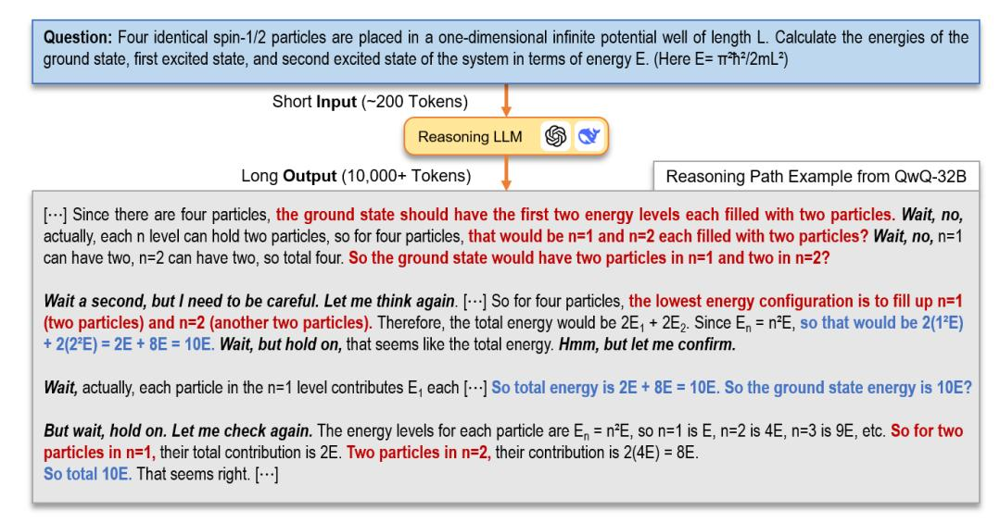
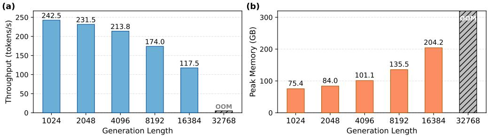
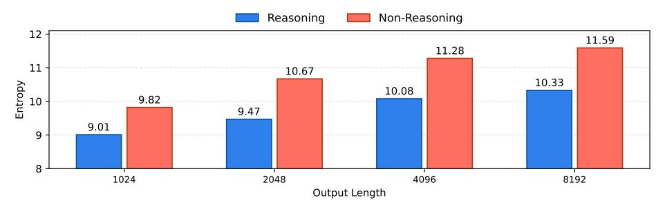
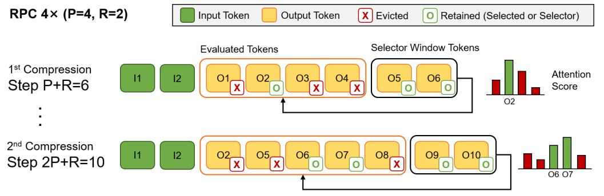
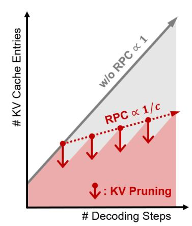
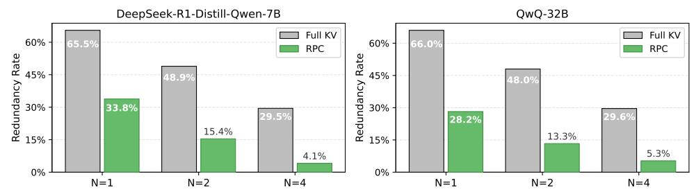
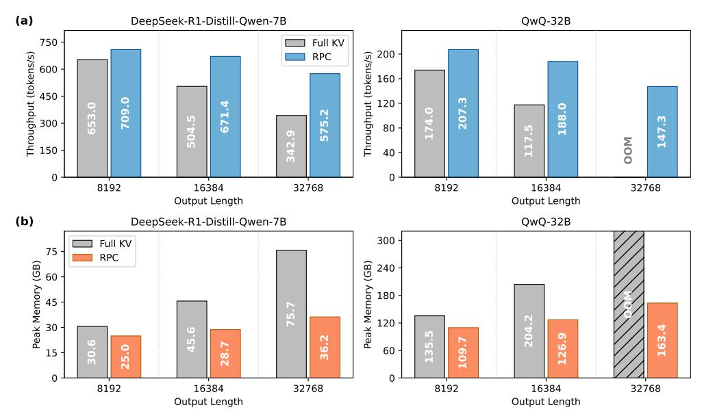
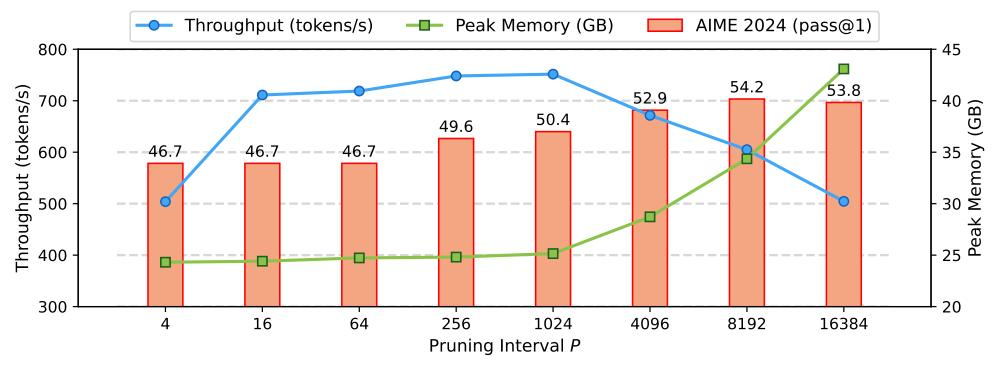

# 1 Introduction

Large language models (LLMs) equipped with reasoning capabilities have expanded the application of LLMs beyond simple natural language processing tasks to complex problem-solving tasks such as Science, Technology, Engineering, and Mathematics (STEM) reasoning and code generation. Early reasoning approaches primarily focused on guiding LLMs through explicit step-by-step logic to facilitate more interpretable and accurate outcomes [\[1\]](#page-9-0). Recently, advanced reasoning LLMs, such as OpenAI o1 [\[2\]](#page-9-1), DeepSeek-R1 [\[3\]](#page-9-2), adopted the concept of *test-time compute scaling* [\[4,](#page-9-3) [5\]](#page-9-4). This method involves generating longer, iterative reasoning outputs, which significantly enhance accuracy. Such iterative generation allows models to carefully evaluate intermediate reasoning steps, refine outputs through internal reflection, and ultimately handle tasks requiring complex reasoning.

Though reasoning LLMs have been widely adopted due to their ability to handle complex tasks through complicated reasoning processes, reasoning LLMs face challenges in inference efficiency due to their tendency to generate long reasoning sequences. The long token sequences required for detailed reasoning processes substantially increase the KV cache overhead during inference. For example, the reasoning path of OpenAI's o3-mini-high can exceed 50K tokens [\[6\]](#page-9-5), and Claude 3.7 Sonnet [\[7\]](#page-9-6) supports reasoning sequences of up to 64K tokens. Such a long token generation imposes critical memory and computational overhead, significantly slowing down inference. Consequently, it is crucial to develop KV cache compression techniques to mitigate these inference efficiency issues and support practical deployment of reasoning LLMs.

<sup>∗</sup>Corresponding Author

<span id="page-1-0"></span>> **[图片提取文字 (无描述)]:**
> Question: Four identical spin-1/2 particles are placed in a one-dimensional infinite potential well of length L. Calculate the energies of the ground state, first excited state, and second excited state of the system in terms of energy E. (Here  $E = \pi^2 h^2 / 2mL^2$ ) Short Input (~200 Tokens) (S) (V) Reasoning LLM Long Output (10,000+ Tokens) Reasoning Path Example from QwQ-32B [···] Since there are four particles, the ground state should have the first two energy levels each filled with two particles. Wait, no, actually, each n level can hold two particles, so for four particles, that would be n=1 and n=2 each filled with two particles? Wait, no, n=1 can have two, n=2 can have two, so total four. So the ground state would have two particles in n=1 and two in n=2? Wait a second, but I need to be careful. Let me think again. [...] So for four particles, the lowest energy configuration is to fill up n=1 (two particles) and n=2 (another two particles). Therefore, the total energy would be  $2E_1 + 2E_2$ . Since  $E_n = n^2E$ , so that would be  $2(1^2E)$ + 2(2°E) = 2E + 8E = 10E. Wait, but hold on, that seems like the total energy. Hmm, but let me confirm. Wait, actually, each particle in the n=1 level contributes E₁ each [···] So total energy is 2E + 8E = 10E. So the ground state energy is 10E? But wait, hold on. Let me check again. The energy levels for each particle are E<sub>n</sub> = n<sup>2</sup>E, so n=1 is E, n=2 is 4E, n=3 is 9E, etc. So for two particles in n=1, their total contribution is 2E. Two particles in n=2, their contribution is 2(4E) = 8E. So total 10E. That seems right. [...]


Figure 1: Example of a reasoning path of a reasoning LLM. Redundant reasoning steps (e.g., repeated checks and re-derivations) are visually highlighted, illustrating the semantic sparsity that motivates our compression method. The parts highlighted in the same color are semantically identical.

Although there are several existing works on compressing KV cache for long sequences [\[8,](#page-9-7) [9,](#page-9-8) [10,](#page-10-0) [11\]](#page-10-1), these works primarily focus on efficient handling of long input prompts. In contrast, the problem of efficiently managing the KV cache for long generated sequences has received limited attention. Unlike input prompts, whose importance can be easily assessed at prefill stage [\[8\]](#page-9-7), generated tokens pose a challenge because their future relevance is often unpredictable. As a token seemingly insignificant at one point might become crucial later, naively discarding such tokens can substantially degrade model accuracy.

However, as illustrated in Figure [1,](#page-1-0) we observe that sequences generated during reasoning processes exhibit distinct properties compared to sequences generated in conventional LLM decoding. Specifically, reasoning sequences frequently revisit previous cases or repeat similar logic, so they have low information density relative to their length. We refer to this phenomenon as the *semantic sparsity* of reasoning paths. This sparsity highlights the inefficiency of retaining all KV entries and the possibility to selectively remove KV cache corresponding to less important tokens without disrupting the overall reasoning process.

Motivated by this observation, we propose Reasoning Path Compression (RPC), a method for accelerating inference in reasoning LLMs by compressing the KV cache associated with explicit thinking tokens. RPC compresses KV cache periodically during decoding, significantly reducing overhead compared to previous step-wise compression techniques which compress KV cache at each decoding step. At each compression interval, it estimates token importance based on attention allocation over a recent window and retains only the top-ranked entries according to a fixed compression ratio. This design preserves recent context while discarding low-impact KV entries, mitigating performance degradation. By applying RPC to QwQ-32B [\[12\]](#page-10-2), we reduce the KV cache size of generated tokens by up to 75%, and improve decoding throughput by up to 1.60×, while keeping the pass@1 drop on the AIME 2024 [\[13\]](#page-10-3) dataset within 1.2% compared to the inference with full KV cache.

### 2 Background

### 2.1 Reasoning LLMs

Reasoning LLMs solve problems by generating explicit intermediate steps, known as reasoning paths, instead of directly producing an answer [\[2,](#page-9-1) [3,](#page-9-2) [12,](#page-10-2) [14\]](#page-10-4). This behavior is reinforced by the way such models are trained: reasoning LLMs are typically fine-tuned with reinforcement learning objectives that reward correct answers after multi-step inference, thereby encouraging longer generations. Consequently, the lengths of generated sequences increase as training progresses [\[15\]](#page-10-5). Allocating up to 32K tokens for explicit reasoning has yielded steady accuracy gains across complex reasoning

<span id="page-2-0"></span>> **[图片提取文字 (无描述)]:**
> (b) (a) 242.5 250 300 231.5 213.8 200 204.2 174.0 200 150 -117.5 135.5 100 -101.1 84.0 100 -75.4 50 -MOO 1024 2048 4096 8192 16384 32768 1024 2048 4096 8192 16384 32768 Generation Length Generation Length


Figure 2: (a) Token generation throughput and (b) peak memory of QwQ-32B at different generation lengths. The results are evaluated on  $4 \times H100$  GPUs with batch size 16.

benchmarks without showing signs of plateau, raising expectations of further improvements with even larger thinking budgets [16]. Such extensive token generation significantly enlarges the KV cache, increasing memory usage and reducing inference throughput. As shown in Figure 2, generating sequences of 16K to 32K tokens dramatically reduces throughput while sharply increasing peak memory usage.

To mitigate the overhead of generating long reasoning paths, a large body of work has focused on training-based approaches that encourage reasoning LLMs to produce shorter sequences [17, 18, 19, 20, 21, 22], relatively few attempts have been made to improve reasoning efficiency at inference time [23]. These approaches utilize length-aware training objectives: either encouraging the generation of short sequences or introducing mechanisms to compress tokens into latent representations [24]. However, their effectiveness typically remains limited when applied to complex reasoning benchmarks widely used to evaluate modern reasoning LLMs (e.g. LiveCodeBench [25]). For example, although LightThinker [22] achieves competitive accuracy with shortened reasoning paths on relatively simpler reasoning tasks like MMLU [26] and BBH [27], our experimental results in Section 4.3 indicate a significant performance degradation when evaluated on more complex reasoning benchmarks. This discrepancy arises primarily due to the conflicting training objectives. The reasoning-oriented objectives aim to promote detailed reasoning steps, whereas the length-aware objectives encourage shorter outputs. Thus, effectively training reasoning LLMs to consistently produce shorter reasoning paths remains challenging.

#### 2.2 KV Cache Compression

The degradation of throughput and the increase in memory usage observed when processing long sequences with LLMs primarily result from growth in KV cache size. Thus, there are many attempts to directly compress the KV cache, but these works primarily focus on efficient handling of long input prompts. For example, SnapKV [8] and HeadKV [9] are specifically designed to compress KV cache associated with long input contexts. These methods do not address the compression of generated tokens produced in reasoning paths.

Other techniques like H2O [10] and TOVA [11] attempt to extend KV cache compression mechanisms to support basic levels of compression during generation. These methods maintain the KV cache within a predefined budget by evicting tokens whenever the cache reaches this size limit during decoding. However, their designs predominantly target scenarios involving long input sequences and relatively short outputs, they are effective when identifying and evicting less relevant input tokens is critical for efficient output generation. Hence, H2O and TOVA struggle to preserve accuracy when applied to reasoning LLMs (see Section 4.3). Moreover, while setting a fixed KV cache budget is straightforward in input-dominated scenarios, it is challenging to predefine cache budgets for reasoning LLMs, as they inherently produce long output sequences of varying lengths. Overall, there are currently no KV cache compression methods tailored to reasoning LLMs.

#### 3 Reasoning Path Compression

### 3.1 Motivation: Semantic Sparsity of Reasoning Paths

Reasoning LLMs do not directly generate the final answer. Instead, they produce reasoning paths, which often contain redundant segments offering little new information, such as repeated logical

<span id="page-3-0"></span>> **[图片提取文字 (无描述)]:**
> Reasoning Non-Reasoning 12 H 11.59 11.28 10.67 10.33 Entropy 10.08 9.82 9.47 9.01 9 8 1024 2048 4096 8192 Output Length


Figure 3: 3-gram Shannon entropy comparison between reasoning LLM and non-reasoning LLM.

steps or re-evaluations of previous generated reasoning. As previously presented in Figure [1,](#page-1-0) such redundancy is frequently observed in model-generated reasoning paths. Additional examples are provided in Appendix [A.](#page-12-0) We refer to this phenomenon, the presence of extended spans of generated tokens that are semantically redundant, as *semantic sparsity*. To quantify semantic sparsity, we compute the *n-gram Shannon entropy* using base-2 logarithm, defined as:

$$H_n = -\sum_{g \in \mathcal{G}_n} p(g) \log_2 p(g) \tag{1}$$

where G<sup>n</sup> denotes the set of all unique n-grams of length n, and p(g) is the empirical probability of each n-gram g.

To analyze semantic sparsity of reasoning paths, we compare the redundancy in sequences generated by conventional LLMs and reasoning LLMs. For this comparison, we use 3-gram entropy to measure phrase-level repetition and evaluate two models with identical architecture (LLaMA-3.1- 8B-Instruct [\[28\]](#page-10-18)): DeepSeek-R1-Distill-Llama-8B [\[3\]](#page-9-2), a reasoning-oriented model, is tested on AIME 2024 [\[13\]](#page-10-3), and LongWriter-8B [\[29\]](#page-10-19), tuned for long-form writing, is tested on a subset of HelloBench [\[30\]](#page-11-0) consisting of prompts that require generating outputs exceeding 8192 tokens.

As shown in Figure [3,](#page-3-0) DeepSeek-R1-Distill-Llama-8B consistently exhibits lower 3-gram entropy than LongWriter-8B across output lengths from 1024 to 8192 tokens. This indicates higher phraselevel repetition in reasoning paths compared to general long-form writing. These results provide quantitative evidence of semantic sparsity, suggesting that large portions of the reasoning trace can be compressed with minimal impact on overall coherence.

### 3.2 Overview of Reasoning Path Compression

We introduce *Reasoning Path Compression* (RPC), a KV cache compression framework tailored for reasoning LLMs (Figure [4\)](#page-3-1). RPC leverages the semantic sparsity inherent in reasoning paths to efficiently eliminate KV entries. The key insight motivating RPC is that reasoning LLMs generate explicit reasoning steps, and many of these reasoning steps lose relevance as reasoning process progress. Exploiting this observation, RPC periodically compresses redundant KV entries during

<span id="page-3-1"></span>> **[图片提取文字 (无描述)]:**
> RPC 4× (P=4, R=2) Input Token Output Token X Evicted Retained (Selected or Selector) Selector Window Tokens **Evaluated Tokens** 1<sup>st</sup> Compression Attention O3\_X 02\_ 04 05 06 Step P+R=6 Score 02 2<sup>nd</sup> Compression 07\_ 06 08\_ Step 2P+R=10 06 07


Figure 4: Illustration of RPC with compression interval P = 4, selector window R = 2, and compression ratio c = 4. At each compression step, recent R tokens are used to evaluate the importance of previously generated tokens.

token generation. Moreover, since recently generated tokens inherently rely on the context provided by preceding tokens, these recent tokens serve as essential indicators of contextual importance. Thus, RPC assesses the relevance of previously generated tokens by analyzing how strongly they are attended to by the most recent tokens, referred to as *selector window*. All compression decisions are made dynamically during inference based solely on attention-derived statistics. Hence, RPC does not require any model modification or additional training, and it is straightforward to integrate RPC into existing inference pipelines of reasoning LLMs.

#### 3.3 Periodic KV Cache Compression Dynamics of RPC

One of the unique features of RPC compared to other KV cache compression methods is its periodic approach to KV cache compression. The KV cache compression dynamics of RPC is controlled by two critical hyperparameters: the compression interval P, which represents how frequently KV cache compression is triggered, and the size of the selector window R, which denotes the number of recent tokens used to assess importance.

As illustrated in Figure 4, RPC waits for P+R tokens to be generated to start the first compression cycle. At this point, the importance of the initial set of P tokens is evaluated using the selector window composed of the most recent R tokens. Given a target compression ratio c, RPC retains only the top  $\frac{P}{c}$  tokens based on their importance scores. Subsequent compression cycles are triggered each time an additional P tokens have been generated.

It is important to note that during each periodic compression cycle, RPC evaluates a combined set comprising both tokens retained from the previous cycle and newly generated tokens, rather than compressing only newly generated ones. By jointly reassessing all these tokens at each cycle, RPC naturally allows outdated tokens to fade out as the reasoning path progresses. As a result, the reasoning context remains properly updated and relevant throughout the inference process, even after multiple cycles of KV cache compression.

Specifically, at the second compression cycle, the selector window, now updated to include the latest R tokens, evaluates the importance of the previously retained  $\frac{P}{c}$  tokens and the newly generated set of P tokens. Among these  $\frac{P}{c}+P$  tokens, RPC retains only the top  $\frac{2P}{c}$  tokens with the highest importance scores and discards the rest. Generalizing this procedure, at the N-th compression cycle, the total number of tokens evaluated with the selector window is  $\frac{(N-1)P}{c}+P$ .

<span id="page-4-0"></span>> **[图片提取文字 (无描述)]:**
> # KV Cache Entries MORPCO RPC × 1/c : KV Pruning # Decoding Steps


Figure 5: KV cache size with and without RPC.

RPC retains only the top  $\frac{NP}{c}$  tokens with the highest importance scores from this set. As selector tokens are always preserved, the total number of KV entries remaining after the N-th compression cycle is  $\frac{NP}{c}+R$ . As shown in Figure 5, this periodic compression effectively regulates the size of KV cache over time.

To fully leverage the advantages of periodic compression, the compression interval P must be carefully selected. A small P value may lead to accuracy degradation after compression, as the semantic context is too limited. On the other hand, a large P provides a broader semantic context for effective compression, while it introduces computational inefficiency and higher peak memory usage by delaying the compression. Given the significance of the compression interval P, an ablation study analyzing its impact and recommendations derived from the analysis are discussed in Section 4.5.

### 3.4 Important Token Selection with Selection Window

Another unique feature of RPC is the concept of the selector window used for selecting important tokens. Previous KV cache compression methods employ various strategies for calculating token importance. For example, SnapKV computes attention scores relative to the final tokens in the input prompt, based on the observation that the last segment of the input shows similar attention allocation pattern to the generation stage. H2O averages attention scores across all preceding tokens, and TOVA mimics RNN operations by reusing the attention scores calculated during token generation as gating

### Algorithm 1: Important token selection algorithm of RPC

```
Input: generation step t, query of step t q_t, KV cache C_{KV}, selector query cache C_{\mathcal{Q}}

Output: updated C_{KV}, updated C_{\mathcal{Q}}

// Cache selector queries\nif (t-R) \geq 0 and (t-R) \mod P < R then

\subseteq Append q_t to C_{\mathcal{Q}}

// Compress KV cache every P steps\nif (t-R) \geq 0 and (t-R) \mod P = 0 then

S \leftarrow Importance of tokens in C_{KV}; // Compute importance score C_{tmp} \leftarrow KV cache with top-\frac{N \cdot P}{c} importance scores; // Retain important KV cache C_{KV} \leftarrow C_{tmp} \cup C_{KV}[-R:]; // Retain KV cache of selector window C_{\mathcal{Q}} \leftarrow []; // Reset selector query cache
```

scores for the KV cache eviction. In contrast, RPC leverages the observation that recently generated tokens in reasoning paths represent logical outputs derived from preceding contexts. Therefore, attention scores relative to these recent tokens can effectively indicate the relevance of previously generated tokens.

The algorithm for selecting important tokens in RPC is presented in Algorithm 1. RPC evaluates token importance using attention scores aggregated across a selector window of the R most recent tokens and all attention heads. Then, to promote coherent token selection and reduce token-level noise, RPC applies local average pooling. Formally, the importance of each past token t at each layer is defined as:

Importance(t) = 
$$\frac{1}{2w+1} \frac{1}{R \cdot H} \sum_{i=-w}^{w} \sum_{r=1}^{R} \sum_{h=1}^{H} Attn_h^{\ell}(q_r, k_{t+i})$$
 (2)

Here,  $\operatorname{Attn}_h^\ell(q_r, k_{t+i})$  denotes the attention weight from the r-th selector token to token generated at t+i-th generation step at head h of layer  $\ell$ . The pooling window size w controls the smoothing level, encouraging contiguous retention of semantically related tokens. To eliminate redundant computations and efficiently compute these importance scores, RPC caches the query vectors of selector tokens.

The selector window size R determines how many recent tokens RPC uses to assess the importance of previously generated tokens. A smaller R may lead to unstable or noisy importance estimations, as scoring can be dominated by a limited number of tokens. In contrast, larger values of R increase memory overhead by requiring additional caching of query vector. Thus, choosing an appropriate value for R involves balancing the robustness in token scoring with computational overhead. A detailed ablation study and recommendation for optimal R values are provided in Section 4.5.

### 4 Experiments

#### 4.1 Experimental Setup

**Models and Datasets.** We evaluate RPC using two open-source reasoning LLMs with different model sizes: DeepSeek-R1-Distill-Qwen-7B with 7B parameters [3] and QwQ-32B with 32B parameters [12]. All outputs are generated using nucleus sampling with temperature = 0.6 and top-p = 0.95. For QwQ-32B, we additionally set top-k = 40 following the model's recommended decoding configuration. The maximum number of generated tokens is capped at 32768, following the default settings of tested models.

**Datasets.** Our evaluation covers three reasoning-intensive benchmarks: American Invitational Mathematics Examination (AIME) 2024 for mathematical reasoning, LiveCodeBench [25] for coding tasks, and IFEval [31] for instruction following. We sample k completions per instance to compute pass@1, where k = 8 for AIME 2024, k = 4 for LiveCodeBench, and k = 1 for IFEval, respectively.

<span id="page-6-1"></span>> **[图片提取文字 (无描述)]:**
> DeepSeek-R1-Distill-Qwen-7B QwQ-32B Full KV Full KV 60% 60% -66.0% 65.5% RPC RPC 45% -45% 48.0% Sedundano 30% 15% Redundan 30% -33.8% 30% -28.2% 15.4% 13.3% 15% 5.3% 4.1% 0% 0% N=1N=2N=4N=1N=2N=4


Figure 6: Redundancy rate comparison between full KV and RPC.

Table 1: Accuracy (%) comparison between baselines and RPC.

<span id="page-6-2"></span>

| Method                  | DeepSe                | ek-R1-Distill-Qwe         | en-7B              | QwQ-32B               |                           |                    |  |
|-------------------------|-----------------------|---------------------------|--------------------|-----------------------|---------------------------|--------------------|--|
|                         | AIME 2024<br>(pass@1) | LiveCodeBench<br>(pass@1) | IFEval<br>(pass@1) | AIME 2024<br>(pass@1) | LiveCodeBench<br>(pass@1) | IFEval<br>(pass@1) |  |
| Full KV Cache           | 55.5                  | 37.6                      | 55.1               | 79.5                  | 63.4                      | 83.9               |  |
| H2O                     | 42.5                  | 22.5                      | 51.8               | 75.0                  | 54.2                      | 74.3               |  |
| TOVA                    | 42.5                  | 21.5                      | 48.8               | 70.0                  | 43.8                      | 50.6               |  |
| LightThinker            | 6.7                   | 0.7                       | 25.1               | -                     | -                         | -                  |  |
| <b>RPC</b> $(P = 4096)$ | 52.9                  | 35.9                      | 56.6               | 78.3                  | 62.2                      | 82.6               |  |
| <b>RPC</b> $(P = 1024)$ | 50.4                  | 33.5                      | 57.3               | 78.3                  | 61.2                      | 81.7               |  |

Implementation Details. Our implementation uses FlashAttention-2 [32] as the attention kernel for all decoding layers and is built on top of HuggingFace Transformers v4.45 [33]. Unless otherwise specified, we use the following default RPC hyperparameters: We set the selector window size R to 32 and apply local pooling with window size w=3 for importance smoothing. The compression interval P is set to 1024 or 4096. The target compression ratio is set to  $4\times$  by default.

**Baselines.** We compare our proposed RPC with a training-based reasoning path compression method, LightThinker [22], and previous KV cache compression techniques, H2O [10] and TOVA [11]. To ensure a fair comparison with H2O and TOVA, we set their KV cache budgets to match the overall compression ratio (4×) of RPC. For each of the evaluation datasets, we profile the average generation length of the original reasoning LLMs with full KV caches, and allocate 25% of this average length as a fixed KV cache budget for all prompts within that dataset. Meanwhile, LightThinker does not offer direct control over the compression ratio, so we measure its effective compression ratio after inference.

#### <span id="page-6-3"></span>4.2 Redundancy Reduction

We quantitatively evaluate the redundancy-reducing effect of RPC using an embedding-based similarity analysis. For each model, we generate outputs on the AIME 2024 dataset using both the full KV baseline and RPC. The generated outputs are segmented into sentences and pairwise cosine similarities are computed between all sentence embeddings within the same output. Two sentences are considered semantically similar if their cosine similarity exceeds 0.75. We define the *redundancy rate* as the proportion of sentences that have more than N semantically similar counterparts within the same output, where  $N \in \{1, 2, 4\}$ .

As shown in Figure 6, the redundancy rate significantly decreases after applying RPC, across all models. Specifically, the proportion of semantically repetitive sentences (i.e., N=1) is reduced by nearly half, and the gap widens for higher redundancy thresholds (N=2,4). This indicates that RPC not only removes verbatim repetitions but also suppresses subtle paraphrased duplications that frequently appear in reasoning trajectories. These results provide strong evidence that RPC effectively leverages semantic sparsity to maintain concise yet coherent reasoning sequences.

Additional details of the embedding-based redundancy analysis and visualized examples of RPC's token selection are provided in Appendix B.

### <span id="page-6-0"></span>4.3 Accuracy Evaluation

Table 1 compares the accuracy between RPC and the baseline methods. LightThinker, a training-based reasoning path compression approach, shows the lowest accuracy across all benchmarks despite

<span id="page-7-0"></span>> **[图片提取文字 (无描述)]:**
> (a) DeepSeek-R1-Distill-Qwen-7B QwQ-32B Full KV 750 200 Throughput (tokens/s) Throughput (tokens/s) RPC 600 160 450 709.0 207.3 120 671.4 653.0 188.0 575.2 504.5 147.3 300 80 117.5 42.9 MOO 150 40 0 0 8192 16384 32768 8192 16384 32768 Output Length Output Length (b) DeepSeek-R1-Distill-Qwen-7B QwQ-32B 300 Full KV 75 **RPC** Peak Memory (GB) Peak Memory (GB) 240 60 180 75.7 204.2 120 30 45.6 163.4 6.9 36.2 109.7 135. 28.7 60 15 0 0 16384 32768 8192 16384 32768 8192 Output Length Output Length


Figure 7: (a) Throughput (tokens/s) and (b) peak memory usage (GB) comparison between RPC (P=4096) and full KV cache inference.

operating with mild compression ratio  $(1.49\times, 1.41\times, 1.57\times$  for AIME 2024, LiveCodeBench, IFEval, respectively). This result highlights the limited effectiveness of length-aware training approaches for reasoning LLMs.

Other KV cache compression baselines, such as H2O and TOVA, achieve higher accuracy than LightThinker but still exhibit a significant gap compared to full KV inference. Moreover, their requirement of a predefined KV cache budget limits applicability in real-world scenarios where the total generation length cannot be known in advance.

In contrast, RPC achieves accuracy comparable to full KV inference without any additional training or prior knowledge of the output length. With a compression interval of P=4096, RPC successfully limits the accuracy drop to within 2.6% for DeepSeek-R1-Distill-Qwen-7B and 1.2% for QwQ-32B on AIME 2024. A shorter interval (P=1024) slightly reduces accuracy while providing stronger compression and efficiency. Therefore, careful selection of P is important, and we provide an ablation study analyzing its impact in Section 4.5.

### 4.4 Efficiency Evaluation

We evaluate the efficiency of RPC in terms of token-generation throughput and peak memory usage. All experiments are conducted using an input prompt with 128 tokens and measure throughput for generating sequences of 8192, 16384, 32768 tokens, with a batch size of 16. The compression interval P is set to 4096. Throughput and memory measurements for DeepSeek-R1-Distill-Qwen-7B are obtained on a single NVIDIA H100 SXM GPU, while QwQ-32B evaluations are conducted on four H100 SXM GPUs. Figure 7 presents the throughput and peak memory improvements achieved by RPC relative to the original models with full KV cache. Additional analyses on the efficiency are also provided in Appendix C.3.

**Throughput.** As shown in Figure 7(a), RPC consistently improves token generation throughput with particularly large gains observed for long generation length (e.g. 32768 tokens), a scenario commonly encountered with reasoning LLMs. RPC achieves  $1.68 \times$  throughput improvement when generating 32768 tokens with DeepSeek-R1-Distill-Qwen-7B, and  $1.60 \times$  throughput improvement when generating 16384 tokens with QwQ-32B. Notably, QwQ-32B with full KV cache cannot handle reasoning tasks with generation lengths of 32768 tokens as it runs out of memory. However, RPC successfully enables token generation at this length.

**Memory Consumption.** As shown in Figure 7(b), RPC effectively reduces peak memory usage by periodically compressing the KV cache. Since peak memory usage includes contributions from model parameters, intermediate activations, and the KV cache, the reduction in peak memory is not

<span id="page-8-1"></span>> **[图片提取文字 (无描述)]:**
> AIME 2024 (pass@1) Throughput (tokens/s) Peak Memory (GB) 800 45 54.2 53.8 (tokens/s) 52.9 <sup>40</sup> (89) 700 50.4 49.6 600 46.7 46.7 46.7 35 ≧ Men 20 500 Peak Ak 400 300 20 16 64 256 1024 4096 8192 16384 Pruning Interval P


Figure 8: Effect of compression interval P on accuracy, throughput, and peak memory.

directly proportional to the KV cache compression ratio. Nevertheless, as the KV cache becomes the dominant factor in peak memory usage for longer generation lengths, RPC provides increasingly substantial memory savings as generation length grows. For DeepSeek-R1-Distill-Qwen-7B, RPC reduces peak memory usage from 75.7GB to 36.2GB when generating 32768 tokens, thereby RPC achieves over 50% memory reduction. Similarly, for QwQ-32B, RPC reduces the overall memory requirement by over 50%, thereby resolving the out-of-memory issue for the generation of 32768 tokens. These results demonstrate that RPC effectively mitigates the memory bottleneck inherent in long-sequence generation of reasoning LLMs by compressing KV cache.

#### <span id="page-8-0"></span>4.5 Ablation Studies

To better understand the effect of key hyperparameters in RPC, we perform ablation studies on DeepSeek-R1-Distill-Qwen-7B using the AIME 2024 dataset. We analyze two critical components: the compression interval P, which determines how often KV-cache compression is applied, and the selector window size R, which controls the number of recent tokens used for attention-based importance scoring.

Compression Interval. We evaluate compression interval P from 4 to 16384 to examine the trade-off between compression interval, reasoning accuracy, and inference efficiency (throughput and peak memory). As shown in Figure 8, reasoning accuracy improves as P increases. It indicates that overly frequent compression can disrupt the reasoning process by prematurely evicting tokens critical for subsequent reasoning steps. However, when P becomes excessively large (e.g. P=8192), throughput declines and peak memory usage rises significantly, as large P delays the KV cache compression. Therefore, selecting an appropriate P value is essential to balance accuracy preservation and efficiency gains. Here, the configurations P=4096 and P=1024 represent practical choices that offer strong balance between performance and efficiency in reasoning-intensive scenarios.

Table 2: Effect of selector window size R.

<span id="page-8-2"></span>

| $\overline{P}$ | Metric                                                          | R = 1                   | 8                       | 32                       | 128                     |
|----------------|-----------------------------------------------------------------|-------------------------|-------------------------|--------------------------|-------------------------|
| 4096           | AIME 2024 (pass@1)<br>Throughput (tokens/s)<br>Peak Memory (GB) | 49.2<br>662.54<br>28.72 | 48.3<br>662.84<br>28.72 | <b>52.9</b> 671.38 28.72 | 49.2<br>673.26<br>29.38 |
| 1024           | AIME 2024 (pass@1)<br>Throughput (tokens/s)<br>Peak Memory (GB) | 45.8<br>746.21<br>24.62 | 49.2<br>745.08<br>24.62 | <b>50.4</b> 751.69 25.15 | 50.0<br>742.46<br>27.37 |

**Selector Window Size.** We evaluate the impact of the selector window size R on the RPC algorithm by evaluating  $R \in \{1, 8, 32, 128\}$ . As shown in Table 2, small R values such as 1 and 8 yield relatively low accuracy (e.g. below 50% with P=4096), because small R values can result in unstable selection of semantically critical tokens. This effect is more pronounced for P=1024 than P=4096, as tokens are evicted more frequently with smaller P. Therefore, R must be sufficiently large to ensure robust importance estimation. However, excessively large R (e.g. 128) can negatively impact accuracy, as older selector tokens may not reflect the current reasoning context effectively. Because varying R has only marginal effects on throughput and peak memory usage, accuracy is

the primary consideration when selecting R. Based on our results, R = 32 is the best choice as it provides the highest accuracy.

### 5 Conclusion

We introduce Reasoning Path Compression (RPC) for compressing KV cache of reasoning LLMs. We observe that reasoning paths often contain redundant segments and inherent semantic sparsity. RPC leverages this characteristic by periodically compressing the KV cache and employs an importance scoring mechanism based on a selector window composed of recent queries. As RPC does not require any additional training or model modifications, it can be applied to a broad range of reasoning LLMs. Experimental results demonstrate that RPC compress the KV cache by 4× with accuracy degradation limited to 1.2%. This aggressive KV cache compression results in up to 1.60× throughput improvement. Moreover, RPC successfully resolves the out-of-memory issue encountered by large reasoning models with 32B parameters when generating long reasoning paths of up to 32K tokens, by achieving over 50% reduction of overall memory requirement.

