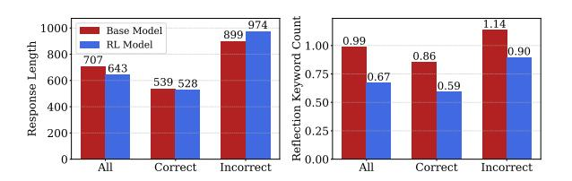

# 5 Comparison of Model Responses Before & After RLVR

RLVR causes the model to increase the probability of generating correct answers it could already generate, but does not enable it to solve previously unsolvable questions. This naturally leads us to the following question: *Can we replicate RLVR's effect by directly nudging the model toward its own correct responses—that is, through self-distillation? And if not, why?*

#### 5.1 Self-Distillation Experiments

| Setup             | Train Acc (%) | Test Acc (%) |
|-------------------|---------------|--------------|
| 1) Base           | 64.0          | 62.6         |
| 2) Base ← Base | 74.7 (+10.7)  | 63.4 (+0.8)  |
| 3) RL             | 80.9          | 74.8         |
| ← 4) RL RL  | 84.4 (+3.5)   | 74.4 (-0.4)  |
| 5) Base ← RL   | 80.5 (+16.5)  | 74.2 (+11.6) |

Table 1: Self-distillation results for the Qwen2.5-1.5B-Math base model and its RLVR-trained variant. The notation A ← B indicates the student model A is trained on responses from the teacher model B. Values in parentheses show gains over the student model with distillation.

To explore this question, we perform selfdistillation with rejection sampling, following approaches similar to STaR [\(Zelikman et al.,](#page-11-4) [2022\)](#page-11-4) and ReST [\(Gulcehre et al.,](#page-9-16) [2023\)](#page-9-16)—that is, we conduct SFT on the model's own correct responses. Recall that, we collected 256 responses per training question from the base model in Section 4. From these, we select up to 8 correct responses for each question (using all available correct ones if fewer than 8 exist) and conduct SFT using this filtered dataset. Additionally, to test whether self-distillation can also further improve the RLVR-trained model, we apply the same self-distillation process to the RL model. We conduct this experiment for both Qwen2.5-1.5B-Math and Qwen2.5-3B, but present only the 1.5B results here due to space constraints. The 3B results show similar trends and are provided in Appendix A.5.

We find that self-distillation fails to replicate the effect of RLVR. As shown in Table 1 (lines 1-2), distilling the base model using its own correct responses yields a train accuracy of 74.7%, a 10.7-point increase. However, test accuracy rises only modestly to 63.4%, a 0.8-point gain over the base model's 62.6% and significantly below the RL model's 74.8%. Similarly, from lines 3-4 we observe self-distillation of the RL model leads to no gain on the test set (74.8% to 74.4%), despite notable rises in training accuracy (80.9% to 84.4%).

These results suggest that, unlike RLVR, self-distillation tends to overfit to the training set and fails to promote more generalizable reasoning behavior.

We take a step further and conduct another self-distillation experiment. Prior work has shown that distilling quality responses from a teacher model can effectively improve the performance of student model (Huang et al., 2024; Min et al., 2024; Muennighoff et al., 2025). In other words, responses that lead to large accuracy gains through distillation can be seen as having high quality (Kim et al., 2025). Based on this idea, we perform an additional experiment: distilling the RL model's responses into the base model.

Interestingly, the base model shows a significant performance gain that is not limited to the training set. As shown in Table 1 (line 5), its accuracy on the training set rises from 64.0% to 80.5%, as expected after fine-tuning. More importantly, its test accuracy also rises—from 62.6% to 74.2%—an absolute gain of 11.6 points, putting it on par with the RL model's 74.8%.

In summary, when distilling the base model with correct responses from the base model there is only minor improvement, whereas when distilling with correct responses from the RLVR-trained model there is significant improvement, on par with RLVR

itself. This suggests that there is a qualitative difference in the two response types, and reveals the following insight: RLVR does more than merely increase the success probability for the easier questions—it enables the model to produce quality responses that were not present in its output distribution before training.

## 5.2 Qualitative Analysis

> **[图片提取文字 (无描述)]:**
> Count 974 1000 Base Model 899 0.99RL Model 1.00 Response Length 0.90800 0.86 Keyword 707 643 0.75 0.67600 539 528 0.590.50 0.50 0.00 0.00 400 200 Correct Incorrect All Correct Incorrect

Figure 3: Qualitative analysis of Qwen2.5-1.5B-Math before and after RLVR training. (Left) Mean response length, and (Right) mean count of reflection keywords, grouped by correctness.

In addition, given that RLVR improves the model's ability to generate quality responses, we examine how RLVR changes the qualitative characteristics of responses. Prior work suggests that RLVR-trained models often produce longer answers and show reflective reasoning behaviors such as verification and backtracking (DeepSeek-AI, 2025; Gandhi et al., 2025; Liu et al., 2025b; Yeo et al., 2025; Zeng et al., 2025). Following these, we compare responses from the base and RL models along two surface-level dimensions: response length and the frequency of reflection-related keywords (e.g., "let's verify," "alternatively," "wait").

As shown in Figure 3, in our small model settings (1.5B and 3B), we observe no significant difference in response length. Moreover, the RL model tends to produce more direct responses, using fewer reflection-related keywords (Full results in Appendix A.6). These patterns diverge from prior observations in the literature. These findings imply that surface-level traits, such as response length or the frequency of reflection keywords, may not reliably indicate response quality. It also underscores the need for developing better quality evaluation criteria in future work.

