# 8 Limitations

While our study provides an in-depth analysis of RLVR and distillation, it also has limitations that suggest directions for future work.

First, due to resource constraints, our experiments are restricted to a single domain, mathematics, and different patterns may emerge in other tasks. There remains an ongoing debate about whether RLVR truly improves capability. As discussed in Section [2,](#page-1-0) some studies argue that RLVR does not enhance capability in general mathematical settings where both training and test sets contain heterogeneous problems with uncontrolled knowledge and difficulty. Others, however, show that RLVR can indeed expand capability when sufficient training compute is available and when training and test sets are carefully controlled in terms of problem type and difficulty. Therefore, follow-up

work is needed to unify these perspectives and develop a more comprehensive understanding of the phenomenon.

Second, our experiments are limited to relatively small models (1.5B and 3B) and a single RL algorithm family (GRPO & Dr. GRPO). Larger models or different RL algorithms may exhibit different dynamics. A more comprehensive study across model scales and training methods is needed to test the generality of our findings.

Third, our distillation experiments are limited in both scale and control. The DeepSeek model used for comparison is distilled on approximately 800k teacher responses and trained from a different base model, whereas our reasoning-only distillation relies on roughly 30k responses from the same model. In addition, when we extend the setup to include teacher responses to out-of-distribution (OOD) questions, we do not observe measurable capability improvement, possibly due to the small number of OOD samples or limited coverage of new knowledge. Consequently, we cannot conclusively determine whether capability gains depend on the introduction of new knowledge. Future work should validate this conjecture under more controlled settings.

## 9 Acknowledgement

We gratefully acknowledge the support of the Center for AI and Robotics (CAIR) at New York University Abu Dhabi for this research.

## References

- Xingyu Dang, Christina Baek, J. Zico Kolter, and Aditi Raghunathan. 2025. Assessing diversity collapse in reasoning. In *OpenReview (ICLR Workshop / Supplementary Track)*. Available at [https:](https://openreview.net/forum?id=AMiKsHLjQh) [//openreview.net/forum?id=AMiKsHLjQh](https://openreview.net/forum?id=AMiKsHLjQh).
- DeepSeek-AI. 2025. [Deepseek-r1: Incentivizing rea](https://arxiv.org/abs/2501.12948)[soning capability in llms via reinforcement learning.](https://arxiv.org/abs/2501.12948) ArXiv:2501.12948.
- Mehdi Fatemi, Banafsheh Rafiee, Mingjie Tang, and Kartik Talamadupula. 2025. [Concise reason](https://arxiv.org/abs/2504.05185)[ing via reinforcement learning.](https://arxiv.org/abs/2504.05185) *arXiv preprint arXiv:2504.05185*.
- Kanishk Gandhi, Ayush Chakravarthy, Anikait Singh, Nathan Lile, and Noah D. Goodman. 2025. [Cog](https://arxiv.org/abs/2503.01307)[nitive behaviors that enable self-improving rea](https://arxiv.org/abs/2503.01307)[soners, or, four habits of highly effective stars.](https://arxiv.org/abs/2503.01307) ArXiv:2503.01307.
- Caglar Gulcehre, Tom Le Paine, Srivatsan Srinivasan, Ksenia Konyushkova, Lotte Weerts, Abhishek Sharma, Aditya Siddhant, Alex Ahern, Miaosen Wang, Chenjie Gu, Wolfgang Macherey, Arnaud Doucet, Orhan Firat, and Nando de Freitas. 2023. [Reinforced self-training \(rest\) for language modeling.](https://arxiv.org/abs/2308.08998) *arXiv preprint arXiv:2308.08998*.
- Andreas Hochlehnert, Hardik Bhatnagar, Vishaal Udandarao, Samuel Albanie, Ameya Prabhu, and Matthias Bethge. 2025. [A sober look at progress in language](https://arxiv.org/abs/2504.07086) [model reasoning: Pitfalls and paths to reproducibility.](https://arxiv.org/abs/2504.07086) *Preprint*, arXiv:2504.07086.
- Jingcheng Hu, Yinmin Zhang, Qi Han, Daxin Jiang, Xiangyu Zhang, and Heung-Yeung Shum. 2025. [Open](https://arxiv.org/abs/2503.24290)[reasoner-zero: An open source approach to scaling](https://arxiv.org/abs/2503.24290) [up reinforcement learning on the base model.](https://arxiv.org/abs/2503.24290) *arXiv preprint arXiv:2503.24290*.
- Maggie Huan, Yuetai Li, Tuney Zheng, Xiaoyu Xu, Seungone Kim, Minxin Du, Radha Poovendran, Graham Neubig, and Xiang Yue. 2025. Does math reasoning improve general llm capabilities? understanding transferability of llm reasoning. *arXiv preprint arXiv:2507.00432*. Also available at [https:](https://arxiv.org/abs/2507.00432) [//arxiv.org/abs/2507.00432](https://arxiv.org/abs/2507.00432).
- Zhen Huang, Haoyang Zou, Xuefeng Li, Yixiu Liu, Yuxiang Zheng, Ethan Chern, Shijie Xia, Yiwei Qin, Weizhe Yuan, and Pengfei Liu. 2024. [O1 replication](https://arxiv.org/abs/2411.16489) [journey–part 2: Surpassing o1-preview through sim](https://arxiv.org/abs/2411.16489)[ple distillation, big progress or bitter lesson?](https://arxiv.org/abs/2411.16489) *arXiv preprint arXiv:2411.16489*.
- Binyuan Hui, Jian Yang, Zeyu Cui, Jiaxi Yang, Dayiheng Liu, Lei Zhang, Tianyu Liu, Jiajun Zhang, Bowen Yu, Kai Dang, An Yang, Rui Men, Fei Huang, Xingzhang Ren, Xuancheng Ren, Jingren Zhou, and Junyang Lin. 2024. [Qwen2.5 technical](https://arxiv.org/abs/2412.15115) [report.](https://arxiv.org/abs/2412.15115) *Preprint*, arXiv:2412.15115.

- Seungone Kim, Juyoung Suk, Xiang Yue, Vijay Viswanathan, Seongyun Lee, Yizhong Wang, Kiril Gashteovski, Carolin Lawrence, Sean Welleck, and Graham Neubig. 2025. [Evaluating language models](https://doi.org/10.18653/v1/2025.acl-long.320) [as synthetic data generators.](https://doi.org/10.18653/v1/2025.acl-long.320) In *Proceedings of the 63rd Annual Meeting of the Association for Computational Linguistics (Volume 1: Long Papers)*, pages 6385–6403, Vienna, Austria. Association for Computational Linguistics.
- Woosuk Kwon, Zhuohan Li, Siyuan Zhuang, Ying Sheng, Lianmin Zheng, Cody Hao Yu, Joseph E. Gonzalez, Hao Zhang, and Ion Stoica. 2023. [Ef](https://arxiv.org/abs/2309.06180)[ficient memory management for large language](https://arxiv.org/abs/2309.06180) [model serving with pagedattention.](https://arxiv.org/abs/2309.06180) *arXiv preprint arXiv:2309.06180*.
- Nathan Lambert, Jacob Morrison, Valentina Pyatkin, Shengyi Huang, Hamish Ivison, Faeze Brahman, Lester James V. Miranda, Alisa Liu, Nouha Dziri, Shane Lyu, Yuling Gu, Saumya Malik, Victoria Graf, Jena D. Hwang, Jiangjiang Yang, Ronan Le Bras, Oyvind Tafjord, Chris Wilhelm, Luca Soldaini, and 4 others. 2024. [Tulu 3: Pushing frontiers in open](https://arxiv.org/abs/2411.15124) [language model post-training.](https://arxiv.org/abs/2411.15124) ArXiv:2411.15124.
- Mingjie Liu, Shizhe Diao, Ximing Lu, Jian Hu, Xin Dong, Yejin Choi, Jan Kautz, and Yi Dong. 2025a. Prorl: Prolonged reinforcement learning expands reasoning boundaries in large language models. *arXiv preprint arXiv:2505.24864*.
- Zichen Liu, Changyu Chen, Wenjun Li, Penghui Qi, Tianyu Pang, Chao Du, Wee Sun Lee, and Min Lin. 2025b. Understanding r1-zero-like training: A critical perspective. *arXiv preprint arXiv:2503.20783*.
- Yingqian Min, Zhipeng Chen, Jinhao Jiang, Jie Chen, Jia Deng, Yiwen Hu, Yiru Tang, Jiapeng Wang, Xiaoxue Cheng, Huatong Song, Wayne Xin Zhao, Zheng Liu, Zhongyuan Wang, and Ji-Rong Wen. 2024. [Imitate, explore, and self-improve: A repro](https://arxiv.org/abs/2412.09413)[duction report on slow-thinking reasoning systems.](https://arxiv.org/abs/2412.09413) *Preprint*, arXiv:2412.09413.
- MoonshotAI. 2025. [Kimi k1.5: Scaling reinforcement](https://arxiv.org/abs/2501.12599) [learning with llms.](https://arxiv.org/abs/2501.12599) ArXiv:2501.12599.
- Niklas Muennighoff, Zitong Yang, Weijia Shi, Xiang Lisa Li, Li Fei-Fei, Hannaneh Hajishirzi, Luke Zettlemoyer, Percy Liang, Emmanuel Candès, and Tatsunori Hashimoto. 2025. [s1: Simple test-time](https://arxiv.org/abs/2501.19393) [scaling.](https://arxiv.org/abs/2501.19393) ArXiv:2501.19393.
- OpenAI. 2024. [Openai o1 system card.](https://arxiv.org/abs/2412.16720) ArXiv:2412.16720.
- OpenCompass. 2025. [Aime2025 dataset.](https://huggingface.co/datasets/opencompass/AIME2025)
- Jiayi Pan, Junjie Zhang, Xingyao Wang, Lifan Yuan, Hao Peng, and Alane Suhr. 2025. Tinyzero: A minimal reproduction of reasoning models. Available at <https://github.com/Jiayi-Pan/TinyZero>.

- Yiwei Qin, Xuefeng Li, Haoyang Zou, Yixiu Liu, Shijie Xia, Zhen Huang, Yixin Ye, Weizhe Yuan, Hector Liu, Yuanzhi Li, and Pengfei Liu. 2024. [O1 repli](https://arxiv.org/abs/2410.18982)[cation journey: A strategic progress report – part 1.](https://arxiv.org/abs/2410.18982) *arXiv preprint arXiv:2410.18982*.
- Qwen. 2024. Qwq-32b preview: Reflect deeply on the boundaries of the unknown. [https://qwenlm.](https://qwenlm.github.io/blog/qwq-32b-preview/) [github.io/blog/qwq-32b-preview/](https://qwenlm.github.io/blog/qwq-32b-preview/). Accessed: 2025-05-05.
- Amrith Setlur, Matthew Y. R. Yang, Charlie Snell, Jeremy Greer, Ian Wu, Virginia Smith, Max Simchowitz, and Aviral Kumar. 2025. e3: Learning to explore enables extrapolation of test-time compute for llms. *arXiv preprint arXiv:2506.09026*.
- Rulin Shao, Shuyue Stella Li, Rui Xin, Scott Geng, Yiping Wang, Sewoong Oh, Simon Shaolei Du, Nathan Lambert, Sewon Min, Ranjay Krishna, Yulia Tsvetkov, Hannaneh Hajishirzi, Pang Wei Koh, and Luke Zettlemoyer. 2025. Spurious rewards: Rethinking training signals in rlvr. *arXiv preprint arXiv:2506.10947*.
- Zhihong Shao, Peiyi Wang, Qihao Zhu, Runxin Xu, Junxiao Song, Xiao Bi, Haowei Zhang, Mingchuan Zhang, Y. K. Li, Y. Wu, and Daya Guo. 2024. [Deepseekmath: Pushing the limits of mathemati](https://arxiv.org/abs/2402.03300)[cal reasoning in open language models.](https://arxiv.org/abs/2402.03300) *Preprint*, arXiv:2402.03300.
- Safal Shrestha, Minwu Kim, Aadim Nepal, Anubhav Shrestha, and Keith Ross. 2025. Warm up before you train: Unlocking general reasoning in resourceconstrained settings. In *Proceedings of the 2025 Conference on Empirical Methods in Natural Language Processing (EMNLP)*.
- Yiyou Sun, Shawn Hu, Georgia Zhou, Ken Zheng, Hannaneh Hajishirzi, Nouha Dziri, and Dawn Song. 2025. Omega: Can llms reason outside the box in math? evaluating exploratory, compositional, and transformative generalization. *arXiv preprint arXiv:2506.18880*.
- Yiping Wang, Qing Yang, Zhiyuan Zeng, Liliang Ren, Lucas Liu, Baolin Peng, Hao Cheng, Xuehai He, Kuan Wang, Jianfeng Gao, Weizhu Chen, Shuohang Wang, Simon Shaolei Du, and Yelong Shen. 2025a. [Reinforcement learning for reasoning in large lan](https://arxiv.org/abs/2504.20571)[guage models with one training example.](https://arxiv.org/abs/2504.20571) *arXiv preprint arXiv:2504.20571*.
- Yiping Wang, Qing Yang, Zhiyuan Zeng, Liliang Ren, Lucas Liu, Baolin Peng, Hao Cheng, Xuehai He, Kuan Wang, Jianfeng Gao, Weizhu Chen, Shuohang Wang, Simon Shaolei Du, and Yelong Shen. 2025b. Reinforcement learning for reasoning in large language models with one training example. In *Proceedings of the 38th International Conference on Neural Information Processing Systems (NeurIPS)*.
- Jason Wei, Xuezhi Wang, Dale Schuurmans, Maarten Bosma, Brian Ichter, Fei Xia, Ed H. Chi, Quoc V. Le,

- and Denny Zhou. 2022. [Chain-of-thought prompt](https://arxiv.org/abs/2201.11903)[ing elicits reasoning in large language models.](https://arxiv.org/abs/2201.11903) In *Advances in Neural Information Processing Systems*.
- Fang Wu, Weihao Xuan, Ximing Lu, Zaid Harchaoui, and Yejin Choi. 2025. The invisible leash: Why rlvr may not escape its origin. *arXiv preprint arXiv:2507.14843*.
- Violet Xiang, Charlie Snell, Kanishk Gandhi, Alon Albalak, Anikait Singh, Chase Blagden, Duy Phung, Rafael Rafailov, Nathan Lile, Dakota Mahan, Louis Castricato, Jan-Philipp Franken, Nick Haber, and Chelsea Finn. 2025. [Towards system 2 reasoning](https://arxiv.org/abs/2501.04682) [in llms: Learning how to think with meta chain-of](https://arxiv.org/abs/2501.04682)[thought.](https://arxiv.org/abs/2501.04682) *Preprint*, arXiv:2501.04682.
- Tian Xie, Zitian Gao, Qingnan Ren, Haoming Luo, Yuqian Hong, Bryan Dai, Joey Zhou, Kai Qiu, Zhirong Wu, and Chong Luo. 2025. [Logic-rl: Un](https://arxiv.org/abs/2502.14768)[leashing llm reasoning with rule-based reinforcement](https://arxiv.org/abs/2502.14768) [learning.](https://arxiv.org/abs/2502.14768) *arXiv preprint arXiv:2502.14768*.
- Haoran Xu, Baolin Peng, Hany Awadalla, Dongdong Chen, Yen-Chun Chen, Mei Gao, Young Jin Kim, Yunsheng Li, Liliang Ren, Yelong Shen, and 1 others. 2025. [Phi-4-mini-reasoning: Exploring the limits](https://arxiv.org/abs/2504.21233) [of small reasoning language models in math.](https://arxiv.org/abs/2504.21233) *arXiv preprint arXiv:2504.21233*.
- An Yang, Beichen Zhang, Binyuan Hui, Bofei Gao, Bowen Yu, Chengpeng Li, Dayiheng Liu, Jianhong Tu, Jingren Zhou, Junyang Lin, Keming Lu, Mingfeng Xue, Runji Lin, Tianyu Liu, Xingzhang Ren, and Zhenru Zhang. 2024. [Qwen2.5-math tech](https://arxiv.org/abs/2409.12122)[nical report: Toward mathematical expert model via](https://arxiv.org/abs/2409.12122) [self-improvement.](https://arxiv.org/abs/2409.12122) *Preprint*, arXiv:2409.12122.
- Yixin Ye, Zhen Huang, Yang Xiao, Ethan Chern, Shijie Xia, and Pengfei Liu. 2025. [Limo: Less is more for](https://arxiv.org/abs/2502.03387) [reasoning.](https://arxiv.org/abs/2502.03387) *Preprint*, arXiv:2502.03387.
- Edward Yeo, Yuxuan Tong, Morry Niu, Graham Neubig, and Xiang Yue. 2025. [Demystifying long](https://arxiv.org/abs/2502.03373) [chain-of-thought reasoning in llms.](https://arxiv.org/abs/2502.03373) *arXiv preprint arXiv:2502.03373*.
- Ping Yu, Jing Xu, Jason Weston, and Ilia Kulikov. 2024. [Distilling system 2 into system 1.](https://arxiv.org/abs/2407.06023) *arXiv preprint arXiv:2407.06023*.
- Qiying Yu, Zheng Zhang, Ruofei Zhu, Yufeng Yuan, Xiaochen Zuo, Yu Yue, Tiantian Fan, Gaohong Liu, Lingjun Liu, Xin Liu, Haibin Lin, Zhiqi Lin, Bole Ma, Guangming Sheng, Yuxuan Tong, Chi Zhang, Mofan Zhang, Wang Zhang, Hang Zhu, and 16 others. 2025. [Dapo: An open-source llm rein](https://arxiv.org/abs/2503.14476)[forcement learning system at scale.](https://arxiv.org/abs/2503.14476) *arXiv preprint arXiv:2503.14476*.
- Yang Yue, Zhiqi Chen, Rui Lu, Andrew Zhao, Zhaokai Wang, Shiji Song, and Gao Huang. 2025. [Does re](https://arxiv.org/abs/2504.13837)[inforcement learning really incentivize reasoning ca](https://arxiv.org/abs/2504.13837)[pacity in llms beyond the base model?](https://arxiv.org/abs/2504.13837) *Preprint*, arXiv:2504.13837.

- Eric Zelikman, Yuhuai Wu, Jesse Mu, and Noah D. Goodman. 2022. [Star: Bootstrapping reasoning with](https://arxiv.org/abs/2203.14465) [reasoning.](https://arxiv.org/abs/2203.14465) *arXiv preprint arXiv:2203.14465*.
- Weihao Zeng and 1 others. 2025. [Simplerl-zoo: Inves](https://arxiv.org/abs/2503.18892)[tigating and taming zero reinforcement learning for](https://arxiv.org/abs/2503.18892) [open base models in the wild.](https://arxiv.org/abs/2503.18892) ArXiv:2503.18892.
- Sheng Zhang, Qianchu Liu, Guanghui Qin, Tristan Naumann, and Hoifung Poon. 2025. [Med](https://arxiv.org/abs/2502.19655)[rlvr: Emerging medical reasoning from a 3b base](https://arxiv.org/abs/2502.19655) [model via reinforcement learning.](https://arxiv.org/abs/2502.19655) *arXiv preprint arXiv:2502.19655*.
- Rosie Zhao, Alexandru Meterez, Sham Kakade, Cengiz Pehlevan, Samy Jelassi, and Eran Malach. 2025. Echo chamber: Rl post-training amplifies behaviors learned in pretraining. In *Proceedings of COLM 2025*. Also available as arXiv preprint arXiv:2504.07912.
- Yuxin Zuo, Kaiyan Zhang, Shang Qu, Li Sheng, Xuekai Zhu, Biqing Qi, Youbang Sun, Ganqu Cui, Ning Ding, and Bowen Zhou. 2025. [Ttrl:](https://arxiv.org/abs/2504.16084) [Test-time reinforcement learning.](https://arxiv.org/abs/2504.16084) *arXiv preprint arXiv:2504.16084*.

#### A Appendix

### A.1 Accuracy vs. Capability Example

As discussed in Section 3, we provide an example to illustrate that a model can have higher *accuracy* but lower *capability* on an evaluation dataset with more than one question.

Recall the definitions:

$$Acc(M) = \frac{1}{N} \sum_{i=1}^{N} p_i^M,$$

$$Cap_k(M) = \frac{1}{N} \sum_{i=1}^{N} \left( 1 - (1 - p_i^M)^k \right).$$

We compare two models,  $M_1$  and  $M_2$ , on a toy dataset of N=3 questions. Their single-attempt success probabilities  $p_i^M$  are shown below:

| Question | $p_i^{M_1}$ | $p_i^{M_2}$ |
|----------|-------------|-------------|
| 1        | 0.9         | 0.5         |
| 2        | 0.9         | 0.5         |
| 3        | 0.003       | 0.5         |

Table 2: Single-pass success probabilities for models  $M_1$  and  $M_2$ .

We first compute the accuracy of two models on this toy dataset.

$$Acc(M_1) = \frac{1}{3}(0.9 + 0.9 + 0.003) = 0.601,$$
$$Acc(M_2) = \frac{1}{3}(0.5 + 0.5 + 0.5) = 0.5.$$

Thus,  $M_1$  has higher accuracy.

We now compute capability with k = 256, which is large enough to expose the low success probability on Question 3 for  $M_1$ :

Using the formula:

$$p_{i,k}^M = 1 - (1 - p_i^M)^k,$$

we compute:

Model  $M_1$ :

$$p_{1,256}^{M_1} = 1 - (1 - 0.9)^{256} \approx 1,$$

$$p_{2,256}^{M_1} = 1 - (1 - 0.9)^{256} \approx 1,$$

$$p_{3,256}^{M_1} = 1 - (1 - 0.003)^{256} \approx 0.537.$$

$$\operatorname{Cap}_{256}(M_1) = \frac{1}{3}(1 + 1 + 0.537) \approx 0.845.$$

Model  $M_2$ :

$$p_{i,256}^{M_2} = 1 - (1 - 0.5)^{256} = 1 - 2^{-256} \approx 1 \quad \text{for all } i,$$
 
$$\operatorname{Cap}_{256}(M_2) = \frac{1}{3}(1 + 1 + 1) = 1.0.$$

As shown, although  $M_1$  has significantly higher probabilities to the first two questions—resulting in higher overall accuracy—its probability on the third question is extremely low. As a result, even with many sampling attempts,  $M_1$  is unlikely to solve all questions. In contrast,  $M_2$  maintains moderate but consistent success probabilities across all three questions, which leads to a higher chance of solving every question at least once when given sufficient attempts.

#### A.2 Pass@k Experiments Results Before & After RLVR

In this paper, we used two models to evaluate the effect of RLVR training: Qwen2.5-1.5B-Math, and Qwen2.5-3B. For corresponding RL model of 1.5B model, we used the Qwen2.5-Math-1.5B-Oat-Zero, a publicly available model trained with MATH train dataset by Liu et al.. For Qwen2.5-3B, we conducted the RLVR training ourselves, also with MATH train dataset. Further details for training can be found at Appendix A.9 and A.10, respectively.

| Split | Model      | Qw       | ven2.5-1.5B- | Math     |          | Qwen2.5-3 | В        |
|-------|------------|----------|--------------|----------|----------|-----------|----------|
| Spine | 1,10401    | Accuracy | Maj@256      | Pass@256 | Accuracy | Maj@256   | Pass@256 |
| Train | Base       | 64.0%    | 76.8%        | 97.2%    | 59.3%    | 80.9%     | 92.7%    |
|       | RL         | 80.9%    | 82.1%        | 97.1%    | 67.9%    | 82.2%     | 92.1%    |
|       | Difference | +16.9%   | +5.3%        | -0.1%    | +8.6%    | +1.3%     | -0.6%    |
| Test  | Base       | 60.6%    | 72.0%        | 97.2%    | 54.9%    | 76.5%     | 95.8%    |
|       | RL         | 74.2%    | 80.8%        | 97.0%    | 63.6%    | 79.5%     | 95.8%    |
|       | Difference | +13.9%   | +8.8%        | -0.2%    | +8.7%    | +3.0%     | +0.0%    |

Table 3: Performance comparison of base and RL models for Qwen2.5-1.5B-Math and Qwen2.5-3B

> **[图片提取文字 (无描述)]:**
> Train Set Test Set Train Set Test Set 0.9 Pass@k 0.6 Base Model 0.5 -- RL Model 1. 64 64 2 32 32 k Qwen2.5-1.5B-Math Qwen2.5-3B
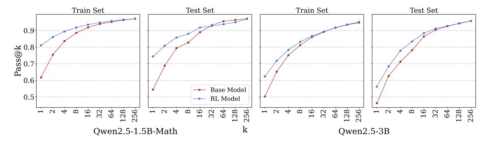

Figure 7: Pass@k comparison between base and RLVR-trained models on train and test sets.

Similar to the work done by Yue et al., we conducted the pass@k experiments with these models. For both the base and RL models, we generated 256 responses per question on the MATH train set and MATH500 test set. Using these responses, we estimated accuracy and pass@k capability for k=1 to 256, following the metric defined in Section 3.2. Additionally, we computed majority vote accuracy (maj@256), which is the percentage of questions where the most frequent answer among the 256 responses is correct.

As expected, we observed that RLVR significantly improved both accuracy and majority vote performance across training and test sets. As shown in Table 3, these gains appeared consistently in both the 3B and 1.5B models, indicating that RLVR leads to generalizable improvement in accuracy without signs of overfitting. In contrast, we observed no meaningful improvement in capability. For both the 1.5B and the 3B models, pass@k either remained stable or slightly declined across the training and test sets. As shown in Figure 7, the RL model outperformed the base model at small k, but their curves converged as k increases—a pattern consistent with prior work (Shao et al., 2024; Yue et al., 2025).

#### A.3 Question-Difficulty-Based Analysis Results

As discussed in Sections 4, we performed detailed analyses based on question difficulty across different training settings. The results are presented below. Figure 8 shows success rate improvements across difficulty bins for both 1.5B and 3B models on train and test. Figure 9 presents the corresponding transition matrices that illustrate how questions move between success rate bins before and after training.

> **[图片提取文字 (无描述)]:**
> 40 +38.5% +36.6% 40 RL Model Improvement RL Model Improvement 35 +33.9% +31.7% 30 +27.5% +28.2% 25 +23.4% +20.3% 20 15 +12.8% +11.4% +9.4% +8.8% 10 +3.0% +0.6% +0.5% +0.6% 33-64 65-128 129-192193-256 1-4 17-32 1-4 5-16 17-32 33-64 65-128 129-192193-256 Math Model Success Rate Base Model Success Rate (a) Qwen2.5-1.5B-Math (Train) (b) Qwen2.5-1.5B-Math (Test) +19.7% +19.1% RL Model Improvement RL Model Improvement +18.0% +16.9% 15 +10.6% +9.6% +9.5% +9.0% +5.4% +4.9% +3.3% +1.7% +0.4% +0.4% +0.1% +0.1% 33-64 65-128 129-192193-256 1-4 17-32 33-64 65-128 129-192193-256 0 1-4 5-16 17-32 5-16 Base Model Success Rate Base Model Success Rate (c) Qwen2.5-3B (Train) (d) Qwen2.5-3B (Test)
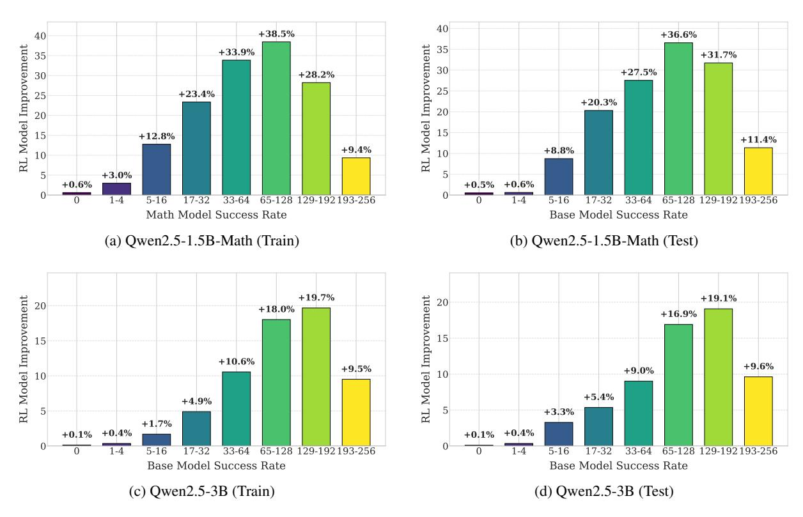

Figure 8: Change in success rates (absolute %) across difficulty bins for Qwen2.5-1.5B-Math and Qwen2.5-3B on the MATH training and test sets. In both models, RLVR significantly improves questions in the mid-success bins (e.g., [17–64], [65–128]), but yields minimal gains in the lowest bins ([0], [1–4]).

> **[图片提取文字 (无描述)]:**
> 0.6% 193-256 0.0% 0.0% 0.2% 0.3% 99.5% 193-256 99.4% (n=3589)(1) (7) (9) (3571)(n=168)(1) (167)(1) 129-192 0.2% 0.4% 1.2% 7.9% 90.2% 129-192 1.7% 2.5% 95.8% 0.8 0.8 (n=1476)(3)(6) (18)(117)(1332)(n=119)(2) (3) (114)Base Model Success Rate Success Rate 65-128 0.4% 0.3% 0.9% 1.9% 10.7% 23.6% 62.2% 65-128 1.3% 15.4% 30.8% 52.6% (239)(631)(n=78)(41)(n=1014)(4) (3) (9) (19)(109)(1) (12)(24)0.6 0.6 0.2% 3.0% 5.1% 13.7% 28.0% 24.1% 33-64 7.1% 2.4% 2.4% 16.7% 31.0% 21.4% 19.0% (3) (n=468)(2) (1) (14)(24)(64)(119)(131)(113)(1) (1) (7) (13)(9) (8) Model 3.7% 3.1% 10.4% 13.8% 20.0% 27.3% 14.6% 9.2% 17-32 3.7% 18.5% 25.9% 29.6% 7.4% 11.1% 17-32 (n=260)(4) (8) (27)(36)(52)(71)(38)(24)(n=27)(1) (1) (5) (7) (8) (2) (3) 0.40.4Base 3.1% 16.4% 24.6% 16.4% 19.5% 11.3% 5.5% 3.4% 5.9% 11.8% 26.5% 23.5% 8.8% 20.6% 2.9% 5-16 5-16 (n=293)(9) (48)(72)(48)(57)(33)(16)(10)(n=34)(2) (4) (9) (8) (3) (7) (1) 32.6% 25.7% 8.6% 6.4% 1.6% 16.7% 22.2% 0.2 0.2 (n=187)(47)(61) (48)(16)(12)(3) (n=18)(3) (4) 16.9% 7.0% 0.9% 0.5% 0.5% 28.6% 7.1% (n=213)(36)(15)(2) (1) (n=14)(1) (1) (4) 0.0 0.0 17-32 33-64 65-128 129-192 193-256 129-192 193-256 1-4 5-16 0 1.4 5-16 17-32 33-64 65-128 RL Model Success Rate RL Model Success Rate (a) Qwen2.5-1.5B-Math (Train) (b) Qwen2.5-1.5B-Math (Test) 1.0 0.4% 193-256 99.6% 193-256 100.0% (n=2350)(10)(2340)(n=135)(135)0.1% 0.1% 1.3% 129-192 20.6% 77.8% 1.8% 22.3% 75.9% 129-192 0.8 (n=1769)(2) (23)(365)(1377)(2) (n=112)(2) (25)0.8 Base Model Success Rate Rate 0.1% 0.9% 0.9% 2.4% 18.4% 65-128 36.5% 40.8% 43.0% 43.0% 13.9% 65-128 (n=1188)(11)(11)(28)(434)(485)(218)(1) (n=79)(34)(34)(11)Success 0.6 0.6 0.2% 1.2% 6.3% 2.0% 33-64 36.4% 47.4% 6.5% 6.0% 50.0% 36.0% 4.0% 4.0% 33-64 (7) (37)(214)(279)(38)(12)(1) (n=50)(3) (25)(18)(2) (2) Base Model 0.3% 10.8% 1.1% 0.5% 2.4% 17-32 38.8% 41.4% 7.1% 17-32 7.1% 31.0% 59.5% (n=379)(1) (41) (147)(157)(27)(4) (2) (1) (n=42)(25)(3) (13)0.40.41.5% 15.6% 22.6% 6.2% 0.2% 0.2% 10.3% 30.8% 7.7% 2.6% 2.6% 46.2% 5-16 (n=469)(73)(252)(106)(29)(7) (1) (1) (18)(3) (1) (n=39)(1) (4) (12)21.9% 0.5% 26.0% 51.5% 13.6% 31.8% 0.2 0.2 (n=392)(102)(202)(86)(2) (n=22)(3) (12)(7) 20.8% 0.5% 19.0% (n=21)(n=365)(76)(2) (4) 0.0 0.0 1-4 5-16 17-32 33-64 65-128 129-192 193-256 0 1-4 5-16 17-32 33-64 65-128 129-192 193-256 RL Model Success Rate RL Model Success Rate (c) Qwen2.5-3B (Train) (d) Qwen2.5-3B (Test)
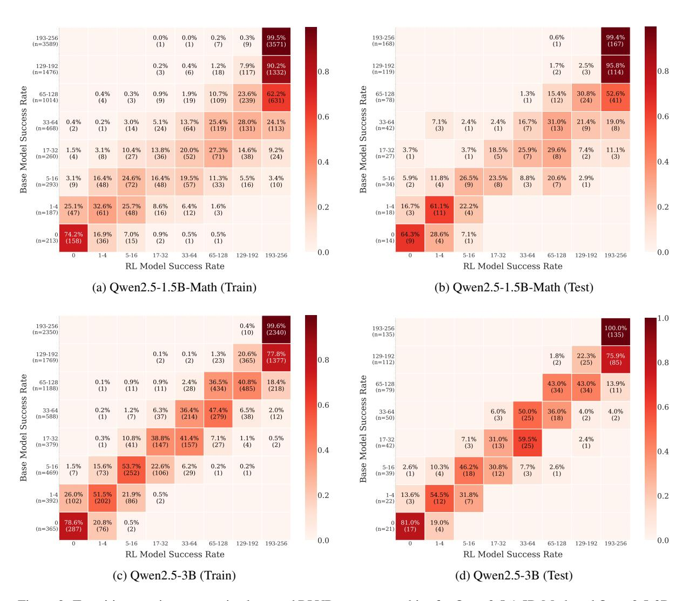

Figure 9: Transition matrices comparing base and RLVR success-rate bins for Qwen2.5-1.5B-Math and Qwen2.5-3B. Each cell shows the percentage and count of questions moving between success bins. Most upward transitions occur from mid-success bins; questions in low-success bins are more likely to remain unchanged or regress.

#### A.4 Entropy Analysis

> **[图片提取文字 (无描述)]:**
> Train Set Train Set Base model Base model RL model RL model Mean Entropy Mean Entropy 1.91 1.38 0.54 Test Set Test Set Base model Base model 3 RL model RL model Mean entropy Mean entropy 0.70 1-8 9-64 64-128 129-192 193-256 0 1-8 9-64 64-128 129-192 193-256 Base model success rate Base model success rate (a) Qwen2.5-1.5B-Math (b) Qwen2.5-3B
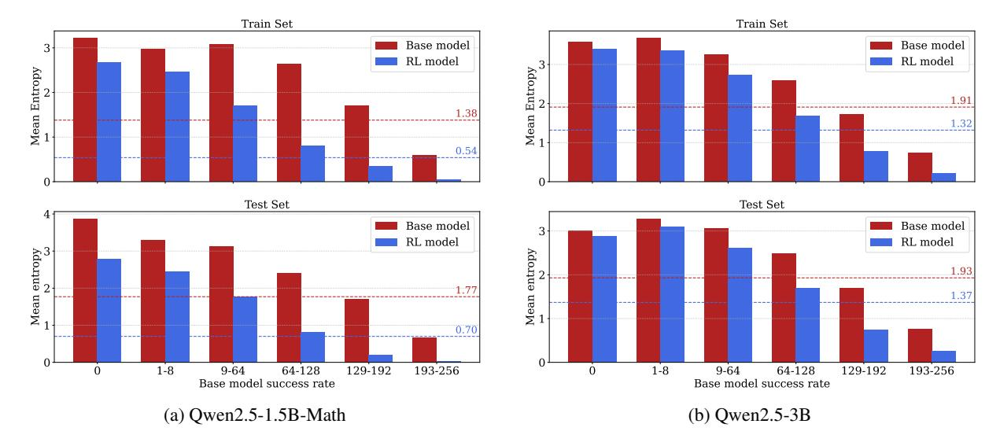

Figure 10: Comparison of output entropy across base and RLVR-trained models, computed over 256 responses per question. Entropy is measured by grouping responses with identical final answers.

As discussed in Section 4.2, we performed an entropy analysis to examine whether RLVR reduces response diversity and causes the model to concentrated on fewer outputs. For both the base and RL models, we computed the entropy of the answers in the 256 responses for each question and then average the entropy values over the questions. Entropy values were measured by grouping responses that yield the same final answer, regardless of correctness. We conducted the experiment for both Qwen2.5-1.5B-Math and Qwen2.5-3B.

As shown in Figure 10, output entropy dropped noticeably after RLVR. More importantly, this reduction consistently appeared across all difficulty levels, including questions where the base model had zero or near-zero success rate. These results support the hypothesis that RLVR reinforces greater consistency, but on harder questions, this often leads the model to focus on incorrect responses—making it less likely to recover even occasional correct answers.

#### A.5 Self-Distillation Results

Table 4 reports the full accuracy results for the self-distillation experiments introduced in Section 5.1. All fine-tuning used the same hyperparameter configuration (Appendix A.11).

| Model             | Student Model | Teacher Model | Train Accuracy | Test Accuracy  |
|-------------------|---------------|---------------|----------------|----------------|
|                   | Base model    |               | 64.0%          | 62.6%          |
|                   | Base model    | Base model    | 74.7% (+10.7%) | 63.4% (+0.8%)  |
| Qwen2.5-1.5B-Math | RL model      |               | 80.9%          | 74.8%          |
|                   | RL model      | RL model      | 84.4% (+3.5%)  | 74.4% (-0.4%)  |
|                   | Base model    | RL model      | 80.5% (+16.5%) | 74.2% (+11.6%) |
|                   | Base model    |               | 59.3%          | 54.9%          |
|                   | Base model    | Base model    | 73.6% (+14.3%) | 58.7% (+3.8%)  |
| Qwen2.5-3B        | RL model      |               | 67.9%          | 63.6%          |
|                   | RL model      | RL model      | 72.1% (+4.2%)  | 64.4% (+0.8%)  |
|                   | Base model    | RL model      | 73.6% (+14.3%) | 64.5% (+9.6%)  |

Table 4: Self-distillation results for Qwen2.5-1.5B-Math and Qwen2.5-3B across different student—teacher configurations. Accuracy values in parentheses reflect improvements over the corresponding student model before fine-tuning.

As discussed in Section 5.1, the 1.5B model shows that self-distillation leads to overfitting: while training accuracy increases significantly, test accuracy improves only slightly or even declines. In contrast, distilling RL responses into the base model yields the strongest generalization improvement, raising test accuracy from 62.6% to 74.2%—surpassing both the base and RLVR-trained models. Similar trends are observed for the Qwen2.5-3B model as well: distilling RL responses into the base model again leads to the highest test accuracy, outperforming all other configurations. This consistent pattern across model sizes reinforces the interpretation that RLVR produces responses of higher quality. Taken together, these results suggest that distillation performance itself may serve as a useful proxy for evaluating the quality of model responses—potentially offering a more meaningful signal than surface-level indicators such as response length or syntactic heuristics.

#### A.6 Qualitative Analysis of Responses Before & After RLVR

In Section 5.2, we compared responses from Qwen2.5-1.5B-Math and Qwen2.5-3B before and after RLVR training along two dimensions: response length and the use of reflection-related keywords (e.g., "let's verify", "alternatively", "wait"). Here, we present the complete results.

## A.6.1 Response Length

> **[图片提取文字 (无描述)]:**
> Base Model RL Model (cp150) Response Length All responses Correct responses Incorrect responses
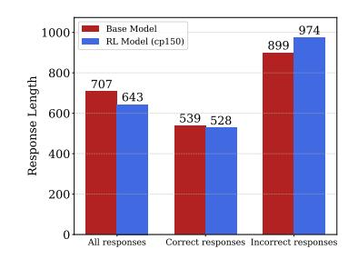

(a) Mean response length grouped by correctness.

> **[图片提取文字 (无描述)]:**
> Base Model RL Model - All - All 000 Mean Response Length Correct Correct Incorrect Incorrect 900 800 700-600-500 0 - 6465 - 128129-192 193-256 0 - 6465-128 129-192 193-256
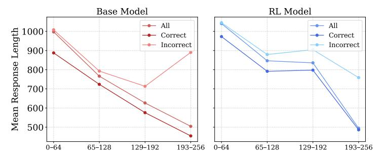

(b) Mean response length stratified by difficulty and correctness.

Figure 11: Comparison of response lengths between base and RL models for Qwen-2.5-1.5B-Math. RLVR did not increase verbosity, and correct answers tended to be shorter.

> **[图片提取文字 (无描述)]:**
> Base Model 775 800 736 RL Model Wean Response Length 400 300 200 594 582 444 439 100 All Correct Incorrect
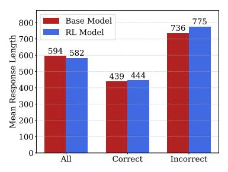

> **[图片提取文字 (无描述)]:**
> (a) Mean response length grouped by correctness
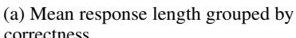

> **[图片提取文字 (无描述)]:**
> Base Model RL Model All All Mean Response Length Correct Correct Incorrect Incorrect 193-256 0 - 6465 - 128129-192 193-256 0 - 6465 - 128129-192
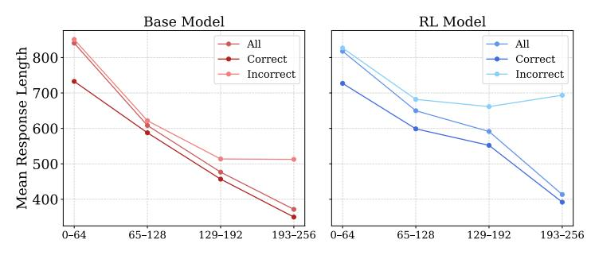

(b) Mean response length stratified by difficulty and correctness.

Figure 12: Comparison of response lengths between base and RL models for Qwen-2.5-3B. RLVR did not increase verbosity, and correct answers tended to be shorter.

> **[图片提取文字 (无描述)]:**
> Base Model RL Model (cp150) Response Length All responses Correct responses Incorrect responses
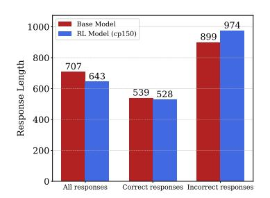

(a) Qwen2.5-1.5B-Math: Mean response length grouped by correctness.

> **[图片提取文字 (无描述)]:**
> Base Model RL Model - All All 1000 Mean Response Length Correct Correct Incorrect Incorrect 900 800 700 600 500 0 - 6465-128 129-192 193-256 0 - 6465-128 129-192 193-256
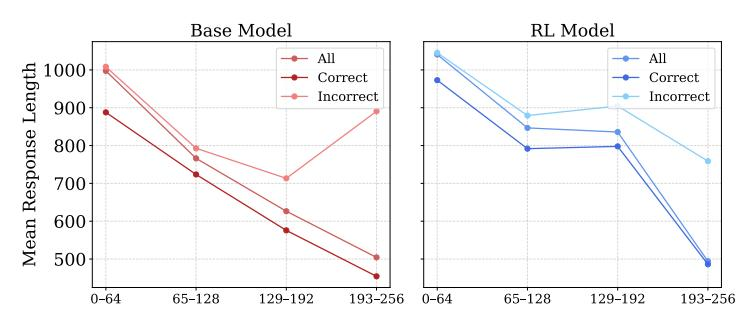

(b) Qwen2.5-1.5B-Math: Mean response length by difficulty and correctness.

> **[图片提取文字 (无描述)]:**
> Base Model RL Model Mean Response Length All Correct Incorrect
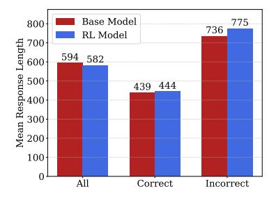

(c) Qwen2.5-3B: Mean response length grouped by correctness.

> **[图片提取文字 (无描述)]:**
> RL Model Base Model All All Mean Response Length Correct Correct Incorrect Incorrect 0 - 64129-192 193-256 0 - 6465 - 128129-192 193-256 65-128
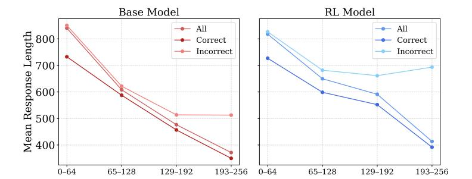

(d) Qwen2.5-3B: Mean response length by difficulty and correctness.

Figure 13: Comparison of response lengths between base and RLVR-trained models across model sizes and difficulty levels. Top row: Qwen2.5-1.5B-Math; bottom row: Qwen2.5-3B. Left: Mean response length grouped by correctness. Right: Mean response length further stratified by difficulty. In both models, RLVR did not increase response length, and correct responses tended to be more concise.

For both 1.5B and 3B models, we generated 256 responses per MATH500 question from both the base and RL models and computed mean response lengths. We also separated responses by correctness. As shown in Figure 13, there was no substantial difference in average length between the two models. In both cases, correct responses were consistently shorter than incorrect ones.

To control for the correlation between question difficulty and correctness, we grouped questions into four bins based on how many of the 256 base model responses were correct—higher bins indicating easier questions. Within each bin, we compared mean response lengths by correctness. As shown in the figure, both models exhibited the same trend: correct responses were consistently shorter, and overall response lengths remained similar, indicating that RLVR did not increase response length.

## A.6.2 Reflection-Related Keywords

> **[图片提取文字 (无描述)]:**
> Base Model 1.14 Mean Reflection Keyword Count RL Model 0.99 1.0 0.90 0.86 8.0 0.67 0.59 0.6 0.4 0.2 All Correct Incorrect
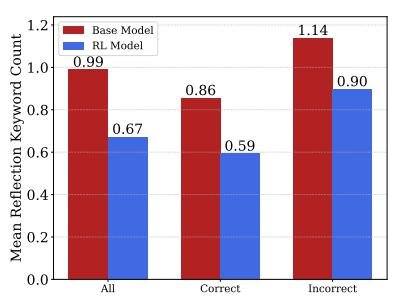

> **[图片提取文字 (无描述)]:**
> (a) Owen2.5-1.5B-Math: Mean count of reflection keywords grouped by correctness.
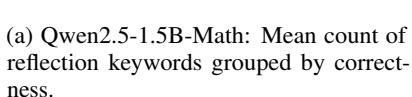

> **[图片提取文字 (无描述)]:**
> Base Model **RL Model** Mean Reflection Keyword Count All - All Correct Correct Incorrect Incorrect 1.0 0.8 0.6 -0 - 6465 - 128129-192 193-256 0 - 6465-128 129-192 193-256
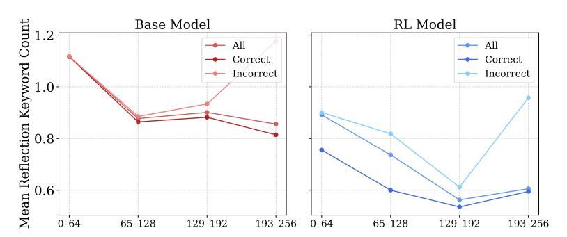

(b) Qwen 2.5-1.5 B-Math: Reflection keyword frequency by difficulty and correctness.

> **[图片提取文字 (无描述)]:**
> Mean Reflection Keyword Count Base Model 8.0 RL Model 0.720.64 0.64 0.6 0.540.42 0.40.26 0.2 All Correct Incorrect
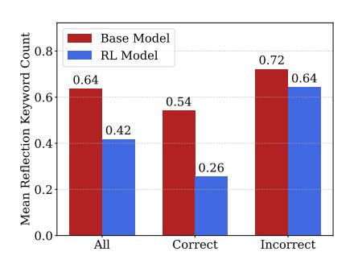

> **[图片提取文字 (无描述)]:**
> Count Base Model RL Model 8.0 All All Reflection Keyword ( 2.0 2.0 2.0 2.0 2.0 2.0 2.0 2.0 2.0 2.0 Correct Correct Incorrect Incorrect Mean 2.0 129-192 0 - 6465-128 129-192 193-256 0 - 6465-128 193-256
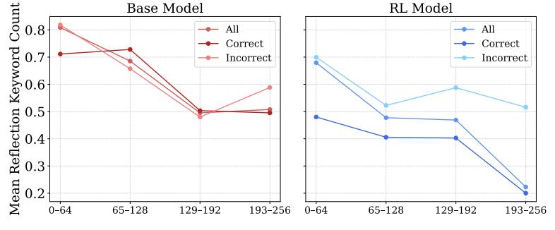

(c) Qwen2.5-3B: Mean count of reflection keywords grouped by correctness.

(d) Qwen2.5-3B: Reflection keyword frequency by difficulty and correctness.

Figure 14: Reflection-related keyword analysis across base and RLVR-trained models. Top row: Qwen2.5-1.5B-Math; bottom row: Qwen2.5-3B. Left: Mean count of reflection-related keywords, grouped by correctness. Right: Keyword frequency stratified by question difficulty and correctness. Across both models, RLVR-trained responses consistently contain fewer reflective phrases.

Prior work suggests that RLVR elicits more non-linear reasoning in model outputs (DeepSeek-AI, 2025; Gandhi et al., 2025). To test this, we analyzed the presence of predefined reflection-related phrases. The full list of the phrases are available in Table 5.

| Reflection-Related Keywo          | ords                           |                           |  |
|-----------------------------------|--------------------------------|---------------------------|--|
| actually                          | aha                            | alternatively correction: |  |
| another approach different method | checking our work double-check | hmm                       |  |
| however                           | I made a mistake               | I need to reconsider      |  |
| I realize                         | let me recalculate             | let me think              |  |
| let's check                       | let's reconsider               | looking back              |  |
| make sure                         | ok                             | on second thought         |  |
| retracing                         | to be sure                     | to confirm                |  |
| verify                            | wait                           | we could also             |  |

Table 5: List of reflection-related phrases used for qualitative analysis.

Using the same setup as the response length analysis, we examined 256 responses per question across all MATH500 test questions for both base and RL models. For each response, we counted occurrences of reflection keywords and stratified results by correctness and difficulty.

As shown in Figure 14, the RL model exhibited substantially fewer reflection keywords than the base

model. The figure further shows that, while the base model showed little variation across correctness levels, the RL model consistently used fewer reflection phrases in correct answers across all difficulty bins. These responses were generally more direct and less exploratory.

#### A.7 QwQ-32B Capability Experiment

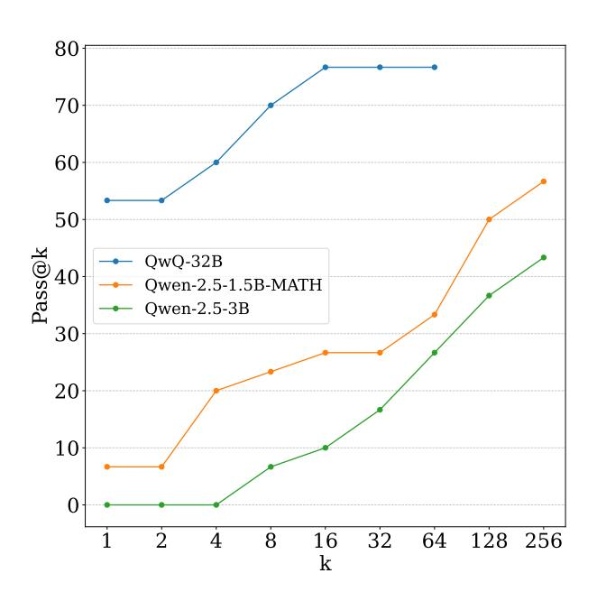

Figure 15: Pass@k results of QwQ-32B, Qwen2.5-3B-Math, and Qwen2.5-1.5B-Math on AIME 25

In Section [6,](#page-5-2) we selected QwQ-32B as the teacher model for our reasoning-only distillation experiment. To ensure a fair test of whether distillation can improve capability without introducing new knowledge, the teacher must have higher capability than the student models—Qwen2.5-3B and Qwen2.5-1.5B-Math.

To validate this, we conducted a pass@k evaluation on AIME 25 using 64 responses per question from QwQ-32B, and compared the results with the two student models. As shown in Figure [15,](#page-20-1) QwQ-32B consistently outperforms both students across all k values, with no sign of convergence. Notably, its pass@64 score reached 76.7%, compared to just 43.3% and 56.7% at pass@256 for Qwen2.5-3B and Qwen2.5-1.5B-Math, respectively. These results confirm that QwQ-32B has substantially higher capability, making it a suitable teacher model for our distillation setup.

#### A.8 Teacher Distillation Pass@k results

As discussed in Section 6, we conducted the pass@k on AIME 25 and MATH 500 for both Qwen2.5-1.5B-Math and Qwen2.5-3B and each their 2 distilled variants. The results are shown below in Figure 16.

> **[图片提取文字 (无描述)]:**
> MATH500-hardest 50 (1.5B) AIME25 (1.5B) 100 → Base model Base model DeepSeek model DeepSeek model Distilled model Distilled model 80 60 40 20 0 256  $\infty$  $\infty$ 2 64 64 AIME25 (3B) MATH500 (3B) 100 Base model Distilled model 80 60 40 20 Base model Distilled model 0 256 512  $\infty$ 64 64 k
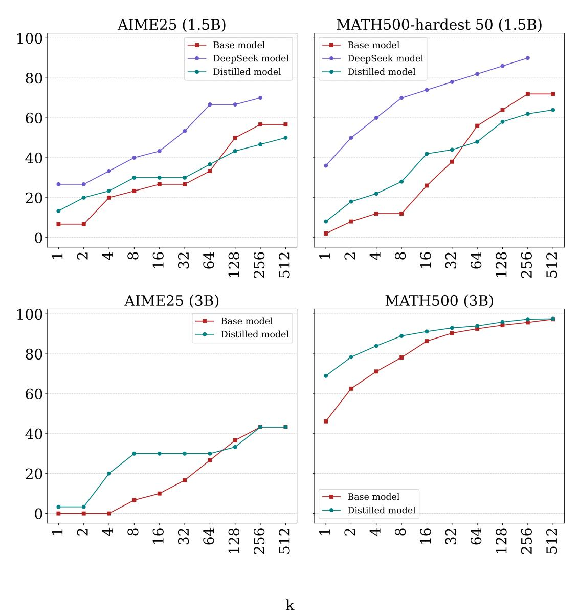

Figure 16: Pass@k comparisons across AIME25 and MATH500 datasets for both 1.5B (top) and 3B (bottom) models and their distillation-trained variants. For the MATH500 results of the 1.5B models, we show performance on the 50 questions with the lowest base-model success rates to better highlight the differences.

