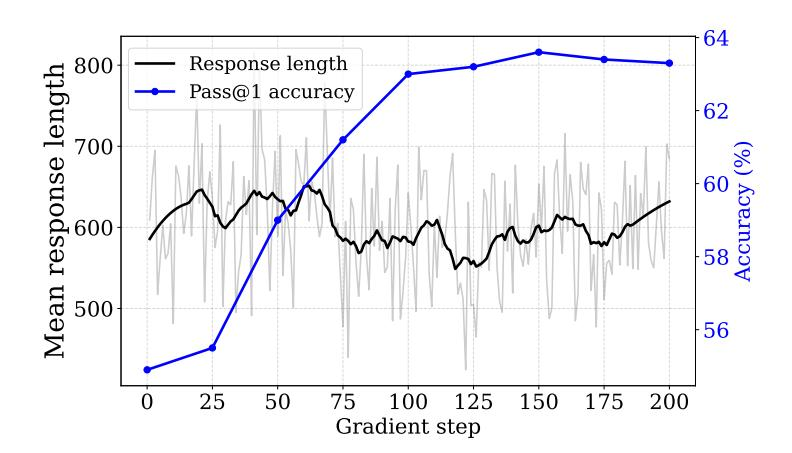

# A.10.2 Reward Function

We adopted a minimalistic reward setting. A response received a reward of 1 if it contained the correct final answer, and -1 otherwise. Answer verification was performed using the math\_verify[4](#page-22-4) package.

$$R(q,a,r) = \begin{cases} 1 & \text{if the response } r \text{ to question } q \text{ matches the ground truth answer } a \\ -1 & \text{otherwise} \end{cases}$$

2 <https://huggingface.co/sail/Qwen2.5-Math-1.5B-Oat-Zero>

3 <https://github.com/huggingface/trl>

4 <https://github.com/huggingface/Math-Verify>

#### **A.10.3 RLVR Training Hyperparameters**

Table 6 summarizes the key hyperparameters used in RLVR training for the Qwen2.5-3B model.

| Hyperparameter                       | Value                                                             |
|--------------------------------------|-------------------------------------------------------------------|
| Optimizer                            | AdamW                                                             |
| Learning rate scheduler              | Constant                                                          |
| Maximum token length                 | 4000                                                              |
| Temperature                          | 0.9                                                               |
| Top-p                                | 1.0                                                               |
| Top-k                                | 50                                                                |
| Number of generations (per question) | 10                                                                |
| Global batch size                    | 4 (per device) $\times$ 7 (GPUs) $\times$ 10 (accumulation) = 280 |
| Learning rate                        | $1 \times 10^{-6}$                                                |
| Gradient clipping (max grad norm)    | 0.1                                                               |
| Number of gradient steps             | 225                                                               |
| Warmup steps                         | 20                                                                |
| Mixed precision                      | bf16                                                              |

Table 6: Key hyperparameters used for RLVR training of Qwen2.5-3B.

## A.10.4 Training Progress and Evaluation

> **[图片提取文字 (无描述)]:**
> Response length Mean response length Pass@1 accuracy 80 90 Accuracy (%) Gradient step

Figure 17: Change in response length (token counts) over training and accuracy on MATH 500 across checkpoints.

During RLVR training, we evaluated the model every 25 gradient steps. To ensure statistical robustness, we followed the recommendation of Hochlehnert et al. (Hochlehnert et al., 2025) and sampled responses 10 times per checkpoint, reporting the mean accuracy. For each evaluation, we used a temperature of 0.8 and a top-p of 0.9.

As shown in Figure 17, accuracy peaked at step 150, reaching 63.6%, and then plateaued. We selected this checkpoint as the RL model used throughout our experiments. The figure also shows the average response length over training. As discussed in Section 5.2, response length remained stable, showing no significant growth.

## A.11 Distillation Training Hyperparameters

For all the self-distillation experiments in Section [5.1](#page-4-1) and teacher distillation in Section [6,](#page-5-2) we used the supervised fine-tuning (SFT) hyperparameters listed in Table [7.](#page-24-1)

| Hyperparameter          | Value          |
|-------------------------|----------------|
| Optimizer               | AdamW          |
| Learning rate scheduler | Constant       |
| Weight decay            | 10−4 × 1 |
| Warmup steps            | 25             |
| Max sequence length     | 32,768         |
| Global batch size       | 4              |
| Mixed precision         | bf16           |

Table 7: Key hyperparameters used for supervised fine-tuning in distillation experiments.

## A.12 Response Generation Details

We used vLLM[5](#page-24-2) library [\(Kwon et al.,](#page-9-20) [2023\)](#page-9-20) for response generation and math\_verify[6](#page-24-3) package for response grading.

We used temperature 0.9, top-p of 1.0, and top-k of 50 for all models, except where noted below. These settings were chosen to ensure response diversity. Unless otherwise specified, we used the question-only template (Template 3).

For Qwen2.5-Math-1.5B-Oat-Zero, we used the same sampling hyperparameters but followed the Qwen prompt format (Template 2), as recommended in the user guideline.[7](#page-24-4)

For QwQ-32B, we used temperature 0.6, top-p 0.95, and top-k 50. We followed the R1 prompt template (Template 1), as recommended in the user guideline.[8](#page-24-5)

For DeepSeek-R1-Distill-Qwen-1.5B, we used temperature 0.6, top-p 0.95, and top-k 50. We followed the R1 prompt template (Template 1), as recommended in the user guideline.[9](#page-24-6)

5 <https://docs.vllm.ai>

6 <https://github.com/huggingface/Math-Verify>

7 <https://huggingface.co/sail/Qwen2.5-Math-1.5B-Oat-Zero>

8 <https://huggingface.co/Qwen/QwQ-32B#usage-guidelines>

9 <https://huggingface.co/deepseek-ai/DeepSeek-R1-Distill-Qwen-1.5B#usage-recommendations>