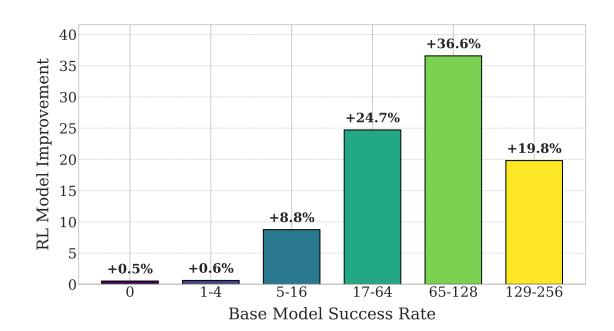
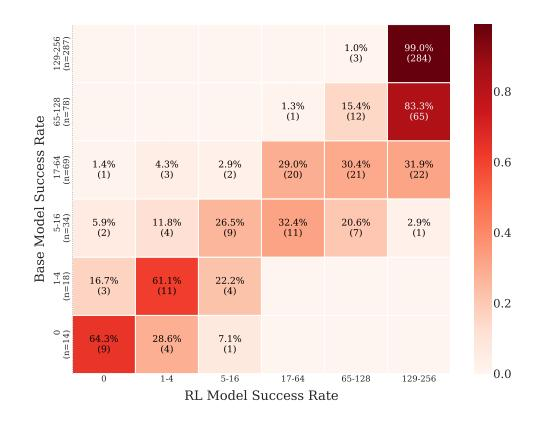

# 4.2 A Deeper-Dive: Analysis Based on Question Difficulty

To better understand the accuracy-capability dynamics of RLVR, we conduct a fine-grained anal-

> **[图片提取文字 (无描述)]:**
> 40 +36.6% 35 RL Model Improvement 30 +24.7% 25 +19.8% 20 15 +8.8% 10 5 +0.6% +0.5% 0 129-256 1-4 5-16 17-6465-128 Base Model Success Rate

Figure 1: Change in success rates after RLVR training on MATH 500 test set, grouped by the base model's per-question success rate measured over 256 responses. The bar height represents the absolute difference (%) between the RL and base models within each bin.

ysis at the question difficulty level. For each question in the training and test sets, we generate 256 responses from the base model and compute its per-question success rate. Questions are then grouped into bins according to these rates: [0], [1–4], [5–16], [17–64], [65–128], and [129–256]. Within each bin, we collect the corresponding questions, retrieve the RL model's responses to the same questions, and compute average success rates for both models. We then calculate the average success rate of the base and RL models in each bin and plot their absolute difference. The results are shown in Figure 1.

> **[图片提取文字 (无描述)]:**
> 129-256 (n=287) 1.0% 99.0% (3) (284)0.8 65-128 (n=78) 1.3% 83.3% 15.4% (1) (12)Base Model Success Rate 17-64 (n=69) 0.6 1.4% 4.3% 2.9% 29.0% 30.4% 31.9% (1) (3) (2)(20)(21)(22)5-16 (n=34) 5.9% 11.8% 26.5% 32,4% 20.6% 2.9% 0.4 (2) (1) (4) (9) (11)(7) 1-4 (n=18) 16.7% 61.1% 22.2% (4) (3) 0.2 (n=14) 64.3% 28.6% 7.1% (4) (1) 0.0 0 1-4 5-16 17-64 65-128 129-256 RL Model Success Rate

Figure 2: Success rate transition matrix showing redistribution of questions from base model to RL model on MATH 500 test set.

We observe two consistent patterns. (1) For questions where the base model already has a moderately high success rate, the RL model shows substantial improvement. For example, in the training set, the [65–128] bin shows a 36.6% gain in average success rate relative to 256 responses, and the [17–64] bin shows a 24.7% gain. (2) In contrast, for questions where the base model has zero or

near-zero success rate, the improvement is negligible. For instance, the [0] bin in the training set improves by only 0.5% points, and the [1–4] bin by just 0.6% points.

Furthermore, to better understand the pattern observed in success rate improvements, we visualize how individual questions move across success rate bins before and after RLVR training. Figure [2](#page-3-1) presents this transition in test set as a matrix. Here, each row corresponds to a success-rate bin based on the base model's performance, and each column corresponds to the same bin based on the RL model's performance. Each cell shows the percentage (and count) of questions that started in a specific base model bin and end up in a particular RL model bin after training.

Notably, we observe two clear trends. (1) Questions already in high-success bins tend to stay there or shift upward after RLVR. For example, in the [65–128] bin, 15.4% remain in place while 83.3% move to the top [129–256] bin; only 1.3% (1 question out of 78) drop lower. A similar upward shift appears in the [17–64] bin. (2) In contrast, questions in low-success bins—especially those near zero—tend to stagnate or regress. In the [1–4] bin, 61.1% remain and 16.7% fall to [0]; likewise, in the [5–16] bin, 44.2% stay or drop lower. This pattern shows a clearer picture of how RLVR fails to help previously unsolved questions and can even increase their number, as many with a small chance of being answered correctly end up never being solved after training.

To understand this behavior, we need to examine the internal dynamics of RLVR training. Take GRPO algorithm as an example. At each iteration, the model generates multiple responses (e.g., 8) per question in a batch. Each response is evaluated for correctness, and parameter updates are applied accordingly. If all 8 responses for a given question are incorrect, that question has no influence on the update. In contrast, for questions with a mix of correct and incorrect responses, the model parameters are nudged to increase the likelihood of generating correct answers and decrease incorrect ones. Now consider an early training step where the batch includes one difficult question (e.g., in bin [1–4]) and several easier ones (e.g., in bin [65–128]). With high probability, the model will generate only incorrect responses for the difficult question, while producing at least some correct answers for the easier ones. As a result, the parameter update will be guided entirely by the easier questions only. This

can lead to the model assigning even lower probability to the correct answers for the difficult question, especially if model capacity is limited. This selective reinforcement continues throughout training, explaining why questions that initially had a small chance of being answered correctly may become even less likely to be solved after training. To confirm this selective reinforcement effect, we also analyze the entropy of the model's output distributions—measured over 256 responses per question—across difficulty levels. We observe that entropy consistently decreases after RLVR training. Full results are provided in Appendix [A.4.](#page-16-0)

To summarize, these results suggest the following insight: RLVR improves accuracy but not capability because *RLVR focuses on improving the accuracy of the less-difficult questions to the detriment of the accuracy of the most difficult questions.*

