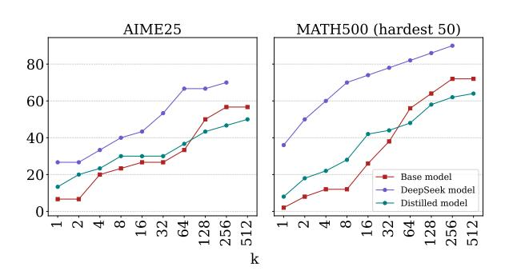
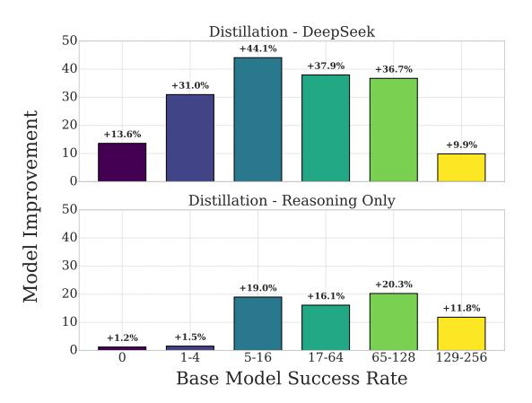
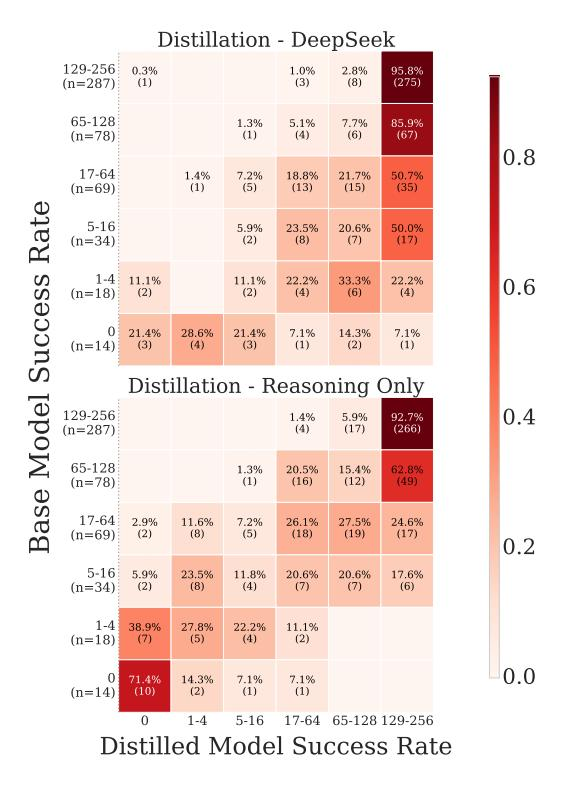

# 6 Under What Conditions Does Distillation Increase Capability?

Distillation from teacher reasoning models is known to be another effective approach for improving accuracy (Min et al., 2024; Muennighoff et al., 2025; Ye et al., 2025). Here, we take a step

further and investigate: Can teacher distillation also improve capability, and under what conditions does such improvement occur?

#### 6.1 Capability Analysis

> **[图片提取文字 (无描述)]:**
> MATH500 (hardest 50) AIME25 80 60 40 20 Base model DeepSeek model Distilled model 512  $\infty$  $\infty$ 32

Figure 4: Pass@k comparisons across AIME25 and MATH500 datasets for the 1.5B model and their distillation-trained variants. For the MATH500 results, we show the results on 50 questions with the lowest success rates under the base model to better visualize the performance gaps between models.

Yue et al. briefly explored this issue by comparing two models: Qwen-2.5-Math-7B (Yang et al., 2024) and DeepSeek-R1-Distill-Qwen-7B (DeepSeek-AI, 2025). The latter is a publicly available model obtained by distilling 800K DeepSeek-R1 responses into the Qwen-2.5-Math-7B student model. Their experiments showed that the distilled model demonstrates improved capability, as evidenced by higher pass@k scores.

However, it remains unclear why the distillation process led to the observed capability improvement. Teacher model responses contain two key components: (1) the model's *reasoning patterns*, and (2) its *domain knowledge*. In the case of DeepSeek-R1-Distill-Qwen-7B, the student model was trained on up to 800K responses generated by DeepSeek-R1 (DeepSeek-AI, 2025), making it highly likely that new mathematical knowledge absent in the original student model's pre-training data was also introduced during distillation. As a result, it is difficult to determine whether the observed gains in capability stem from adopting more effective reasoning pattern or from learning new knowledge.

To disentangle these effects, we conduct a comparative study using three models: (1) Qwen2.5-Math-1.5B, a non-reasoning base model; (2) DeepSeek-R1-Distill-Qwen-1.5B, which, like its 7B counterpart, was trained on 800K responses from DeepSeek-R1 (DeepSeek-AI, 2025) and likely benefits from both new knowledge and im-

> **[图片提取文字 (无描述)]:**
> Distillation - DeepSeek 50 +44.1% +37.9% 40 +36.7% +31.0% 30 Model Improvement 20 +13.6% +9.9% 10 Distillation - Reasoning Only 50 40 30 +20.3% +19.0% 20 +16.1% +11.8% 10 +1.2% +1.5% 0 1-45-16 17-6465-128 129-256 Base Model Success Rate

Figure 5: Change in success rates (absolute difference in %) for the DeepSeek model and the reasoning-only model, grouped by base model success rate bins.

proved reasoning; (3) a distilled model we train ourselves, designed to isolate the effect of reasoning-pattern transfer without introducing any new domain knowledge beyond what the base model already possesses. For simplicity, we refer to these as the base model, the DeepSeek model, and the reasoning-only model.

We train the reasoning-only model using the following procedure. Starting with the base model, we generate 256 responses for each of the 7,500 questions in the MATH train set. We exclude any question for which the model achieves a zero success rate. Since the base model answers each remaining question correctly at least once, we treat these as in-distribution. As the teacher, we use QwQ-32B (Qwen, 2024), which we verified to have higher capability than the student model (see Appendix A.7 for details). For each indistribution question, QwQ-32B generates 8 candidate responses. From these, we randomly select up to 4 correct ones (using all available if fewer than 4 exist) and conduct SFT on the base model with them. Distilling in this manner should not introduce any new knowledge beyond what the base model already has. The resulting distilled model achieves 69% accuracy on the MATH 500 dataset, significantly outperforming the base model's 60%, indicating a successful distillation.

We evaluate the capability of the three models by conducting pass@k experiments on the AIME25 (OpenCompass, 2025) and MATH500 dataset. Results are shown in Figure 4. We observe the following patterns consistently across both datasets. (1) The DeepSeek model outperforms the base model across the entire range of k values. For AIME25, it

> **[图片提取文字 (无描述)]:**
> Distillation - DeepSeek 129-256 0.3% 1.0% 2.8% 95.8% (n=287)(3)(8)(275)(1) 65 - 1281.3% 7.7% 5.1% 85.9% (1) (4) (67)(n=78)(6)0.8 17-641.4% 7.2% 18.8% 21.7% 50.7% (1) (n=69)(5)(13)(15)(35)Base Model Success Rate 5-165.9% 23.5% 20.6% 50.0% (n=34)(2)(8) (7) (17)1-4 11.1% 11.1% 22.2% 33.3% 22.2% 0.6(n=18)(2)(2)(4)(6)(4)0 21.4% 28.6% 21.4% 7.1% 14.3% 7.1% (3)(4)(3)(1) (2)(1) (n=14)Distillation - Reasoning Only 129-256 0.41.4% 5.9% 92.7% (n=287)(4)(17)(266)65-128 1.3% 20.5% 15.4% (n=78)(1) (16)(12)(49)17-642.9% 11.6% 7.2% 26.1% 27.5% 24.6% (n=69)(2)(8)(5)(18)(19)(17)0.2 5 - 165.9% 23.5% 11.8% 20.6% 20.6% 17.6% (n=34)(2)(8)(4)(7)(7)(6)1-438.9% 27.8% 22.2% 11.1% (n=18)(7)(5)(4) (2)0.00 71.4% 14.3% 7.1% 7.1% (n=14)(10)(2)(1) (1)0 1-45-16 17-64 65-128 129-256 Distilled Model Success Rate

Figure 6: Success rate transition matrix showing redistribution of questions in two distillation settings on MATH 500 test set.

achieves a pass@256 score of 70.0%, compared to 56.7% for the base model. To ensure this gap does not close at higher k, we extend evaluation of the base model up to pass@512 and confirm that its performance plateaus, remaining at 56.7%. A similar pattern is observed in MATH500. This shows that the DeepSeek model achieves gains in both accuracy and capability, consistent with (Yue et al., 2025). (2) In contrast, the reasoning-only model initially outperforms the base model at lower k, but the curves converge and even cross as k increases. We also replicate the experiment with Owen2.5-3B and observe the same convergence pattern (See Appendix A.8 for results). These results show that the reasoning-only model we train improves accuracy but does not expand capability, similar to the case of RLVR discussed in Section 4.

These results show that distillation does not always lead to capability expansion, even when it yields significant accuracy gains. We conjecture that the observed difference arises from whether new knowledge is introduced during distillation. Specifically, Distillation may improve capability when it introduces new knowledge, whereas learning reasoning patterns alone boosts accuracy but not capability.

