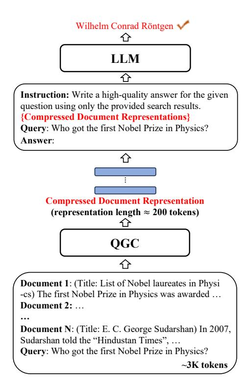

# 3 Query-Guided Compression

As shown in Figure [2,](#page-2-0) we equip the LLM with the Query-Guided Compressor to compress long documents into a much shorter sequence of continuous representations, which are then concatenated with the corresponding instruction and query as the input for the LLM. In the following, we first introduce the architecture of Query-Guided Compressor and then its training objective. Then, we propose a dynamic compression strategy that assigns higher compression ratios for irrelevant documents to further improve the compressed representations.

### 3.1 Compressor Architecture

Figure [3](#page-3-0) illustrates the basic architecture of our Query-Guided Compressor. Using the compressor, we adopt the following steps to produce compressed representations of each document: 1) learning the query-aware document representations; 2) compressing the document representations into ngram representations by weighted pooling; 3) aug-

> **[图片提取文字 (无描述)]:**
> Wilhelm Conrad Röntgen LLM Instruction: Write a high-quality answer for the given question using only the provided search results. {Compressed Document Representations} Query: Who got the first Nobel Prize in Physics? Answer: Compressed Document Representation (representation length  $\approx 200$  tokens) QGC Document 1: (Title: List of Nobel laureates in Physi -cs) The first Nobel Prize in Physics was awarded ... Document 2: ... Document N: (Title: E. C. George Sudarshan) In 2007, Sudarshan told the "Hindustan Times". ... Query: Who got the first Nobel Prize in Physics? ~3K tokens

Figure 2: The framework of our method.

menting the n-gram representations by reviewing the query and the entire document; 4) aligning the obtained representations into the embedding space of the LLM. Particularly, these four steps correspond exactly to the four key components of our compressor, which are all boxed in Figure [3.](#page-3-0) Note that we perform the above operations on each document, thus omitting the index k of the document for simplicity.

Query-Guided Context Encoder At the first step, we feed the concatenation of the query x q and the document x d into query-aware context encoder to learn the representations of the query and the document.

The encoder consists of two Transformer encoder layers. Formally, these representations can be obtained in the following way:

$$[\mathbf{h}^q; \mathbf{h}^d] = \text{ContextEncoder}([\mathbf{x}^q; \mathbf{x}^d]).$$
 (2)

Here, h q={h q i } Nq i=1 and h d={h d i } Nd i=1 are the corresponding representation sequences of the query and the document with the lengths of Nq and Nd, respectively. By allowing the query and the document to see each other during encoding, we can facilitate the extraction of the key information relevant to the query in the document.

**Query-Guided Pooling Layer** In the next step, we split the entire document into several n-grams and compress the information of each n-gram into a vector based on their correlation to the query.

To this end, document representations are organized as follows:

$$\mathbf{h}^{d} = [\mathbf{h}_{G_{1}}^{d}, ..., \mathbf{h}_{G_{j}}^{d}, ..., \mathbf{h}_{G_{N_{g}}}^{d}]$$

$$= [\mathbf{h}_{1:n}^{d}, ..., \mathbf{h}_{(j-1) \times n; j \times n}^{d}, ..., \mathbf{h}_{N_{d}-n+1:N_{d}}^{d}],$$
(3)

where  $\mathbf{G}_j$  represent the indices of the *j*-th *n*-gram.  $N_q = \frac{N_d}{n}$  is the number of *n*-grams.

Then, we measure the weight of each token in  $G_j$  by calculating its relevance with the mean representation  $\overline{h}^q$  of query tokens:

$$\overline{h}^q = \frac{1}{N_q} \sum h_i^q, \tag{4}$$

$$w_{i,\mathbf{G}_{j}} = \frac{\exp s(\overline{h}^{q}, h_{i}^{d})}{\sum_{i' \in \mathbf{G}_{j}} \exp s(\overline{h}^{q}, h_{i'}^{d})},$$
 (5)

where  $s(\cdot,\cdot)$  is the dot-product function, and  $w_{i,G_j}$  represents the weight of the i-th token representation  $h_i^d$  in the document, which belongs to the j-th n-gram.

Finally, we acquire the compressed n-gram representations  $\hat{h}^d_{\mathbf{G}_j}$  as the weighted sum of token representations in the n-gram:

$$\hat{h}_{\mathbf{G}_j}^d = \sum_{i \in \mathbf{G}_i} w_{i,\mathbf{G}_j} \cdot h_i^d. \tag{6}$$

Query-Document Reviewing Layer To further prevent the key information loss in compression, we introduce a novel reviewing module to perfect the compressed n-gram representations by revising both the query and the document representations.

Concretely, this encoder consists of two Transformer encoder layers, which takes the query representations  $\mathbf{h}^q$ , the document representations  $\hat{\mathbf{h}}^d$ , and the compressed n-gram representations  $\hat{\mathbf{h}}^d$  as inputs, and outputs the improved document n-gram representations  $\hat{\mathbf{h}}^d$ :

$$\widetilde{\mathbf{h}}^d = \text{ReviewingLayer}([\mathbf{h}^q; \mathbf{h}^d; \hat{\mathbf{h}}^d]).$$
 (7)

**Semantic Alignment Layer** Since  $\tilde{\mathbf{h}}^d$  lie in a different embedding space with the inputs of the LLM, we use a fully-connected semantic alignment layer to map the n-gram representations into the embedding space of the LLM. The aligned n-gram representations  $\mathbf{e}^d$  can be formulated as follows:

$$\mathbf{e}^d = \mathbf{W} \cdot \widetilde{\mathbf{h}}^d + \mathbf{b},\tag{8}$$

where **W** and **b** are learnable parameters.

> **[图片提取文字 (无描述)]:**
> $e^{d}$ Semantic Alignment Layer Compressed **Document Representations**  $\tilde{\mathbf{h}}^d$ Query-Document Reviewing Layer 企  $\hat{h}_{\mathbf{G}_{2}}^{d}$  $\bar{h}^q$  $\mathbf{h}^d$  $\mathbf{h}^q$ Query-Guided Query-Guided Context Encoder Pooling Layer  $\mathbf{x}^d$  $\mathbf{x}^q$

Figure 3: The structure of QGC. The first three layers use query q to guide document d encoding, pooling, and reviewing respectively. The last layer aligns document representations into the target LLM embedding space.

### 3.2 Compressor Training

Unlike AutoCompressor (Chevalier et al., 2023), we fix the parameter of the LLM and only fine-tune the compressor.

Through the above steps, each long document is compressed into a shorter sequence of continuous representations  $\mathbf{e}^d$ . Thus, the inputs of the LLM are finally formated as  $\widetilde{\mathbf{x}} = (\mathbf{x}^{ins}, \mathbf{e}^{d_1}, ..., \mathbf{e}^{d_k}, ..., \mathbf{e}^{d_K}, \mathbf{x}^q)$ . To avoid missing the key information during compression, we define the training objective of the compressor in the following way:

$$\mathcal{L} = \mathcal{L}_{CE} + \mathcal{L}_{KL}$$

$$= -\log p(\mathbf{y}|\widetilde{\mathbf{x}}) + \text{KL}[p(\mathbf{y}|\mathbf{x})||p(\mathbf{y}|\widetilde{\mathbf{x}})],$$
(9)

where  $KL[\cdot||\cdot]$  represents the Kullback–Leibler divergence. By introducing the KL loss, we encourage the LLM to generate the correct answer even with compressed representations as input.

### 3.3 Dynamically Compressing Strategy

Due to the different importance of retrieved documents, we propose to dynamically adjust the compression ratios for different retrieved documents. Specifically, we assign the n-gram size  $n_k$  for the k-th document based on the importance ranking:

$$n_k = \begin{cases} \min(2 \cdot O_k, 16) & S_k \ge \epsilon \\ \infty & S_k < \epsilon \end{cases}, \tag{10}$$

where  $S_k$  and  $O_k$  is the score and rank of the k-th document acquired by the existing reranker, such as Contriever (Izacard et al., 2022a).  $\epsilon$  is the score threshold for filtering low-score documents. Note that when the assigned n-gram size  $n_k$  is set to  $\infty$ , the corresponding document will be discarded.

| Methods                                    | NaturalQuestions |       |       | TriviaQA |       |       | HotpotQA |       |       |
|--------------------------------------------|------------------|-------|-------|----------|-------|-------|----------|-------|-------|
|                                            | Acc              | CR    | TP    | EM       | CR    | TP    | F1       | CR    | TP    |
| LongChat-13B                               |                  |       |       |          |       |       |          |       |       |
| Closed-book                                | 34.84            | -     | -     | 36.07    | -     | -     | 22.19    | -     | -     |
| Oracle                                     | 83.05            | 59.2x | -     | -        | -     | -     | 60.61    | 42.2x | -     |
| Original Prompt                            | 53.11            | 1.0x  | -     | 48.70    | 1.0x  | -     | 44.76    | 1.0x  | -     |
| Reranker-based Methods                     |                  |       |       |          |       |       |          |       |       |
| Sentence-BERT (Reimers and Gurevych, 2020) | 60.75            | 4.1x  | 0.137 | 48.89    | 4.5x  | 1.957 | 42.92    | 4.4x  | 1.930 |
| BGE-Reranker (Xiao et al., 2023)           | 64.33            | 4.1x  | 0.138 | 47.71    | 4.5x  | 1.724 | 47.96    | 4.4x  | 1.689 |
| Cond.PPL (Jiang et al., 2023)              | 65.91            | 4.1x  | 0.128 | 52.48    | 4.5x  | 1.287 | 49.82    | 4.3x  | 1.267 |
| Compression-based Methods                  |                  |       |       |          |       |       |          |       |       |
| Selective-Context (Li et al., 2023)        | 35.44            | 2.5x  | 0.077 | 42.73    | 2.5x  | 0.465 | 29.68    | 2.6x  | 0.456 |
| LongLLMLingua (Jiang et al., 2023)†        | 66.70            | 3.9x  | -     | -        | -     | -     | -        | -     | -     |
| LongLLMLingua (Jiang et al., 2023)         | 67.01            | 4.1x  | 0.118 | 51.51    | 3.7x  | 0.724 | 45.43    | 3.8x  | 0.683 |
| QGC                                        | 69.19            | 15.2x | 0.356 | 57.72    | 7.9x  | 1.832 | 52.12    | 8.8x  | 1.849 |
| LLaMA-2-7B                                 |                  |       |       |          |       |       |          |       |       |
| Closed-book                                | 32.35            | -     | -     | 30.70    | -     | -     | 10.54    | -     | -     |
| Oracle                                     | 73.45            | 59.2x | -     | -        | -     | -     | 57.68    | 42.2x | -     |
| Original Prompt                            | 27.53            | 1.0x  | -     | 49.47    | 1.0x  | -     | 44.24    | 1.0x  | -     |
| Reranker-based Methods                     |                  |       |       |          |       |       |          |       |       |
| Sentence-BERT (Reimers and Gurevych, 2020) | 24.26            | 4.1x  | 0.133 | 49.49    | 4.5x  | 0.731 | 40.65    | 4.4x  | 0.752 |
| BGE-Reranker (Xiao et al., 2023)           | 25.08            | 4.1x  | 0.130 | 48.69    | 4.5x  | 0.683 | 46.13    | 4.4x  | 0.724 |
| Cond.PPL (Jiang et al., 2023)              | 27.87            | 4.1x  | 0.123 | 52.76    | 4.5x  | 0.602 | 47.84    | 4.3x  | 0.623 |
| Compression-based Methods                  |                  |       |       |          |       |       |          |       |       |
| Selective-Context (Li et al., 2023)        | 31.79            | 2.6x  | 0.082 | 48.55    | 2.5x  | 0.303 | 28.21    | 2.6x  | 0.332 |
| LongLLMLingua (Jiang et al., 2023)         | 41.13            | 4.1x  | 0.108 | 50.44    | 3.7x  | 0.432 | 39.87    | 3.8x  | 0.438 |
| AutoCompressor (Chevalier et al., 2023)    | 49.23            | 13.9x | 0.302 | 29.17    | 8.7x  | 0.823 | 29.02    | 8.1x  | 0.833 |
| ICAE (Ge et al., 2023)                     | 53.34            | 21.5x | -     | 48.91    | 10.2x | -     | 34.50    | 9.5x  | -     |
| QGC                                        | 60.90            | 15.2x | 0.313 | 57.46    | 7.9x  | 0.902 | 51.64    | 8.8x  | 0.927 |
| QGC(ϵ = 0.42)                              | 57.62            | 20.6x | -     | 57.11    | 10.9x | -     | 51.23    | 12.1x | -     |

Table 1: Experimental results on three benchmark datasets. Acc = accuracy, EM = exact match, F1 = F1 score, CR = compression ratio, TP = throughput (examples/second). Closed-book, Oracle, and Original Prompt denote using the query only, the complete ground-truth documents, and all retrieved documents as inputs, respectively. † indicates that the results are directly cited from [Jiang et al.](#page-9-5) [\(2023\)](#page-9-5).

