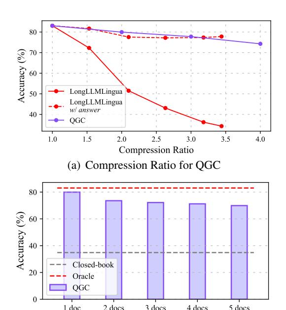

# 4 Experiments

In this section, we conduct extensive experiments to investigate the effectiveness of QGC.

Datasets & Evaluation Metric The experiments are carried out based on the three datasets:

- NaturalQuestions We select the processed version [\(Liu et al.,](#page-9-8) [2023\)](#page-9-8) where each question has 20 related documents and only one of them contains the correct answer. We follow [Liu et al.](#page-9-8) [\(2023\)](#page-9-8) to use accuracy (Acc) as the evaluation metric, which judges whether the correct answer appears in the prediction.
- TriviaQA We employ the adversarial Con-

triever [\(Izacard et al.,](#page-9-9) [2022a\)](#page-9-9) to retrieve the top 10 documents from all Wikipedia passages. Following [Lewis et al.](#page-9-4) [\(2020\)](#page-9-4), we use the Exact Match (EM) metric to evaluate the LLM prediction.

• HotpotQA Different from the above two datasets, HotpotQA [\(Yang et al.\)](#page-10-2) is a multihop dataset where the answer lies in more than one document. Specifically, each question has 10 related documents and two of them are ground-truth documents. Following [Yang](#page-10-2) [et al.,](#page-10-2) we use the F1 score to measure the correctness of the LLM.

Besides, we calculate the compression ratio (CR)

for different methods, which is defined as the length rate of the original context to the compressed context. We also provide the inference throughput (TP) on a single A100-80G GPU, including compression and generation.

Baselines Following [\(Jiang et al.,](#page-9-5) [2023\)](#page-9-5), we include two sets of methods as our baselines.

- 1) *Reranker-based Methods*. It simply uses a reranker method to sort documents based on importance and discards unimportant ones. We select the following reranker: Sentence-BERT [\(Reimers](#page-9-10) [and Gurevych,](#page-9-10) [2020\)](#page-9-10), BGE-Reranker [\(Xiao et al.,](#page-10-1) [2023\)](#page-10-1), and Cond.PPL proposed by [Jiang et al.](#page-9-5) [\(2023\)](#page-9-5) to measure the association between the query and documents. Then, we discard documents with low association until the compression ratio is met and sort the remaining documents according to the association from high to low.
- 2) *Compression-based Methods*. Compared with reranker-based methods, they further compress the sorted documents, retaining more information while satisfying a higher compression ratio. We select the following methods as our baselines:
  - Selective-Context [\(Li et al.,](#page-9-6) [2023\)](#page-9-6) It uses selfinformation estimated by an external language model to prune redundant words.
  - LongLLMLingua [\(Jiang et al.,](#page-9-5) [2023\)](#page-9-5) It is the state-of-the-art method for long context compression. It first uses a language model to quantify the importance of each document as its question-aware perplexity, and then designs a question-aware coarse-to-fine compression method to delete unimportant tokens.
  - AutoCompressor [\(Chevalier et al.,](#page-8-1) [2023\)](#page-8-1) It fine-tunes LLaMA-2-7B to recursively compress long context into summary vectors, which are used as soft prompts to generate the answer. We use the released AutoCompressor-Llama-2-7B-6K for experiments.
  - ICAE [\(Ge et al.,](#page-8-2) [2023\)](#page-8-2) Similar to AutoCompressor, it generates compact and informative memory slots to represent the original context. We use the released ICAE model pre-trained on Llama-2-7B-Chat for experiments [5](#page-5-0) .

Implementation Details We use LongChat-13B-16K and LLaMA-2-7B as the LLMs for evaluation,

| Methods                              | Accuracy |
|--------------------------------------|----------|
| QGC                                  | 69.19    |
| w/o query-guided context encoder     | 50.36    |
| w/o query-guided pooling layer       | 55.34    |
| w/o query-document reviewing layer   | 64.14    |
| w/o dynamically compressing strategy | 62.15    |

Table 2: The accuracy of ablation study on NaturalQuestions test set, where the target LLM is LongChat-13B.

which are frozen during the optimization of QGC. To ensure stable and reproducible results, we employ greedy decoding and set the temperature to 0 in all experiments. Following [Jiang et al.](#page-9-5) [\(2023\)](#page-9-5), we use LLaMA-2-7B-Chat as the external language model for Selective-Context and LongLLMLingua. For QGC, both the query-guided context encoder and query-document reviewing layer consist of two Transformer encoder layers. All these layers and word embeddings are initialized with LLaMA-2- 7B where MLP parameters are all fixed during training. Our rationale behind this approach stems from our belief that the MLP plays a crucial role in knowledge retention, while our focus lies in adjusting the acquired knowledge based on query. Thus, the trainable parameters in QGC are only 3.5% of LongChat-13B-16K. Besides the ground-truth document, we concatenate 1-4 random documents to build the long context. We also randomly set the n-gram size from the candidate list (4, 6, 8, 10) for each training batch to make the compressor more robust. We train QGC on downstream datasets for 15 epochs, using a learning rate of 5e-5 with the Adam optimizer and batch size of 64. During inference, we use the Cond.PPL proposed by [Jiang](#page-9-5) [et al.](#page-9-5) [\(2023\)](#page-9-5) to sort retrieved documents for all compression-based methods and QGC, and set the ϵ as 0.35. Following [\(Liu et al.,](#page-9-8) [2023;](#page-9-8) [Bai et al.,](#page-8-3) [2023\)](#page-8-3) the maximum generation tokens is 100 for NaturalQuestions, and 32 for both TriviaQA and HotpotQA. All experiments are conducted on 8 NVIDIA A100 GPUs.

Main Results Table [1](#page-4-0) reports the performance, compression ratios, and throughput of various methods or models on different datasets. Overall, QGC achieves higher compression ratios and greater throughput while achieving comparable or even better performance with LongLLMLingua. These results demonstrate that QGC can effectively compress context into shorter inputs.

Specifically, the performance and compression ratio of the reranker-based methods are limited

5 https://github.com/getao/icae

> **[图片提取文字 (无描述)]:**
> 80 70 Accuracy (%) 60 LongLLMLingua 50 LongLLMLingua w/ answer 40 QGC 2.0 2.5 3.0 1.0 1.5 3.5 4.0 Compression Ratio (a) Compression Ratio for QGC 80 Accuracy (%) 60 40 Closed-book 20 -Oracle QGC 0 1 doc 2 docs 3 does 4 docs 5 docs

(b) Document Number for QGC Figure 4: The accuracy of QGC with varying compression ratios and number of documents, respectively.

because no compression operation is used within the document. Compared to AutoCompressor and ICAE, our method achieves better accuracy with comparable compression ratios. Compared with LongLLMLingua, QGC achieves average +5.03 and +12.87 performance improvements when using LongChat-13B and LLaMA-2-7B as the target LLMs. On average, the compression ratio and throughput of QGC are 2.75 times and 2.47 times that of LongLLMLingua on all datasets and target LLMs, respectively.

Ablation Study To explore the effect of different components on QGC, we use LongChat-13B as the target LLM and introduce the following variants of QGC for ablation study: 1) w/o queryguided context encoder. In this variant, the query and document are independently encoded; 2) w/o query-guided pooling layer. When establishing this variant, we directly replace the weighted sum of token representations in each n-gram with their mean representation; 3) w/o query-document reviewing layer. This variant no longer refines the compressed representations of n-grams; 4) w/o dynamically compressing strategy. We fix the n-gram size as 4 for comparable comparison.

As shown in Table 2, the absence of the query-document reviewing layer and dynamically compressing strategy lead to a 5.05 and 7.04 accuracy loss respectively. The more substantial loss is observed after removing the query-guided context encoder and query-guided pooling layer, resulting

| Methods         | SS   | ST-2  | GSM8K |       |  |  |
|-----------------|------|-------|-------|-------|--|--|
|                 | Acc  | CR    | Acc   | CR    |  |  |
| Original Prompt | 92.4 | 1.0x  | 14.48 | 1.0x  |  |  |
| LongLLMLingua   | -    | -     | 5.91  | 3.9x  |  |  |
| AutoCompressor  | 94.2 | 15.0x | 6.68  | 13.6x |  |  |
| QGC             | 94.8 | 23.3x | 14.18 | 13.4x |  |  |

Table 3: Experimental results on SST-2 and GSM8K datasets, where the target LLM is LLaMA-2-7B.

in a significant performance accuracy drop of 18.83 and 13.85 respectively, highlighting the importance of employing the query to guide compression.

### 5 Analysis

In this section, we conduct in-depth analyses to explore the performance of QGC in terms of key information loss, demonstration compression, detailed throughput and reranker impact. All analyses are conducted on NaturalQuestions with target LLM as LongChat-13B.

**Key Information Loss in QGC** As described in Section 2.2, previous methods dramatically lose key information as the compression ratio increases. For comparison, we experiment with QGC using the same setting.

Compared to LongLLMLingua in Figure 4(a), the performance of QGC only decreases 10% as the compression ratio increases from 1x to 4x, and is even comparable to that of LongLLMLingua containing the correct answer in the compressed result. As seen in Figure 4(b), we observe that the performance of QGC slightly degrades with more documents, which is only a 12% decrease with 4 documents (27% for AutoCompressor). These results demonstrate that QGC can effectively retain key information even in much longer context and higher compression ratio scenarios.

**Demonstration Compression for In-Context Learning** To further validate the effectiveness of QGC in a broader context, we conduct experiments on both SST-2 and GSM8K datasets. We adopt the approach of previous studies (Chevalier et al., 2023; Wei et al., 2022) which utilizing demonstrations as the document, while maintaining consistency with their experimental setup. The results in Table 3 reveals notable insights. On the SST-2 dataset, our method surpasses autocompressor in both compression ratio and accuracy. Meanwhile, on the GSM8K dataset, our accuracy performance remains on par with the original prompt

> **[图片提取文字 (无描述)]:**
> 2.5 Generation Throughput (examples/s) Compression 2.0 Acc=68.02 Acc=69.19 1.5 1.0 Acc=52.89 Acc=67.010.5 0.0 QGC QGC LongLLMLingua LongLLMLingua (CR=20.6x) (CR=15.2x)(CR=13.9x) (CR=4.1x)

Figure 5: The accuracy, compression throughput, and generation throughput of QGC and LongLLMLingua.

at the same compression ratio as autocompressor. This suggests that QGC strikes an excellent balance between model performance and compression ratio. These results showcases QGC's proficiency in preserving information from demonstrations and fostering the in-context learning capacity of the target LLM.

**Detailed Throughput Evaluation** To evaluate the throughput of various methods or models, encompassing both compression and generation, we perform testing on a single A100-80G GPU.

The results presented in Figure 5 indicate that QGC is obviously higher than LongLLMLingua in both compression throughput and generation throughput. Moreover, by adjusting the hyperparameter  $\epsilon$  (See Equation 10) to increase the compression ratio, QGC can achieve a higher compression ratio while minimizing the impact on LLM performance and further improving throughput. Furthermore, our higher compression ratios lead to shorter LLM input, which also significantly improves the generation throughput of the target LLM. As for LongLLMLingua, since it additionally introduces LLaMA-2-7B for compression, the compression throughput is significantly lower than ours. Besides, although LongLLMLingua can also improve compression ratio by adjusting hyper-parameters, its performance will significantly drop, while OGC still maintains excellent performance.

Impact of Different Rerankers The compression ratio for each document is determined by the corresponding correlation with the query obtained by a reranker. Here, we analyze the impact of using different rerankers in this process. In addition to the three methods introduced in reranker-based methods, we also include BM25 and Gzip (Jiang et al., b) for comparison.

Experimental results are shown in Figure 6. It can be found that QGC performs better with more competitive rerankers. Besides, compared with di-

> **[图片提取文字 (无描述)]:**
> Base (avg. CR = 4.1x) 70 QGC (avg. CR = 15x) Accuracy (%) 50 30 BM25 Gzip BGE-Reranker Cond.PPL

Figure 6: The performance of QGC using different rerankers. "Base" represents the performance of each reranker to be used for compression. The performance (Recall) of rerankers: Cond.PPL > BGE-Rererank > SBERT (Sentence-BERT) > Gzip > BM25.

rectly using rerankers for compression, QGC not only achieves an average 2.65 times higher compression ratio but also maintains lossless or even improved performance.

#### 6 Related Work

Long Context for LLMs Recently, there have been a lot of studies focusing on expanding the context length of LLMs (Press et al., 2021; Peng et al., 2023; Bertsch et al., 2023). Existing efforts primarily involve gradually increasing the window size during pre-training (Nijkamp et al., 2023), interpolating position embeddings (Chen et al., 2023), and modifying the attention mechanism (Ding et al., 2023). Unlike these works, we do not directly aim to expand the context window of LLMs. Hence, the QGC that we proposed can complement these techniques by enabling LLMs to access a broader context with reduced cost and shorter latency.

**Retrieval-augmented LMs** Combined with a standalone retriever to augment LMs are gaining popularity for benefiting various knowledgeintensive tasks. Previous studies have achieved remarkable results in improving perplexity (Wang et al., 2023a), factual accuracy (Nakano et al., 2022), downstream task performance (Izacard et al., 2022b), and in-context learning (Huang et al., 2023). Besides, many works focus on cooperating LLMs and retrieved documents, such as reranking retrieved documents (Mao et al.) and discarding irrelevant documents (Mallen et al.). QGC is also a retrieval augmentation method for LLMs, which efficiently compresses the retrieved documents into shorter inputs while maintaining no significant performance degradation.

**Context Compression** With the growing context length in LLMs, the demand for higher ef-

ficiency, lower cost, and reduced latency has attracted much attention. As a promising solution, compression techniques can be broadly categorized into two types: black-box compression [\(Xu](#page-10-0) [et al.,](#page-10-0) [2023\)](#page-10-0) and white-box compression [\(Wang](#page-9-7) [et al.,](#page-9-7) [2023b\)](#page-9-7). Black-box compression primarily involves token pruning based on different importance measures, such as self-information [\(Li](#page-9-6) [et al.,](#page-9-6) [2023\)](#page-9-6) and the LLM perplexity [\(Jiang et al.,](#page-9-21) [a,](#page-9-21) [2023\)](#page-9-5). On the other hand, white-box compression focuses on generating summarization or compressing the context into soft prompt through fine-tuning or Low-Rank Adaptation (LoRA). For instance, [Wang et al.](#page-9-7) [\(2023b\)](#page-9-7) autoregressively generates filtered content and fine-tunes target LLM to use it for generation. [Mu et al.](#page-9-22) [\(2023\)](#page-9-22) trains LLMs to compress instructions into concise key-value attention prefixes. [Chevalier et al.](#page-8-1) [\(2023\)](#page-8-1) recursively compresses lengthy text into summary vectors, while [Ge et al.](#page-8-2) [\(2023\)](#page-8-2) generates memory slots to represent the original context. Compared with the above-mentioned compression studies, QGC's design fully takes into account the query, which leads to the enhanced retention of key information, higher compression ratios, higher throughput, and improved overall performance.

