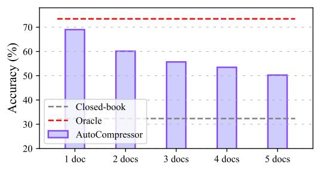

# Retaining Key Information under High Compression Ratios: Query-Guided Compressor for LLMs

Zhiwei Cao1,3\*, Qian Cao2\*, Yu Lu2, Ningxin Peng2, Luyang Huang2 Shanbo Cheng2† and Jinsong Su1,3†

1School of Informatics, Xiamen University 2ByteDance Research 3Shanghai Artificial Intelligence Laboratory

lines1@stu.xmu.edu.cn {caoqian.95, luyu.ly, chengshanbo}@bytedance.com jssu@xmu.edu.cn

### **Abstract**

The growing popularity of Large Language Models has sparked interest in context compression for Large Language Models (LLMs). However, the performance of previous methods degrades dramatically as compression ratios increase, sometimes even falling to the closedbook level. This decline can be attributed to the loss of key information during the compression process. Our preliminary study supports this hypothesis, emphasizing the significance of retaining key information to maintain model performance under high compression ratios. As a result, we introduce Query-Guided Compressor (QGC), which leverages queries to guide the context compression process, effectively preserving key information within the compressed context. Additionally, we employ a dynamic compression strategy. We validate the effectiveness of our proposed QGC on the Question Answering task, including NaturalQuestions, TriviaQA, and HotpotQA datasets. Experimental results show that QGC can consistently perform well even at high compression ratios, which also offers significant benefits in terms of inference cost and throughput1.

#### 1 Introduction

The emergence of chatGPT (Ouyang et al., 2022) and GPT4 (OpenAI, 2023), along with other Large Language Models (LLMs) (Touvron et al., 2023a,b) has sparked a global sensation. The success of LLMs is closely tied to the long context capabilities of LLMs (Dong et al., 2022; Lewis et al., 2020), especially in the field of multi-document question answering. However, the utilization of long context also introduces challenges such as higher inference cost, longer latency, and inferior perfor-

mance caused by redundant information (Jiang et al., 2023).

Many efforts have been made to compress the long context by directly removing a certain percentage of less important words, such as LongLLMLingua (Jiang et al., 2023) and Selective-Context (Li et al., 2023). Another common method is to generate a text summary of the given context (Xu et al., 2023; Wang et al., 2023b). Unlike deleting or reordering the word in the context, AutoCompressor (Chevalier et al., 2023) compresses long documents into multiple vectors as soft prompts, which are optimized with full parameters of LLMs. However, our preliminary study shows that these methods have a common flaw: as the compression ratio increases, the compressed context fails to retain key information, resulting in a significant decrease in the performance of LLMs.

The key to solve this problem is query, which defines what key information is. We aim to preserve this query-related key information even at a high compression ratio. Specifically, we propose the Query-Guided Compressor (QGC) to fully utilize query information throughout each compression step. We first feed the query and the documents together into a context encoder to learn the queryguide document representations. We then compress these document representations into n-gram representations guided by the importance of each word in relation to the query. Subsequently, we propose to augment the n-gram representations by reviewing the query and document, which are finally aligned to the embedding space of the LLMs. We further propose dynamically adjusting the compression ratio of each document based on its relevance to the query. Compared to previous methods, QGC has several advantages: 1) high compression ratios by retaining most query-related information during compression, 2) low training costs by optimizing the compressor only instead of finetuning the entire LLM, and 3) better semantic consistency by com-

\*These authors contributed equally. This work was done when Zhiwei Cao was interning at ByteDance.

&lt;sup>†Corresponding author.

&lt;sup>1Our code is available at https://github.com/ DeepLearnXMU/QGC.

pressing the n-gram structure rather than deleting words.

We validate the effectiveness of QGC on the multi-document Question Answering task, including three datasets: NaturalQuestions, TriviaQA, and HotpotQA. Experimental results on the QA task indicate that, compared to LongLLMLingua, OGC exhibits a 2.75 times higher compression ratio and a 2.42 times higher throughput. Additionally, its accuracy has improved by an average of 5 points. We further investigated the loss of key information throughout the compression process. The findings reveal that under high compression ratios and high noise conditions, QGC only incurs a performance loss of about 10%, while LongLLM-Lingua suffers a loss of approximately 47%. This validates the effectiveness of QGC in retaining key information.

### 2 Preliminary Study

In this section, we first briefly formulate the long context compression on the Question Answering task, and then present an analysis on the key information loss in previous compression methods.

### 2.1 Task Formulation

Given a LLM input with augmented context  $\mathbf{x} = (\mathbf{x}^{ins}, \mathbf{x}^{d_1}, ..., \mathbf{x}^{d_k}, ..., \mathbf{x}^{d_K}, \mathbf{x}^q)$ , which consists of the instruction  $\mathbf{x}^{ins}$ , K documents  $\{\mathbf{x}^{d_k}\}_{k=1}^K$ , and the query  $\mathbf{x}^q$ , the objective of context compression can be formulated as:

$$\min_{\widetilde{\mathbf{y}}} d(\text{LLM}(\mathbf{y}|\mathbf{x}), \text{LLM}(\widetilde{\mathbf{y}}|\widetilde{\mathbf{x}})), \tag{1}$$

where  $\mathbf{y}$  is the ground-truth answer and  $\widetilde{\mathbf{y}}$  represents the output of the LLM with the compressed context  $\widetilde{\mathbf{x}}$  as the input.  $d(\cdot,\cdot)$  is a function measuring the distance between two distributions, such as KL divergence. In this work, we focus on compressing K retrieved documents that greatly determine the length of the input.

#### 2.2 Key Information Loss in Compression

We study the effectiveness of two representative methods, LongLLMLingua (Jiang et al., 2023) and AutoCompressor (Chevalier et al., 2023). We conduct experiments on the NaturalQuestions dataset (Liu et al., 2023) and use accuracy as the evaluation metric, which judges whether any correct answers appear in the LLM prediction.

> **[图片提取文字 (无描述)]:**
> 80 70 Accuracy (%) 60 Closed-book Oracle 50 LongLLMLingua LongLLMLingua w/ answer 40 2.00 2.50 2.75 1.50 1.75 2.25 3.00 3.25 3.50 Compression Ratio

(a) Compression Ratio for LongLLMLingua

> **[图片提取文字 (无描述)]:**
> 70 60 Accuracy 50 40 Closed-book Oracle 30 AutoCompressor 3 docs 4 docs 5 docs 1 doc 2 docs

(b) Document Number for AutoCompressor

Figure 1: The accuracy of LongLLMLingua (Jiang et al., 2023) and AutoCompressor (Chevalier et al., 2023) with different compression ratios and number of documents on the NaturalQuestions test set, respectively. Closedbook denotes providing LLMs with the question only, and Oracle means using the question and corresponding ground-truth documents as the input of the LLM. "w/answer" means adding the golden answer to the compressed context.

For LongLLMLingua, we apply LLaMA-2-7B-Chat2 as the small language model for compression, and use LongChat-13B-16K3 as the target LLM. We use the open-source AutoCompressor4, which fine-tunes LLaMA-2-7B to compress context and generate answers. Here, we consider four settings:

- **Closed-book**. It takes the query as the LLM input with no additional documents.
- Oracle. The query and only the document containing the ground truth are used as inputs to the LLM.
- Base. Based on Oracle, we compress the document directly with various compression ratios for LongLLMLingua. However, since Auto-Compressor is set to compress documents to fixed length vectors, we change the compression ratio by adding external documents.

2https://ai.meta.com/llama/

&lt;sup>3https://huggingface.co/lmsys/longchat-13b-16k

&lt;sup>4https://github.com/princeton-nlp/AutoCompressors

• Base *w/ answer*. We manually add key information to the compressed results by concatenating the answer with the compressed word sequence in LongLLMLingua. Note that this setting is impractical for AutoCompressor where the compressed results are vectors that cannot be changed directly.

From Figure [1,](#page-1-3) we find that the performance of both methods degrades significantly with increasing compression ratios. As shown in Figure [1\(a\),](#page-1-4) the performance of LongLLMLingua decreases by 47% as the compression ratio increases from 1.53x to 3.44x. Even worse, the accuracy of LongLLM-Lingua at 3.44x compression ratio is equivalent to that of the closed-book setting. The same findings are illustrated in Figure [1\(b\)](#page-1-5) for AutoCompressor.

More importantly, we observe that adding key information to the compressed result can greatly alleviate the performance degradation that typically occurs at high compression ratios. Back to Figure [1\(a\),](#page-1-4) the accuracy line fluctuates little as the compression ratio increases from 1.5x to 3.5x with the help of additional key information, which is a decrease of 3.87% compared to the former 47% with the loss of key information. These observations validate the need to preserve key information during compression, which motivates us to explore a better method to fully exploit query information for context compression.

