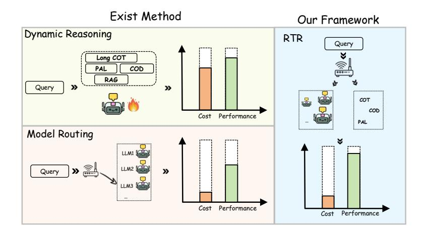

# 1 Introduction

With the continuous advancement of large language models (LLMs), their generality and autonomy have demonstrated human-like or even superhuman capabilities. In this context, reasoning ability has undoubtedly become the core driver of intelligent agent behavior [\[1\]](#page-9-0). Consequently, an increasing number of reasoning models [\[2–](#page-9-1)[4\]](#page-9-2) and reasoning strategies [\[5–](#page-9-3)[11\]](#page-9-4) have emerged. These expert models and reasoning strategies synergize and evolve, collectively pushing the boundaries of language models' reasoning capabilities.

This raises a critical question worthy of in-depth exploration: Given such a rich selection space of expert models and reasoning strategies, *how can we efficiently identify the most suitable pairing within their combinatorial space?*

Intuitively, one might prefer combining powerful reasoning models (e.g., o3 [\[12\]](#page-9-5)) with sophisticated reasoning strategies (e.g., Chain-of-Thought [\[13\]](#page-9-6)) to tackle complex problems. Particularly under the guidance of the test-time scaling paradigm, allocating a high budget to enhance performance appears to be a natural choice.

However, this intuition-driven, fixed pairing approach may face two key challenges in practice: Performance bottlenecks: Existing research [\[14](#page-9-7)[–21\]](#page-10-0) suggests that "overthinking" can trap the reasoning process in protracted local reasoning patterns, limiting the model's ability to deviate from the current reasoning path, thereby degrading performance. Budget inefficiency: For low-difficulty tasks, employing high-performance models and complex strategies not only fails to yield significant

> **[图片提取文字 (无描述)]:**
> Exist Method Our Framework Dynamic Reasoning RTR Query Long COT COD RAG Query >> \*\*\*\*\*\*\*\*\*\*\*\*\*\*\*\*\*\*\*\*\*\*\*\*\*\*\*\*\*\*\*\*\*\*\*\*\*\*\* COT COD Cost Performance PAL ..... Model Routing Query Cost Performance Cost Performance

Figure 1: We propose Route-to-Reason (RTR), a low-cost and flexible expert selection framework capable of jointly optimizing model and strategy selection.

gains but also leads to resource waste. We believe "less is more": lighter expert-strategy pairings often achieve better cost-performance trade-offs.

Some prior explorations have focused on model routing [\[22](#page-10-1)[–31\]](#page-10-2), enabling the system to select the most suitable model from a pool based on the input. However, most existing routing methods overlook the intricate relationship among expert model performance, reasoning strategies, and input complexity, often resulting in suboptimal decisions. While the works of [\[16,](#page-9-8) [32](#page-10-3)[–36\]](#page-10-4) approach the problem from the perspective of dynamic reasoning strategy selection. These approaches, with the goal of tailoring the reasoning process to input characteristics, enhance performance and enable dynamic scaling at test time. Substantial performance variation across expert-strategy combinations and input difficulties remains underexplored. A principled approach to modeling these differences and selecting models accordingly could further improve performance and efficiency.

To address this, we propose a unified framework for joint model and strategy routing, enabling efficient and accurate test-time computation through dynamic selection. Specifically, we represent each expert and each reasoning strategy using learnable vector that capture their respective performance and computational cost characteristics. Given an input instance, we encode the query using a pretrained LM. Then, we design two modules to predict the expected performance and response tokens for all model-strategy combinations, thereby constructing a routing table. Based on this table, a routing policy selects the optimal model-strategy pair that maximizes efficiency while improving accuracy.

Compared to previous approaches, our framework dynamically adapts to questions of varying difficulty and intelligently selects the most appropriate model-strategy pair for each query. This leads to a more optimal trade-off between computational cost and reasoning performance. The key distinctions between our approach and existing methods are illustrated in Figure [1.](#page-1-0) Existing methods often fail to achieve an optimal balance between cost and performance. In contrast, by jointly selecting both the model and the reasoning strategy, our framework achieves superior performance at a reduced computational cost.

We conduct experiments on seven challenging reasoning tasks (language understanding, scientific reasoning and mathematical reasoning) to evaluate the proposed RTR in both in-distribution and out-of-distribution settings. Results show that our approach consistently improves reasoning accuracy while reducing the average number of generated tokens by over 60% compared with single best model, validating its effectiveness.

