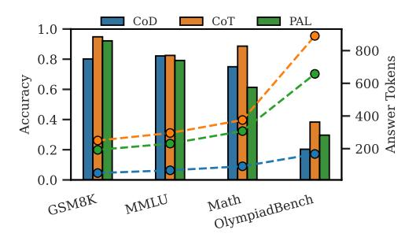

# 2 Methodology

### 2.1 Motivation

Recently, reasoning-enhanced language models have demonstrated strong performance on complex tasks by leveraging extended reasoning steps and structured thinking [\[3,](#page-9-9) [4\]](#page-9-2). However, their advantages tend to diminish on simpler problems. As illustrated in Figure [2,](#page-2-0) while the thinking model (QwQ)

<span id="page-2-0"></span>> **[图片提取文字 (无描述)]:**
> QwQ-32B Owen2.5-14B 1.0 8000 8.0 6000 Accuracy 0.6 4000 0.4 2000 0.2 MMLU OlympiadBench GSM8K Math


> **[图片提取文字 (无描述)]:**
> CoD CoT PAL 1.0 800 0.8 900 900 900 900 900 900 900 900 900 900 Accuracy 0.6 0.4 0.2 Math OlympiadBench GSM8K MMLU


Figure 2: Performance and average answer tokens distribution of two different LLMs when responding to queries from subsets of four reasoning tasks.

Figure 3: Performance and average answer tokens distribution of Qwen2.5-14B-Instruct under different reasoning strategies when responding to queries from subsets of four reasoning tasks.

shows substantial improvements over the non-thinking model (Qwen2.5-14B-Instruct) on complex tasks such as Math [37] and OlympiadBench [38], it offers only marginal improvements or even slight performance drops on relatively straightforward and commonsense tasks like GSM8K [11] and MMLU [39], despite incurring significantly higher inference costs, often generating up to 10 times more tokens. This highlights a critical challenge: rather than universally deploying heavy reasoning models, it becomes essential to determine when such complex reasoning is truly necessary.

Moreover, we observe that reasoning strategies play as crucial a role as model selection. As shown in Figure 3, strategies such as CoD [8] prompting can significantly reduce answer length while achieving performance comparable to CoT [13] prompting on easier tasks. Additionally, PAL [7] performs well on arithmetic-intensive tasks and generates more consistent outputs. These observations motivate our approach: jointly selecting both the model and the reasoning strategy for each input query enables adaptive, cost-effective inference while maintaining strong overall performance.

#### 2.2 Problem Formulation and Preliminaries

We consider a collection of language models  $\mathcal{M}=\{m_j:j=1,\ldots,M\}$ , each differing in size or capability, and a set of reasoning strategies  $\mathcal{S}=\{s_k:k=1,\ldots,K\}$ . Given a set of input queries  $\mathcal{D}=\{x_i:i=1,\ldots,N\}$ , applying model  $m_j$  with strategy  $s_k$  to query  $x_i$  yields a response characterized by two quantities: the performance score  $a_{i,j,k}$  (e.g., accuracy, utility, or another task-specific metric), and the number of generated tokens  $l_{i,j,k}$  serving as a proxy for inference cost. Our objective is to predict these two quantities and select an appropriate model-strategy pair  $(m_j,s_k)$  based on these quantities for each query  $x_i$ . Formally, we seek to learn a routing function:

$$\pi: \mathcal{X} \to \mathcal{M} \times \mathcal{S}$$
,

where  $\pi(x_i) = (j^*, k^*)$  denotes the selected model and strategy for  $x_i$ . The objective is to optimize the trade-off between total performance and total generation cost:

$$\max_{\pi} \sum_{i=1}^{n} a_{i,j^*,k^*} - \lambda \sum_{i=1}^{n} l_{i,j^*,k^*},$$

where  $\lambda > 0$  is a hyperparameter that balances performance and efficiency,  $a_{i,j^*,k^*}$  and  $l_{i,j^*,k^*}$  denote the performance and generated length, respectively.

### 2.3 RTR Framework

**Method Overview.** As shown in Figure 4, for each input question, we first encode it into a dense vector representation using a pretrained encoder. Additionally, each candidate model and reasoning strategy is represented by an embedding that captures its characteristics, such as performance capability and computational cost. These embeddings, together with the question representation, are concatenated and passed into two predictors: one estimates the expected performance, and the other predicts the expected answer length. This yields a routing table for each question containing the predicted performance and token usage for every model-strategy pair. Finally, a routing policy, controlled by a trade-off coefficient between performance and cost, selects the optimal model

<span id="page-3-0"></span>> **[图片提取文字 (无描述)]:**
> Easy Candidate Reasoning Strategies Terry eats 2 yogurts a day. Accuracy They are currently on sale at 4 Routing Table for Each Query (:) PAL CoT CoD yogurts for \$5.00. How much Efficiency does he spend on yogurt over Textual descriptions 30 days? Strategy | Performance Model Tokens Learnable Owen2.5-3B + PAL Parameters Medium Owen2.5-7B CoT 0.52 310 4354 Alicia's average on her five tests is 88 points. The score range for 0.79 150 Owen2.5-14B CoD each test is 0 points to 100 Hard Y.S. points, inclusive. What is the Encoder QwQ-32B + CoT \_\_000 lowest possible score that Alicia 280 Owen2.5-7B PAL 0.84 could have earned on one of Medium the five tests? Deepseek-R1-CoT 0.88 1500 14B auestions strategies models Owen2.5-7B + CoD Hard Textual QwQ-32B CoD 0.95 2100 descriptions A circle passes through the origin and the points of intersection of Learnable Parameters ... ... the parabolas  $y = x^2 - 3$  and y  $=-x^2-2x+9$ . Determine the Owen2.5-3B QwQ-32B Owen2.5-14B coordinates of the center of this circle. Candidate Models


Figure 4: The RTR first encodes the input question, available models, and reasoning strategies. Two predictor modules then estimate the expected performance and token usage for each model-strategy combination, generating a routing table. Finally, the router selects the most suitable model-strategy pair that balances accuracy and efficiency for each question.

and strategy combination for each query. The training and inference procedures are provided in Algorithm 1.

Model and Strategy Representation. The prediction performance for each model-strategy pair critically depends on how well their characteristics are represented. To this end, we design a dual-component representation for each model and strategy. The first component is obtained by encoding a textual description of the model or strategy using a pretrained encoder, similar to how we encode input questions. These descriptions are generated using an auxiliary LLM aiming to capture high-level semantic attributes such as capability and usage scenarios. The detailed textual descriptions used for models and strategies are provided in Appendix B.3. This component is fixed during training. The second component is a randomly initialized embedding that is learned and updated during training. This learnable component enables the model to capture fine-grained behavioral nuances and task-specific adaptation signals that may not be easily conveyed through textual descriptions. These two components combine external knowledge and internal task-specific patterns to form a comprehensive representation.

**Dual Prediction Module.** After obtaining the representations of the query, model, and strategy, we construct two predictor modules to estimate the response quality and output token usage of each model-strategy combination for a given query. Specifically, we use multi-layer perceptron (MLP) for each prediction task. These predictors are trained independently using their respective loss functions.

The performance prediction module estimates the likelihood that a given model-strategy pair will correctly answer the input query. Since the correctness labels in the training data are binary, we use a binary cross-entropy loss:

$$\hat{a}_{i,j,k} = \text{MLP}_{\text{perf}}(z_{i,j,k}), \quad \mathcal{L}_{\text{perf}} = -y \log(\hat{a}_{i,j,k}) - (1-y) \log(1 - \hat{a}_{i,j,k}),$$
 (1)

where  $z_{i,j,k}$  denotes the input to the performance predictor for query i and model-strategy pair (j,k), and y is the ground-truth correctness label.

The token usage prediction module estimates the expected number of output tokens required to generate a response. As this is a regression task, we adopt mean squared error (MSE) loss:

$$\hat{l}_{i,j,k} = \text{MLP}_{\text{len}}(z_{i,j,k}), \quad \mathcal{L}_{\text{len}} = \left(\hat{l}_{i,j,k} - l_{i,j,k}\right)^2, \tag{2}$$

where  $z_{i,j,k}$  denotes the input to the token usage predictor, and  $l_{i,j,k}$  is the ground-truth response length.

**Routing Table and Routing Policy.** Inspired by routing concepts in computer networks, we design a routing mechanism based on a predicted performance-cost table. For each query, we generate a routing table that organizes the predicted performance and output tokens for all combinations

of candidate models and strategies as shown in Figure 4. This table encapsulates the necessary decision-making information, akin to a routing table in network systems, and serves as the foundation for downstream routing decisions.

To determine the best routing destination for a given query, we propose a simple yet effective scoring function. The final routing score  $s_{n,l,s}$  for query  $q_n$  routed to model l with strategy s is computed as a weighted combination of predicted performance and cost:

$$score_{i,j,k} = \lambda \cdot \hat{a}_{i,j,k} - (1 - \lambda) \cdot \hat{l}_{i,j,k}. \tag{3}$$

Here,  $\hat{a}_{i,j,k}$  and  $\hat{l}_{i,j,k}$  denote the predicted performance score and predicted cost (e.g., based on output length) respectively. The parameter  $\lambda \in [0,1]$  controls the trade-off between quality and cost: a higher  $\lambda$  prioritizes performance (quality-first), while a lower  $\lambda$  encourages cost-efficiency. The optimal routing decision is then made by selecting the candidate with the highest score:

$$(j^*, k^*) = \arg\max_{j,k} score_{i,j,k}.$$
(4)

This approach offers flexibility in adapting to different application needs. For instance, by tuning  $\lambda$ , users can customize the system to prefer higher-quality responses, lower costs, or a balanced trade-off between the two. We do experiments to show its effectiveness.

## 3 Experiment

#### 3.1 Experimental Setup

Candidate LLMs and Strategies. We choose six open-source LLMs from HuggingFace<sup>1</sup>: Non-thinking models[3] include Qwen2.5-3B, Qwen2.5-7B, and Qwen2.5-14B, which are general-purpose models designed for a wide range of tasks, with performance generally improving with model size. Thinking models [3, 4] include DeepSeek-R1-7B, DeepSeek-R1-14B, and QwQ-32B, which are optimized for reasoning tasks. These models are trained to produce longer reasoning steps for complex problems.

We evaluate four reasoning strategies: Vanilla, which uses the original question without any additional prompting and serves as a baseline; CoT [13] prompts the model to generate intermediate reasoning steps before answering; PAL [7] prompts the model to solve questions by generating executable code; and CoD [8] prompts the model to generate only intermediate drafts with explicit constraints on output length, encouraging concise reasoning. Detailed prompts for each strategy are provided in Appendix B.2.

### Algorithm 1 Training and Inference of RTR.

```
Require: Training set \mathcal{D}_{\text{train}}, encoder E, de-
     scriptions \{d_j, d_k\}, trade-off \lambda
 1: Initialize learnable embeddings \{e_j\}, \{e_k\}
     and MLPs: MLPperf, MLPlen
 2: Encode descriptions: z_j = [E(d_j); e_j],
     z_k = [E(d_k); e_k]
 3: for each (x_i, \{a_{ijk}, l_{ijk}\}_{j,k}) in \mathcal{D}_{\text{train}} do
         q_i = E(x_i)
 4:
         for each (j, k) do
 5:
               z_{i,j,k} = [q_i; z_j; z_k]
 6:
               Update MLP<sub>perf</sub>, MLP<sub>len</sub> using BCE
 7:
     and MSE losses
 8:
         end for
 9: end for
10: Inference:
11: for each test x_n do
12:
          q_n = E(x_n)
         for each (j, k) do
13:
               z_{n,j,k} = [q_n; z_j; z_k]
14:
              Predict \hat{a}_{n,j,k}, \hat{l}_{n,j,k} via MLPs
15:
               score_{n,j,k} = \lambda \hat{a}_{n,j,k} - (1-\lambda)\hat{l}_{n,j,k}
16:
17:
         Select (j^*, k^*) = \arg \max_{j,k} \operatorname{score}_{n,j,k}
18:
19: end for
```

**Datasets.** The statistics of the datasets used are summarized in Table 1. We select subsets from four reasoning tasks of varying difficulty: (i) GSM8K [11], a mathematical reasoning dataset with diverse grade school word problems; (ii) MMLU [39], a general-purpose benchmark, where we evaluate on a selected subset of STEM subjects; (iii) Math [37], a large-scale dataset focusing on diverse math problems requiring numerical reasoning and problem solving; and (iv) OlympiadBench [38], a challenging benchmark derived from olympiad-level scientific problems. We construct our dataset by

<span id="page-4-1"></span>https://huggingface.co/

collecting responses generated by candidate LLMs using different reasoning strategies, and split it into 70% for training and 30% for testing.

To assess generalization, we further evaluate the trained router on three out-of-distribution (OOD) benchmarks: (i) SciQ [\[40\]](#page-11-1), a multiple-choice science question dataset for middle school level; (ii) PIQA [\[41\]](#page-11-2), which tests physical commonsense reasoning through everyday scenarios; and (iii) ARC-C [\[42\]](#page-11-3), a challenging subset of the ARC benchmark focusing on questions requiring multi-step reasoning and commonsense inference. These datasets are not included in the training phase and are used solely to evaluate the router's out-of-distribution performance.

Baselines. We compare our proposed model against the following baselines. First, we consider two single-model baselines: Qwen2.5-3B: The smallest single LLM in our pool of candidate LLMs; QwQ-32B: The best single LLM in our pool of candidate LLMs.

Next, we compare our method with several routing-based baselines. The detailed settings of these baselines are provided in Appendix [B.1.](#page-16-2) Random: Randomly selects a model-strategy pair from the pool of candi-

Table 1: Overview of Datasets.

<span id="page-5-0"></span>

|     | Dataset            | Cases | Difficulty |
|-----|--------------------|-------|------------|
|     | GSM8K [11]         | 600   | Easy       |
| ID  | Math [37]          | 600   | Medium     |
|     | MMLU [39]          | 600   | Medium     |
|     | OlympiadBench [38] | 300   | Hard       |
|     | SciQ [40]          | 300   | Easy       |
| OOD | PIQA [41]          | 300   | Medium     |
|     | ARC-C [42]         | 300   | Hard       |

dates; KNN-Router [\[28\]](#page-10-7): For a given test query, the KNN-router identifies the k nearest neighbors from the training set in the embedding space. For each candidate model-strategy pair, it estimates the expected performance by averaging the observed rewards over these neighbors, and selects the pair with the highest estimated score; RouteLLM [\[30\]](#page-10-8): A binary router that assigns queries to either a strong or weak model based on learned routing policies over query features; EmbedLLM [\[22\]](#page-10-1): Constructs an embedding for each model using matrix factorization to capture its performance profile across the dataset, and uses these embeddings to route queries to the most suitable LLM.

Evaluation metrics. Routing methods are evaluated using two primary metrics: *accuracy*, which measures the correctness of the selected model's response on each task, and the *average number of tokens*, reflecting the efficiency in controlling computational cost.

Implementation Details. For non-reasoning models, outputs are generated via greedy decoding (temperature = 0). For reasoning-based models, we follow official recommendations, using temperature = 0.6 and top-p = 0.95 for sampling. For the router, textual descriptions of each model, reasoning strategy, and input query are encoded with the all-mpnet-base-v2[2](#page-5-1) model from the sentence-transformers library, yielding 768-dimensional embeddings. Both predictors are implemented as MLPs with a hidden size of 768. Training is performed for up to 100 epochs using the Adam optimizer (batch size 32, initial learning rate 1 × 10<sup>−</sup><sup>3</sup> ), with early stopping based on test loss.

