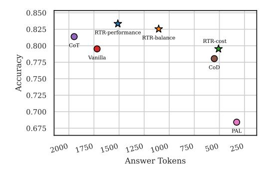

# 3.2 Main Results

In-Distribution Results. Table [2](#page-6-0) presents the performance comparison of various routing methods across four reasoning tasks. First, we observe that all routing models outperform random routing, demonstrating the effectiveness of employing routing strategies. Our proposed method, RTR, achieves the best overall accuracy (82.5%) while significantly reducing the average output length (1091.3 tokens). It outperforms all baselines in terms of the trade-off between performance and cost. Specifically, RTR achieves the highest accuracy on MMLU and OlympiadBench, and the second-best results on GSM8K and Math. Compared to the best-performing baseline, EmbedLLM, RTR matches or surpasses its accuracy while reducing the average token usage by over 39.6%. Notably, compared to the single largest model, QwQ-32B, which achieves strong performance at a very high cost, RTR improves average accuracy by 2.5 percentage points while reducing output token length by more than 60%. These results demonstrate that RTR can effectively select the most appropriate LLM and strategy to achieve both high accuracy and efficiency.

<https://huggingface.co/sentence-transformers/all-mpnet-base-v2>

Table 2: Results on in-distribution datasets. The best router-based result is in **bold**, and the second-best is underlined.

| Model      | GSM8K       |              | Math        |        | MMLU        |        | OlympiadBench |               | AVG         |        |
|------------|-------------|--------------|-------------|--------|-------------|--------|---------------|---------------|-------------|--------|
|            | Accuracy    | Tokens       | Accuracy    | Tokens | Accuracy    | Tokens | Accuracy      | Tokens        | Accuracy    | Tokens |
| Qwen2.5-3B | 71.5        | 205.4        | 54.3        | 295.5  | 61.7        | 253.1  | 21.0          | 1007.2        | 56.0        | 371.7  |
| QwQ        | 94.4        | 1148.5       | 95.6        | 2583.0 | 71.8        | 1219.3 | 48.5          | 8762.3        | 80.0        | 2745.2 |
| random     | 84.4        | 382.4        | 77.7        | 1043.7 | 69.4        | 723.1  | 32.6          | 4219 .1       | 69.5        | 1271.6 |
| KNN-Router | 89.2        | 272.9        | 88.3        | 1122.3 | 78.1        | 347.5  | 36.6          | <u>4197.7</u> | 76.9        | 1101.3 |
| RouteLLM   | 91.0        | 372.0        | 89.3        | 1161.8 | 72.8        | 597.3  | 45.5          | 7696.8        | 77.3        | 1814.3 |
| EmbedLLM   | 95.8        | 927.1        | 94.8        | 1898.2 | <u>80.5</u> | 508.8  | 41.5          | 5786.4        | <u>81.9</u> | 1808.3 |
| RTR (Ours) | <u>95.2</u> | <u>297.8</u> | <u>92.9</u> | 982.9  | 82.5        | 432.5  | 45.5          | 3399.7        | 82.5        | 1091.3 |

Table 3: Results on out-of-distribution datasets. The best is in **bold** and the second-best is underlined.

| Model      | PIQA        |              | SciQ     |              | ARC-C       |              | AVG      |              |
|------------|-------------|--------------|----------|--------------|-------------|--------------|----------|--------------|
| Wiodei     | Accuracy    | Tokens       | Accuracy | Tokens       | Accuracy    | Tokens       | Accuracy | Tokens       |
| Qwen2.5-3B | 73.3        | 150.8        | 68.2     | 187.6        | 65.3        | 248.9        | 68.9     | 195.8        |
| QwQ        | 95.5        | 1126.4       | 93.8     | 1203.6       | 91.7        | 1831.9       | 93.7     | 1387.3       |
| random     | 84.6        | 350.0        | 78.3     | 430.8        | 74.1        | 713.9        | 79.0     | 498.2        |
| KNN-Router | 90.3        | <u>277.4</u> | 89.2     | 376.2        | 86.3        | 550.6        | 88.6     | <u>419.4</u> |
| RouteLLM   | 93.2        | 363.1        | 92.7     | 894.3        | 91.2        | 1103.2       | 92.3     | 786.9        |
| EmbedLLM   | <u>95.1</u> | 832.8        | 92.2     | 1002.3       | <u>92.4</u> | 1631.1       | 93.2     | 1155.4       |
| RTR (Ours) | 95.3        | 222.3        | 94.2     | <u>405.7</u> | 93.1        | <u>553.7</u> | 94.2     | 393.9        |

**Out-Of-Distribution Results.** As shown in Table 3, the proposed RTR achieves the highest average accuracy across all out-of-distribution datasets, surpassing the best-performing individual LLM (QwQ) by a substantial margin of 0.5%. Notably, RTR achieves this strong performance while significantly reducing the average number of response tokens (393.9 vs. 1387.3), indicating superior efficiency. Among all routing-based baselines, only RTR is able to outperform QwQ in terms of average accuracy, highlighting its better generalization capability.

### 3.3 Further Analysis

Effectiveness of Performance Prediction. We conduct ablation studies to evaluate the effectiveness of our dual-component representation for model-strategy pairs. We compare three configurations: (1) textual descriptions encoded using a sentence encoder, (2) randomly initialized learnable embeddings, and (3) a combination of both. As shown in Figure 5, the combined representation yields the highest accuracy in predicting model-strategy correctness, demonstrating the complementary strengths of prior knowledge from textual descriptions and task-adaptive learned embeddings.

**Effectiveness of Token Usage Prediction.** We evaluate the performance of our token length prediction. As shown in Figure 6, although reasoning and non-reasoning models differ substantially in average output length, the predictor achieves approximately 80% accuracy for non-reasoning

> **[图片提取文字 (无描述)]:**
> **%** 77.0 Prediction Accuracy 76.176.0 75.0 75.0 74.0 73.6 73.0 Encoder + Embedding Embedding

Figure 5: Distribution of the performance and average answer token of different LLMs in response to queries on the 4 reasoning tasks.

> **[图片提取文字 (无描述)]:**
> 1.0 Prediction Accuracy 0.8 0.6 0.4 0.2 Non-thinking Model Thinking Model 200 400 600 800 Tokens Error Tolerance

Figure 6: Distribution of the performance and average answer token of different reasoning strategies responding to queries on 4 reasoning tasks.

models within a 200-token error margin, and about 60% accuracy for reasoning models with a 600-token margin. Given that the output length of reasoning models can exceed 10,000 tokens, this level of coarse-grained prediction accuracy is sufficient for effective routing.

**Different Routing Strategy.** We further evaluate our model under various routing scenarios. We first consider routing based on a single fixed strategy. As shown in Figure 7, relying on a single strategy often leads to higher costs or suboptimal performance, as it cannot leverage the complementary strengths of different strategies. For example, strategies with greater reasoning depth may achieve higher accuracy but incur significantly higher costs. This underscores the advantage of dynamically selecting reasoning strategies.

We then examine three routing configurations by adjusting the controller parameters to reflect different trade-off preferences: *performance-first*, *cost-first*, and *balanced*, corresponding to RTR-performance, RTR-cost, and RTR-balanced in Figure 7, respectively. Experimental results show that our framework is flexible under different budget constraints and achieves competitive performance while adapting to varying priorities in cost-effectiveness and accuracy. Moreover, all three configurations outperform using only the vanilla strategy, highlighting the benefits of leveraging multiple reasoning strategies.

> **[图片提取文字 (无描述)]:**
> 0.850 0.825 RTR-performance RTR-balance RTR-cost 0.800 CoT Accuracy Vanilla. 0.775 CoD 0.750 0.725 0.700 0.675 PAL 2000 1750 1500 1250 1000 750 500 250 Answer Tokens

Figure 7: Distribution of different routing strategies. Routing with any of the four single strategies often results in suboptimal performance. All three routing configurations outperform the Vanilla baseline.

> **[图片提取文字 (无描述)]:**
> Question QwQ + CoT How much does it cost you for lunch Okay, let's see. The question is asking today at Subway if you pay \$40 for a how much it costs for lunch today at foot-long fish sub and thrice as much Subway if I pay \$40 for a foot-long for a six-inch cold-cut combo sub? fish sub and thrice as much for a sixinch cold-cut combo sub, Hmm, I need to figure out the total cost here. best model and strategy Let me break it down step by step. RTR (After thingking with over 4000 Qwen2.5-7B + CoD tokens) If you pay \$40 for a foot-long fish sub, thrice as much for a six-inch Total cost: \$40 (fish sub) + \$60 (coldcold-cut combo sub will be 3\*\$40= cut combo) = \$100. \$120. The cost of lunch will be Answer: The total cost for lunch is \$120+\$40 = 120+40=160 \$100.

Figure 8: In this case, without using RTR, selecting the best model (QwQ) and the CoT strategy leads to redundant reasoning and ultimately an incorrect answer. In contrast, our RTR routes the query to Qwen2.5-7B with the CoD strategy and obtains the correct answer using only 32 tokens.

#### 3.4 Case Study

Figure 8 illustrates a case showing the effectiveness of RTR. When RTR is disabled, the best-performing model (QwQ) along with the reasoning strategy of Chain-of-Thought results in redundant and unnecessarily verbose reasoning, ultimately leading to an incorrect answer. In contrast, when RTR is applied, it routes the query to Qwen2.5-7B and CoD. This configuration yields the correct answer while using only 32 tokens, demonstrating both improved accuracy and significantly reduced computation.

### 3.5 When To Think Routing

With the emergence of recent LLMs that support manual toggling between *thinking* and *non-thinking* modes, our framework is naturally compatible with such dual-mode models via binary routing. Specifically, we represent each mode as a distinct candidate in our model pool, this setup enables our router to automatically determine when to invoke the thinking mode, allowing for dynamic selection based on task requirements. To validate this capability, we conduct experiments with Qwen3-4B, which supports both reasoning and non-reasoning

Table 4: Performance of dynamic routing between reasoning and non-reasoning modes in Qwen3-4B.

| Method                  | Acc (%) | Tokens |
|-------------------------|---------|--------|
| Qwen3-4B (non-thinking) | 73.4    | 592.1  |
| Qwen3-4B (thinking)     | 82.4    | 3112.8 |
| Random                  | 76.6    | 1834.2 |
| RouteLLM                | 82.8    | 2247.1 |
| KNN-Router              | 80.6    | 1418.7 |
| EmbedLLM                | 83.2    | 2623.5 |
| RTR (ours)              | 83.8    | 1321.1 |

modes. As shown in Table 4, our framework effectively learns to trigger the reasoning mode only

when beneficial, thereby significantly reducing average token usage while maintaining high prediction accuracy. Moreover, dynamic strategy selection improves performance beyond that of any single-model baseline.

