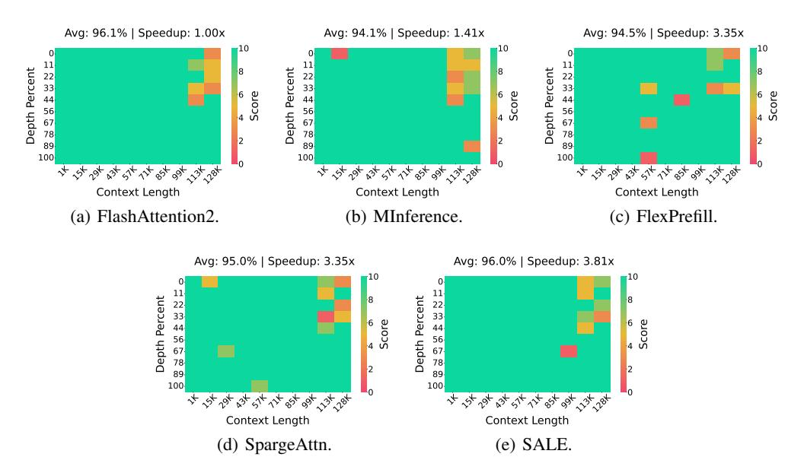
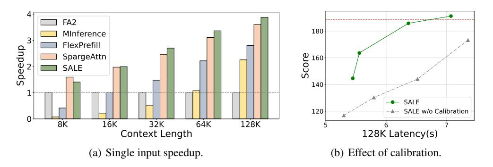

# 2 Related works

Sparse LLM prefilling Many previous works try to leverage the sparsity nature of transformer model to accelerate LLM inference from different perspectives.

One line of research exploits input text sparsity to dynamically prune context irrelevant to the user's query [\[32,](#page-12-1) [30,](#page-11-15) [33–](#page-12-2)[35\]](#page-12-3). While these methods can significantly reduce LLM inference latency for relatively simple prompts, they severely degrade generation quality when processing complex inputs [\[36\]](#page-12-4).

Numerous studies have observed sparsity patterns in self-attention modules, where only a small subset of attention map elements are much larger than the rest. Some methods [\[20,](#page-11-7) [37,](#page-12-5) [38\]](#page-12-6) use predefined static sparsity patterns to prune the attention map. However, these methods suffer from accuracy degradation as the attention sparsity distribution varies among different input contexts [\[15,](#page-11-2) [23\]](#page-11-10). Other methods assume that the distribution follows certain structures, such as Vertical-Slash or Block-Sparse. Some of them [\[15,](#page-11-2) [22\]](#page-11-9) try to dynamically predict the location of important regions by examining the exact attention scores of several tokens. Others [\[39,](#page-12-7) [24,](#page-11-11) [23,](#page-11-10) [25\]](#page-11-12) regard the attention map of compressed tokens, which are generated from continuous token chunks, as the proxy of real attention map. All these methods fail to achieve accurate predictions due to their overly coarse-grained approximations of attention maps.

In contrast to the aforementioned approaches, several alternatives to self-attention have emerged to circumvent its quadratic complexity. Notable examples include: (1) natively sparse attention algorithms [40, 41], (2) linear attention mechanisms [42, 43], and (3) state-space models [44, 45]. However, these methods impose significant adoption costs as they necessitate full model retraining.

During the decoding stage, methods like SparQ [46] and InfiniGen [47] compress the channels of query / key tokens to efficiently approximate the attention scores. Retrieval-based approaches [29, 48, 49] leverage vector-retrieval technique to approximately sort the attention scores of input tokens. Several existing algorithms compress tokens by analyzing attention maps during the prefilling stage. These approaches either eliminate redundant tokens [27, 50, 28, 51, 52] or perform token merging [53, 54]. Our method is orthogonal to these optimizations and can be combined to further enhance end-to-end LLM inference efficiency.

**Attention kernel optimization** Many CUDA kernel optimization techniques [55–58] leverage hardware features to accelerate the computation of the original full attention. Although these methods accelerate computation, they still require full attention calculations and fail to fully exploit the inherent sparsity of attention maps.

## 3 Method

This section presents the detailed architecture of SALE, which operates through three sequential processing stages: **Quantization**, **Selection-Pass** and **Computation-Pass**. During Selection-Pass, we select important attention regions at the block granularity and record the coordinates of these blocks. We then compute attention on selected blocks in the following Computation-Pass.

#### 3.1 Problem formulation

We denote the query, key and value matrix as Q, K and V, respectively, while the corresponding token at the offset i are  $q_i$ ,  $k_i$ ,  $v_i$ . Let N represents the sequence length, and d represents the hidden size. The shapes of Q, K and V are all  $N \times d$ . Single-head self-attention module can be mathematically formalized as below:

$$Attn(Q, K, V, M) = Softmax(\frac{QK^{T}}{\sqrt{d}} + M)V$$
 (1)

During the computation of self-attention, attention weight matrix S is defined as  $S = QK^T/\sqrt{d}$ , and attention score matrix P is defined as P = Softmax(S+M). Matrix M is the sparse attention mask with a shape of  $N \times N$ . It is formed by  $M = M_c + M_s$ , where  $M_c, M_s \in \{0, -\infty\}$  represent the causal mask and sparse mask respectively. Based on the mathematical properties of Softmax function, if an item M[i,j] in matrix M is  $-\infty$ , its corresponding attention score will be zero. Therefore, we can skip the attention computation at this position.

For block-sparse attention, query and key tokens are divided into continuous blocks of sizes  $b_q, b_k$  along the sequence length dimension. We denote the query, key token block at position j as  $Q_j, K_j$ , which have shapes of  $b_q \times d$  and  $b_k \times d$  respectively. For simplicity, we assume  $b_q \mid N, b_k \mid N$ , and denote  $N_q = N/b_q, N_k = N/b_k$ . As shown in Figure 1(b), the attention map can be viewed as the concatenation of  $N_q \cdot N_k$  attention blocks, each of shape  $b_q \times b_k$ . Block sparse attention skips computation at the block level. To formulate, we denote  $M_{bs} \in \{0,1\}$  as block-level sparse mask, and values of sparse mask  $M_s$  depend on  $M_{bs}$ :

$$M_s[i,j] = \begin{cases} 0, & \text{if} \quad M_{bs}[\lfloor i/b_q \rfloor, \lfloor j/b_k \rfloor] = 1, \\ -\infty, & \text{if} \quad M_{bs}[\lfloor i/b_q \rfloor, \lfloor j/b_k \rfloor] = 0 \end{cases}$$
 (2)

In other words, the attention computation between  $Q_i, K_j, V_j$  will be skipped if  $M_{bs}[i, j]$  is zero. Block-sparse attention aims to maximize sparsity in matrix  $M_{bs}$  while bounding the approximation error relative to full attention within a tolerable threshold.

#### <span id="page-2-0"></span>3.2 Block selection via fine-grained importance approximation

We construct  $M_{bs}$  during Selection-Pass, which is illustrated in Algorithm 1. In order to achieve the optimization objectives for  $M_{bs}$  while minimizing additional overhead, SALE proposes two key techniques: 4-bit Attention Weight Approximation and Relative Importance Approximation.

<span id="page-3-1"></span>> **[图片提取文字 (无描述)]:**
> $b_{k} = 2$ Layer 0, Head 6 Layer 16, Head 13  $b_{q} = 2 -$ Input 2 FP16 computed 4-bit estimated To compute To skip Sparse Mask Estimated Attention Map


<span id="page-3-0"></span>(a) Attention maps. (b) Sparse mask obtained after estimation.

Figure 1: (a) Attention maps of two different attention heads in Llama-3.1-8B-Instruct when processing different input sequences. (b) Illustration of SALE. The whole 16 × 16 attention map is viewed as concatenation of many 2 × 2 blocks. We first estimate the attention weights in an element-wise manner, and then construct a sparse mask at the block level based on these estimations.

4-bit attention weight approximation To obtain a finer-grained estimation of the attention map, SALE examines the attention weights for all positions. The overall computation process of Selection-Pass is akin to that of FlashAttention2 [\[56\]](#page-13-6). Specifically, in the outer loop, we iterate through all query blocks, while in the inner loop, we examine the attention weights between each query block and key block.

During block-wise inspection, rather than full-precision floating-point Q and K matrices, SALE computes attention weights using 4-bit quantized versions <sup>Q</sup><sup>e</sup> and <sup>K</sup><sup>e</sup> to make the approximation. This design significantly minimizes additional overhead with high-throughput low-bit Tensor Core instructions and reduced GPU global memory access. In addition, the quantization overhead is negligible. In our implementation, we leverage the quantization algorithm proposed by SageAttention-2 [\[59\]](#page-13-7).

Relative importance estimation Denoting approximated attention weights as <sup>S</sup>e, the next step is to evaluate the "importance" of each attention block. In related works [\[27,](#page-11-14) [28,](#page-11-17) [30,](#page-11-15) [50\]](#page-12-18), a commonly used metric is the attention score, obtained by applying *Softmax* function to attention weights. To perform sparse attention computation which cannot obtain full attention scores, we propose *Relative Attention Score* as our importance metric. Our design is based on an observation in many related studies [\[20,](#page-11-7) [26,](#page-11-13) [38\]](#page-12-6). As shown in Figure [1\(a\),](#page-3-1) attention scores within the "sink-local" region (i.e. the beginning and end of each row) maintain consistently high values, while the region exhibits consistent size across diverse input sequences. Motivated by this pattern, we assess "importance" by comparing <sup>S</sup>e[i, j] with the attention weights within the sink-local region. As illustrated in Algorithm [1,](#page-4-0) before examining blocks located in the middle of the sequence, we first compute full precision attention on blocks in the sink-local area. Denoting the indices of key tokens within the sink-local region as ISL, this process yields two intermediate values, <sup>m</sup><sup>e</sup> <sup>i</sup> and <sup>e</sup>l<sup>i</sup> , which can be formulated as follows:

$$\widetilde{m}_i = \max_{j \in I_{SL}} S[i,j], \quad \widetilde{l}_i = \sum_{j \in I_{SL}} e^{S[i,j] - \widetilde{m}_i}$$

Then, the *Relative Attention Score* <sup>P</sup>e[i, j] can be computed as:

$$\widetilde{P}[i,j] = \frac{e^{\widetilde{S}[i,j] - \widetilde{m}_i}}{\widetilde{l}_i} \tag{3}$$

If all <sup>P</sup>e[i, j] values in a block are smaller than the threshold <sup>τ</sup> (e.g. 0.004), this block is marked as non-critical, and the computation for this block will be skipped in the subsequent Computation-Pass. The procedure for determining the threshold value τ ∈ (0, 1) is elaborated in Section [3.3.](#page-4-1)

### **Algorithm 1:** Selection-Pass

```
Input: Q, K \in \mathbb{R}^{N \times d}, 4-bit quantized matrices \widetilde{Q}, \widetilde{K} \in \mathbb{Z}^{N \times d}, threshold \tau, block size b_a, b_k, local
 1 N_q \leftarrow N/b_q, N_k \leftarrow N/b_k, N_{local} \leftarrow l/b_k;
\mathbf{2} \; \; \mathrm{Split} \; Q, K \; \mathrm{into} \; \mathrm{blocks} \; Q_i \in \mathbb{R}^{b_q \times d}, K_j \in \mathbb{R}^{b_k \times d}, \\ \mathrm{split} \; \widetilde{Q}, \widetilde{K} \; \mathrm{into} \; \mathrm{blocks} \; \widetilde{Q}_i \in \mathbb{Z}^{b_q \times d}, \, \widetilde{K}_j \in \mathbb{Z}^{b_k \times d}
        for i = 0 to N_q - 1 do
            I_{SL} \leftarrow \{0\} \cup [i - N_{local}, i - 1];
                                                                                                            // Block indices of sink-local area
              \widetilde{m}, \widetilde{l} \in \mathbb{R}^{b_q}, \widetilde{m} \leftarrow -\infty, \widetilde{l} \leftarrow 0;
 4
                                                                                                               // Initialize intermediate result
              for j \in I_{SL} do
                    if j \neq 0 then
                     \widetilde{m}_{\Delta} \leftarrow \widetilde{m} - \operatorname{rowmax}(Q_i K_j^T / \sqrt{d}); \quad \widetilde{l} \leftarrow \widetilde{l} \cdot \exp(\widetilde{m}_{\Delta});
                     \widetilde{m} \leftarrow \operatorname{rowmax}(Q_i K_i^T / \sqrt{d});
                                                                                                                                              // Ignore causal mask
                    \widetilde{l} \leftarrow \widetilde{l} + \operatorname{rowsum}(\exp(\frac{Q_i K_j^T}{\sqrt{d}} - \widetilde{m}));
10
11
12
             end
             for j \leftarrow 1 to (i - N_{local} - 1) do
13
                    \widetilde{S}_{ij} \leftarrow \text{Dequantize}(\widetilde{Q}_i \widetilde{K}_j^T) / \sqrt{d};
14
                                                                                                                      // Approximate attention weight
                    \widetilde{P}_{ij} \leftarrow \exp(\widetilde{S}_{ij} - \widetilde{m}) / \widetilde{\widetilde{l}};
                                                                                                            // Compute Relative Attention Score
15
                    M_{bs}[i,j] \leftarrow \max(\widetilde{P}_{ij}) \geq \tau;
16
17
             end
    end
     Output: Block-level sparse mask M_{bs}
```

#### <span id="page-4-1"></span>3.3 Per-head threshold calibration

Figure 1(a) illustrates the attention score distributions of two attention heads of Llama-3.1-8B-Instruct, exhibiting inconsistent sparsity levels. Thus, applying the same  $\tau$  for all heads may lead to suboptimal performance. To address the issue, we propose an offline calibration procedure to determine the optimal  $\tau$  value for each head, which ensures negligible output errors while maximizing sparsity.

We adopt the  $L_1$  distance between the output of SALE and the output of full attention as the error metric, which can be formulated as  $Err(\tau) = \|O - \widetilde{O}\|_1/N$ . O is the result of the original attention,  $\widetilde{O}$  is the result of SALE, and N represents sequence length. At the beginning of the calibration,  $\tau$  is initially set to be a relatively large threshold  $\tau_0$  (e.g. 0.008). We then progressively reduce the sparsity level by halving the value of  $\tau$  until  $Err(\tau)$  falls below  $\theta$ , where  $\theta$  is the predefined error bound. By tuning  $\theta$ , we can control the sparsity level of SALE.

#### 3.4 Kernel optimization

**Reduction in dequantization operations** Theoretically, whether an attention block is skipped only depends on the comparison between the largest *Relative Attention Score* with  $\tau$ . By employing per-thread quantization strategy proposed in [59], we make all quantized attention weight elements held by each thread share the same quantization scale. This ensures that the largest *Relative Attention Score* and the largest approximated attention weight occur at the same position. Therefore, only the largest approximated attention weight needs to be dequantized, which saves many low-throughput operations such as datatype conversion.

**Relative attention score comparison** Directly computing *Relative Attention Score* is time-consuming as it consists of multiple complex hardware instructions, including floating point division and exponential function. Considering that  $\widetilde{l}_i$  and  $\widetilde{m}_i$  do not change after the computation in sink-local area, we optimize this comparison by following mathematical transformation:

$$\frac{e^{\widetilde{S}[i,j]-\widetilde{m}_i}}{\widetilde{l}_i} \ge \tau \iff \widetilde{S}[i,j] \ge \ln(\tau \cdot \widetilde{l}_i + \widetilde{m}_i)$$
(4)

The comparison between the *Relative Attention Score* and τ can then be accomplished using a single floating point comparison instruction. It is worth noting that we also mitigate potential overflow issues caused by the exponential function.

Integration with SageAttention The final stage of SALE is Computation-Pass. In this stage, sparse attention is computed only on the important blocks selected by Selection-Pass. We employ the QKV quantization strategy proposed in SageAttention [\[60\]](#page-13-8) to further accelerate Computation-Pass while maintaining negligible precision loss.

## 4 Experiments

## 4.1 Settings

Models Most of the experiments are conducted using Llama-3.1-8B-Instruct [\[9\]](#page-9-6) (Llama-3.1). We also use Qwen2.5-32B-Instruct [\[31\]](#page-12-0) (Qwen-2.5) to validate the effectiveness of our method on larger-scale LLM. Both of these models support context lengths of 128K. We use the default chat template to construct the input prompt.

Implementation details We implement Selection-Pass in C++ CUDA and use Triton [\[61\]](#page-13-9) compiler to accelerate the quantization process. We implement the quantized Computation-Pass based on the open-source code of SpargeAttn [\[24\]](#page-11-11). For model inference, we leverage the transformers [\[62\]](#page-13-10) library to build an execution pipeline and replace the default self-attention module with SALE. We use greedy decoding to avoid randomness during generation. For those hyper-parameters mentioned in Section [3.2,](#page-2-0) we use block size b<sup>q</sup> = 64 and b<sup>k</sup> = 32. For the sink-local area discussed in Section [3.2,](#page-2-0) we constrain the sink area size to 32 tokens and the local area size to no more than 256 tokens for any input sequence. During offline calibration, we set the initial threshold τ<sup>0</sup> = 0.008, and use error bounds of θ = 0.4 for Llama-3.1 and θ = 2.0 for Qwen-2.5 by default. All latency experiments are conducted on a server with 8 GeForce RTX 4090 GPUs without using tensor-parallel [\[63\]](#page-13-11) or context-parallel [\[64\]](#page-13-12) technique.

<span id="page-5-1"></span>Baselines To demonstrate the advantages of SALE, we compare it with four strong baselines for self-attention acceleration in long-context processing: FlashAttention2(*FA2*) [\[56\]](#page-13-6), MInference(*MInfer*) [\[15\]](#page-11-2), FlexPrefill(*Flex*) [\[23\]](#page-11-10), and SpargeAttn(*Sparge*) [\[24\]](#page-11-11). FA2 computes standard full attention, while the other three methods employ sparse attention mechanisms. All experimental results are based on their publicly available implementation. We use γ = 0.95 for both Llama-3.1 and Qwen-2.5 when evaluating FlexPrefill. We use (l<sup>1</sup> = 0.08, l<sup>2</sup> = 0.09) for Llama-3.1, and (l<sup>1</sup> = 0.04, l<sup>2</sup> = 0.05) for Qwen-2.5 when evaluating SpargeAttn. For MInference, we select the sparse pattern for each head based on its open-source code.

Additionally, to investigate the performance of these methods under varying sparsity levels, we prepare multiple sets of hyperparameters based on their publicly available codes. For FlexPrefill and SpargeAttn, as described in their papers, we adjust their sparsity levels by tuning γ and (l1, l2), respectively. For MInference, since its open-source implementation configures all heads with the *Vertical-Slash* pattern, the sparsity rate is adjusted by varying the total number of vertical and slash lines across all heads. To ensure a fair comparison, we use the calibration samples for MInference, SpargeAttn, and SALE.

Metrics To validate the effectiveness of SALE, we assess model quality using long-context benchmarks (see Section [4.2\)](#page-5-0) and quantify efficiency through latency measurements. All latency results in the experimental section focus solely on the attention computation time across all layers during the LLM prefilling phase. Our latency measurements include all online operations, such as quantization, block selection, and index selection. In some experiments, we report the end-to-end (E2E) latency on certain datasets, which is computed by summing the latency of all samples in the dataset.

## <span id="page-5-0"></span>4.2 Accuracy evaluation

Following common practice [\[24,](#page-11-11) [15,](#page-11-2) [23,](#page-11-10) [29,](#page-11-16) [39,](#page-12-7) [28\]](#page-11-17), we adopt three long-context understanding benchmarks to compare the generation quality of our method with other baselines. These benchmarks employ task-specific evaluation metrics, including accuracy, F1-score, and Rouge-L, where higher

<span id="page-6-0"></span>Table 1: LongBench evaluation results of different methods. We use boldface to denote the highest value and underline to indicate the second-highest value.

| Tasks         | FA2   | MInfer | Llama-3.1<br>Flex | Sparge | SALE   | FA2   | MInfer | Qwen-2.5<br>Flex | Sparge | SALE  |
|---------------|-------|--------|-------------------|--------|--------|-------|--------|------------------|--------|-------|
| NarrativeQA   | 29.93 | 24.92  | 28.29             | 29.62  | 28.95  | 29.20 | 31.27  | 29.80            | 29.19  | 32.21 |
| Qasper        | 44.82 | 44.29  | 44.55             | 43.73  | 45.33  | 45.79 | 45.05  | 45.53            | 44.61  | 45.95 |
| MultiFieldQA  | 54.65 | 53.71  | 55.34             | 56.02  | 55.18  | 53.25 | 53.01  | 52.61            | 51.66  | 53.37 |
| HotpotQA      | 55.81 | 52.00  | 55.38             | 54.57  | 55.83  | 64.68 | 64.59  | 64.78            | 63.94  | 63.95 |
| 2WikiMQA      | 46.16 | 44.10  | 43.43             | 47.08  | 42.61  | 60.87 | 60.82  | 62.98            | 61.13  | 62.33 |
| MuSiQue       | 30.41 | 25.72  | 30.07             | 31.40  | 30.10  | 39.89 | 41.38  | 39.46            | 39.22  | 40.54 |
| GovReport     | 35.29 | 35.09  | 34.64             | 35.04  | 35.45  | 30.38 | 30.59  | 30.78            | 30.36  | 30.66 |
| QMSum         | 25.25 | 25.47  | 25.83             | 25.12  | 25.33  | 23.06 | 23.16  | 23.10            | 23.18  | 23.42 |
| TREC          | 72.50 | 72.00  | 70.50             | 71.00  | 70.50  | 73.50 | 73.50  | 73.50            | 74.50  | 73.00 |
| TriviaQA      | 91.65 | 91.18  | 89.81             | 92.68  | 90.47  | 87.68 | 88.40  | 89.40            | 88.81  | 87.97 |
| SAMSum        | 43.67 | 43.73  | 43.18             | 43.18  | 44.19  | 45.67 | 45.92  | 46.43            | 46.41  | 45.92 |
| LSHT          | 46.50 | 46.00  | 41.00             | 45.50  | 46.50  | 45.79 | 47.50  | 44.17            | 47.00  | 47.21 |
| Count         | 6.72  | 3.25   | 2.59              | 5.89   | 7.09   | 12.67 | 13.67  | 3.57             | 9.22   | 13.38 |
| Retrieval     | 99.50 | 97.00  | 82.00             | 84.00  | 100.00 | 99.50 | 99.25  | 92.25            | 98.83  | 98.25 |
| Average       | 48.77 | 47.03  | 46.18             | 47.48  | 48.39  | 50.85 | 51.29  | 49.88            | 50.57  | 51.30 |
| Speedup (64K) | 1.00× | 1.07×  | 2.21×             | 3.11×  | 3.36×  | 1.00× | 1.25×  | 1.39×            | 2.55×  | 3.28× |

values indicate better performance. (1) LongBench [\[65\]](#page-13-13): A comprehensive benchmark covering diverse long-text applications, including single-document QA, multi-document QA, summarization, few-shot learning, synthetic tasks, etc. The context lengths of most input samples are below 32K tokens. (2) InfiniteBench [\[66\]](#page-13-14): A benchmark designed to evaluate the capability of processing excessively long context (exceeding 100K tokens). It comprises several challenging synthetic tasks such as Retrieve.KV and Math.Find, as well as other real-world tasks including QA and summarization based on fake books or fake dialogues. (3) Needle-In-A-Haystack [\[67\]](#page-13-15): A widely-used long-context retrieval task. It requires the LLM to locate a randomly inserted sentence at various positions within a real-world context. For all these benchmarks and tasks, we employ the official evaluation scripts from their respective open-source repositories to assess model outputs.

LongBench Table [1](#page-6-0) presents the LongBench evaluation results comparing SALE with baseline approaches. In the second row of the table, we use abbreviations introduced in Section [4.1](#page-5-1) to denote each method. In the last two rows, we report the average scores as well as the latency speedup achieved when processing 64K-length Needle-In-A-Haystack input.

The results on both models show that our approach not only achieves superior accuracy but also delivers the highest acceleration ratio among all sparse attention baselines. In addition, when applying our method, Llama-3.1 exhibits only marginal performance degradation while Qwen-2.5 shows improvement. We attribute this improvement to our method's ability to potentially filter noisy information during the prefilling phase, thereby enhancing the model's comprehension capabilities.

InfiniteBench Table [2](#page-6-1) presents the test scores of InfiniteBench, evaluating the capability of processing extremely long inputs. As shown in the table, our method also achieves the best accuracyefficiency trade-off on InfiniteBench.

<span id="page-6-1"></span>Table 2: InfiniteBench evaluation results of different methods. We use boldface to denote the highest value and underline to indicate the second-highest value.

| Tasks         | Llama-3.1 |        |       |        | Qwen-2.5 |       |        |       |        |       |
|---------------|-----------|--------|-------|--------|----------|-------|--------|-------|--------|-------|
|               | FA2       | MInfer | Flex  | Sparge | SALE     | FA2   | MInfer | Flex  | Sparge | SALE  |
| Retrieve.KV   | 55.60     | 20.00  | 38.00 | 47.20  | 56.40    | 4.00  | 7.60   | 4.80  | 4.60   | 5.40  |
| En.MC         | 67.25     | 55.02  | 68.56 | 66.38  | 66.38    | 63.70 | 63.32  | 59.80 | 61.50  | 62.80 |
| Math.Find     | 34.29     | 34.86  | 30.00 | 34.57  | 30.57    | 41.40 | 45.71  | 47.20 | 41.70  | 52.00 |
| En.QA         | 15.12     | 13.96  | 14.18 | 13.51  | 13.19    | 6.70  | 6.85   | 6.70  | 6.80   | 6.90  |
| En.Dia        | 16.50     | 13.50  | 17.00 | 17.50  | 19.00    | 27.50 | 30.00  | 29.00 | 25.50  | 27.50 |
| Average       | 37.75     | 27.47  | 33.55 | 35.83  | 37.11    | 28.66 | 30.70  | 29.5  | 28.02  | 30.92 |
| Speedup (64K) | 1.00×     | 1.07×  | 2.21× | 3.11×  | 3.36×    | 1.00× | 1.25×  | 1.39× | 2.55×  | 3.28× |

<span id="page-7-0"></span>> **[图片提取文字 (无描述)]:**
> Avg: 96.1% | Speedup: 1.00x Avg: 94.1% | Speedup: 1.41x Avg: 94.5% | Speedup: 3.35x 11 11 11 Depth Percent Depth Percent Depth Percent 22 33 22 33 33 Score Score 6 44 44 44 56 56 56 67 67 67 78 78 78 89 89 89 100 100 100 124 134 134 24 14 154 834 134 184 224 234 234 214 124 824 824 234 284 24 34 34 24 14 17 84 84 134 34 Context Length Context Length Context Length (a) FlashAttention2. (b) MInference. (c) FlexPrefill. Avg: 95.0% | Speedup: 3.35x Avg: 96.0% | Speedup: 3.81x 11 Depth Percent Depth Percent 8 22 33 33 Score Score 44 44 56 56 67 67 78 78 89 89 100 100 4 4 4 4 4 4 4 4 4 4 8 8 8 4 1 3 4 8 24 24 24 24 24 42 84 84 24 24 84 Context Length Context Length (e) SALE. (d) SpargeAttn.


Figure 2: Needle-In-A-Haystack evaluation results.

**Needle-In-A-Haystack** We evaluate the Needle-In-A-Haystack (NIAH) task using Llama-3.1, with results visualized in Figure 2. The average score and end-to-end speedup for each method are annotated above their respective plots. Our method achieves a  $3.81 \times$  speedup with only a 0.1% drop in average score compared to FlashAttention2, outperforming all other sparse attention baselines.

#### 4.3 Efficiency evaluation

**Single input speedup** We first compare the latency of different methods when processing a single input. The results are presented in Figure 3(a). We conduct experiments using Llama-3.1 and report the speedup of each method relative to FlashAttention2. To illustrate how latency scales with the number of tokens, we prepare five input samples of different lengths. These samples are obtained by truncating a single 128K-length input from the Needle-In-A-Haystack task.

Our method demonstrates consistent speedups over FlashAttention2 across all sequence lengths while outperforming all sparse attention baselines in most cases. Notably, SALE exhibits greater speedup as context length increases, benefiting from sparser attention patterns.

**Accuracy vs efficiency** We adjust the computation budget of each method following the approach described in Section 4.1 to analyze the accuracy-efficiency trade-offs. Considering that the speedup

<span id="page-7-1"></span>> **[图片提取文字 (无描述)]:**
> FA2 180 MInference FlexPrefill Speedup Score SpargeAttn SALE 140 - SALE 120 – ≜ – SALE w/o Calibration 8K 16K 32K 64K 128K Context Length 128K Latency(s) (a) Single input speedup. (b) Effect of calibration.


<span id="page-7-2"></span>Figure 3: (a) Speedup in single-input processing. (b) Comparison between SALE v.s. SALE w/o Calibration on InfiniteBench. The brown horizontal dashed line represents the score achieved by FlashAttention2.

<span id="page-8-0"></span>> **[图片提取文字 (无描述)]:**
> 190 670 680 180 640 170 Score Score 670 9 610 160 660 SALE 580 150 Sparge 650 140 550 ···+··· Flex SALE Minfer Sparge SALE Sparge Minfer Flex 130 300 700 1100 3400 4100 4800 500 600 700 8000 12000 16000 20000 E2E Latency(s) E2E Latency(s) E2E Latency(s) (a) Trade-off on LongBench. (c) Trade-off on InfiniteBench. (b) Zoom in.


Figure 4: Evaluation of accuracy-efficiency trade-offs. The brown horizontal dashed line represents the score achieved by FlashAttention2. (a) Performance on LongBench under different sparsity levels. (b) A magnified view focusing on the region enclosed by the dashed box in (a). (c) Performance on InfiniteBench under different sparsity levels.

achieved by dynamic sparse attention methods may vary depending on the input content, we evaluate the end-to-end latency of all methods on both LongBench and InfiniteBench for comprehensive comparison. The results, shown in Figure 4, demonstrate the superior performance of our method on both datasets.

#### 4.4 Ablation study

In this section, we evaluate the latency of each stage in SALE and assess the impact of per-head threshold calibration. Additional analysis results are provided in the appendix.

**Latency breakdown** We report the latency breakdown results of SALE under various input lengths in Table 3. All experiments use Llama-3.1, with reported timings reflecting end-to-end execution across all 32 model layers. In the second-to-last line, we show the execution time ratio of Quantization and Selection-Pass operations relative to full attention latency. In the final line, we present the speedup of Computation-Pass compared to full attention. The results demonstrate that our method introduces acceptable computational overhead, with its relative cost decreasing as sequence length grows. Furthermore, Computation-Pass shows greater speedups with longer context lengths, reflecting improved sparsity level at scale.

<span id="page-8-1"></span>

| G                        | l ovz  | 1077  | 227    | C 477  | 10077 |
|--------------------------|--------|-------|--------|--------|-------|
| Context length           | 8K     | 16K   | 32K    | 64K    | 128K  |
| Quantization             | 11     | 21    | 47     | 99     | 208   |
| Selection-Pass           | 14     | 48    | 166    | 634    | 2562  |
| Computation-Pass         | 51     | 137   | 378    | 1117   | 3599  |
| FA2                      | 106    | 416   | 1597   | 6224   | 24731 |
| Overhead ratio           | 23.9%  | 16.7% | 13.3%  | 11.5%  | 11.1% |
| Computation-Pass speedup | 2.08 > | 3.04× | 4 23 × | 5 57 × | 6.87× |

Table 3: Latency breakdown (ms).

**Threshold calibration** To demonstrate the performance gain brought by per-head threshold calibration, we set all heads in Llama-3.1 to share the same  $\tau$ , which is referred to as *SALE w/o Calibration*. As shown in Figure 3(b), per-head threshold calibration yields substantial performance gains.

## 5 Conclusion

In this paper, we propose a block-Sparse Attention technique based on Low-bit Estimation. By performing fine-grained estimation of the attention map, we achieve a better accuracy-efficiency trade-off. Specifically, we estimate the attention weights using low-bit quantized queries and keys, and assess the importance of query-key pairs using our *Relative Attention Score* metric. Furthermore, we introduce several CUDA kernel optimization techniques to ensure the efficiency of sparse mask construction on hardware. These components allow our method to efficiently and accurately analyze attention patterns. Experimental results demonstrate that our approach achieves the best trade-off among existing sparse attention baselines, delivering a speedup of at least 3.36× when processing sequences longer than 64K tokens while maintaining negligible accuracy loss.

