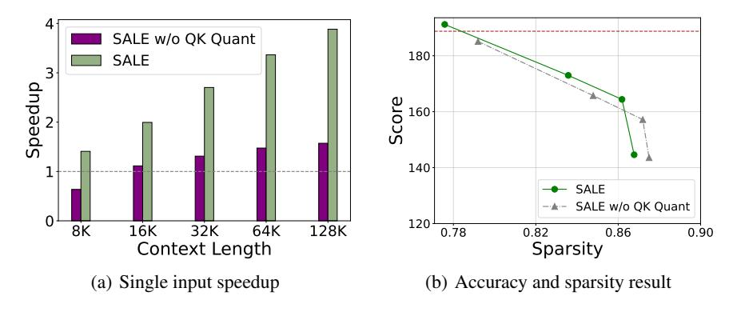

# E Additional ablation studies

To evaluate the effectiveness of 4-bit attention weight approximation, we further conducted experiments using original-precision (16-bit) QK matrices to inspect the attention map, which is referred to as *SALE w/o QK Quant*. The result is shown in Figure [5.](#page-15-0) We measure the single input speedup of two methods under varying input lengths, using the same set of input samples as in the Figure [3\(a\).](#page-7-1) The result indicates that using original-precision QK to estimate attention weights leads to a significant increase in computational overhead.

We further evaluate the accuracy and attention sparsity of both methods based on Llama-3.1, where corresponding data points for the two methods are obtained using the same θ. We use the scores from InfiniteBench to represent accuracy. Attention sparsity metric is defined as the ratio of the number of skipped attention blocks to the total number of attention blocks, and the results presented here are

> **[图片提取文字 (无描述)]:**
> SALE w/o QK Quant 180 SALE Speedup 160 140 SALE - - SALE w/o QK Quant 120 8K 16K 32K 64K 128K 0.78 0.82 0.86 0.90 Sparsity Context Length (b) Accuracy and sparsity result (a) Single input speedup

Figure 5: Comparison between SALE and SALE w/o QK Quant. (a)Single input speedup. (b) Comparison between SALE v.s. SALE w/o QK Quant on InfiniteBench. The brown horizontal dashed line represents the score achieved by FlashAttention2.

measured when processing contexts of 128K length. As observed, under identical hyperparameter settings, *SALE w/o QK Quant* achieves higher attention sparsity while showing a slight performance drop on InfiniteBench. This may be attributed to the limited precision of current Int4 quantization techniques, which can cause certain approximated attention weights to exceed their true values, thereby leading to more blocks being selected.